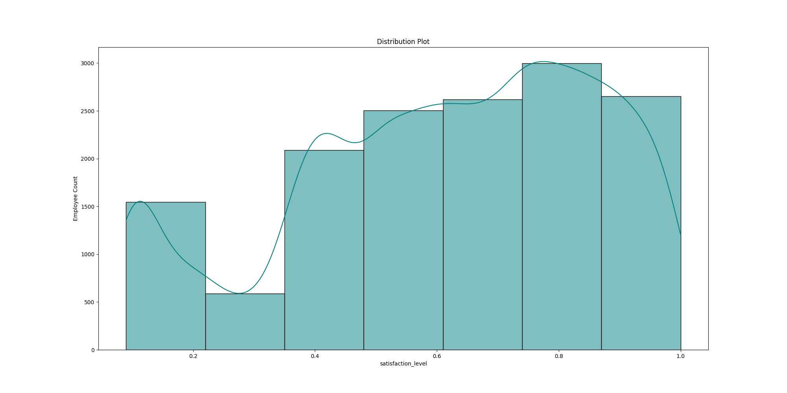
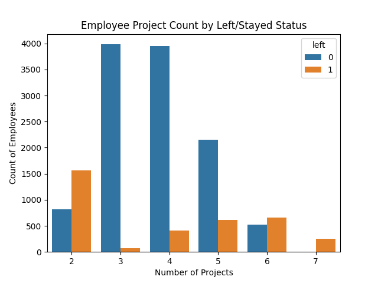
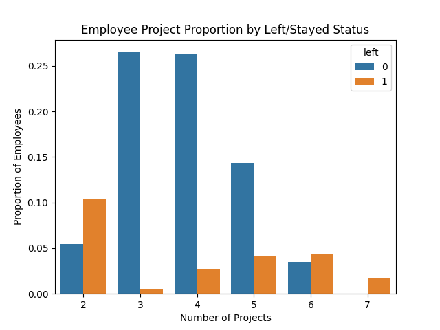
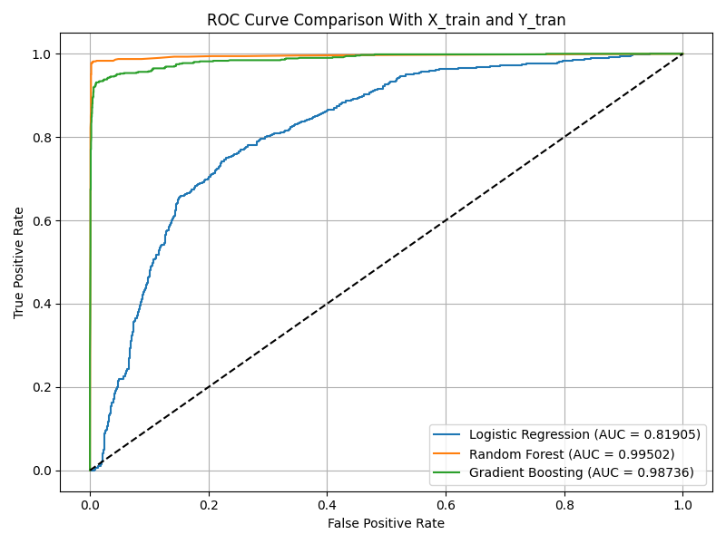

# Employee Turnover
## employee_turnover.py

## Run
```
python ./employee_turnover.py
```
### Output
```
employee_turnover.py
Shape : 	(14999, 10)
Row labels : 	RangeIndex(start=0, stop=14999, step=1)
Column names : 
Index(['satisfaction_level', 'last_evaluation', 'number_project',
       'average_montly_hours', 'time_spend_company', 'Work_accident', 'left',
       'promotion_last_5years', 'sales', 'salary'],
      dtype='object')
Data type : 
satisfaction_level       float64
last_evaluation          float64
number_project             int64
average_montly_hours       int64
time_spend_company         int64
Work_accident              int64
left                       int64
promotion_last_5years      int64
sales                     object
salary                    object
dtype: object
Data info : 

<class 'pandas.core.frame.DataFrame'>
RangeIndex: 14999 entries, 0 to 14998
Data columns (total 10 columns):
 #   Column                 Non-Null Count  Dtype  
---  ------                 --------------  -----  
 0   satisfaction_level     14999 non-null  float64
 1   last_evaluation        14999 non-null  float64
 2   number_project         14999 non-null  int64  
 3   average_montly_hours   14999 non-null  int64  
 4   time_spend_company     14999 non-null  int64  
 5   Work_accident          14999 non-null  int64  
 6   left                   14999 non-null  int64  
 7   promotion_last_5years  14999 non-null  int64  
 8   sales                  14999 non-null  object 
 9   salary                 14999 non-null  object 
dtypes: float64(2), int64(6), object(2)
memory usage: 1.1+ MB
None
Describe data : 
       satisfaction_level  last_evaluation  number_project  \
count        14999.000000     14999.000000    14999.000000   
mean             0.612834         0.716102        3.803054   
std              0.248631         0.171169        1.232592   
min              0.090000         0.360000        2.000000   
25%              0.440000         0.560000        3.000000   
50%              0.640000         0.720000        4.000000   
75%              0.820000         0.870000        5.000000   
max              1.000000         1.000000        7.000000   

       average_montly_hours  time_spend_company  Work_accident          left  \
count          14999.000000        14999.000000   14999.000000  14999.000000   
mean             201.050337            3.498233       0.144610      0.238083   
std               49.943099            1.460136       0.351719      0.425924   
min               96.000000            2.000000       0.000000      0.000000   
25%              156.000000            3.000000       0.000000      0.000000   
50%              200.000000            3.000000       0.000000      0.000000   
75%              245.000000            4.000000       0.000000      0.000000   
max              310.000000           10.000000       1.000000      1.000000   

       promotion_last_5years  
count           14999.000000  
mean                0.021268  
std                 0.144281  
min                 0.000000  
25%                 0.000000  
50%                 0.000000  
75%                 0.000000  
max                 1.000000  
satisfaction_level       0
last_evaluation          0
number_project           0
average_montly_hours     0
time_spend_company       0
Work_accident            0
left                     0
promotion_last_5years    0
sales                    0
salary                   0
dtype: int64
column which has null is
Series([], dtype: int64)
Shape : 	(14999, 10)
Row labels : 	RangeIndex(start=0, stop=14999, step=1)
Column names : 
Index(['satisfaction_level', 'last_evaluation', 'number_project',
       'average_montly_hours', 'time_spend_company', 'Work_accident', 'left',
       'promotion_last_5years', 'department', 'salary'],
      dtype='object')
Data type : 
satisfaction_level       float64
last_evaluation          float64
number_project             int64
average_montly_hours       int64
time_spend_company         int64
Work_accident              int64
left                       int64
promotion_last_5years      int64
department                object
salary                    object
dtype: object
Data info : 

<class 'pandas.core.frame.DataFrame'>
RangeIndex: 14999 entries, 0 to 14998
Data columns (total 10 columns):
 #   Column                 Non-Null Count  Dtype  
---  ------                 --------------  -----  
 0   satisfaction_level     14999 non-null  float64
 1   last_evaluation        14999 non-null  float64
 2   number_project         14999 non-null  int64  
 3   average_montly_hours   14999 non-null  int64  
 4   time_spend_company     14999 non-null  int64  
 5   Work_accident          14999 non-null  int64  
 6   left                   14999 non-null  int64  
 7   promotion_last_5years  14999 non-null  int64  
 8   department             14999 non-null  object 
 9   salary                 14999 non-null  object 
dtypes: float64(2), int64(6), object(2)
memory usage: 1.1+ MB
None
Describe data : 
       satisfaction_level  last_evaluation  number_project  \
count        14999.000000     14999.000000    14999.000000   
mean             0.612834         0.716102        3.803054   
std              0.248631         0.171169        1.232592   
min              0.090000         0.360000        2.000000   
25%              0.440000         0.560000        3.000000   
50%              0.640000         0.720000        4.000000   
75%              0.820000         0.870000        5.000000   
max              1.000000         1.000000        7.000000   

       average_montly_hours  time_spend_company  Work_accident          left  \
count          14999.000000        14999.000000   14999.000000  14999.000000   
mean             201.050337            3.498233       0.144610      0.238083   
std               49.943099            1.460136       0.351719      0.425924   
min               96.000000            2.000000       0.000000      0.000000   
25%              156.000000            3.000000       0.000000      0.000000   
50%              200.000000            3.000000       0.000000      0.000000   
75%              245.000000            4.000000       0.000000      0.000000   
max              310.000000           10.000000       1.000000      1.000000   

       promotion_last_5years  
count           14999.000000  
mean                0.021268  
std                 0.144281  
min                 0.000000  
25%                 0.000000  
50%                 0.000000  
75%                 0.000000  
max                 1.000000  
satisfaction_level       0
last_evaluation          0
number_project           0
average_montly_hours     0
time_spend_company       0
Work_accident            0
left                     0
promotion_last_5years    0
department               0
salary                   0
dtype: int64
column which has null is
Series([], dtype: int64)
   satisfaction_level  last_evaluation  number_project  average_montly_hours  \
0                0.38             0.53               2                   157   
1                0.80             0.86               5                   262   
2                0.11             0.88               7                   272   

   time_spend_company  Work_accident  left  promotion_last_5years department  \
0                   3              0     1                      0      sales   
1                   6              0     1                      0      sales   
2                   4              0     1                      0      sales   

   salary  
0     low  
1  medium  
2  medium  
Shape : 	(14999, 10)
Row labels : 	RangeIndex(start=0, stop=14999, step=1)
Column names : 
Index(['satisfaction_level', 'last_evaluation', 'number_project',
       'average_montly_hours', 'time_spend_company', 'Work_accident', 'left',
       'promotion_last_5years', 'department', 'salary'],
      dtype='object')
Data type : 
satisfaction_level       float64
last_evaluation          float64
number_project             int64
average_montly_hours       int64
time_spend_company         int64
Work_accident              int64
left                       int64
promotion_last_5years      int64
department                object
salary                    object
dtype: object
Data info : 

<class 'pandas.core.frame.DataFrame'>
RangeIndex: 14999 entries, 0 to 14998
Data columns (total 10 columns):
 #   Column                 Non-Null Count  Dtype  
---  ------                 --------------  -----  
 0   satisfaction_level     14999 non-null  float64
 1   last_evaluation        14999 non-null  float64
 2   number_project         14999 non-null  int64  
 3   average_montly_hours   14999 non-null  int64  
 4   time_spend_company     14999 non-null  int64  
 5   Work_accident          14999 non-null  int64  
 6   left                   14999 non-null  int64  
 7   promotion_last_5years  14999 non-null  int64  
 8   department             14999 non-null  object 
 9   salary                 14999 non-null  object 
dtypes: float64(2), int64(6), object(2)
memory usage: 1.1+ MB
None
Describe data : 
       satisfaction_level  last_evaluation  number_project  \
count        14999.000000     14999.000000    14999.000000   
mean             0.612834         0.716102        3.803054   
std              0.248631         0.171169        1.232592   
min              0.090000         0.360000        2.000000   
25%              0.440000         0.560000        3.000000   
50%              0.640000         0.720000        4.000000   
75%              0.820000         0.870000        5.000000   
max              1.000000         1.000000        7.000000   

       average_montly_hours  time_spend_company  Work_accident          left  \
count          14999.000000        14999.000000   14999.000000  14999.000000   
mean             201.050337            3.498233       0.144610      0.238083   
std               49.943099            1.460136       0.351719      0.425924   
min               96.000000            2.000000       0.000000      0.000000   
25%              156.000000            3.000000       0.000000      0.000000   
50%              200.000000            3.000000       0.000000      0.000000   
75%              245.000000            4.000000       0.000000      0.000000   
max              310.000000           10.000000       1.000000      1.000000   

       promotion_last_5years  
count           14999.000000  
mean                0.021268  
std                 0.144281  
min                 0.000000  
25%                 0.000000  
50%                 0.000000  
75%                 0.000000  
max                 1.000000  
satisfaction_level       0
last_evaluation          0
number_project           0
average_montly_hours     0
time_spend_company       0
Work_accident            0
left                     0
promotion_last_5years    0
department               0
salary                   0
dtype: int64
column which has null is
Series([], dtype: int64)
   satisfaction_level  last_evaluation  number_project  average_montly_hours  \
0                0.38             0.53               2                   157   
1                0.80             0.86               5                   262   
2                0.11             0.88               7                   272   

   time_spend_company  Work_accident  left  promotion_last_5years  \
0                   3              0     1                      0   
1                   6              0     1                      0   
2                   4              0     1                      0   

   department_IT  department_RandD  department_accounting  department_hr  \
0              0                 0                      0              0   
1              0                 0                      0              0   
2              0                 0                      0              0   

   department_management  department_marketing  department_product_mng  \
0                      0                     0                       0   
1                      0                     0                       0   
2                      0                     0                       0   

   department_sales  department_support  department_technical  salary_high  \
0                 1                   0                     0            0   
1                 1                   0                     0            0   
2                 1                   0                     0            0   

   salary_low  salary_medium  
0           1              0  
1           0              1  
2           0              1  
0        1
1        1
2        1
3        1
4        1
        ..
14994    1
14995    1
14996    1
14997    1
14998    1
Name: left, Length: 14999, dtype: int64
Describe Correlation : 
                        satisfaction_level  last_evaluation  number_project  \
satisfaction_level                1.000000         0.105021       -0.142970   
last_evaluation                   0.105021         1.000000        0.349333   
number_project                   -0.142970         0.349333        1.000000   
average_montly_hours             -0.020048         0.339742        0.417211   
time_spend_company               -0.100866         0.131591        0.196786   
Work_accident                     0.058697        -0.007104       -0.004741   
left                             -0.388375         0.006567        0.023787   
promotion_last_5years             0.025605        -0.008684       -0.006064   
department_IT                     0.006373         0.001269        0.003287   
department_RandD                  0.006615        -0.005471        0.009703   
department_accounting            -0.028649         0.002193        0.004189   
department_hr                    -0.012841        -0.009645       -0.027356   
department_management             0.007172         0.009662        0.009728   
department_marketing              0.005715        -0.000311       -0.023064   
department_product_mng            0.006919        -0.001989        0.000829   
department_sales                  0.004007        -0.023031       -0.013388   
department_support                0.009185         0.017104        0.000303   
department_technical             -0.009345         0.013742        0.028596   
salary_high                       0.029708        -0.020628       -0.008726   
salary_low                       -0.047415         0.005221       -0.002504   
salary_medium                     0.031367         0.006191        0.007377   

                        average_montly_hours  time_spend_company  \
satisfaction_level                 -0.020048           -0.100866   
last_evaluation                     0.339742            0.131591   
number_project                      0.417211            0.196786   
average_montly_hours                1.000000            0.127755   
time_spend_company                  0.127755            1.000000   
Work_accident                      -0.010143            0.002120   
left                                0.071287            0.144822   
promotion_last_5years              -0.003544            0.067433   
department_IT                       0.006967           -0.006053   
department_RandD                   -0.001177           -0.021116   
department_accounting               0.000524            0.003909   
department_hr                      -0.010783           -0.022194   
department_management               0.000834            0.115436   
department_marketing               -0.008210            0.012096   
department_product_mng             -0.005494           -0.003919   
department_sales                   -0.001718            0.015150   
department_support                 -0.002444           -0.030111   
department_technical                0.013638           -0.027991   
salary_high                        -0.007101            0.039953   
salary_low                         -0.001050           -0.040110   
salary_medium                       0.005007            0.018299   

                        Work_accident      left  promotion_last_5years  \
satisfaction_level           0.058697 -0.388375               0.025605   
last_evaluation             -0.007104  0.006567              -0.008684   
number_project              -0.004741  0.023787              -0.006064   
average_montly_hours        -0.010143  0.071287              -0.003544   
time_spend_company           0.002120  0.144822               0.067433   
Work_accident                1.000000 -0.154622               0.039245   
left                        -0.154622  1.000000              -0.061788   
promotion_last_5years        0.039245 -0.061788               1.000000   
department_IT               -0.009293 -0.010925              -0.038942   
department_RandD             0.017167 -0.046596               0.021268   
department_accounting       -0.012836  0.015201              -0.004852   
department_hr               -0.015649  0.028249              -0.001531   
department_management        0.011242 -0.046035               0.128087   
department_marketing         0.011367 -0.000859               0.049253   
department_product_mng       0.001246 -0.011029              -0.037288   
department_sales            -0.004955  0.009923               0.012353   
department_support           0.012079  0.010700              -0.035605   
department_technical        -0.006070  0.020076              -0.035799   
salary_high                  0.009040 -0.120929               0.076756   
salary_low                  -0.006813  0.134722              -0.082832   
salary_medium                0.001856 -0.068833               0.040985   

                        department_IT  department_RandD  \
satisfaction_level           0.006373          0.006615   
last_evaluation              0.001269         -0.005471   
number_project               0.003287          0.009703   
average_montly_hours         0.006967         -0.001177   
time_spend_company          -0.006053         -0.021116   
Work_accident               -0.009293          0.017167   
left                        -0.010925         -0.046596   
promotion_last_5years       -0.038942          0.021268   
department_IT                1.000000         -0.070240   
department_RandD            -0.070240          1.000000   
department_accounting       -0.069293         -0.054629   
department_hr               -0.067949         -0.053570   
department_management       -0.062500         -0.049274   
department_marketing        -0.073524         -0.057965   
department_product_mng      -0.075503         -0.059525   
department_sales            -0.184302         -0.145300   
department_support          -0.124705         -0.098315   
department_technical        -0.140484         -0.110755   
salary_high                 -0.016089         -0.015115   
salary_low                   0.005116         -0.011887   
salary_medium                0.003775          0.020402   

                        department_accounting  department_hr  \
satisfaction_level                  -0.028649      -0.012841   
last_evaluation                      0.002193      -0.009645   
number_project                       0.004189      -0.027356   
average_montly_hours                 0.000524      -0.010783   
time_spend_company                   0.003909      -0.022194   
Work_accident                       -0.012836      -0.015649   
left                                 0.015201       0.028249   
promotion_last_5years               -0.004852      -0.001531   
department_IT                       -0.069293      -0.067949   
department_RandD                    -0.054629      -0.053570   
department_accounting                1.000000      -0.052848   
department_hr                       -0.052848       1.000000   
department_management               -0.048610      -0.047667   
department_marketing                -0.057183      -0.056075   
department_product_mng              -0.058723      -0.057584   
department_sales                    -0.143341      -0.140562   
department_support                  -0.096989      -0.095109   
department_technical                -0.109262      -0.107143   
salary_high                          0.011821      -0.017858   
salary_low                          -0.009759      -0.015690   
salary_medium                        0.003285       0.025765   

                        department_management  department_marketing  \
satisfaction_level                   0.007172              0.005715   
last_evaluation                      0.009662             -0.000311   
number_project                       0.009728             -0.023064   
average_montly_hours                 0.000834             -0.008210   
time_spend_company                   0.115436              0.012096   
Work_accident                        0.011242              0.011367   
left                                -0.046035             -0.000859   
promotion_last_5years                0.128087              0.049253   
department_IT                       -0.062500             -0.073524   
department_RandD                    -0.049274             -0.057965   
department_accounting               -0.048610             -0.057183   
department_hr                       -0.047667             -0.056075   
department_management                1.000000             -0.051578   
department_marketing                -0.051578              1.000000   
department_product_mng              -0.052966             -0.062308   
department_sales                    -0.129289             -0.152093   
department_support                  -0.087482             -0.102911   
department_technical                -0.098551             -0.115933   
salary_high                          0.209077              0.009642   
salary_low                          -0.084641             -0.009479   
salary_medium                       -0.030716              0.004213   

                        department_product_mng  department_sales  \
satisfaction_level                    0.006919          0.004007   
last_evaluation                      -0.001989         -0.023031   
number_project                        0.000829         -0.013388   
average_montly_hours                 -0.005494         -0.001718   
time_spend_company                   -0.003919          0.015150   
Work_accident                         0.001246         -0.004955   
left                                 -0.011029          0.009923   
promotion_last_5years                -0.037288          0.012353   
department_IT                        -0.075503         -0.184302   
department_RandD                     -0.059525         -0.145300   
department_accounting                -0.058723         -0.143341   
department_hr                        -0.057584         -0.140562   
department_management                -0.052966         -0.129289   
department_marketing                 -0.062308         -0.152093   
department_product_mng                1.000000         -0.156187   
department_sales                     -0.156187          1.000000   
department_support                   -0.105682         -0.257967   
department_technical                 -0.119054         -0.290608   
salary_high                          -0.006514         -0.039273   
salary_low                            0.006191          0.023766   
salary_medium                        -0.002632         -0.002174   

                        department_support  department_technical  salary_high  \
satisfaction_level                0.009185             -0.009345     0.029708   
last_evaluation                   0.017104              0.013742    -0.020628   
number_project                    0.000303              0.028596    -0.008726   
average_montly_hours             -0.002444              0.013638    -0.007101   
time_spend_company               -0.030111             -0.027991     0.039953   
Work_accident                     0.012079             -0.006070     0.009040   
left                              0.010700              0.020076    -0.120929   
promotion_last_5years            -0.035605             -0.035799     0.076756   
department_IT                    -0.124705             -0.140484    -0.016089   
department_RandD                 -0.098315             -0.110755    -0.015115   
department_accounting            -0.096989             -0.109262     0.011821   
department_hr                    -0.095109             -0.107143    -0.017858   
department_management            -0.087482             -0.098551     0.209077   
department_marketing             -0.102911             -0.115933     0.009642   
department_product_mng           -0.105682             -0.119054    -0.006514   
department_sales                 -0.257967             -0.290608    -0.039273   
department_support                1.000000             -0.196636    -0.029184   
department_technical             -0.196636              1.000000    -0.014672   
salary_high                      -0.029184             -0.014672     1.000000   
salary_low                        0.022038              0.015674    -0.292560   
salary_medium                    -0.006035             -0.007673    -0.260274   

                        salary_low  salary_medium  
satisfaction_level       -0.047415       0.031367  
last_evaluation           0.005221       0.006191  
number_project           -0.002504       0.007377  
average_montly_hours     -0.001050       0.005007  
time_spend_company       -0.040110       0.018299  
Work_accident            -0.006813       0.001856  
left                      0.134722      -0.068833  
promotion_last_5years    -0.082832       0.040985  
department_IT             0.005116       0.003775  
department_RandD         -0.011887       0.020402  
department_accounting    -0.009759       0.003285  
department_hr            -0.015690       0.025765  
department_management    -0.084641      -0.030716  
department_marketing     -0.009479       0.004213  
department_product_mng    0.006191      -0.002632  
department_sales          0.023766      -0.002174  
department_support        0.022038      -0.006035  
department_technical      0.015674      -0.007673  
salary_high              -0.292560      -0.260274  
salary_low                1.000000      -0.847144  
salary_medium            -0.847144       1.000000  
----
   satisfaction_level  last_evaluation  clus_label
0                0.38             0.53           2
1                0.80             0.86           1
2                0.11             0.88           0
2025-04-07 19:26:14.905 python[43501:14623866] +[IMKClient subclass]: chose IMKClient_Modern
2025-04-07 19:26:14.905 python[43501:14623866] +[IMKInputSession subclass]: chose IMKInputSession_Modern
employee_turnover.py:153: UserWarning: No artists with labels found to put in legend.  Note that artists whose label start with an underscore are ignored when legend() is called with no argument.
  plt.legend()
python3.9/site-packages/sklearn/base.py:474: FutureWarning: `BaseEstimator._validate_data` is deprecated in 1.6 and will be removed in 1.7. Use `sklearn.utils.validation.validate_data` instead. This function becomes public and is part of the scikit-learn developer API.
  warnings.warn(
Original Training Set Class Distribution: {0: np.int64(9142), 1: np.int64(2857)}
After SMOTE Class Distribution: {0: np.int64(9142), 1: np.int64(9142)}
X_train_resampled        satisfaction_level  last_evaluation  number_project  \
0                0.150000         0.390000               5   
1                0.090000         0.810000               6   
2                0.570000         0.490000               2   
3                0.850000         0.590000               2   
4                0.160000         0.720000               4   
...                   ...              ...             ...   
18279            0.370226         0.480338               2   
18280            0.770443         0.885111               4   
18281            0.110000         0.819084               6   
18282            0.739726         0.907842               5   
18283            0.433713         0.564431               2   

       average_montly_hours  time_spend_company  Work_accident  \
0                       229                   4              0   
1                       257                   4              0   
2                       237                   2              0   
3                       264                   2              0   
4                       192                   6              0   
...                     ...                 ...            ...   
18279                   152                   3              0   
18280                   239                   5              0   
18281                   304                   4              0   
18282                   266                   5              0   
18283                   142                   3              0   

       promotion_last_5years  department_IT  department_RandD  \
0                          0              0                 0   
1                          0              0                 0   
2                          0              0                 0   
3                          0              0                 0   
4                          0              0                 0   
...                      ...            ...               ...   
18279                      0              0                 0   
18280                      0              0                 0   
18281                      0              0                 0   
18282                      0              0                 0   
18283                      0              0                 0   

       department_accounting  department_hr  department_management  \
0                          0              0                      0   
1                          0              0                      0   
2                          0              0                      0   
3                          0              0                      0   
4                          0              0                      0   
...                      ...            ...                    ...   
18279                      0              0                      0   
18280                      0              0                      0   
18281                      1              0                      0   
18282                      0              0                      0   
18283                      0              0                      0   

       department_marketing  department_product_mng  department_sales  \
0                         0                       0                 1   
1                         0                       0                 0   
2                         0                       0                 0   
3                         0                       0                 0   
4                         0                       0                 1   
...                     ...                     ...               ...   
18279                     0                       0                 0   
18280                     0                       0                 1   
18281                     0                       0                 0   
18282                     0                       0                 0   
18283                     0                       0                 0   

       department_support  department_technical  salary_high  salary_low  \
0                       0                     0            0           1   
1                       1                     0            0           1   
2                       1                     0            0           1   
3                       1                     0            0           1   
4                       0                     0            1           0   
...                   ...                   ...          ...         ...   
18279                   0                     1            0           1   
18280                   0                     0            0           1   
18281                   0                     0            0           1   
18282                   0                     0            0           0   
18283                   0                     0            0           0   

       salary_medium  
0                  0  
1                  0  
2                  0  
3                  0  
4                  0  
...              ...  
18279              0  
18280              0  
18281              0  
18282              1  
18283              1  

[18284 rows x 20 columns]
y_train_resampled 0        0
1        1
2        0
3        0
4        0
        ..
18279    1
18280    1
18281    1
18282    1
18283    1
Name: left, Length: 18284, dtype: int64
False
<class 'pandas.core.series.Series'>
Classification Report for Logistic Regression (5-Fold CV):
              precision    recall  f1-score   support

           0      0.817     0.798     0.807      9142
           1      0.802     0.821     0.811      9142

    accuracy                          0.809     18284
   macro avg      0.809     0.809     0.809     18284
weighted avg      0.809     0.809     0.809     18284

Classification Report for Random Forest (5-Fold CV):
              precision    recall  f1-score   support

           0      0.975     0.994     0.984      9142
           1      0.994     0.975     0.984      9142

    accuracy                          0.984     18284
   macro avg      0.984     0.984     0.984     18284
weighted avg      0.984     0.984     0.984     18284

Classification Report for Gradient Boosting (5-Fold CV):
              precision    recall  f1-score   support

           0      0.946     0.977     0.961      9142
           1      0.976     0.944     0.960      9142

    accuracy                          0.960     18284
   macro avg      0.961     0.960     0.960     18284
weighted avg      0.961     0.960     0.960     18284

:small_blue_diamond: Logistic Regression
Confusion Matrix:
 [[1836  450]
 [ 200  514]]
Classification Report:
               precision    recall  f1-score   support

           0       0.90      0.80      0.85      2286
           1       0.53      0.72      0.61       714

    accuracy                           0.78      3000
   macro avg       0.72      0.76      0.73      3000
weighted avg       0.81      0.78      0.79      3000


:small_blue_diamond: Random Forest
Confusion Matrix:
 [[2265   21]
 [  15  699]]
Classification Report:
               precision    recall  f1-score   support

           0       0.99      0.99      0.99      2286
           1       0.97      0.98      0.97       714

    accuracy                           0.99      3000
   macro avg       0.98      0.98      0.98      3000
weighted avg       0.99      0.99      0.99      3000


:small_blue_diamond: Gradient Boosting
Confusion Matrix:
 [[2230   56]
 [  45  669]]
Classification Report:
               precision    recall  f1-score   support

           0       0.98      0.98      0.98      2286
           1       0.92      0.94      0.93       714

    accuracy                           0.97      3000
   macro avg       0.95      0.96      0.95      3000
weighted avg       0.97      0.97      0.97      3000

       Employee_satisfaction_level  Employee_last_eval_level  \
10627                         0.98                      0.77   
2703                          0.76                      0.93   
6059                          0.70                      0.93   
3258                          0.48                      0.61   
4565                          0.57                      0.90   
4991                          0.79                      0.82   
13976                         0.92                      0.64   
9427                          0.98                      0.54   
7173                          1.00                      0.61   
13412                         0.53                      0.64   

       Employee_project  Employee_monthly_hrs  Employee_time_spend  \
10627                 3                   191                    2   
2703                  3                   271                    5   
6059                  3                   185                    4   
3258                  3                   223                    3   
4565                  3                   144                    2   
4991                  3                    98                    3   
13976                 4                   190                   10   
9427                  4                   178                    3   
7173                  5                   264                    3   
13412                 3                   143                    2   

       Employee_work_accident  Employee_promotion_last5  Employee_dept  \
10627                       0                         0              0   
2703                        0                         0              0   
6059                        0                         0              0   
3258                        1                         0              0   
4565                        0                         0              1   
4991                        1                         0              0   
13976                       1                         0              0   
9427                        0                         0              0   
7173                        0                         0              0   
13412                       0                         0              0   

       Employee_rd  Employee_accounting  Employee_hr  Employee_management  \
10627            0                    0            0                    0   
2703             0                    0            1                    0   
6059             0                    1            0                    0   
3258             0                    0            0                    0   
4565             0                    0            0                    0   
4991             0                    0            1                    0   
13976            0                    0            0                    1   
9427             0                    0            0                    0   
7173             1                    0            0                    0   
13412            0                    0            0                    0   

       Employee_marketing  Employee_prod  Employee_sales  Employee_support  \
10627                   0              0               1                 0   
2703                    0              0               0                 0   
6059                    0              0               0                 0   
3258                    0              0               0                 1   
4565                    0              0               0                 0   
4991                    0              0               0                 0   
13976                   0              0               0                 0   
9427                    0              0               0                 0   
7173                    0              0               0                 0   
13412                   0              0               1                 0   

       Employee_technical  Employee_high_salary  Employee_low_salary  \
10627                   0                     0                    0   
2703                    0                     0                    1   
6059                    0                     0                    0   
3258                    0                     0                    0   
4565                    0                     0                    0   
4991                    0                     0                    1   
13976                   0                     0                    1   
9427                    1                     0                    1   
7173                    0                     0                    0   
13412                   0                     0                    1   

       Employee_medium_salary  Actual  Predicted_Probability  
10627                       1       0                   0.00  
2703                        0       0                   0.47  
6059                        1       0                   0.02  
3258                        1       0                   0.00  
4565                        1       0                   0.01  
4991                        0       0                   0.01  
13976                       0       0                   0.01  
9427                        0       0                   0.00  
7173                        1       0                   0.00  
13412                       0       0                   0.00  
                   Risk Zone  Employee Count
0          Safe Zone (Green)            2244
1       High-Risk Zone (Red)             634
2  Medium-Risk Zone (Orange)              72
3     Low-Risk Zone (Yellow)              50
Index(['Employee_satisfaction_level', 'Employee_last_eval_level',
       'Employee_project', 'Employee_monthly_hrs', 'Employee_time_spend',
       'Employee_work_accident', 'Employee_promotion_last5', 'Employee_dept',
       'Employee_rd', 'Employee_accounting', 'Employee_hr',
       'Employee_management', 'Employee_marketing', 'Employee_prod',
       'Employee_sales', 'Employee_support', 'Employee_technical',
       'Employee_high_salary', 'Employee_low_salary', 'Employee_medium_salary',
       'Actual', 'Predicted_Probability', 'Risk_Zone'],
      dtype='object')
----
       Employee_satisfaction_level  Employee_last_eval_level  clus_label
10627                         0.98                      0.77           0
2703                          0.76                      0.93           0
6059                          0.70                      0.93           0
----
       Employee_satisfaction_level  Employee_last_eval_level  clus_label
10627                         0.98                      0.77           2
2703                          0.76                      0.93           2
6059                          0.70                      0.93           2
----
       Employee_satisfaction_level  Employee_last_eval_level  clus_label
10627                         0.98                      0.77           2
2703                          0.76                      0.93           2
6059                          0.70                      0.93           2
employee_turnover.py:499: UserWarning: Boolean Series key will be reindexed to match DataFrame index.
  outcome_data_stayed_high = rf_prob_df[rf_prob_df['Actual'] == 0][rf_prob_df['Risk_Zone'] == 'High-Risk Zone (Red)'][['Employee_satisfaction_level', 'Employee_last_eval_level']]
----
      Employee_satisfaction_level  Employee_last_eval_level  clus_label
6184                         0.93                      0.70           2
2612                         0.14                      1.00           0
2821                         0.22                      0.52           1

Process finished with exit code 0
```
### Visualizations

### Section - 2.1 Heatmap of the correlation
#### Correlation Matrix Summary
        # The correlation values range from -1 to 1:
            # 1 means perfect positive correlation,
            # -1 means perfect negative correlation,
            # 0 means no correlation.
            # Based on a predefined threshold (for example, 0.9), you can identify pairs of columns that are highly correlated and drop them.
            # Reasons behind employees leaving are influenced by satisfaction_level -> salary -> work_accident -> department

### Section - 2.2 Distribution Plot Summary
#### Distribution Plot for satisfaction level and Employee count
#### Outcome of the Distributions:
        # Employee Satisfaction (satisfaction_level)
            # The distribution is bimodal, with peaks at low (around 0.1) and high (around 0.7-0.8) satisfaction levels.
            # This suggests that employees tend to be either very satisfied or very dissatisfied.


#### Distribution Plot for last evaluation and Employee count
#### Employee Evaluation (last_evaluation)
            # The distribution shows peaks around 0.5 and 0.85-1.0.
            # This suggests two groups: moderate performers and highly evaluated employees.

#### Distribution Plot for average monthly hours and Employee count
#### Employee Average Monthly Hours (average_monthly_hours)
            # The distribution is right-skewed, with peaks around 150-200 and 250+ hours.
            # This suggests two work-hour groups: regular workers and overworked employees.

#### Distribution of satisfaction level, last evaluation and average monthly hours [for employees who left]


### Section - 2.3 Bar Plot Summary
         Inference from countPlot is Employees with low number of projects which is 2 and 
         Employees with high number of projects(7) left the company
#### Bar plot for Employee Project count by left/stayed status 

#### Bar plot for Employee Project % by left/stayed status 

#### Bar plot for Employee Proportion by left/stayed status 


### Section - 3.2 Clustering
#### 3.3 Inference from Clusters
        Cluster 0 (Low Satisfaction, High Evaluation) employees are at the highest risk—even if they perform well, they leave due to dissatisfaction.
        Cluster 1 (High Satisfaction & Evaluation) might be leaving due to external offers or burnout.
        Cluster 2 (Moderate Satisfaction & Evaluation) might indicate employees who were not particularly engaged.
#### Clustering for satisfaction level and last evaluation for employees who left


#### Section 4. Smote - Before and After
    After applying SMOTE, the number of samples for employees who left and those who stayed are approx balanced, enabling fairer model training


#### Section 6 - ROC - Curve comparison with X train and y train [resampled]
    The ROC AUC curve is to the top left corner, the better the model
    So, as per our graph - the better model is Random Forest which has the highest AUC value - 0.99564 for resampled and 0.99502 for raw data

#### ROC - Curve comparison with X train and y train 


#### Section 7 - Zone category and its predicted employee count

Risk Zone  Employee Count

          Safe Zone (Green)            2244
      High-Risk Zone (Red)             634
      Medium-Risk Zone (Orange)        72
      Low-Risk Zone (Yellow)           50

## Perform data quality checks by checking for missing values, if an
    ## No missing values

## Understand what factors contributed most to employee turnover at EDA.
    ## Reasons behind employees leaving are influenced by satisfaction_level -> salary -> work_accident -> department

## Perform clustering of employees who left based on their satisfaction and evaluation.
    ## Cluster 0 (Low Satisfaction, High Evaluation) employees are at the highest risk—even if they perform well, they leave due to dissatisfaction.
    ## Cluster 1 (High Satisfaction & Evaluation) might be leaving due to external offers or burnout.
    ## Cluster 2 (Moderate Satisfaction & Evaluation) might indicate employees who were not particularly engaged.

## Handle the left Class Imbalance using the SMOTE technique - Handled 
    After applying SMOTE, the number of samples for employees who left and those who stayed are approx balanced, enabling fairer model training


## Perform k-fold cross-validation model training and evaluate performance 
Classification Report for Logistic Regression (5-Fold CV):
              precision    recall  f1-score   support

           0      0.816     0.797     0.807      9142
           1      0.802     0.821     0.811      9142

    accuracy                          0.809     18284
    macro avg      0.809     0.809     0.809     18284
    weighted avg      0.809     0.809     0.809     18284

Classification Report for Random Forest (5-Fold CV):
              precision    recall  f1-score   support

           0      0.976     0.994     0.985      9142
           1      0.994     0.975     0.984      9142

    accuracy                          0.985     18284
    macro avg      0.985     0.985     0.985     18284
    weighted avg   0.985     0.985     0.985     18284

Classification Report for Gradient Boosting (5-Fold CV):
              precision    recall  f1-score   support

           0      0.947     0.977     0.962      9142
           1      0.976     0.945     0.960      9142

    accuracy                          0.961     18284
    macro avg      0.961     0.961     0.961     18284
    weighted avg   0.961     0.961     0.961     18284

:small_blue_diamond: Logistic Regression
Confusion Matrix:
     [[1836  450]
     [ 199  515]]

Classification Report:
               precision    recall  f1-score   support

           0       0.90      0.80      0.85      2286
           1       0.53      0.72      0.61       714

    accuracy                           0.78      3000
    macro avg       0.72      0.76      0.73      3000
    weighted avg    0.81      0.78      0.79      3000

## Identify the best model and justify the evaluation metrics used - Random Forest due to its high accuracy 

Classification Report for Random Forest (5-Fold CV):
              precision    recall  f1-score   support

           0      0.976     0.994     0.985      9142
           1      0.994     0.975     0.984      9142

    accuracy                          0.985     18284
    macro avg      0.985     0.985     0.985     18284
    weighted avg   0.985     0.985     0.985     18284

## Suggest various retention strategies for targeted employees.
    ## Employee engagement 
    ## Frequent all hands meeting
    ## Awards and promotions for high performers 
    ## Frequent 1-1's

