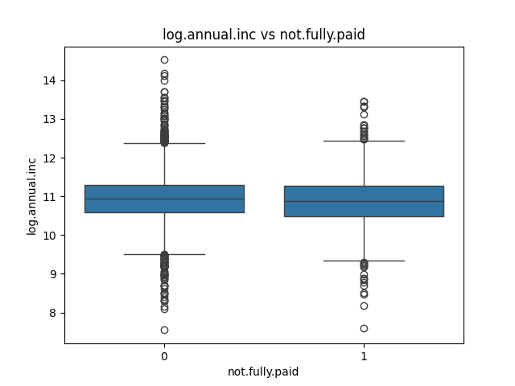
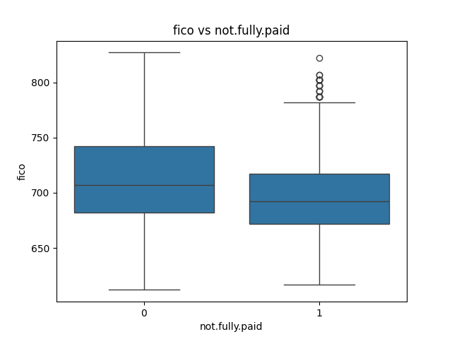
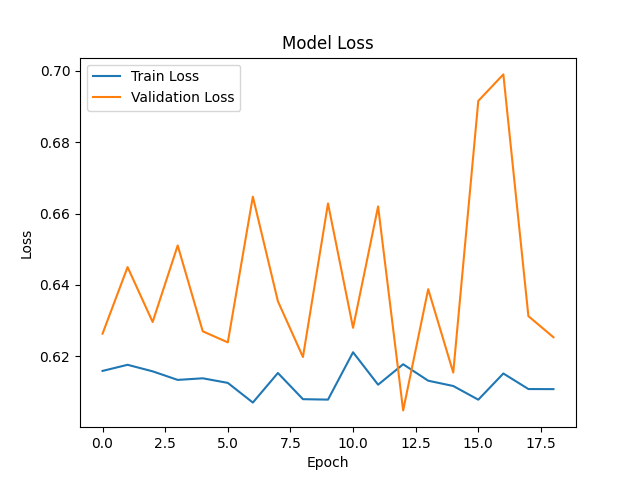

# Conclusions
Model Accuracy with Keras

    accuracy-0.71, Test AUC Score: 0.7058

Model Accuracy with XG Boost

    accuracy-0.69, Test AUC Score: 0.6253
Based on Industry standard accuracy should be 80%, we are not getting accuracy = 80% because of data is not enough. Hence performance of the model should be considered as poor, we can still rely on this model with Manual judgement.


## Run Predictions API
```commandline
$ cd analytical_processors/fastapi
$ python3 lending_club_predictions.py
```

```commandline
curl --location --request POST 'http://127.0.0.1:5000/predict' \
--header 'Content-Type: application/json' \
--data-raw '{
    "credit.policy": [
        1,1,1,1,1,1,0
    ],
    "purpose": [
        "all_other","credit_card","debt_consolidation","educational","home_improvement","major_purchase","small_business"
    ],
    "int.rate": [
        0.12,0.11,0.13,0.14,0.10,0.09,0.15
    ],
    "installment": [
        278.00,890.00,234.43,234.23,221.55,454.99,223.90
    ],
    "log.annual.inc": [
        11.08,12.09,13.45,12.43,13.56,9.23,14.8
    ],
    "dti": [
        14.49,12.09,13.45,12.43,13.56,9.23,14.8
    ],
    "fico": [
        720,800,790,678,780,770,678
    ],
    "days.with.cr.line": [
        3260,3432,4332,6765,2334,6677,4556
    ],
    "revol.bal": [
        43623,89089,89878,56547,34544,76556,100000
    ],
    "revol.util": [
        86.7,76.7,90.7,89.7,66.7,76.7,96.7
    ],
    "inq.last.6mths": [
        0,1,0,2,4,1,2
    ],
    "delinq.2yrs": [
        1,0,0,0,0,0,1
    ],
    "pub.rec": [
        0,0,1,0,0,0,0
    ],
    "not.fully.paid": [
        0,0,0,0,0,0,1
    ]
}'

Response
[
    {
        "default_probability_percent": 48.309627533,
        "predicted_class": 0
    },
    {
        "default_probability_percent": 53.461856842,
        "predicted_class": 1
    },
    {
        "default_probability_percent": 12.5070114136,
        "predicted_class": 0
    },
    {
        "default_probability_percent": 55.815612793,
        "predicted_class": 1
    },
    {
        "default_probability_percent": 27.3426151276,
        "predicted_class": 0
    },
    {
        "default_probability_percent": 62.6190261841,
        "predicted_class": 1
    },
    {
        "default_probability_percent": 81.0511932373,
        "predicted_class": 1
    }
]
```
## EDA, Model Training & Development
```commandline
/opt/homebrew/Cellar/python@3.12/3.12.9/venv/bin/python PycharmProjects/public/analytical_processors/lending_club.py
-----------------------------------------------------------------------------------------------------------
Shape : 
(9578, 14)
-----------------------------------------------------------------------------------------------------------
Data type : 
credit.policy          int64
purpose               object
int.rate             float64
installment          float64
log.annual.inc       float64
dti                  float64
fico                   int64
days.with.cr.line    float64
revol.bal              int64
revol.util           float64
inq.last.6mths         int64
delinq.2yrs            int64
pub.rec                int64
not.fully.paid         int64
dtype: object
-----------------------------------------------------------------------------------------------------------
Row labels : 
RangeIndex(start=0, stop=9578, step=1)
-----------------------------------------------------------------------------------------------------------
Column names : 
Index(['credit.policy', 'purpose', 'int.rate', 'installment', 'log.annual.inc', 'dti', 'fico', 'days.with.cr.line', 'revol.bal', 'revol.util', 'inq.last.6mths', 'delinq.2yrs', 'pub.rec', 'not.fully.paid'], dtype='object')
-----------------------------------------------------------------------------------------------------------
<class 'pandas.core.frame.DataFrame'>
RangeIndex: 9578 entries, 0 to 9577
Data columns (total 14 columns):
 #   Column             Non-Null Count  Dtype  
---  ------             --------------  -----  
 0   credit.policy      9578 non-null   int64  
 1   purpose            9578 non-null   object 
 2   int.rate           9578 non-null   float64
 3   installment        9578 non-null   float64
 4   log.annual.inc     9578 non-null   float64
 5   dti                9578 non-null   float64
 6   fico               9578 non-null   int64  
 7   days.with.cr.line  9578 non-null   float64
 8   revol.bal          9578 non-null   int64  
 9   revol.util         9578 non-null   float64
 10  inq.last.6mths     9578 non-null   int64  
 11  delinq.2yrs        9578 non-null   int64  
 12  pub.rec            9578 non-null   int64  
 13  not.fully.paid     9578 non-null   int64  
dtypes: float64(6), int64(7), object(1)
memory usage: 1.0+ MB
Data info : 
None
-----------------------------------------------------------------------------------------------------------
Describe data : 
       credit.policy     int.rate  installment  log.annual.inc          dti         fico  days.with.cr.line     revol.bal   revol.util  inq.last.6mths  delinq.2yrs      pub.rec  not.fully.paid
count    9578.000000  9578.000000  9578.000000     9578.000000  9578.000000  9578.000000        9578.000000  9.578000e+03  9578.000000     9578.000000  9578.000000  9578.000000     9578.000000
mean        0.804970     0.122640   319.089413       10.932117    12.606679   710.846314        4560.767197  1.691396e+04    46.799236        1.577469     0.163708     0.062122        0.160054
std         0.396245     0.026847   207.071301        0.614813     6.883970    37.970537        2496.930377  3.375619e+04    29.014417        2.200245     0.546215     0.262126        0.366676
min         0.000000     0.060000    15.670000        7.547502     0.000000   612.000000         178.958333  0.000000e+00     0.000000        0.000000     0.000000     0.000000        0.000000
25%         1.000000     0.103900   163.770000       10.558414     7.212500   682.000000        2820.000000  3.187000e+03    22.600000        0.000000     0.000000     0.000000        0.000000
50%         1.000000     0.122100   268.950000       10.928884    12.665000   707.000000        4139.958333  8.596000e+03    46.300000        1.000000     0.000000     0.000000        0.000000
75%         1.000000     0.140700   432.762500       11.291293    17.950000   737.000000        5730.000000  1.824950e+04    70.900000        2.000000     0.000000     0.000000        0.000000
max         1.000000     0.216400   940.140000       14.528354    29.960000   827.000000       17639.958330  1.207359e+06   119.000000       33.000000    13.000000     5.000000        1.000000
-----------------------------------------------------------------------------------------------------------
At least one null value method null : 
credit.policy        0
purpose              0
int.rate             0
installment          0
log.annual.inc       0
dti                  0
fico                 0
days.with.cr.line    0
revol.bal            0
revol.util           0
inq.last.6mths       0
delinq.2yrs          0
pub.rec              0
not.fully.paid       0
dtype: int64
-----------------------------------------------------------------------------------------------------------
At least one null value method na : 
credit.policy        0
purpose              0
int.rate             0
installment          0
log.annual.inc       0
dti                  0
fico                 0
days.with.cr.line    0
revol.bal            0
revol.util           0
inq.last.6mths       0
delinq.2yrs          0
pub.rec              0
not.fully.paid       0
dtype: int64
-----------------------------------------------------------------------------------------------------------
Column which has null is: 
Series([], dtype: int64)
-----------------------------------------------------------------------------------------------------------
Duplicate data: 
0       False
1       False
2       False
3       False
4       False
        ...  
9573    False
9574    False
9575    False
9576    False
9577    False
Length: 9578, dtype: bool
-----------------------------------------------------------------------------------------------------------
Duplicate rows: 
Empty DataFrame
Columns: [credit.policy, purpose, int.rate, installment, log.annual.inc, dti, fico, days.with.cr.line, revol.bal, revol.util, inq.last.6mths, delinq.2yrs, pub.rec, not.fully.paid]
Index: []
-----------------------------------------------------------------------------------------------------------
   credit.policy             purpose  int.rate  installment  log.annual.inc    dti  fico  days.with.cr.line  revol.bal  revol.util  inq.last.6mths  delinq.2yrs  pub.rec  not.fully.paid
0              1  debt_consolidation    0.1189       829.10       11.350407  19.48   737        5639.958333      28854        52.1               0            0        0               0
1              1         credit_card    0.1071       228.22       11.082143  14.29   707        2760.000000      33623        76.7               0            0        0               0
2              1  debt_consolidation    0.1357       366.86       10.373491  11.63   682        4710.000000       3511        25.6               1            0        0               0
3              1  debt_consolidation    0.1008       162.34       11.350407   8.10   712        2699.958333      33667        73.2               1            0        0               0
4              1         credit_card    0.1426       102.92       11.299732  14.97   667        4066.000000       4740        39.5               0            1        0               0
-----------------------------------------------------------------------------------------------------------
Shape : 
(9578, 20)
-----------------------------------------------------------------------------------------------------------
Data type : 
credit.policy                   int64
int.rate                      float64
installment                   float64
log.annual.inc                float64
dti                           float64
fico                            int64
days.with.cr.line             float64
revol.bal                       int64
revol.util                    float64
inq.last.6mths                  int64
delinq.2yrs                     int64
pub.rec                         int64
not.fully.paid                  int64
purpose_all_other               int64
purpose_credit_card             int64
purpose_debt_consolidation      int64
purpose_educational             int64
purpose_home_improvement        int64
purpose_major_purchase          int64
purpose_small_business          int64
dtype: object
-----------------------------------------------------------------------------------------------------------
Row labels : 
RangeIndex(start=0, stop=9578, step=1)
-----------------------------------------------------------------------------------------------------------
Column names : 
Index(['credit.policy', 'int.rate', 'installment', 'log.annual.inc', 'dti', 'fico', 'days.with.cr.line', 'revol.bal', 'revol.util', 'inq.last.6mths', 'delinq.2yrs', 'pub.rec', 'not.fully.paid', 'purpose_all_other', 'purpose_credit_card', 'purpose_debt_consolidation', 'purpose_educational', 'purpose_home_improvement', 'purpose_major_purchase', 'purpose_small_business'], dtype='object')
-----------------------------------------------------------------------------------------------------------
<class 'pandas.core.frame.DataFrame'>
RangeIndex: 9578 entries, 0 to 9577
Data columns (total 20 columns):
 #   Column                      Non-Null Count  Dtype  
---  ------                      --------------  -----  
 0   credit.policy               9578 non-null   int64  
 1   int.rate                    9578 non-null   float64
 2   installment                 9578 non-null   float64
 3   log.annual.inc              9578 non-null   float64
 4   dti                         9578 non-null   float64
 5   fico                        9578 non-null   int64  
 6   days.with.cr.line           9578 non-null   float64
 7   revol.bal                   9578 non-null   int64  
 8   revol.util                  9578 non-null   float64
 9   inq.last.6mths              9578 non-null   int64  
 10  delinq.2yrs                 9578 non-null   int64  
 11  pub.rec                     9578 non-null   int64  
 12  not.fully.paid              9578 non-null   int64  
 13  purpose_all_other           9578 non-null   int64  
 14  purpose_credit_card         9578 non-null   int64  
 15  purpose_debt_consolidation  9578 non-null   int64  
 16  purpose_educational         9578 non-null   int64  
 17  purpose_home_improvement    9578 non-null   int64  
 18  purpose_major_purchase      9578 non-null   int64  
 19  purpose_small_business      9578 non-null   int64  
dtypes: float64(6), int64(14)
memory usage: 1.5 MB
Data info : 
None
-----------------------------------------------------------------------------------------------------------
Describe data : 
       credit.policy     int.rate  installment  log.annual.inc          dti         fico  days.with.cr.line     revol.bal   revol.util  inq.last.6mths  delinq.2yrs      pub.rec  not.fully.paid  purpose_all_other  purpose_credit_card  purpose_debt_consolidation  purpose_educational  purpose_home_improvement  purpose_major_purchase  purpose_small_business
count    9578.000000  9578.000000  9578.000000     9578.000000  9578.000000  9578.000000        9578.000000  9.578000e+03  9578.000000     9578.000000  9578.000000  9578.000000     9578.000000        9578.000000          9578.000000                 9578.000000          9578.000000               9578.000000             9578.000000             9578.000000
mean        0.804970     0.122640   319.089413       10.932117    12.606679   710.846314        4560.767197  1.691396e+04    46.799236        1.577469     0.163708     0.062122        0.160054           0.243370             0.131760                    0.413134             0.035811                  0.065671                0.045625                0.064627
std         0.396245     0.026847   207.071301        0.614813     6.883970    37.970537        2496.930377  3.375619e+04    29.014417        2.200245     0.546215     0.262126        0.366676           0.429139             0.338248                    0.492422             0.185829                  0.247720                0.208682                0.245880
min         0.000000     0.060000    15.670000        7.547502     0.000000   612.000000         178.958333  0.000000e+00     0.000000        0.000000     0.000000     0.000000        0.000000           0.000000             0.000000                    0.000000             0.000000                  0.000000                0.000000                0.000000
25%         1.000000     0.103900   163.770000       10.558414     7.212500   682.000000        2820.000000  3.187000e+03    22.600000        0.000000     0.000000     0.000000        0.000000           0.000000             0.000000                    0.000000             0.000000                  0.000000                0.000000                0.000000
50%         1.000000     0.122100   268.950000       10.928884    12.665000   707.000000        4139.958333  8.596000e+03    46.300000        1.000000     0.000000     0.000000        0.000000           0.000000             0.000000                    0.000000             0.000000                  0.000000                0.000000                0.000000
75%         1.000000     0.140700   432.762500       11.291293    17.950000   737.000000        5730.000000  1.824950e+04    70.900000        2.000000     0.000000     0.000000        0.000000           0.000000             0.000000                    1.000000             0.000000                  0.000000                0.000000                0.000000
max         1.000000     0.216400   940.140000       14.528354    29.960000   827.000000       17639.958330  1.207359e+06   119.000000       33.000000    13.000000     5.000000        1.000000           1.000000             1.000000                    1.000000             1.000000                  1.000000                1.000000                1.000000
-----------------------------------------------------------------------------------------------------------
At least one null value method null : 
credit.policy                 0
int.rate                      0
installment                   0
log.annual.inc                0
dti                           0
fico                          0
days.with.cr.line             0
revol.bal                     0
revol.util                    0
inq.last.6mths                0
delinq.2yrs                   0
pub.rec                       0
not.fully.paid                0
purpose_all_other             0
purpose_credit_card           0
purpose_debt_consolidation    0
purpose_educational           0
purpose_home_improvement      0
purpose_major_purchase        0
purpose_small_business        0
dtype: int64
-----------------------------------------------------------------------------------------------------------
At least one null value method na : 
credit.policy                 0
int.rate                      0
installment                   0
log.annual.inc                0
dti                           0
fico                          0
days.with.cr.line             0
revol.bal                     0
revol.util                    0
inq.last.6mths                0
delinq.2yrs                   0
pub.rec                       0
not.fully.paid                0
purpose_all_other             0
purpose_credit_card           0
purpose_debt_consolidation    0
purpose_educational           0
purpose_home_improvement      0
purpose_major_purchase        0
purpose_small_business        0
dtype: int64
-----------------------------------------------------------------------------------------------------------
Column which has null is: 
Series([], dtype: int64)
-----------------------------------------------------------------------------------------------------------
Duplicate data: 
0       False
1       False
2       False
3       False
4       False
        ...  
9573    False
9574    False
9575    False
9576    False
9577    False
Length: 9578, dtype: bool
-----------------------------------------------------------------------------------------------------------
Duplicate rows: 
Empty DataFrame
Columns: [credit.policy, int.rate, installment, log.annual.inc, dti, fico, days.with.cr.line, revol.bal, revol.util, inq.last.6mths, delinq.2yrs, pub.rec, not.fully.paid, purpose_all_other, purpose_credit_card, purpose_debt_consolidation, purpose_educational, purpose_home_improvement, purpose_major_purchase, purpose_small_business]
Index: []
-----------------------------------------------------------------------------------------------------------
   credit.policy  int.rate  installment  log.annual.inc    dti  fico  days.with.cr.line  revol.bal  revol.util  inq.last.6mths  delinq.2yrs  pub.rec  not.fully.paid  purpose_all_other  purpose_credit_card  purpose_debt_consolidation  purpose_educational  purpose_home_improvement  purpose_major_purchase  purpose_small_business
0              1    0.1189       829.10       11.350407  19.48   737        5639.958333      28854        52.1               0            0        0               0                  0                    0                           1                    0                         0                       0                       0
1              1    0.1071       228.22       11.082143  14.29   707        2760.000000      33623        76.7               0            0        0               0                  0                    1                           0                    0                         0                       0                       0
2              1    0.1357       366.86       10.373491  11.63   682        4710.000000       3511        25.6               1            0        0               0                  0                    0                           1                    0                         0                       0                       0
3              1    0.1008       162.34       11.350407   8.10   712        2699.958333      33667        73.2               1            0        0               0                  0                    0                           1                    0                         0                       0                       0
4              1    0.1426       102.92       11.299732  14.97   667        4066.000000       4740        39.5               0            1        0               0                  0                    1                           0                    0                         0                       0                       0

Class Distribution:
Class 0: 8045 samples (83.99%)
Class 1: 1533 samples (16.01%)

🚨 Data is IMBALANCED.
-----------------------------------------------------------------------------------------------------------
Shape : 
(9578, 27)
-----------------------------------------------------------------------------------------------------------
Data type : 
credit.policy                 int64
purpose                      object
int.rate                    float64
installment                 float64
log.annual.inc              float64
dti                         float64
fico                          int64
days.with.cr.line           float64
revol.bal                     int64
revol.util                  float64
inq.last.6mths                int64
delinq.2yrs                   int64
pub.rec                       int64
not.fully.paid                int64
credit.policy_zscore        float64
int.rate_zscore             float64
installment_zscore          float64
log.annual.inc_zscore       float64
dti_zscore                  float64
fico_zscore                 float64
days.with.cr.line_zscore    float64
revol.bal_zscore            float64
revol.util_zscore           float64
inq.last.6mths_zscore       float64
delinq.2yrs_zscore          float64
pub.rec_zscore              float64
not.fully.paid_zscore       float64
dtype: object
-----------------------------------------------------------------------------------------------------------
Row labels : 
RangeIndex(start=0, stop=9578, step=1)
-----------------------------------------------------------------------------------------------------------
Column names : 
Index(['credit.policy', 'purpose', 'int.rate', 'installment', 'log.annual.inc', 'dti', 'fico', 'days.with.cr.line', 'revol.bal', 'revol.util', 'inq.last.6mths', 'delinq.2yrs', 'pub.rec', 'not.fully.paid', 'credit.policy_zscore', 'int.rate_zscore', 'installment_zscore', 'log.annual.inc_zscore', 'dti_zscore', 'fico_zscore', 'days.with.cr.line_zscore', 'revol.bal_zscore', 'revol.util_zscore', 'inq.last.6mths_zscore', 'delinq.2yrs_zscore', 'pub.rec_zscore', 'not.fully.paid_zscore'], dtype='object')
-----------------------------------------------------------------------------------------------------------
<class 'pandas.core.frame.DataFrame'>
RangeIndex: 9578 entries, 0 to 9577
Data columns (total 27 columns):
 #   Column                    Non-Null Count  Dtype  
---  ------                    --------------  -----  
 0   credit.policy             9578 non-null   int64  
 1   purpose                   9578 non-null   object 
 2   int.rate                  9578 non-null   float64
 3   installment               9578 non-null   float64
 4   log.annual.inc            9578 non-null   float64
 5   dti                       9578 non-null   float64
 6   fico                      9578 non-null   int64  
 7   days.with.cr.line         9578 non-null   float64
 8   revol.bal                 9578 non-null   int64  
 9   revol.util                9578 non-null   float64
 10  inq.last.6mths            9578 non-null   int64  
 11  delinq.2yrs               9578 non-null   int64  
 12  pub.rec                   9578 non-null   int64  
 13  not.fully.paid            9578 non-null   int64  
 14  credit.policy_zscore      9578 non-null   float64
 15  int.rate_zscore           9578 non-null   float64
 16  installment_zscore        9578 non-null   float64
 17  log.annual.inc_zscore     9578 non-null   float64
 18  dti_zscore                9578 non-null   float64
 19  fico_zscore               9578 non-null   float64
 20  days.with.cr.line_zscore  9578 non-null   float64
 21  revol.bal_zscore          9578 non-null   float64
 22  revol.util_zscore         9578 non-null   float64
 23  inq.last.6mths_zscore     9578 non-null   float64
 24  delinq.2yrs_zscore        9578 non-null   float64
 25  pub.rec_zscore            9578 non-null   float64
 26  not.fully.paid_zscore     9578 non-null   float64
dtypes: float64(19), int64(7), object(1)
memory usage: 2.0+ MB
Data info : 
None
-----------------------------------------------------------------------------------------------------------
Describe data : 
       credit.policy     int.rate  installment  log.annual.inc          dti         fico  days.with.cr.line     revol.bal   revol.util  inq.last.6mths  delinq.2yrs      pub.rec  not.fully.paid  credit.policy_zscore  int.rate_zscore  installment_zscore  log.annual.inc_zscore    dti_zscore   fico_zscore  days.with.cr.line_zscore  revol.bal_zscore  revol.util_zscore  inq.last.6mths_zscore  delinq.2yrs_zscore  pub.rec_zscore  not.fully.paid_zscore
count    9578.000000  9578.000000  9578.000000     9578.000000  9578.000000  9578.000000        9578.000000  9.578000e+03  9578.000000     9578.000000  9578.000000  9578.000000     9578.000000          9.578000e+03     9.578000e+03        9.578000e+03           9.578000e+03  9.578000e+03  9.578000e+03              9.578000e+03      9.578000e+03       9.578000e+03           9.578000e+03        9.578000e+03    9.578000e+03           9.578000e+03
mean        0.804970     0.122640   319.089413       10.932117    12.606679   710.846314        4560.767197  1.691396e+04    46.799236        1.577469     0.163708     0.062122        0.160054         -9.495664e-17    -4.747832e-17       -4.896202e-17           1.348681e-15 -7.121748e-17  2.848699e-16             -5.934790e-17     -1.186958e-17       4.154353e-17           2.373916e-17        1.186958e-17    5.638051e-17           1.780437e-17
std         0.396245     0.026847   207.071301        0.614813     6.883970    37.970537        2496.930377  3.375619e+04    29.014417        2.200245     0.546215     0.262126        0.366676          1.000052e+00     1.000052e+00        1.000052e+00           1.000052e+00  1.000052e+00  1.000052e+00              1.000052e+00      1.000052e+00       1.000052e+00           1.000052e+00        1.000052e+00    1.000052e+00           1.000052e+00
min         0.000000     0.060000    15.670000        7.547502     0.000000   612.000000         178.958333  0.000000e+00     0.000000        0.000000     0.000000     0.000000        0.000000         -2.031603e+00    -2.333347e+00       -1.465366e+00          -5.505403e+00 -1.831405e+00 -2.603373e+00             -1.754970e+00     -5.010888e-01      -1.613049e+00          -7.169889e-01       -2.997301e-01   -2.370032e-01          -4.365239e-01
25%         1.000000     0.103900   163.770000       10.558414     7.212500   682.000000        2820.000000  3.187000e+03    22.600000        0.000000     0.000000     0.000000        0.000000          4.922223e-01    -6.980686e-01       -7.501161e-01          -6.078650e-01 -7.836264e-01 -7.597422e-01             -6.971993e-01     -4.066715e-01      -8.340853e-01          -7.169889e-01       -2.997301e-01   -2.370032e-01          -4.365239e-01
50%         1.000000     0.122100   268.950000       10.928884    12.665000   707.000000        4139.958333  8.596000e+03    46.300000        1.000000     0.000000     0.000000        0.000000          4.922223e-01    -2.011729e-02       -2.421486e-01          -5.259710e-03  8.472466e-03 -1.013026e-01             -1.685393e-01     -2.464259e-01      -1.720737e-02          -2.624704e-01       -2.997301e-01   -2.370032e-01          -4.365239e-01
75%         1.000000     0.140700   432.762500       11.291293    17.950000   737.000000        5730.000000  1.824950e+04    70.900000        2.000000     0.000000     0.000000        0.000000          4.922223e-01     6.727340e-01        5.489849e-01           5.842340e-01  7.762382e-01  6.888249e-01              4.682925e-01      3.956625e-02       8.306913e-01           1.920481e-01       -2.997301e-01   -2.370032e-01          -4.365239e-01
max         1.000000     0.216400   940.140000       14.528354    29.960000   827.000000       17639.958330  1.207359e+06   119.000000       33.000000    13.000000     5.000000        1.000000          4.922223e-01     3.492564e+00        2.999368e+00           5.849627e+00  2.520962e+00  3.059207e+00              5.238382e+00      3.526782e+01       2.488574e+00           1.428212e+01        2.350167e+01    1.883877e+01           2.290825e+00
-----------------------------------------------------------------------------------------------------------
At least one null value method null : 
credit.policy               0
purpose                     0
int.rate                    0
installment                 0
log.annual.inc              0
dti                         0
fico                        0
days.with.cr.line           0
revol.bal                   0
revol.util                  0
inq.last.6mths              0
delinq.2yrs                 0
pub.rec                     0
not.fully.paid              0
credit.policy_zscore        0
int.rate_zscore             0
installment_zscore          0
log.annual.inc_zscore       0
dti_zscore                  0
fico_zscore                 0
days.with.cr.line_zscore    0
revol.bal_zscore            0
revol.util_zscore           0
inq.last.6mths_zscore       0
delinq.2yrs_zscore          0
pub.rec_zscore              0
not.fully.paid_zscore       0
dtype: int64
-----------------------------------------------------------------------------------------------------------
At least one null value method na : 
credit.policy               0
purpose                     0
int.rate                    0
installment                 0
log.annual.inc              0
dti                         0
fico                        0
days.with.cr.line           0
revol.bal                   0
revol.util                  0
inq.last.6mths              0
delinq.2yrs                 0
pub.rec                     0
not.fully.paid              0
credit.policy_zscore        0
int.rate_zscore             0
installment_zscore          0
log.annual.inc_zscore       0
dti_zscore                  0
fico_zscore                 0
days.with.cr.line_zscore    0
revol.bal_zscore            0
revol.util_zscore           0
inq.last.6mths_zscore       0
delinq.2yrs_zscore          0
pub.rec_zscore              0
not.fully.paid_zscore       0
dtype: int64
-----------------------------------------------------------------------------------------------------------
Column which has null is: 
Series([], dtype: int64)
-----------------------------------------------------------------------------------------------------------
Duplicate data: 
0       False
1       False
2       False
3       False
4       False
        ...  
9573    False
9574    False
9575    False
9576    False
9577    False
Length: 9578, dtype: bool
-----------------------------------------------------------------------------------------------------------
Duplicate rows: 
Empty DataFrame
Columns: [credit.policy, purpose, int.rate, installment, log.annual.inc, dti, fico, days.with.cr.line, revol.bal, revol.util, inq.last.6mths, delinq.2yrs, pub.rec, not.fully.paid, credit.policy_zscore, int.rate_zscore, installment_zscore, log.annual.inc_zscore, dti_zscore, fico_zscore, days.with.cr.line_zscore, revol.bal_zscore, revol.util_zscore, inq.last.6mths_zscore, delinq.2yrs_zscore, pub.rec_zscore, not.fully.paid_zscore]
Index: []
-----------------------------------------------------------------------------------------------------------
   credit.policy             purpose  int.rate  installment  log.annual.inc    dti  fico  days.with.cr.line  revol.bal  revol.util  inq.last.6mths  delinq.2yrs  pub.rec  not.fully.paid  credit.policy_zscore  int.rate_zscore  installment_zscore  log.annual.inc_zscore  dti_zscore  fico_zscore  days.with.cr.line_zscore  revol.bal_zscore  revol.util_zscore  inq.last.6mths_zscore  delinq.2yrs_zscore  pub.rec_zscore  not.fully.paid_zscore
0              1  debt_consolidation    0.1189       829.10       11.350407  19.48   737        5639.958333      28854        52.1               0            0        0               0              0.492222        -0.139318            2.463099               0.680388    0.998505     0.688825                  0.432230          0.353732           0.182704              -0.716989           -0.299730       -0.237003              -0.436524
1              1         credit_card    0.1071       228.22       11.082143  14.29   707        2760.000000      33623        76.7               0            0        0               0              0.492222        -0.578868           -0.438854               0.244031    0.244540    -0.101303                 -0.721230          0.495018           1.030602              -0.716989           -0.299730       -0.237003              -0.436524
2              1  debt_consolidation    0.1357       366.86       10.373491  11.63   682        4710.000000       3511        25.6               1            0        0               0              0.492222         0.486484            0.230708              -0.908659   -0.141885    -0.759742                  0.059770         -0.397073          -0.730683              -0.262470           -0.299730       -0.237003              -0.436524
3              1  debt_consolidation    0.1008       162.34       11.350407   8.10   712        2699.958333      33667        73.2               1            0        0               0              0.492222        -0.813544           -0.757022               0.680388   -0.654697     0.030385                 -0.745277          0.496321           0.909966              -0.262470           -0.299730       -0.237003              -0.436524
4              1         credit_card    0.1426       102.92       11.299732  14.97   667        4066.000000       4740        39.5               0            1        0               0              0.492222         0.743509           -1.043992               0.597961    0.343326    -1.154806                 -0.198161         -0.360663          -0.251586              -0.716989            1.531147       -0.237003              -0.436524
[[ 0.49222226 -0.13931753  2.46309947 ... -0.2651173  -0.21864717
  -0.26285458]
 [ 0.49222226 -0.57886837 -0.43885443 ... -0.2651173  -0.21864717
  -0.26285458]
 [ 0.49222226  0.48648368  0.23070836 ... -0.2651173  -0.21864717
  -0.26285458]
 ...
 [-2.03160257 -0.57886837 -1.06867038 ... -0.2651173  -0.21864717
  -0.26285458]
 [-2.03160257  1.39166043  0.1569135  ...  3.77191529 -0.21864717
  -0.26285458]
 [-2.03160257  0.61685894  2.58060136 ... -0.2651173  -0.21864717
  -0.26285458]]
Class Weights: {0: 0.5954305253341623, 1: 3.1197068403908794}
Columns to drop (correlation > 0.85): []
/opt/homebrew/Cellar/python@3.12/3.12.9/venv/lib/python3.12/site-packages/keras/src/layers/core/dense.py:87: UserWarning: Do not pass an `input_shape`/`input_dim` argument to a layer. When using Sequential models, prefer using an `Input(shape)` object as the first layer in the model instead.
  super().__init__(activity_regularizer=activity_regularizer, **kwargs)
Epoch 1/50
240/240 ━━━━━━━━━━━━━━━━━━━━ 0s 740us/step - accuracy: 0.5313 - loss: 0.7077 - val_accuracy: 0.6049 - val_loss: 0.6592
Epoch 2/50
240/240 ━━━━━━━━━━━━━━━━━━━━ 0s 484us/step - accuracy: 0.5958 - loss: 0.6665 - val_accuracy: 0.6519 - val_loss: 0.6326
Epoch 3/50
240/240 ━━━━━━━━━━━━━━━━━━━━ 0s 472us/step - accuracy: 0.6253 - loss: 0.6423 - val_accuracy: 0.6759 - val_loss: 0.6217
Epoch 4/50
240/240 ━━━━━━━━━━━━━━━━━━━━ 0s 500us/step - accuracy: 0.6216 - loss: 0.6443 - val_accuracy: 0.6785 - val_loss: 0.6156
Epoch 5/50
240/240 ━━━━━━━━━━━━━━━━━━━━ 0s 472us/step - accuracy: 0.6266 - loss: 0.6517 - val_accuracy: 0.6435 - val_loss: 0.6267
Epoch 6/50
240/240 ━━━━━━━━━━━━━━━━━━━━ 0s 510us/step - accuracy: 0.6122 - loss: 0.6463 - val_accuracy: 0.6665 - val_loss: 0.6155
Epoch 7/50
240/240 ━━━━━━━━━━━━━━━━━━━━ 0s 466us/step - accuracy: 0.6211 - loss: 0.6439 - val_accuracy: 0.6592 - val_loss: 0.6248
Epoch 8/50
240/240 ━━━━━━━━━━━━━━━━━━━━ 0s 479us/step - accuracy: 0.6186 - loss: 0.6463 - val_accuracy: 0.6597 - val_loss: 0.6191
Epoch 9/50
240/240 ━━━━━━━━━━━━━━━━━━━━ 0s 458us/step - accuracy: 0.6320 - loss: 0.6332 - val_accuracy: 0.6320 - val_loss: 0.6310
Epoch 10/50
240/240 ━━━━━━━━━━━━━━━━━━━━ 0s 483us/step - accuracy: 0.5986 - loss: 0.6404 - val_accuracy: 0.6608 - val_loss: 0.6117
Epoch 11/50
240/240 ━━━━━━━━━━━━━━━━━━━━ 0s 466us/step - accuracy: 0.6271 - loss: 0.6404 - val_accuracy: 0.6420 - val_loss: 0.6290
Epoch 12/50
240/240 ━━━━━━━━━━━━━━━━━━━━ 0s 489us/step - accuracy: 0.6183 - loss: 0.6233 - val_accuracy: 0.6503 - val_loss: 0.6185
Epoch 13/50
240/240 ━━━━━━━━━━━━━━━━━━━━ 0s 488us/step - accuracy: 0.6146 - loss: 0.6278 - val_accuracy: 0.6884 - val_loss: 0.6032
Epoch 14/50
240/240 ━━━━━━━━━━━━━━━━━━━━ 0s 496us/step - accuracy: 0.6144 - loss: 0.6451 - val_accuracy: 0.6701 - val_loss: 0.6198
Epoch 15/50
240/240 ━━━━━━━━━━━━━━━━━━━━ 0s 462us/step - accuracy: 0.6188 - loss: 0.6333 - val_accuracy: 0.6733 - val_loss: 0.6137
Epoch 16/50
240/240 ━━━━━━━━━━━━━━━━━━━━ 0s 490us/step - accuracy: 0.6439 - loss: 0.6171 - val_accuracy: 0.6362 - val_loss: 0.6419
Epoch 17/50
240/240 ━━━━━━━━━━━━━━━━━━━━ 0s 461us/step - accuracy: 0.6061 - loss: 0.6290 - val_accuracy: 0.6185 - val_loss: 0.6535
Epoch 18/50
240/240 ━━━━━━━━━━━━━━━━━━━━ 0s 484us/step - accuracy: 0.6278 - loss: 0.6174 - val_accuracy: 0.6477 - val_loss: 0.6364
Epoch 19/50
240/240 ━━━━━━━━━━━━━━━━━━━━ 0s 462us/step - accuracy: 0.6264 - loss: 0.6328 - val_accuracy: 0.6858 - val_loss: 0.5998
Epoch 20/50
240/240 ━━━━━━━━━━━━━━━━━━━━ 0s 483us/step - accuracy: 0.6411 - loss: 0.6327 - val_accuracy: 0.6623 - val_loss: 0.6165
Epoch 21/50
240/240 ━━━━━━━━━━━━━━━━━━━━ 0s 468us/step - accuracy: 0.6383 - loss: 0.6162 - val_accuracy: 0.6524 - val_loss: 0.6311
Epoch 22/50
240/240 ━━━━━━━━━━━━━━━━━━━━ 0s 485us/step - accuracy: 0.6311 - loss: 0.6187 - val_accuracy: 0.6581 - val_loss: 0.6173
Epoch 23/50
240/240 ━━━━━━━━━━━━━━━━━━━━ 0s 455us/step - accuracy: 0.6307 - loss: 0.6235 - val_accuracy: 0.6503 - val_loss: 0.6323
Epoch 24/50
240/240 ━━━━━━━━━━━━━━━━━━━━ 0s 483us/step - accuracy: 0.6306 - loss: 0.6171 - val_accuracy: 0.6681 - val_loss: 0.6200
Epoch 25/50
240/240 ━━━━━━━━━━━━━━━━━━━━ 0s 459us/step - accuracy: 0.6414 - loss: 0.6191 - val_accuracy: 0.6347 - val_loss: 0.6411
Epoch 26/50
240/240 ━━━━━━━━━━━━━━━━━━━━ 0s 489us/step - accuracy: 0.6274 - loss: 0.6276 - val_accuracy: 0.6383 - val_loss: 0.6427
Epoch 27/50
240/240 ━━━━━━━━━━━━━━━━━━━━ 0s 462us/step - accuracy: 0.6214 - loss: 0.6290 - val_accuracy: 0.6555 - val_loss: 0.6342
Epoch 28/50
240/240 ━━━━━━━━━━━━━━━━━━━━ 0s 495us/step - accuracy: 0.6249 - loss: 0.6231 - val_accuracy: 0.6618 - val_loss: 0.6254
Epoch 29/50
240/240 ━━━━━━━━━━━━━━━━━━━━ 0s 461us/step - accuracy: 0.6539 - loss: 0.5972 - val_accuracy: 0.6153 - val_loss: 0.6469
Epoch 30/50
240/240 ━━━━━━━━━━━━━━━━━━━━ 0s 490us/step - accuracy: 0.6227 - loss: 0.6086 - val_accuracy: 0.6456 - val_loss: 0.6259
Epoch 31/50
240/240 ━━━━━━━━━━━━━━━━━━━━ 0s 467us/step - accuracy: 0.6345 - loss: 0.6285 - val_accuracy: 0.6519 - val_loss: 0.6099
Epoch 32/50
240/240 ━━━━━━━━━━━━━━━━━━━━ 0s 488us/step - accuracy: 0.6261 - loss: 0.6184 - val_accuracy: 0.6660 - val_loss: 0.6141
Epoch 33/50
240/240 ━━━━━━━━━━━━━━━━━━━━ 0s 460us/step - accuracy: 0.6465 - loss: 0.6113 - val_accuracy: 0.6545 - val_loss: 0.6198
Epoch 34/50
240/240 ━━━━━━━━━━━━━━━━━━━━ 0s 484us/step - accuracy: 0.6476 - loss: 0.6026 - val_accuracy: 0.6550 - val_loss: 0.6214
Epoch 35/50
240/240 ━━━━━━━━━━━━━━━━━━━━ 0s 460us/step - accuracy: 0.6412 - loss: 0.6080 - val_accuracy: 0.6550 - val_loss: 0.6183
Epoch 36/50
240/240 ━━━━━━━━━━━━━━━━━━━━ 0s 486us/step - accuracy: 0.6477 - loss: 0.6089 - val_accuracy: 0.6357 - val_loss: 0.6363
Epoch 37/50
240/240 ━━━━━━━━━━━━━━━━━━━━ 0s 468us/step - accuracy: 0.6472 - loss: 0.6185 - val_accuracy: 0.6759 - val_loss: 0.6027
Epoch 38/50
240/240 ━━━━━━━━━━━━━━━━━━━━ 0s 495us/step - accuracy: 0.6502 - loss: 0.6001 - val_accuracy: 0.6487 - val_loss: 0.6274
Epoch 39/50
240/240 ━━━━━━━━━━━━━━━━━━━━ 0s 467us/step - accuracy: 0.6492 - loss: 0.6020 - val_accuracy: 0.6832 - val_loss: 0.6099
Epoch 40/50
240/240 ━━━━━━━━━━━━━━━━━━━━ 0s 489us/step - accuracy: 0.6563 - loss: 0.6183 - val_accuracy: 0.6654 - val_loss: 0.6212
Epoch 41/50
240/240 ━━━━━━━━━━━━━━━━━━━━ 0s 461us/step - accuracy: 0.6479 - loss: 0.6107 - val_accuracy: 0.6827 - val_loss: 0.6087
Epoch 42/50
240/240 ━━━━━━━━━━━━━━━━━━━━ 0s 483us/step - accuracy: 0.6623 - loss: 0.6078 - val_accuracy: 0.6842 - val_loss: 0.6138
Epoch 43/50
240/240 ━━━━━━━━━━━━━━━━━━━━ 0s 466us/step - accuracy: 0.6703 - loss: 0.6123 - val_accuracy: 0.6837 - val_loss: 0.5989
Epoch 44/50
240/240 ━━━━━━━━━━━━━━━━━━━━ 0s 484us/step - accuracy: 0.6599 - loss: 0.6094 - val_accuracy: 0.6973 - val_loss: 0.5949
Epoch 45/50
240/240 ━━━━━━━━━━━━━━━━━━━━ 0s 481us/step - accuracy: 0.6678 - loss: 0.6130 - val_accuracy: 0.6816 - val_loss: 0.6102
Epoch 46/50
240/240 ━━━━━━━━━━━━━━━━━━━━ 0s 493us/step - accuracy: 0.6602 - loss: 0.5943 - val_accuracy: 0.6743 - val_loss: 0.6158
Epoch 47/50
240/240 ━━━━━━━━━━━━━━━━━━━━ 0s 472us/step - accuracy: 0.6486 - loss: 0.6328 - val_accuracy: 0.6644 - val_loss: 0.6209
Epoch 48/50
240/240 ━━━━━━━━━━━━━━━━━━━━ 0s 495us/step - accuracy: 0.6663 - loss: 0.5982 - val_accuracy: 0.6717 - val_loss: 0.6186
Epoch 49/50
240/240 ━━━━━━━━━━━━━━━━━━━━ 0s 456us/step - accuracy: 0.6668 - loss: 0.5990 - val_accuracy: 0.6837 - val_loss: 0.6112
Epoch 50/50
240/240 ━━━━━━━━━━━━━━━━━━━━ 0s 490us/step - accuracy: 0.6825 - loss: 0.5880 - val_accuracy: 0.6587 - val_loss: 0.6362
60/60 ━━━━━━━━━━━━━━━━━━━━ 0s 369us/step

Classification Report:
              precision    recall  f1-score   support

           0       0.91      0.66      0.77      1611
           1       0.27      0.65      0.38       305

    accuracy                           0.66      1916
   macro avg       0.59      0.65      0.57      1916
weighted avg       0.81      0.66      0.70      1916

Test AUC Score: 0.6924
WARNING:absl:You are saving your model as an HDF5 file via `model.save()` or `keras.saving.save_model(model)`. This file format is considered legacy. We recommend using instead the native Keras format, e.g. `model.save('my_model.keras')` or `keras.saving.save_model(model, 'my_model.keras')`. 
Model saved successfully to loan_default_keras_model.h5!
-----------------------------------------------------------------------------------------------------------
-----------------------------------------------------------------------------------------------------------
WARNING:absl:Compiled the loaded model, but the compiled metrics have yet to be built. `model.compile_metrics` will be empty until you train or evaluate the model.
Model and Scalar loaded successfully!
-----------------------------------------------------------------------------------------------------------
Shape : 
(14, 14)
-----------------------------------------------------------------------------------------------------------
Data type : 
credit.policy          int64
purpose               object
int.rate             float64
installment          float64
log.annual.inc       float64
dti                  float64
fico                   int64
days.with.cr.line    float64
revol.bal              int64
revol.util           float64
inq.last.6mths         int64
delinq.2yrs            int64
pub.rec                int64
not.fully.paid         int64
dtype: object
-----------------------------------------------------------------------------------------------------------
Row labels : 
RangeIndex(start=0, stop=14, step=1)
-----------------------------------------------------------------------------------------------------------
Column names : 
Index(['credit.policy', 'purpose', 'int.rate', 'installment', 'log.annual.inc', 'dti', 'fico', 'days.with.cr.line', 'revol.bal', 'revol.util', 'inq.last.6mths', 'delinq.2yrs', 'pub.rec', 'not.fully.paid'], dtype='object')
-----------------------------------------------------------------------------------------------------------
<class 'pandas.core.frame.DataFrame'>
RangeIndex: 14 entries, 0 to 13
Data columns (total 14 columns):
 #   Column             Non-Null Count  Dtype  
---  ------             --------------  -----  
 0   credit.policy      14 non-null     int64  
 1   purpose            14 non-null     object 
 2   int.rate           14 non-null     float64
 3   installment        14 non-null     float64
 4   log.annual.inc     14 non-null     float64
 5   dti                14 non-null     float64
 6   fico               14 non-null     int64  
 7   days.with.cr.line  14 non-null     float64
 8   revol.bal          14 non-null     int64  
 9   revol.util         14 non-null     float64
 10  inq.last.6mths     14 non-null     int64  
 11  delinq.2yrs        14 non-null     int64  
 12  pub.rec            14 non-null     int64  
 13  not.fully.paid     14 non-null     int64  
dtypes: float64(6), int64(7), object(1)
memory usage: 1.7+ KB
Data info : 
None
-----------------------------------------------------------------------------------------------------------
Describe data : 
       credit.policy   int.rate  installment  log.annual.inc        dti        fico  days.with.cr.line     revol.bal  revol.util  inq.last.6mths  delinq.2yrs    pub.rec  not.fully.paid
count           14.0  14.000000    14.000000       14.000000  14.000000   14.000000          14.000000     14.000000   14.000000       14.000000    14.000000  14.000000       14.000000
mean             1.0   0.117107   247.351429       11.103247  12.030714  717.642857        5041.005952  28607.071429   55.475000        1.142857     0.214286   0.142857        0.214286
std              0.0   0.027713   208.337111        1.064862   4.588092   27.048694        2071.722095  22265.719911   24.504213        1.561909     0.425815   0.363137        0.425815
min              1.0   0.064300    86.750000        8.798127   4.200000  680.000000        3199.958333   4021.000000    4.950000        0.000000     0.000000   0.000000        0.000000
25%              1.0   0.095200   134.887500       10.458723   8.775000  696.250000        3365.010417  13450.250000   36.550000        0.000000     0.000000   0.000000        0.000000
50%              1.0   0.122400   178.175000       11.190937  12.005000  720.000000        4733.020834  15185.000000   61.050000        1.000000     0.000000   0.000000        0.000000
75%              1.0   0.131300   269.670000       11.393275  15.000000  736.500000        5558.000000  42430.750000   74.975000        1.000000     0.000000   0.000000        0.000000
max              1.0   0.159600   879.100000       13.184421  19.680000  770.000000       11048.958330  79909.000000   86.800000        5.000000     1.000000   1.000000        1.000000
-----------------------------------------------------------------------------------------------------------
At least one null value method null : 
credit.policy        0
purpose              0
int.rate             0
installment          0
log.annual.inc       0
dti                  0
fico                 0
days.with.cr.line    0
revol.bal            0
revol.util           0
inq.last.6mths       0
delinq.2yrs          0
pub.rec              0
not.fully.paid       0
dtype: int64
-----------------------------------------------------------------------------------------------------------
At least one null value method na : 
credit.policy        0
purpose              0
int.rate             0
installment          0
log.annual.inc       0
dti                  0
fico                 0
days.with.cr.line    0
revol.bal            0
revol.util           0
inq.last.6mths       0
delinq.2yrs          0
pub.rec              0
not.fully.paid       0
dtype: int64
-----------------------------------------------------------------------------------------------------------
Column which has null is: 
Series([], dtype: int64)
-----------------------------------------------------------------------------------------------------------
Duplicate data: 
0     False
1     False
2     False
3     False
4     False
5     False
6     False
7     False
8     False
9     False
10    False
11    False
12    False
13    False
dtype: bool
-----------------------------------------------------------------------------------------------------------
Duplicate rows: 
Empty DataFrame
Columns: [credit.policy, purpose, int.rate, installment, log.annual.inc, dti, fico, days.with.cr.line, revol.bal, revol.util, inq.last.6mths, delinq.2yrs, pub.rec, not.fully.paid]
Index: []
-----------------------------------------------------------------------------------------------------------
   credit.policy             purpose  int.rate  installment  log.annual.inc    dti  fico  days.with.cr.line  revol.bal  revol.util  inq.last.6mths  delinq.2yrs  pub.rec  not.fully.paid
0              1  debt_consolidation    0.1289       879.10       11.350407  19.68   750        6139.958333      38854        62.1               1            0        1               0
1              1         credit_card    0.1171       278.22       11.082143  14.49   720        3260.000000      43623        86.7               0            0        0               1
2              1  debt_consolidation    0.1457       416.86       10.373491  11.83   695        5210.000000      13511        35.6               4            1        0               0
3              1    home_improvement    0.1108       212.34       11.350407   8.30   725        3199.958333      43667        83.2               1            0        0               0
4              1         credit_card    0.1526       152.92       11.299732  15.17   680        4566.000000      14740        49.5               0            0        1               0
-----------------------------------------------------------------------------------------------------------
Shape : 
(14, 20)
-----------------------------------------------------------------------------------------------------------
Data type : 
credit.policy                   int64
int.rate                      float64
installment                   float64
log.annual.inc                float64
dti                           float64
fico                            int64
days.with.cr.line             float64
revol.bal                       int64
revol.util                    float64
inq.last.6mths                  int64
delinq.2yrs                     int64
pub.rec                         int64
not.fully.paid                  int64
purpose_all_other               int64
purpose_credit_card             int64
purpose_debt_consolidation      int64
purpose_educational             int64
purpose_home_improvement        int64
purpose_major_purchase          int64
purpose_small_business          int64
dtype: object
-----------------------------------------------------------------------------------------------------------
Row labels : 
RangeIndex(start=0, stop=14, step=1)
-----------------------------------------------------------------------------------------------------------
Column names : 
Index(['credit.policy', 'int.rate', 'installment', 'log.annual.inc', 'dti', 'fico', 'days.with.cr.line', 'revol.bal', 'revol.util', 'inq.last.6mths', 'delinq.2yrs', 'pub.rec', 'not.fully.paid', 'purpose_all_other', 'purpose_credit_card', 'purpose_debt_consolidation', 'purpose_educational', 'purpose_home_improvement', 'purpose_major_purchase', 'purpose_small_business'], dtype='object')
-----------------------------------------------------------------------------------------------------------
<class 'pandas.core.frame.DataFrame'>
RangeIndex: 14 entries, 0 to 13
Data columns (total 20 columns):
 #   Column                      Non-Null Count  Dtype  
---  ------                      --------------  -----  
 0   credit.policy               14 non-null     int64  
 1   int.rate                    14 non-null     float64
 2   installment                 14 non-null     float64
 3   log.annual.inc              14 non-null     float64
 4   dti                         14 non-null     float64
 5   fico                        14 non-null     int64  
 6   days.with.cr.line           14 non-null     float64
 7   revol.bal                   14 non-null     int64  
 8   revol.util                  14 non-null     float64
 9   inq.last.6mths              14 non-null     int64  
 10  delinq.2yrs                 14 non-null     int64  
 11  pub.rec                     14 non-null     int64  
 12  not.fully.paid              14 non-null     int64  
 13  purpose_all_other           14 non-null     int64  
 14  purpose_credit_card         14 non-null     int64  
 15  purpose_debt_consolidation  14 non-null     int64  
 16  purpose_educational         14 non-null     int64  
 17  purpose_home_improvement    14 non-null     int64  
 18  purpose_major_purchase      14 non-null     int64  
 19  purpose_small_business      14 non-null     int64  
dtypes: float64(6), int64(14)
memory usage: 2.3 KB
Data info : 
None
-----------------------------------------------------------------------------------------------------------
Describe data : 
       credit.policy   int.rate  installment  log.annual.inc        dti        fico  days.with.cr.line     revol.bal  revol.util  inq.last.6mths  delinq.2yrs    pub.rec  not.fully.paid  purpose_all_other  purpose_credit_card  purpose_debt_consolidation  purpose_educational  purpose_home_improvement  purpose_major_purchase  purpose_small_business
count           14.0  14.000000    14.000000       14.000000  14.000000   14.000000          14.000000     14.000000   14.000000       14.000000    14.000000  14.000000       14.000000          14.000000            14.000000                   14.000000            14.000000                 14.000000               14.000000               14.000000
mean             1.0   0.117107   247.351429       11.103247  12.030714  717.642857        5041.005952  28607.071429   55.475000        1.142857     0.214286   0.142857        0.214286           0.142857             0.285714                    0.214286             0.071429                  0.142857                0.071429                0.071429
std              0.0   0.027713   208.337111        1.064862   4.588092   27.048694        2071.722095  22265.719911   24.504213        1.561909     0.425815   0.363137        0.425815           0.363137             0.468807                    0.425815             0.267261                  0.363137                0.267261                0.267261
min              1.0   0.064300    86.750000        8.798127   4.200000  680.000000        3199.958333   4021.000000    4.950000        0.000000     0.000000   0.000000        0.000000           0.000000             0.000000                    0.000000             0.000000                  0.000000                0.000000                0.000000
25%              1.0   0.095200   134.887500       10.458723   8.775000  696.250000        3365.010417  13450.250000   36.550000        0.000000     0.000000   0.000000        0.000000           0.000000             0.000000                    0.000000             0.000000                  0.000000                0.000000                0.000000
50%              1.0   0.122400   178.175000       11.190937  12.005000  720.000000        4733.020834  15185.000000   61.050000        1.000000     0.000000   0.000000        0.000000           0.000000             0.000000                    0.000000             0.000000                  0.000000                0.000000                0.000000
75%              1.0   0.131300   269.670000       11.393275  15.000000  736.500000        5558.000000  42430.750000   74.975000        1.000000     0.000000   0.000000        0.000000           0.000000             0.750000                    0.000000             0.000000                  0.000000                0.000000                0.000000
max              1.0   0.159600   879.100000       13.184421  19.680000  770.000000       11048.958330  79909.000000   86.800000        5.000000     1.000000   1.000000        1.000000           1.000000             1.000000                    1.000000             1.000000                  1.000000                1.000000                1.000000
-----------------------------------------------------------------------------------------------------------
At least one null value method null : 
credit.policy                 0
int.rate                      0
installment                   0
log.annual.inc                0
dti                           0
fico                          0
days.with.cr.line             0
revol.bal                     0
revol.util                    0
inq.last.6mths                0
delinq.2yrs                   0
pub.rec                       0
not.fully.paid                0
purpose_all_other             0
purpose_credit_card           0
purpose_debt_consolidation    0
purpose_educational           0
purpose_home_improvement      0
purpose_major_purchase        0
purpose_small_business        0
dtype: int64
-----------------------------------------------------------------------------------------------------------
At least one null value method na : 
credit.policy                 0
int.rate                      0
installment                   0
log.annual.inc                0
dti                           0
fico                          0
days.with.cr.line             0
revol.bal                     0
revol.util                    0
inq.last.6mths                0
delinq.2yrs                   0
pub.rec                       0
not.fully.paid                0
purpose_all_other             0
purpose_credit_card           0
purpose_debt_consolidation    0
purpose_educational           0
purpose_home_improvement      0
purpose_major_purchase        0
purpose_small_business        0
dtype: int64
-----------------------------------------------------------------------------------------------------------
Column which has null is: 
Series([], dtype: int64)
-----------------------------------------------------------------------------------------------------------
Duplicate data: 
0     False
1     False
2     False
3     False
4     False
5     False
6     False
7     False
8     False
9     False
10    False
11    False
12    False
13    False
dtype: bool
-----------------------------------------------------------------------------------------------------------
Duplicate rows: 
Empty DataFrame
Columns: [credit.policy, int.rate, installment, log.annual.inc, dti, fico, days.with.cr.line, revol.bal, revol.util, inq.last.6mths, delinq.2yrs, pub.rec, not.fully.paid, purpose_all_other, purpose_credit_card, purpose_debt_consolidation, purpose_educational, purpose_home_improvement, purpose_major_purchase, purpose_small_business]
Index: []
-----------------------------------------------------------------------------------------------------------
   credit.policy  int.rate  installment  log.annual.inc    dti  fico  days.with.cr.line  revol.bal  revol.util  inq.last.6mths  delinq.2yrs  pub.rec  not.fully.paid  purpose_all_other  purpose_credit_card  purpose_debt_consolidation  purpose_educational  purpose_home_improvement  purpose_major_purchase  purpose_small_business
0              1    0.1289       879.10       11.350407  19.68   750        6139.958333      38854        62.1               1            0        1               0                  0                    0                           1                    0                         0                       0                       0
1              1    0.1171       278.22       11.082143  14.49   720        3260.000000      43623        86.7               0            0        0               1                  0                    1                           0                    0                         0                       0                       0
2              1    0.1457       416.86       10.373491  11.83   695        5210.000000      13511        35.6               4            1        0               0                  0                    0                           1                    0                         0                       0                       0
3              1    0.1108       212.34       11.350407   8.30   725        3199.958333      43667        83.2               1            0        0               0                  0                    0                           0                    0                         1                       0                       0
4              1    0.1526       152.92       11.299732  15.17   680        4566.000000      14740        49.5               0            0        1               0                  0                    1                           0                    0                         0                       0                       0
PycharmProjects/public/analytical_processors/wrangling/prepare.py:37: RuntimeWarning: Precision loss occurred in moment calculation due to catastrophic cancellation. This occurs when the data are nearly identical. Results may be unreliable.
  z_scores = data.select_dtypes(include=['number']).apply(lambda x: stats.zscore(x))
-----------------------------------------------------------------------------------------------------------
Shape : 
(14, 27)
-----------------------------------------------------------------------------------------------------------
Data type : 
credit.policy                 int64
purpose                      object
int.rate                    float64
installment                 float64
log.annual.inc              float64
dti                         float64
fico                          int64
days.with.cr.line           float64
revol.bal                     int64
revol.util                  float64
inq.last.6mths                int64
delinq.2yrs                   int64
pub.rec                       int64
not.fully.paid                int64
credit.policy_zscore        float64
int.rate_zscore             float64
installment_zscore          float64
log.annual.inc_zscore       float64
dti_zscore                  float64
fico_zscore                 float64
days.with.cr.line_zscore    float64
revol.bal_zscore            float64
revol.util_zscore           float64
inq.last.6mths_zscore       float64
delinq.2yrs_zscore          float64
pub.rec_zscore              float64
not.fully.paid_zscore       float64
dtype: object
-----------------------------------------------------------------------------------------------------------
Row labels : 
RangeIndex(start=0, stop=14, step=1)
-----------------------------------------------------------------------------------------------------------
Column names : 
Index(['credit.policy', 'purpose', 'int.rate', 'installment', 'log.annual.inc', 'dti', 'fico', 'days.with.cr.line', 'revol.bal', 'revol.util', 'inq.last.6mths', 'delinq.2yrs', 'pub.rec', 'not.fully.paid', 'credit.policy_zscore', 'int.rate_zscore', 'installment_zscore', 'log.annual.inc_zscore', 'dti_zscore', 'fico_zscore', 'days.with.cr.line_zscore', 'revol.bal_zscore', 'revol.util_zscore', 'inq.last.6mths_zscore', 'delinq.2yrs_zscore', 'pub.rec_zscore', 'not.fully.paid_zscore'], dtype='object')
-----------------------------------------------------------------------------------------------------------
<class 'pandas.core.frame.DataFrame'>
RangeIndex: 14 entries, 0 to 13
Data columns (total 27 columns):
 #   Column                    Non-Null Count  Dtype  
---  ------                    --------------  -----  
 0   credit.policy             14 non-null     int64  
 1   purpose                   14 non-null     object 
 2   int.rate                  14 non-null     float64
 3   installment               14 non-null     float64
 4   log.annual.inc            14 non-null     float64
 5   dti                       14 non-null     float64
 6   fico                      14 non-null     int64  
 7   days.with.cr.line         14 non-null     float64
 8   revol.bal                 14 non-null     int64  
 9   revol.util                14 non-null     float64
 10  inq.last.6mths            14 non-null     int64  
 11  delinq.2yrs               14 non-null     int64  
 12  pub.rec                   14 non-null     int64  
 13  not.fully.paid            14 non-null     int64  
 14  credit.policy_zscore      0 non-null      float64
 15  int.rate_zscore           14 non-null     float64
 16  installment_zscore        14 non-null     float64
 17  log.annual.inc_zscore     14 non-null     float64
 18  dti_zscore                14 non-null     float64
 19  fico_zscore               14 non-null     float64
 20  days.with.cr.line_zscore  14 non-null     float64
 21  revol.bal_zscore          14 non-null     float64
 22  revol.util_zscore         14 non-null     float64
 23  inq.last.6mths_zscore     14 non-null     float64
 24  delinq.2yrs_zscore        14 non-null     float64
 25  pub.rec_zscore            14 non-null     float64
 26  not.fully.paid_zscore     14 non-null     float64
dtypes: float64(19), int64(7), object(1)
memory usage: 3.1+ KB
Data info : 
None
-----------------------------------------------------------------------------------------------------------
Describe data : 
       credit.policy   int.rate  installment  log.annual.inc        dti        fico  days.with.cr.line     revol.bal  revol.util  inq.last.6mths  delinq.2yrs    pub.rec  not.fully.paid  credit.policy_zscore  int.rate_zscore  installment_zscore  log.annual.inc_zscore    dti_zscore   fico_zscore  days.with.cr.line_zscore  revol.bal_zscore  revol.util_zscore  inq.last.6mths_zscore  delinq.2yrs_zscore  pub.rec_zscore  not.fully.paid_zscore
count           14.0  14.000000    14.000000       14.000000  14.000000   14.000000          14.000000     14.000000   14.000000       14.000000    14.000000  14.000000       14.000000                   0.0     1.400000e+01        1.400000e+01           1.400000e+01  1.400000e+01  1.400000e+01              1.400000e+01      1.400000e+01       1.400000e+01           1.400000e+01           14.000000    1.400000e+01              14.000000
mean             1.0   0.117107   247.351429       11.103247  12.030714  717.642857        5041.005952  28607.071429   55.475000        1.142857     0.214286   0.142857        0.214286                   NaN     5.392512e-16       -1.982541e-16           6.026925e-16 -1.090398e-17  1.229175e-15              5.630417e-16      5.551115e-17      -3.806479e-16           6.344132e-17            0.000000    1.586033e-17               0.000000
std              0.0   0.027713   208.337111        1.064862   4.588092   27.048694        2071.722095  22265.719911   24.504213        1.561909     0.425815   0.363137        0.425815                   NaN     1.037749e+00        1.037749e+00           1.037749e+00  1.037749e+00  1.037749e+00              1.037749e+00      1.037749e+00       1.037749e+00           1.037749e+00            1.037749    1.037749e+00               1.037749
min              1.0   0.064300    86.750000        8.798127   4.200000  680.000000        3199.958333   4021.000000    4.950000        0.000000     0.000000   0.000000        0.000000                   NaN    -1.977456e+00       -7.999726e-01          -2.246428e+00 -1.771175e+00 -1.444204e+00             -9.222016e-01     -1.145895e+00      -2.139725e+00          -7.593264e-01           -0.522233   -4.082483e-01              -0.522233
25%              1.0   0.095200   134.887500       10.458723   8.775000  696.250000        3365.010417  13450.250000   36.550000        0.000000     0.000000   0.000000        0.000000                   NaN    -8.203513e-01       -5.601946e-01          -6.281137e-01 -7.363876e-01 -8.207574e-01             -8.395251e-01     -7.064212e-01      -8.014704e-01          -7.593264e-01           -0.522233   -4.082483e-01              -0.522233
50%              1.0   0.122400   178.175000       11.190937  12.005000  720.000000        4733.020834  15185.000000   61.050000        1.000000     0.000000   0.000000        0.000000                   NaN     1.982003e-01       -3.445751e-01           8.545774e-02 -5.816137e-03  9.043404e-02             -1.542732e-01     -6.255689e-01       2.361003e-01          -9.491580e-02           -0.522233   -4.082483e-01              -0.522233
75%              1.0   0.131300   269.670000       11.393275  15.000000  736.500000        5558.000000  42430.750000   74.975000        1.000000     0.000000   0.000000        0.000000                   NaN     5.314764e-01        1.111711e-01           2.826439e-01  6.716023e-01  7.234723e-01              2.589682e-01      6.442868e-01       8.258215e-01          -9.491580e-02           -0.522233   -4.082483e-01              -0.522233
max              1.0   0.159600   879.100000       13.184421  19.680000  770.000000       11048.958330  79909.000000   86.800000        5.000000     1.000000   1.000000        1.000000                   NaN     1.591219e+00        3.146806e+00           2.028185e+00  1.730139e+00  2.008732e+00              3.009451e+00      2.391053e+00       1.326608e+00           2.562727e+00            1.914854    2.449490e+00               1.914854
-----------------------------------------------------------------------------------------------------------
At least one null value method null : 
credit.policy                0
purpose                      0
int.rate                     0
installment                  0
log.annual.inc               0
dti                          0
fico                         0
days.with.cr.line            0
revol.bal                    0
revol.util                   0
inq.last.6mths               0
delinq.2yrs                  0
pub.rec                      0
not.fully.paid               0
credit.policy_zscore        14
int.rate_zscore              0
installment_zscore           0
log.annual.inc_zscore        0
dti_zscore                   0
fico_zscore                  0
days.with.cr.line_zscore     0
revol.bal_zscore             0
revol.util_zscore            0
inq.last.6mths_zscore        0
delinq.2yrs_zscore           0
pub.rec_zscore               0
not.fully.paid_zscore        0
dtype: int64
-----------------------------------------------------------------------------------------------------------
At least one null value method na : 
credit.policy                0
purpose                      0
int.rate                     0
installment                  0
log.annual.inc               0
dti                          0
fico                         0
days.with.cr.line            0
revol.bal                    0
revol.util                   0
inq.last.6mths               0
delinq.2yrs                  0
pub.rec                      0
not.fully.paid               0
credit.policy_zscore        14
int.rate_zscore              0
installment_zscore           0
log.annual.inc_zscore        0
dti_zscore                   0
fico_zscore                  0
days.with.cr.line_zscore     0
revol.bal_zscore             0
revol.util_zscore            0
inq.last.6mths_zscore        0
delinq.2yrs_zscore           0
pub.rec_zscore               0
not.fully.paid_zscore        0
dtype: int64
-----------------------------------------------------------------------------------------------------------
Column which has null is: 
Series([], dtype: int64)
-----------------------------------------------------------------------------------------------------------
Duplicate data: 
0     False
1     False
2     False
3     False
4     False
5     False
6     False
7     False
8     False
9     False
10    False
11    False
12    False
13    False
dtype: bool
-----------------------------------------------------------------------------------------------------------
Duplicate rows: 
Empty DataFrame
Columns: [credit.policy, purpose, int.rate, installment, log.annual.inc, dti, fico, days.with.cr.line, revol.bal, revol.util, inq.last.6mths, delinq.2yrs, pub.rec, not.fully.paid, credit.policy_zscore, int.rate_zscore, installment_zscore, log.annual.inc_zscore, dti_zscore, fico_zscore, days.with.cr.line_zscore, revol.bal_zscore, revol.util_zscore, inq.last.6mths_zscore, delinq.2yrs_zscore, pub.rec_zscore, not.fully.paid_zscore]
Index: []
-----------------------------------------------------------------------------------------------------------
   credit.policy             purpose  int.rate  installment  log.annual.inc    dti  fico  days.with.cr.line  revol.bal  revol.util  inq.last.6mths  delinq.2yrs  pub.rec  not.fully.paid  credit.policy_zscore  int.rate_zscore  installment_zscore  log.annual.inc_zscore  dti_zscore  fico_zscore  days.with.cr.line_zscore  revol.bal_zscore  revol.util_zscore  inq.last.6mths_zscore  delinq.2yrs_zscore  pub.rec_zscore  not.fully.paid_zscore
0              1  debt_consolidation    0.1289       879.10       11.350407  19.68   750        6139.958333      38854        62.1               1            0        1               0                   NaN         0.441604            3.146806               0.240867    1.730139     1.241413                  0.550478          0.477583           0.280568              -0.094916           -0.522233        2.449490              -0.522233
1              1         credit_card    0.1171       278.22       11.082143  14.49   720        3260.000000      43623        86.7               0            0        0               1                   NaN        -0.000267            0.153760              -0.020567    0.556249     0.090434                 -0.892126          0.699855           1.322373              -0.759326           -0.522233       -0.408248               1.914854
2              1  debt_consolidation    0.1457       416.86       10.373491  11.83   695        5210.000000      13511        35.6               4            1        0               0                   NaN         1.070710            0.844340              -0.711175   -0.045398    -0.868715                  0.084651         -0.703590          -0.841703               1.898316            1.914854       -0.408248              -0.522233
3              1    home_improvement    0.1108       212.34       11.350407   8.30   725        3199.958333      43667        83.2               1            0        0               0                   NaN        -0.236182           -0.174396               0.240867   -0.843825     0.282264                 -0.922202          0.701905           1.174149              -0.094916           -0.522233       -0.408248              -0.522233
4              1         credit_card    0.1526       152.92       11.299732  15.17   680        4566.000000      14740        49.5               0            0        1               0                   NaN         1.329092           -0.470373               0.191483    0.710053    -1.444204                 -0.237936         -0.646309          -0.253040              -0.759326           -0.522233        2.449490              -0.522233
-----------------------------------------------------------------------------------------------------------
1/1 ━━━━━━━━━━━━━━━━━━━━ 0s 18ms/step
    default_probability_percent  predicted_class
0                     19.233219                0
1                     29.860395                0
2                     51.072510                1
3                     44.744862                0
4                     67.416740                1
5                      3.269012                0
6                     46.402420                0
7                     51.468189                1
8                     35.272213                0
9                     43.047184                0
10                    61.106499                1
11                     0.833928                0
12                    66.675262                1
13                     0.775839                0
-----------------------------------------------------------------------------------------------------------

Classification Report data_new:
              precision    recall  f1-score   support

           0       0.78      0.64      0.70        11
           1       0.20      0.33      0.25         3

    accuracy                           0.57        14
   macro avg       0.49      0.48      0.47        14
weighted avg       0.65      0.57      0.60        14

Test AUC Score data_new: 0.4848
-----------------------------------------------------------------------------------------------------------
-----------------------------------------------------------------------------------------------------------
Imbalance Ratio: 5.24
/opt/homebrew/Cellar/python@3.12/3.12.9/venv/lib/python3.12/site-packages/xgboost/training.py:183: UserWarning: [23:21:30] WARNING: /Users/runner/work/xgboost/xgboost/src/learner.cc:738: 
Parameters: { "use_label_encoder" } are not used.

  bst.update(dtrain, iteration=i, fobj=obj)
[0]	validation_0-auc:0.63817
[100]	validation_0-auc:0.68099
[200]	validation_0-auc:0.66487
[300]	validation_0-auc:0.64568
[400]	validation_0-auc:0.63540
[499]	validation_0-auc:0.62525

Classification Report:
              precision    recall  f1-score   support

           0       0.87      0.74      0.80      1611
           1       0.24      0.42      0.30       305

    accuracy                           0.69      1916
   macro avg       0.55      0.58      0.55      1916
weighted avg       0.77      0.69      0.72      1916

Test AUC Score: 0.6253
-----------------------------------------------------------------------------------------------------------
-----------------------------------------------------------------------------------------------------------

Process finished with exit code 0
```

# EDA

## Loan Data Null Analysis


## Loan Data Box Plots







## Loan Data Pair Plot


## Loan Data Z Scores


## Loan Data Keras Model Accuracy
### Run 1

### Run 2


## Loan Data Keras Model Loss
### Run 1

### Run 2


## Loan Data New Null Analysis


## Loan Data New Box Plots


## Loan Data Correlation Matrix


## Loan Data New Correlation Matrix


## Loan Data New Pair Plot


## Loan Data New Z Scores


## XG Boost Model Top 10 Features


