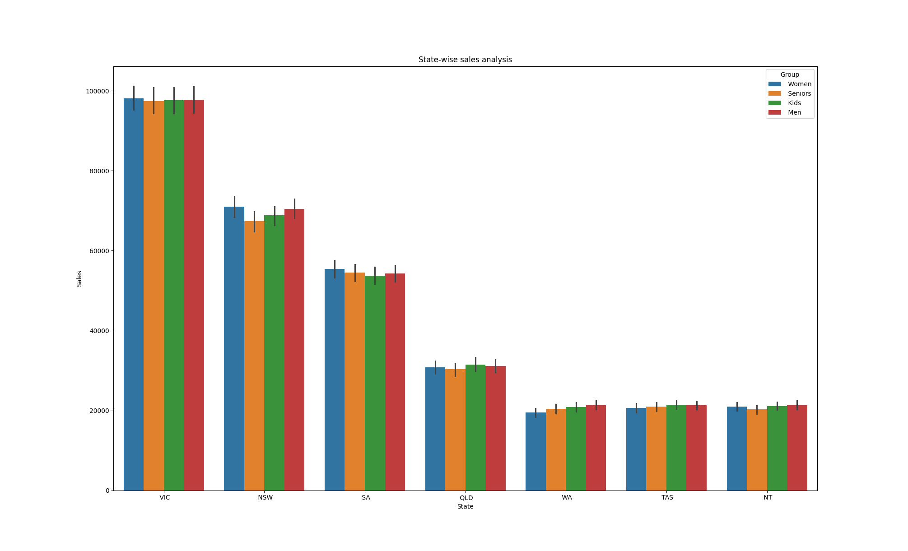
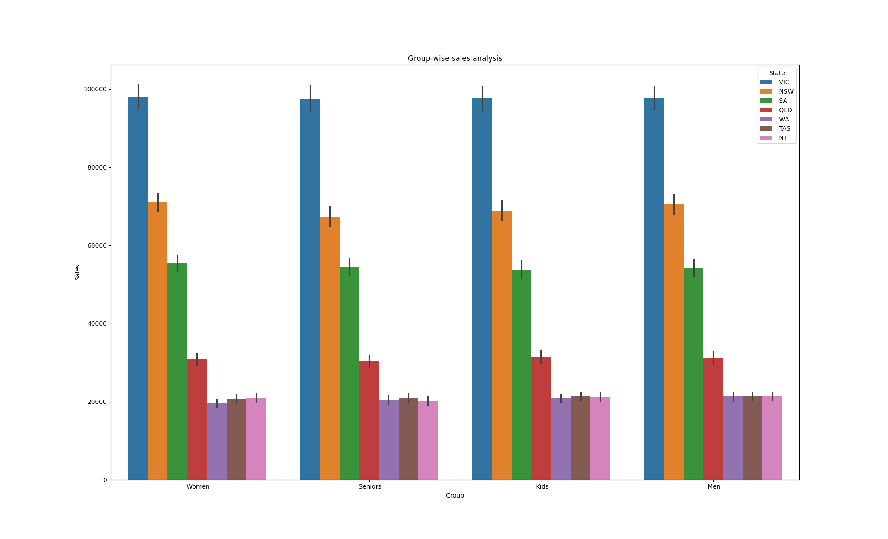
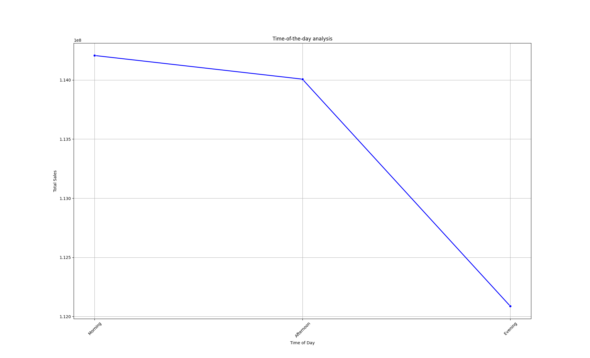
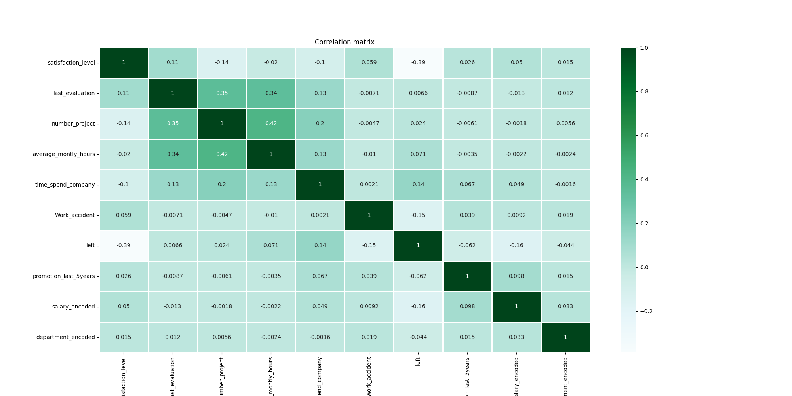
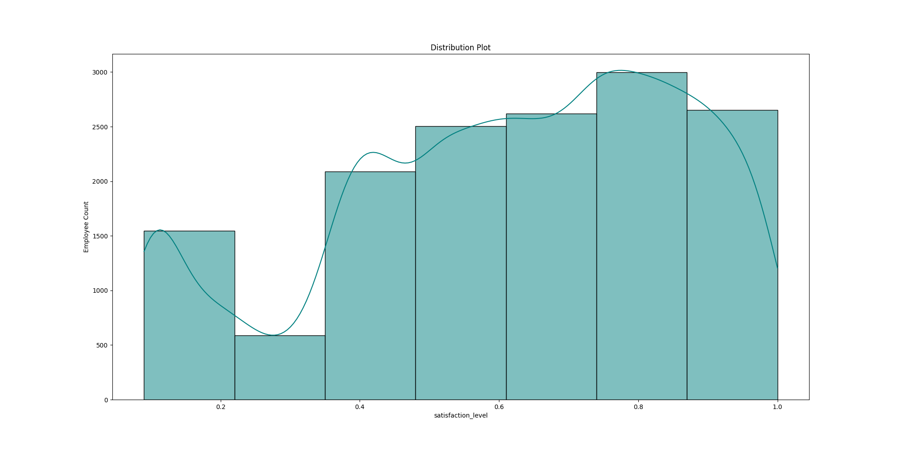
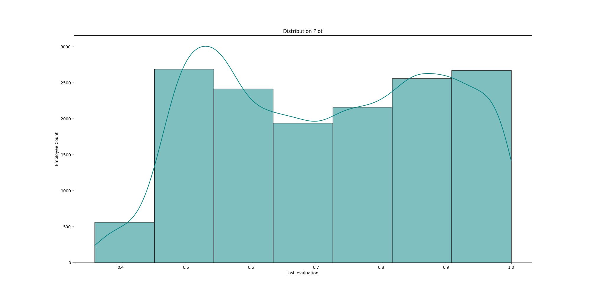
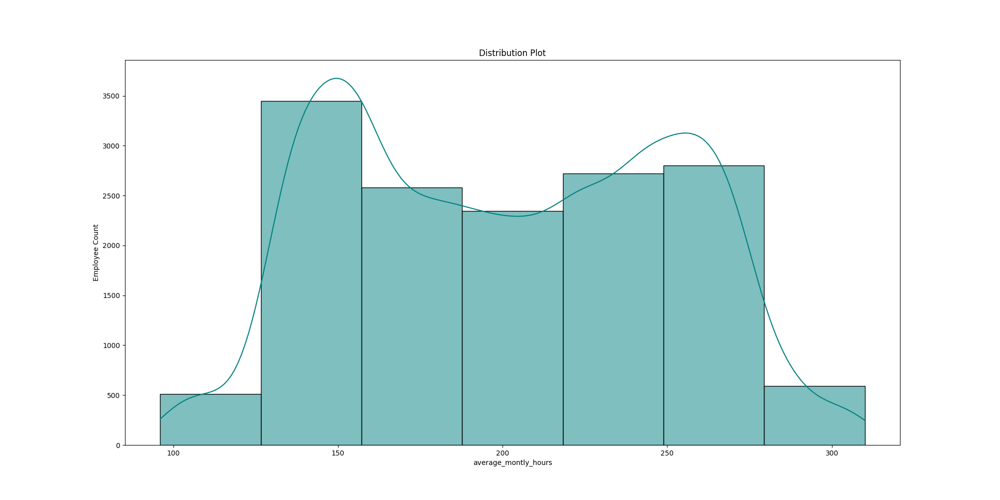
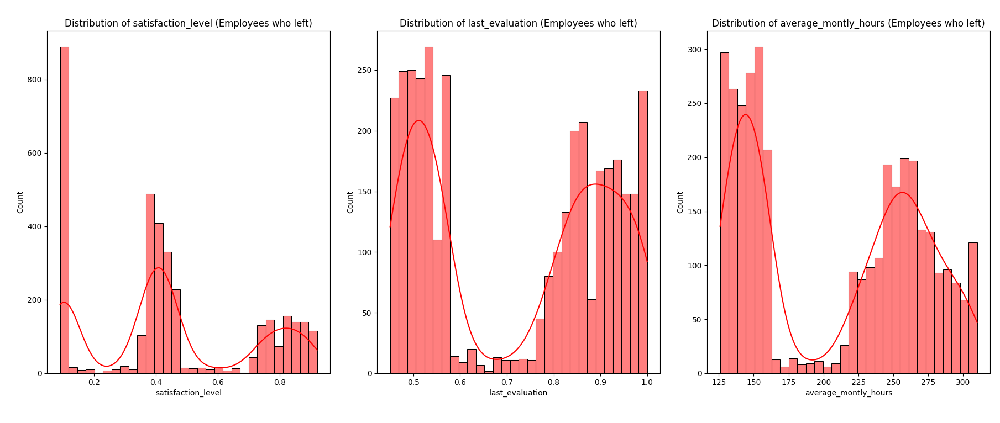
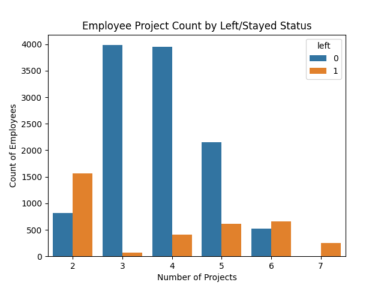
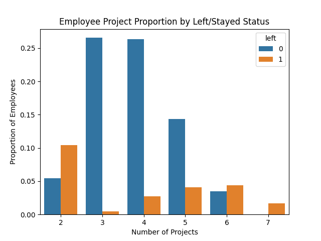

# Authors

## Vijay Bhanu Peddimsetti, Vinothkumar Ganesan, Nagaswetha Akula

# Modules
## requirements.txt
```
pandas==2.2.3
seaborn==0.13.2
scikit-learn==1.6.1
```

### Environment preparation
please install the requirements 
```
python -m pip install --upgrade pip
pip install -r requirements.txt
```

# Sales Assignment

## sales_analysis.py
```
import pandas as pd

from analysis.data_analysis import sales, sales_normalization, sales_by_time
from visualization.visualize import bar_plot, line_plot
from wrangling.insights import explain, group_by_features
from wrangling.normalization import min_max_normalization
from wrangling.prepare import fill_null, convert_data_type

# Main Execution
if __name__ == "__main__":
    try:
        file_path = '../data/AusApparalSales4thQrt2020.csv'
        data = pd.read_csv(file_path)
        explain(data)
        # fill_null(data,'Time','Morning')
        # fill_null(data, 'Sales', 20000)
        explain(data)
        data = convert_data_type(data, data.Date, 'datetime')
        print('After converting datatime datatype')
        print(data.info())
        min_max_normalization(data, 'Sales', 'sales_normalization')
        print('after adding sales_normalization')
        print(data[['Unit', 'Sales', 'sales_normalization']].agg(['min', 'max']))
        group_by_features(data)
        grouped_data_by_state = sales(data, 'State')
        print(f"Maximum Sales in State={grouped_data_by_state.idxmax()}")
        print(f"Minimum Sales in State={grouped_data_by_state.idxmin()}")
        grouped_data_by_group = sales(data, 'Group')
        print(f"Maximum Sales by Group={grouped_data_by_group.idxmax()}")
        print(f"Minimum Sales by Group={grouped_data_by_group.idxmin()}")

        grouped_data_by_state_normalization = sales_normalization(data, 'State')
        print(f"Maximum Sales using normalization in State={grouped_data_by_state_normalization.idxmax()}")
        print(f"Minimum Sales using normalization in State={grouped_data_by_state_normalization.idxmin()}")
        grouped_data_by_group_normalization = sales_normalization(data, 'Group')
        print(f"Maximum Sales using normalization by Group={grouped_data_by_group_normalization.idxmax()}")
        print(f"Minimum Sales using normalization by Group={grouped_data_by_group_normalization.idxmin()}")

        monthly_report = sales_by_time(data, 'month')
        print(f"Monthly Sales={data.groupby(monthly_report)['Sales'].sum()}")
        weekly_report = sales_by_time(data, 'day_of_week')
        print(f"Weekly Sales={data.groupby(weekly_report)['Sales'].sum()}")
        quarterly_report = sales_by_time(data, 'quarter')
        print(f"Quarterly Sales={data.groupby(quarterly_report)['Sales'].sum()}")

        monthly_report_sales_normalization = sales_by_time(data, 'month')
        print(f"Monthly sales_normalization={data.groupby(monthly_report)['sales_normalization'].sum()}")
        weekly_report_sales_normalization = sales_by_time(data, 'day_of_week')
        print(f"Weekly sales_normalization={data.groupby(weekly_report)['sales_normalization'].sum()}")
        quarterly_report_sales_normalization = sales_by_time(data, 'quarter')
        print(f"Quarterly sales_normalization={data.groupby(quarterly_report)['sales_normalization'].sum()}")

        bar_plot(data, 'State', 'Sales', 'Group', 'State-wise sales analysis')
        bar_plot(data, 'Group', 'Sales', 'State', 'Group-wise sales analysis')
        sorted_data = data.sort_values(['Time'], ascending=False)
        line_plot(sorted_data.groupby('Time')['Sales'].sum().reset_index())
    except Exception as e:
        print(f"❌ Fatal error: {e}")
```

## Wrangling
### wrangling/insights.py
```
import pandas as pd


def explain(data):
    print(f'Shape : \t{data.shape}')
    print(f'Row Labels : \t{data.index}')
    print(f'Column Names : \n{data.columns}')
    print(f'DataType : \n{data.dtypes}')
    # this returns if there is at least one null value in any of the column data
    print(data.isna().sum(axis=0))
    missing_val = data.isna().sum(axis=0)
    print('column which has null is')
    print(missing_val[missing_val == 1])


def group_by_features(data):
    # %% d. Share your insights regarding the application of the GroupBy() function for
    # either data chunking or merging, and offer a recommendation based on
    # your analysis.
    # Grouping the data by 'State' and 'Time' 'Group' to analyze total sales and units sold
    data_grouped_group = data.groupby(['State', 'Time', 'Group']).agg({'Sales': 'sum', 'Unit': 'sum'}).reset_index()
    sorted_group = data_grouped_group.sort_values(by='Sales', ascending=False)
    print('Grouping the data by State and Time Group to analyze total sales and units sold')
    print(sorted_group)
    # Applying standard deviation to the 'Sales' column and creating a new column
    print('Applying standard deviation to the Sales column and creating a new column')
    data["Sales_Std_Dev"] = data.groupby(["State", "Time"])["Sales"].transform("std")
    print(data)
    print(data.select_dtypes(include='int').describe())
    print('Mode of Data')
    print(data.select_dtypes(include='int').mode())
    return data
```
### wrangling/prepare.py
```
import pandas as pd


def fill_null(data, column, value):
    return data.fillna({column: value}, inplace=True)


def convert_data_type(data, column, dest_type):
    if dest_type == 'datetime':
        data.Date = pd.to_datetime(column)
        return data
```
### wrangling/normalization.py
```
from sklearn.preprocessing import MinMaxScaler


# TBD C. Choose a suitable data wrangling technique—either data standardization
# or normalization. Execute the preferred normalization method and
# present the resulting data. (Normalization is the preferred approach for this
# problem.)  Normalization (Min-Max Scaling)	When data needs to be in a fixed range (0 to 1)	Xnormalized=Xmax−XminX−Xmin
def min_max_normalization(data, column_name, new_column_name_to_be_added):
    scaler = MinMaxScaler()
    # Apply normalization to 'Sales' column
    data[new_column_name_to_be_added] = scaler.fit_transform(data[[column_name]])
    return data
```

## Analysis
### analysis/data_analysis.py
```
# Identify the group with the highest sales and the group with the lowest
# sales based on the data provided.

def sales(data, column):
    grouped_data = data.groupby(column)
    return grouped_data['Sales'].sum()


def sales_normalization(data, column):
    grouped_data = data.groupby(column)
    return grouped_data['sales_normalization'].sum()


def sales_by_time(data, duration):
    if duration == 'month':
        return data['Date'].dt.month
    if duration == 'day_of_week':
        return data['Date'].dt.day_of_week
    if duration == 'quarter':
        return data['Date'].dt.quarter
```
## Visualization
### visualization/visualize.py
```
import seaborn as sb

import matplotlib.pyplot as plt


def bar_plot(data, xcolumn, ycolumn, huecolumn, title):
    plt.figure(figsize=(12, 8))
    sorted_data = data.sort_values([ycolumn], ascending=False)
    sb.barplot(x=xcolumn, y=ycolumn, hue=huecolumn, data=sorted_data)
    plt.title(title)
    plt.show()


def line_plot(grouped_data):
    # Sorting time-of-day sales in descending order
    df_time_sales = grouped_data.sort_values(by="Sales", ascending=False)
    plt.figure(figsize=(10, 6))
    sb.lineplot(data=df_time_sales, x="Time", y="Sales", marker="o", linewidth=2, color="b")
    # sb.lineplot(x=df_time_sales.index, y=grouped_data.values)
    plt.title('Time-of-the-day analysis')
    plt.xlabel('Time of Day')
    plt.ylabel('Total Sales')
    plt.xticks(rotation=45)
    plt.grid(True)
    plt.show()
```

## Run
```
python ./sales_analysis.py
```
### Output
```
$ python ./sales_analysis.py                                                                  
Shape :         (7560, 6)
Row Labels :    RangeIndex(start=0, stop=7560, step=1)
Column Names : 
Index(['Date', 'Time', 'State', 'Group', 'Unit', 'Sales'], dtype='object')
DataType : 
Date     object
Time     object
State    object
Group    object
Unit      int64
Sales     int64
dtype: object
Date     0
Time     0
State    0
Group    0
Unit     0
Sales    0
dtype: int64
column which has null is
Series([], dtype: int64)
Shape :         (7560, 6)
Row Labels :    RangeIndex(start=0, stop=7560, step=1)
Column Names : 
Index(['Date', 'Time', 'State', 'Group', 'Unit', 'Sales'], dtype='object')
DataType : 
Date     object
Time     object
State    object
Group    object
Unit      int64
Sales     int64
dtype: object
Date     0
Time     0
State    0
Group    0
Unit     0
Sales    0
dtype: int64
column which has null is
Series([], dtype: int64)
After converting datatime datatype
<class 'pandas.core.frame.DataFrame'>
RangeIndex: 7560 entries, 0 to 7559
Data columns (total 6 columns):
 #   Column  Non-Null Count  Dtype         
---  ------  --------------  -----         
 0   Date    7560 non-null   datetime64[ns]
 1   Time    7560 non-null   object        
 2   State   7560 non-null   object        
 3   Group   7560 non-null   object        
 4   Unit    7560 non-null   int64         
 5   Sales   7560 non-null   int64         
dtypes: datetime64[ns](1), int64(2), object(3)
memory usage: 354.5+ KB
None
after adding sales_normalization
     Unit   Sales  sales_normalization
min     2    5000                  0.0
max    65  162500                  1.0
Grouping the data by State and Time Group to analyze total sales and units sold
   State        Time     Group    Sales  Unit
70   VIC     Morning   Seniors  9057500  3623
68   VIC     Morning      Kids  8950000  3580
67   VIC     Evening     Women  8930000  3572
65   VIC     Evening       Men  8900000  3560
62   VIC   Afternoon   Seniors  8830000  3532
..   ...         ...       ...      ...   ...
78    WA     Evening   Seniors  1792500   717
74    WA   Afternoon   Seniors  1770000   708
83    WA     Morning     Women  1767500   707
22    NT     Morning   Seniors  1760000   704
75    WA   Afternoon     Women  1685000   674

[84 rows x 5 columns]
Applying standard deviation to the Sales column and creating a new column
           Date        Time State     Group  Unit  Sales  sales_normalization  Sales_Std_Dev
0    2020-10-01     Morning    WA      Kids     8  20000             0.095238    9421.807477
1    2020-10-01     Morning    WA       Men     8  20000             0.095238    9421.807477
2    2020-10-01     Morning    WA     Women     4  10000             0.031746    9421.807477
3    2020-10-01     Morning    WA   Seniors    15  37500             0.206349    9421.807477
4    2020-10-01   Afternoon    WA      Kids     3   7500             0.015873    9394.976396
...         ...         ...   ...       ...   ...    ...                  ...            ...
7555 2020-12-30   Afternoon   TAS   Seniors    14  35000             0.190476    8901.955732
7556 2020-12-30     Evening   TAS      Kids    15  37500             0.206349    8802.606375
7557 2020-12-30     Evening   TAS       Men    15  37500             0.206349    8802.606375
7558 2020-12-30     Evening   TAS     Women    11  27500             0.142857    8802.606375
7559 2020-12-30     Evening   TAS   Seniors    13  32500             0.174603    8802.606375

[7560 rows x 8 columns]
              Unit          Sales
count  7560.000000    7560.000000
mean     18.005423   45013.558201
std      12.901403   32253.506944
min       2.000000    5000.000000
25%       8.000000   20000.000000
50%      14.000000   35000.000000
75%      26.000000   65000.000000
max      65.000000  162500.000000
Mode of Data
   Unit  Sales
0     9  22500
Maximum Sales in State= VIC
Minimum Sales in State= WA
Maximum Sales by Group= Men
Minimum Sales by Group= Seniors
Maximum Sales using normalization in State= VIC
Minimum Sales using normalization in State= WA
Maximum Sales using normalization by Group= Men
Minimum Sales using normalization by Group= Seniors
Monthly Sales=Date
10    114290000
11     90682500
12    135330000
Name: Sales, dtype: int64
Weekly Sales=Date
0    48050000
1    50327500
2    49945000
3    49405000
4    48000000
5    46245000
6    48330000
Name: Sales, dtype: int64
Quarterly Sales=Date
4    340302500
Name: Sales, dtype: int64
Monthly sales_normalization=Date
10    645.650794
11    495.761905
12    779.238095
Name: sales_normalization, dtype: float64
Weekly sales_normalization=Date
0    270.412698
1    284.873016
2    282.444444
3    279.015873
4    270.095238
5    261.619048
6    272.190476
Name: sales_normalization, dtype: float64
Quarterly sales_normalization=Date
4    1920.650794
Name: sales_normalization, dtype: float64
2025-02-07 05:29:24.345 python[83668:2789266] +[IMKClient subclass]: chose IMKClient_Modern
2025-02-07 05:29:24.346 python[83668:2789266] +[IMKInputSession subclass]: chose IMKInputSession_Modern
```
### Visualizations

#### State-wise sales analysis


#### Group-wise sales analysis


#### Time-of-the-day analysis


# Employee Turnover

## employee_turnover.py

## Run
```
python ./employee_turnover.py
```
### Output
```
Shape : 	(14999, 10)
Row Labels : 	RangeIndex(start=0, stop=14999, step=1)
Column Names : 
Index(['satisfaction_level', 'last_evaluation', 'number_project',
       'average_montly_hours', 'time_spend_company', 'Work_accident', 'left',
       'promotion_last_5years', 'sales', 'salary'],
      dtype='object')
DataType : 
satisfaction_level       float64
last_evaluation          float64
number_project             int64
average_montly_hours       int64
time_spend_company         int64
Work_accident              int64
left                       int64
promotion_last_5years      int64
sales                     object
salary                    object
dtype: object
satisfaction_level       0
last_evaluation          0
number_project           0
average_montly_hours     0
time_spend_company       0
Work_accident            0
left                     0
promotion_last_5years    0
sales                    0
salary                   0
dtype: int64
column which has null is
Series([], dtype: int64)
Shape : 	(14999, 10)
Row Labels : 	RangeIndex(start=0, stop=14999, step=1)
Column Names : 
Index(['satisfaction_level', 'last_evaluation', 'number_project',
       'average_montly_hours', 'time_spend_company', 'Work_accident', 'left',
       'promotion_last_5years', 'department', 'salary'],
      dtype='object')
DataType : 
satisfaction_level       float64
last_evaluation          float64
number_project             int64
average_montly_hours       int64
time_spend_company         int64
Work_accident              int64
left                       int64
promotion_last_5years      int64
department                object
salary                    object
dtype: object
satisfaction_level       0
last_evaluation          0
number_project           0
average_montly_hours     0
time_spend_company       0
Work_accident            0
left                     0
promotion_last_5years    0
department               0
salary                   0
dtype: int64
column which has null is
Series([], dtype: int64)
Shape : 	(14999, 12)
Row Labels : 	RangeIndex(start=0, stop=14999, step=1)
Column Names : 
Index(['satisfaction_level', 'last_evaluation', 'number_project',
       'average_montly_hours', 'time_spend_company', 'Work_accident', 'left',
       'promotion_last_5years', 'department', 'salary', 'salary_encoded',
       'department_encoded'],
      dtype='object')
DataType : 
satisfaction_level       float64
last_evaluation          float64
number_project             int64
average_montly_hours       int64
time_spend_company         int64
Work_accident              int64
left                       int64
promotion_last_5years      int64
department                object
salary                    object
salary_encoded             int64
department_encoded         int64
dtype: object
satisfaction_level       0
last_evaluation          0
number_project           0
average_montly_hours     0
time_spend_company       0
Work_accident            0
left                     0
promotion_last_5years    0
department               0
salary                   0
salary_encoded           0
department_encoded       0
dtype: int64
column which has null is
Series([], dtype: int64)
Shape : 	(14999, 10)
Row Labels : 	RangeIndex(start=0, stop=14999, step=1)
Column Names : 
Index(['satisfaction_level', 'last_evaluation', 'number_project',
       'average_montly_hours', 'time_spend_company', 'Work_accident', 'left',
       'promotion_last_5years', 'salary_encoded', 'department_encoded'],
      dtype='object')
DataType : 
satisfaction_level       float64
last_evaluation          float64
number_project             int64
average_montly_hours       int64
time_spend_company         int64
Work_accident              int64
left                       int64
promotion_last_5years      int64
salary_encoded             int64
department_encoded         int64
dtype: object
satisfaction_level       0
last_evaluation          0
number_project           0
average_montly_hours     0
time_spend_company       0
Work_accident            0
left                     0
promotion_last_5years    0
salary_encoded           0
department_encoded       0
dtype: int64
column which has null is
Series([], dtype: int64)
```
### Visualizations

#### Correlation Matrix

#### Correlation Matrix

#### Correlation Matrix

#### Correlation Matrix

#### Correlation Matrix

#### Correlation Matrix

#### Correlation Matrix

#### Correlation Matrix
