# Part 1
[capstone_historical_analysis.py](capstone_historical_analysis.py)
```python
# Install if not already present
# pip install opencv-python tensorflow matplotlib seaborn scikit-surprise "numpy<2"

import os
import numpy as np
import matplotlib.pyplot as plt
import cv2
import random
from tensorflow.keras.preprocessing import image
from tensorflow.keras.preprocessing.image import ImageDataGenerator
from tensorflow.keras.applications import MobileNetV2
from tensorflow.keras.models import Model, load_model
from tensorflow.keras.layers import Dense, Dropout, GlobalAveragePooling2D
from tensorflow.keras.callbacks import EarlyStopping
from sklearn.metrics import confusion_matrix
import seaborn as sns
import pandas as pd
import ssl
from datetime import datetime


def get_datetime():
    now = datetime.now()

    # It is also possible to format the output:
    return now.strftime("%Y%m%d%H%M%S")


def create_folder(name):
    if not os.path.exists(name):
        os.makedirs(name)

show=True
folder = get_datetime()
create_folder(folder)

def save_show(plot, name):
    plot.savefig(f'{folder}/{name}.png')
    if show:
        plot.show()


# Fix for SSL: CERTIFICATE_VERIFY_FAILED
ssl._create_default_https_context = ssl._create_unverified_context


# Paths to image dataset
data_dir = 'data/part1/dataset_hist_structures/Stuctures_Dataset'  # Replace with actual path after unzip
categories = os.listdir(data_dir)
if '.DS_Store' in categories:
    categories.remove('.DS_Store')
# Sample image plots
for category in categories:
    path = os.path.join(data_dir, category)
    images = random.sample(os.listdir(path), 8)
    plt.figure(figsize=(12, 5))
    for i, img_file in enumerate(images):
        img = cv2.imread(os.path.join(path, img_file))
        img = cv2.cvtColor(img, cv2.COLOR_BGR2RGB)
        plt.subplot(2, 4, i+1)
        plt.imshow(img)
        plt.title(category)
        plt.axis('off')
    save_show(plt, f'{category}_SampleImagePlots')


# Exploratory Data Analysis (EDA)
# ---
# Analyze the distribution of images per category to understand the dataset balance.

# Create a dataframe with image paths and labels
image_paths = []
labels = []
for category in categories:
    cat_path = os.path.join(data_dir, category)
    for image_file in os.listdir(cat_path):
        image_paths.append(os.path.join(cat_path, image_file))
        labels.append(category)

df = pd.DataFrame({'path': image_paths, 'label': labels})

# Plot the distribution of images per category
plt.figure(figsize=(12, 6))
sns.countplot(y=df['label'], order=df['label'].value_counts().index)
plt.title('Image Distribution per Category')
plt.xlabel('Number of Images')
plt.ylabel('Category')
plt.tight_layout()
save_show(plt, f'ImageDistributionPerCategory')


# 2. Transfer Learning
# Instead of training a model from scratch, you reuse a pre-trained model (already trained on a large dataset like ImageNet).
#
# You then fine-tune it or add new layers for your specific task.
#
# Why use it?
#
# Saves time, computational resources, and data.
#
# Helps get good accuracy even with smaller datasets.
#
# 3. MobileNetV2 Architecture
# A lightweight, efficient CNN designed by Google for mobile and edge devices.
#
# Pretrained on ImageNet (millions of general images).
#
# Known for fast inference and small model size, with good accuracy.
# So, putting it all together:
# A deep learning model using transfer learning based on the MobileNetV2 architecture means:

# You start with a pre-trained MobileNetV2 model that already knows general image features.
#
# You freeze its early layers (so it keeps what it already learned).
#
# You add custom layers on top (for your task, like classifying historical structures).
#
# You train only the new layers, or optionally fine-tune some layers of MobileNetV2 as well.

base_model = MobileNetV2(input_shape=(224, 224, 3), include_top=False, weights='imagenet')
base_model.trainable = False

x = GlobalAveragePooling2D()(base_model.output)
x = Dropout(0.5)(x)
x = Dense(128, activation='relu')(x)
output = Dense(len(categories), activation='softmax')(x)

model = Model(inputs=base_model.input, outputs=output)
model.compile(optimizer='adam', loss='categorical_crossentropy', metrics=['accuracy'])
model.summary()

train_datagen = ImageDataGenerator(rescale=1./255, validation_split=0.2)

train_generator = train_datagen.flow_from_directory(
    data_dir,
    target_size=(224, 224),
    batch_size=32,
    class_mode='categorical',
    subset='training'
)

val_generator = train_datagen.flow_from_directory(
    data_dir,
    target_size=(224, 224),
    batch_size=32,
    class_mode='categorical',
    subset='validation'
)

early_stop = EarlyStopping(monitor='val_accuracy', patience=5, restore_best_weights=True)

history = model.fit(
    train_generator,
    validation_data=val_generator,
    epochs=20,
    callbacks=[early_stop]
)

# By examining this plot, you can see how the training and validation accuracies change over time.
#
# If the training accuracy is much higher than the validation accuracy, it indicates overfitting (the model is memorizing the training data but not generalizing well to unseen data).
# If both accuracies are increasing and close to each other, the model is learning well.
# If both accuracies plateau or decrease, it might indicate that the model has stopped learning or that the learning rate is too high.

plt.plot(history.history['accuracy'], label='Train')
plt.plot(history.history['val_accuracy'], label='Validation')
plt.title('Training vs Validation Accuracy')
plt.xlabel('Epoch')
plt.ylabel('Accuracy')
plt.legend()
plt.grid(True)
save_show(plt, f'TrainingVsValidationAccuracy')

# Plot training & validation loss values
plt.figure()
plt.plot(history.history['loss'], label='Train')
plt.plot(history.history['val_loss'], label='Validation')
plt.title('Model Loss')
plt.ylabel('Loss')
plt.xlabel('Epoch')
plt.legend(loc='upper right')
plt.grid(True)
save_show(plt, 'TrainingVsValidationLoss')

# --- Save Model ---
# This creates a file named structure_classifier_model.h5 containing:
#
# Model architecture
#
# Weights
#
# Optimizer state
#
# Training config
model.save("structure_classifier_model.h5")


# Load the saved model
model = load_model("structure_classifier_model.h5")

TEST_DIR = 'data/part1/dataset_hist_structures/Dataset_test'

# Get 10 random image paths
all_images = []
for root, _, files in os.walk(TEST_DIR):
    for file in files:
        if file.lower().endswith((".jpg", ".jpeg", ".png")):
            all_images.append(os.path.join(root, file))

y_true = []
y_pred = []

for img_path in all_images:
    try:
        # Derive true label from folder name
        true_label = os.path.basename(os.path.dirname(img_path))
        # This line loads an image from the path specified by img_path and resizes it to 224x224 pixels. This is the input size required by the MobileNetV2 model used earlier.
        img = image.load_img(img_path, target_size=(224, 224))
        # This converts the loaded image into a NumPy array. This is necessary because neural networks process data in array format.
        img_array = image.img_to_array(img)
        # img_array = np.expand_dims(img_array, axis=0) / 255.0: This line does two things:
        # np.expand_dims(img_array, axis=0): Adds an extra dimension to the array. This is because the model expects a batch of images, even if we are only providing one. The added dimension represents the batch size (in this case, 1).
        # / 255.0: This normalizes the pixel values by dividing by 255.0. Pixel values are typically in the range of 0 to 255, and normalizing them to a range of 0 to 1 helps the model train more effectively.
        img_array = np.expand_dims(img_array, axis=0) / 255.0

        prediction = model.predict(img_array)
        # The ImageDataGenerator used for training (train_generator) automatically assigns an integer index to each class (category) it finds in the dataset. This line retrieves that mapping, where the keys are the class names and the values are the integer indices.
        # labels = dict((v, k) for k, v in class_indices.items()): This line creates a new dictionary called labels. It reverses the mapping from class_indices, so that the keys are now the integer indices and the values are the class names. This makes it easy to look up the class name using the predicted index from the model.
        class_indices = train_generator.class_indices
        labels = dict((v, k) for k, v in class_indices.items())
        pred_class = labels[np.argmax(prediction)]

        print(f"{img_path} ➜ Predicted Class: {pred_class} ➜ True label: {true_label}")
        y_true.append(true_label)
        y_pred.append(pred_class)
    except:
        print(f"skipping {img_path}")
        continue

# --- Confusion Matrix ---
class_names = list(train_generator.class_indices.keys())
cm = confusion_matrix(y_true, y_pred, labels=class_names)

plt.figure(figsize=(12, 10))
sns.heatmap(cm, annot=True, fmt="d", cmap="Blues", xticklabels=class_names, yticklabels=class_names)
plt.title("Confusion Matrix")
plt.ylabel("True Label")
plt.xlabel("Predicted Label")
save_show(plt, f'ConfusionMatrix')
```
## Sample Images
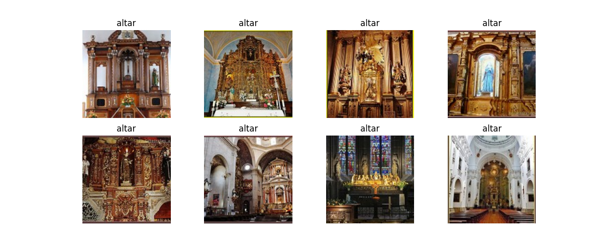
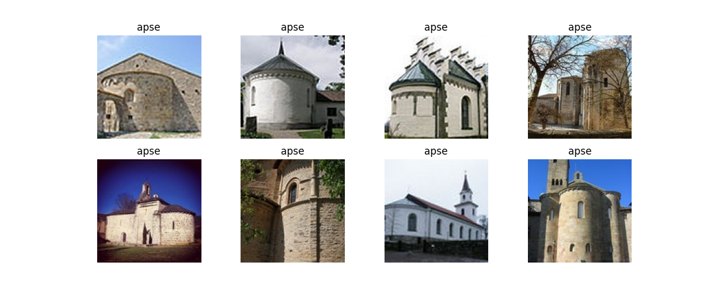
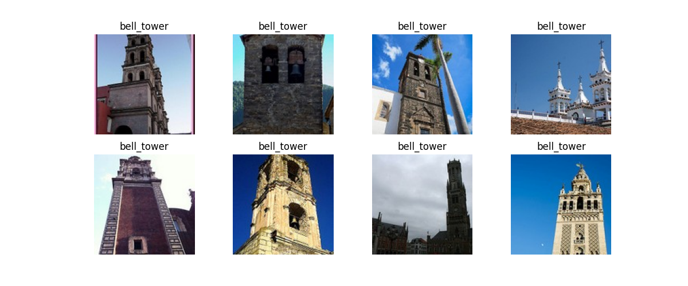
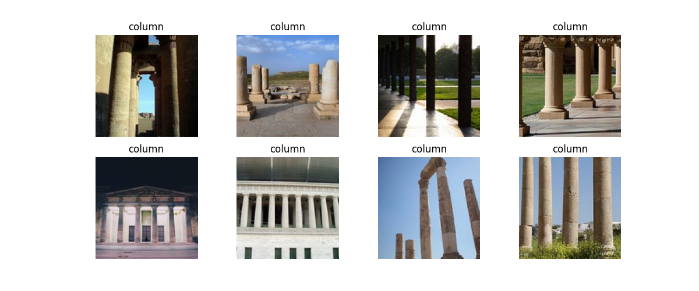


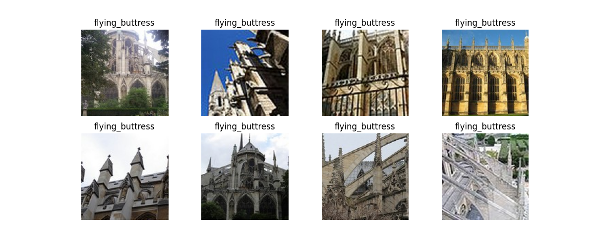
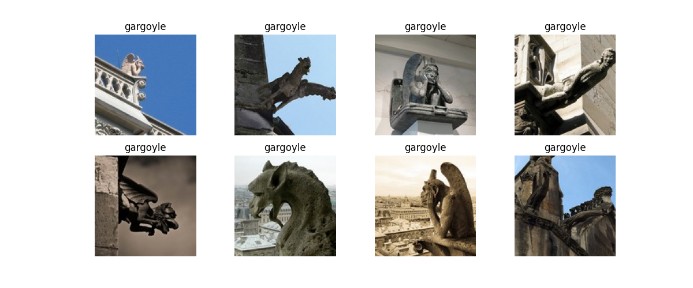
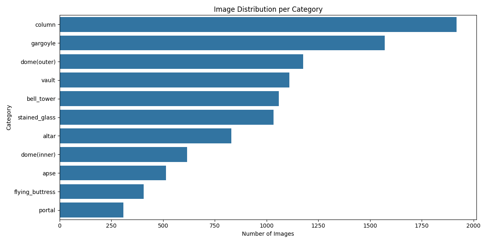
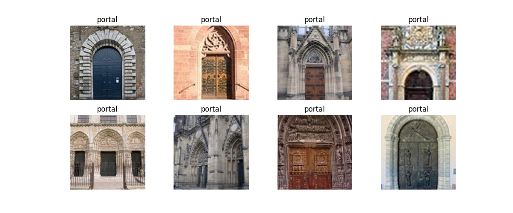
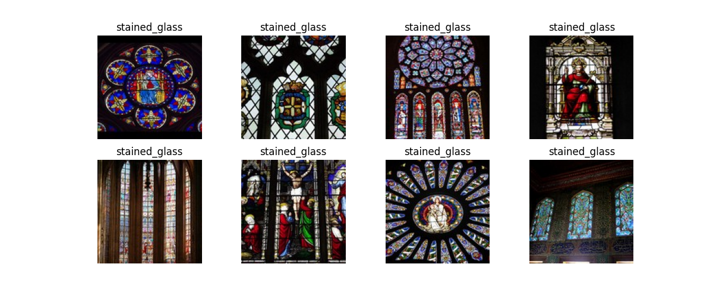
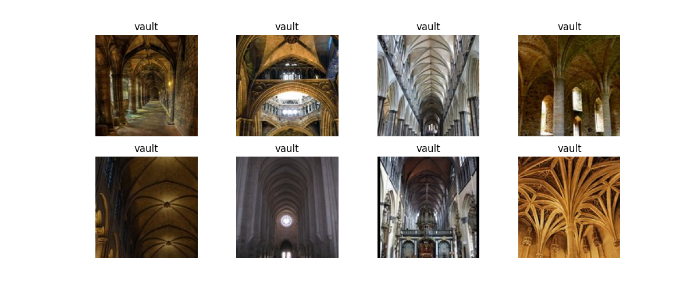

## Training Vs Validation Accuracy
[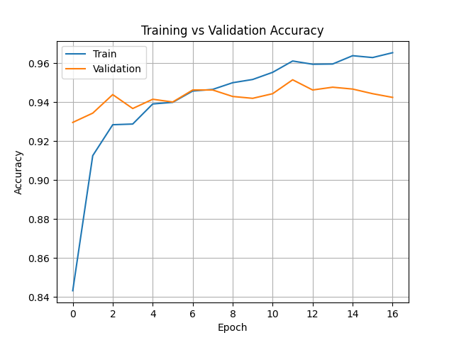]

## Training Vs Validation Loss
[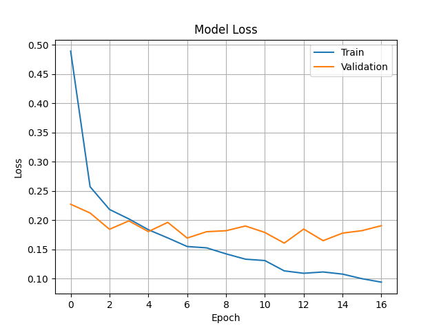]

## Confusion Matrix
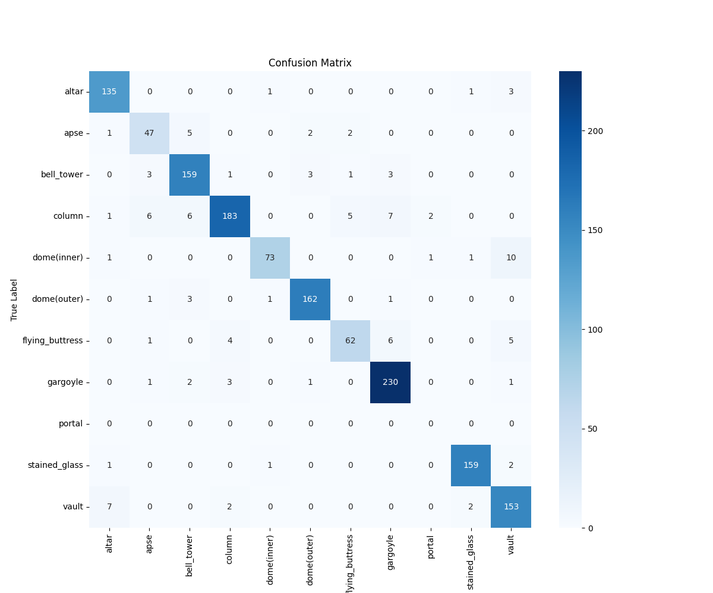

## Output

Python3.12/bin/python PycharmProjects/public/analytical_processors/historcal_structures/capstone_historical_analysis.py 
Model: "functional"
┏━━━━━━━━━━━━━━━━━━━━━┳━━━━━━━━━━━━━━━━━━━┳━━━━━━━━━━━━┳━━━━━━━━━━━━━━━━━━━┓
┃ Layer (type)        ┃ Output Shape      ┃    Param # ┃ Connected to      ┃
┡━━━━━━━━━━━━━━━━━━━━━╇━━━━━━━━━━━━━━━━━━━╇━━━━━━━━━━━━╇━━━━━━━━━━━━━━━━━━━┩
│ input_layer         │ (None, 224, 224,  │          0 │ -                 │
│ (InputLayer)        │ 3)                │            │                   │
├─────────────────────┼───────────────────┼────────────┼───────────────────┤
│ Conv1 (Conv2D)      │ (None, 112, 112,  │        864 │ input_layer[0][0] │
│                     │ 32)               │            │                   │
├─────────────────────┼───────────────────┼────────────┼───────────────────┤
│ bn_Conv1            │ (None, 112, 112,  │        128 │ Conv1[0][0]       │
│ (BatchNormalizatio… │ 32)               │            │                   │
├─────────────────────┼───────────────────┼────────────┼───────────────────┤
│ Conv1_relu (ReLU)   │ (None, 112, 112,  │          0 │ bn_Conv1[0][0]    │
│                     │ 32)               │            │                   │
├─────────────────────┼───────────────────┼────────────┼───────────────────┤
│ expanded_conv_dept… │ (None, 112, 112,  │        288 │ Conv1_relu[0][0]  │
│ (DepthwiseConv2D)   │ 32)               │            │                   │
├─────────────────────┼───────────────────┼────────────┼───────────────────┤
│ expanded_conv_dept… │ (None, 112, 112,  │        128 │ expanded_conv_de… │
│ (BatchNormalizatio… │ 32)               │            │                   │
├─────────────────────┼───────────────────┼────────────┼───────────────────┤
│ expanded_conv_dept… │ (None, 112, 112,  │          0 │ expanded_conv_de… │
│ (ReLU)              │ 32)               │            │                   │
├─────────────────────┼───────────────────┼────────────┼───────────────────┤
│ expanded_conv_proj… │ (None, 112, 112,  │        512 │ expanded_conv_de… │
│ (Conv2D)            │ 16)               │            │                   │
├─────────────────────┼───────────────────┼────────────┼───────────────────┤
│ expanded_conv_proj… │ (None, 112, 112,  │         64 │ expanded_conv_pr… │
│ (BatchNormalizatio… │ 16)               │            │                   │
├─────────────────────┼───────────────────┼────────────┼───────────────────┤
│ block_1_expand      │ (None, 112, 112,  │      1,536 │ expanded_conv_pr… │
│ (Conv2D)            │ 96)               │            │                   │
├─────────────────────┼───────────────────┼────────────┼───────────────────┤
│ block_1_expand_BN   │ (None, 112, 112,  │        384 │ block_1_expand[0… │
│ (BatchNormalizatio… │ 96)               │            │                   │
├─────────────────────┼───────────────────┼────────────┼───────────────────┤
│ block_1_expand_relu │ (None, 112, 112,  │          0 │ block_1_expand_B… │
│ (ReLU)              │ 96)               │            │                   │
├─────────────────────┼───────────────────┼────────────┼───────────────────┤
│ block_1_pad         │ (None, 113, 113,  │          0 │ block_1_expand_r… │
│ (ZeroPadding2D)     │ 96)               │            │                   │
├─────────────────────┼───────────────────┼────────────┼───────────────────┤
│ block_1_depthwise   │ (None, 56, 56,    │        864 │ block_1_pad[0][0] │
│ (DepthwiseConv2D)   │ 96)               │            │                   │
├─────────────────────┼───────────────────┼────────────┼───────────────────┤
│ block_1_depthwise_… │ (None, 56, 56,    │        384 │ block_1_depthwis… │
│ (BatchNormalizatio… │ 96)               │            │                   │
├─────────────────────┼───────────────────┼────────────┼───────────────────┤
│ block_1_depthwise_… │ (None, 56, 56,    │          0 │ block_1_depthwis… │
│ (ReLU)              │ 96)               │            │                   │
├─────────────────────┼───────────────────┼────────────┼───────────────────┤
│ block_1_project     │ (None, 56, 56,    │      2,304 │ block_1_depthwis… │
│ (Conv2D)            │ 24)               │            │                   │
├─────────────────────┼───────────────────┼────────────┼───────────────────┤
│ block_1_project_BN  │ (None, 56, 56,    │         96 │ block_1_project[… │
│ (BatchNormalizatio… │ 24)               │            │                   │
├─────────────────────┼───────────────────┼────────────┼───────────────────┤
│ block_2_expand      │ (None, 56, 56,    │      3,456 │ block_1_project_… │
│ (Conv2D)            │ 144)              │            │                   │
├─────────────────────┼───────────────────┼────────────┼───────────────────┤
│ block_2_expand_BN   │ (None, 56, 56,    │        576 │ block_2_expand[0… │
│ (BatchNormalizatio… │ 144)              │            │                   │
├─────────────────────┼───────────────────┼────────────┼───────────────────┤
│ block_2_expand_relu │ (None, 56, 56,    │          0 │ block_2_expand_B… │
│ (ReLU)              │ 144)              │            │                   │
├─────────────────────┼───────────────────┼────────────┼───────────────────┤
│ block_2_depthwise   │ (None, 56, 56,    │      1,296 │ block_2_expand_r… │
│ (DepthwiseConv2D)   │ 144)              │            │                   │
├─────────────────────┼───────────────────┼────────────┼───────────────────┤
│ block_2_depthwise_… │ (None, 56, 56,    │        576 │ block_2_depthwis… │
│ (BatchNormalizatio… │ 144)              │            │                   │
├─────────────────────┼───────────────────┼────────────┼───────────────────┤
│ block_2_depthwise_… │ (None, 56, 56,    │          0 │ block_2_depthwis… │
│ (ReLU)              │ 144)              │            │                   │
├─────────────────────┼───────────────────┼────────────┼───────────────────┤
│ block_2_project     │ (None, 56, 56,    │      3,456 │ block_2_depthwis… │
│ (Conv2D)            │ 24)               │            │                   │
├─────────────────────┼───────────────────┼────────────┼───────────────────┤
│ block_2_project_BN  │ (None, 56, 56,    │         96 │ block_2_project[… │
│ (BatchNormalizatio… │ 24)               │            │                   │
├─────────────────────┼───────────────────┼────────────┼───────────────────┤
│ block_2_add (Add)   │ (None, 56, 56,    │          0 │ block_1_project_… │
│                     │ 24)               │            │ block_2_project_… │
├─────────────────────┼───────────────────┼────────────┼───────────────────┤
│ block_3_expand      │ (None, 56, 56,    │      3,456 │ block_2_add[0][0] │
│ (Conv2D)            │ 144)              │            │                   │
├─────────────────────┼───────────────────┼────────────┼───────────────────┤
│ block_3_expand_BN   │ (None, 56, 56,    │        576 │ block_3_expand[0… │
│ (BatchNormalizatio… │ 144)              │            │                   │
├─────────────────────┼───────────────────┼────────────┼───────────────────┤
│ block_3_expand_relu │ (None, 56, 56,    │          0 │ block_3_expand_B… │
│ (ReLU)              │ 144)              │            │                   │
├─────────────────────┼───────────────────┼────────────┼───────────────────┤
│ block_3_pad         │ (None, 57, 57,    │          0 │ block_3_expand_r… │
│ (ZeroPadding2D)     │ 144)              │            │                   │
├─────────────────────┼───────────────────┼────────────┼───────────────────┤
│ block_3_depthwise   │ (None, 28, 28,    │      1,296 │ block_3_pad[0][0] │
│ (DepthwiseConv2D)   │ 144)              │            │                   │
├─────────────────────┼───────────────────┼────────────┼───────────────────┤
│ block_3_depthwise_… │ (None, 28, 28,    │        576 │ block_3_depthwis… │
│ (BatchNormalizatio… │ 144)              │            │                   │
├─────────────────────┼───────────────────┼────────────┼───────────────────┤
│ block_3_depthwise_… │ (None, 28, 28,    │          0 │ block_3_depthwis… │
│ (ReLU)              │ 144)              │            │                   │
├─────────────────────┼───────────────────┼────────────┼───────────────────┤
│ block_3_project     │ (None, 28, 28,    │      4,608 │ block_3_depthwis… │
│ (Conv2D)            │ 32)               │            │                   │
├─────────────────────┼───────────────────┼────────────┼───────────────────┤
│ block_3_project_BN  │ (None, 28, 28,    │        128 │ block_3_project[… │
│ (BatchNormalizatio… │ 32)               │            │                   │
├─────────────────────┼───────────────────┼────────────┼───────────────────┤
│ block_4_expand      │ (None, 28, 28,    │      6,144 │ block_3_project_… │
│ (Conv2D)            │ 192)              │            │                   │
├─────────────────────┼───────────────────┼────────────┼───────────────────┤
│ block_4_expand_BN   │ (None, 28, 28,    │        768 │ block_4_expand[0… │
│ (BatchNormalizatio… │ 192)              │            │                   │
├─────────────────────┼───────────────────┼────────────┼───────────────────┤
│ block_4_expand_relu │ (None, 28, 28,    │          0 │ block_4_expand_B… │
│ (ReLU)              │ 192)              │            │                   │
├─────────────────────┼───────────────────┼────────────┼───────────────────┤
│ block_4_depthwise   │ (None, 28, 28,    │      1,728 │ block_4_expand_r… │
│ (DepthwiseConv2D)   │ 192)              │            │                   │
├─────────────────────┼───────────────────┼────────────┼───────────────────┤
│ block_4_depthwise_… │ (None, 28, 28,    │        768 │ block_4_depthwis… │
│ (BatchNormalizatio… │ 192)              │            │                   │
├─────────────────────┼───────────────────┼────────────┼───────────────────┤
│ block_4_depthwise_… │ (None, 28, 28,    │          0 │ block_4_depthwis… │
│ (ReLU)              │ 192)              │            │                   │
├─────────────────────┼───────────────────┼────────────┼───────────────────┤
│ block_4_project     │ (None, 28, 28,    │      6,144 │ block_4_depthwis… │
│ (Conv2D)            │ 32)               │            │                   │
├─────────────────────┼───────────────────┼────────────┼───────────────────┤
│ block_4_project_BN  │ (None, 28, 28,    │        128 │ block_4_project[… │
│ (BatchNormalizatio… │ 32)               │            │                   │
├─────────────────────┼───────────────────┼────────────┼───────────────────┤
│ block_4_add (Add)   │ (None, 28, 28,    │          0 │ block_3_project_… │
│                     │ 32)               │            │ block_4_project_… │
├─────────────────────┼───────────────────┼────────────┼───────────────────┤
│ block_5_expand      │ (None, 28, 28,    │      6,144 │ block_4_add[0][0] │
│ (Conv2D)            │ 192)              │            │                   │
├─────────────────────┼───────────────────┼────────────┼───────────────────┤
│ block_5_expand_BN   │ (None, 28, 28,    │        768 │ block_5_expand[0… │
│ (BatchNormalizatio… │ 192)              │            │                   │
├─────────────────────┼───────────────────┼────────────┼───────────────────┤
│ block_5_expand_relu │ (None, 28, 28,    │          0 │ block_5_expand_B… │
│ (ReLU)              │ 192)              │            │                   │
├─────────────────────┼───────────────────┼────────────┼───────────────────┤
│ block_5_depthwise   │ (None, 28, 28,    │      1,728 │ block_5_expand_r… │
│ (DepthwiseConv2D)   │ 192)              │            │                   │
├─────────────────────┼───────────────────┼────────────┼───────────────────┤
│ block_5_depthwise_… │ (None, 28, 28,    │        768 │ block_5_depthwis… │
│ (BatchNormalizatio… │ 192)              │            │                   │
├─────────────────────┼───────────────────┼────────────┼───────────────────┤
│ block_5_depthwise_… │ (None, 28, 28,    │          0 │ block_5_depthwis… │
│ (ReLU)              │ 192)              │            │                   │
├─────────────────────┼───────────────────┼────────────┼───────────────────┤
│ block_5_project     │ (None, 28, 28,    │      6,144 │ block_5_depthwis… │
│ (Conv2D)            │ 32)               │            │                   │
├─────────────────────┼───────────────────┼────────────┼───────────────────┤
│ block_5_project_BN  │ (None, 28, 28,    │        128 │ block_5_project[… │
│ (BatchNormalizatio… │ 32)               │            │                   │
├─────────────────────┼───────────────────┼────────────┼───────────────────┤
│ block_5_add (Add)   │ (None, 28, 28,    │          0 │ block_4_add[0][0… │
│                     │ 32)               │            │ block_5_project_… │
├─────────────────────┼───────────────────┼────────────┼───────────────────┤
│ block_6_expand      │ (None, 28, 28,    │      6,144 │ block_5_add[0][0] │
│ (Conv2D)            │ 192)              │            │                   │
├─────────────────────┼───────────────────┼────────────┼───────────────────┤
│ block_6_expand_BN   │ (None, 28, 28,    │        768 │ block_6_expand[0… │
│ (BatchNormalizatio… │ 192)              │            │                   │
├─────────────────────┼───────────────────┼────────────┼───────────────────┤
│ block_6_expand_relu │ (None, 28, 28,    │          0 │ block_6_expand_B… │
│ (ReLU)              │ 192)              │            │                   │
├─────────────────────┼───────────────────┼────────────┼───────────────────┤
│ block_6_pad         │ (None, 29, 29,    │          0 │ block_6_expand_r… │
│ (ZeroPadding2D)     │ 192)              │            │                   │
├─────────────────────┼───────────────────┼────────────┼───────────────────┤
│ block_6_depthwise   │ (None, 14, 14,    │      1,728 │ block_6_pad[0][0] │
│ (DepthwiseConv2D)   │ 192)              │            │                   │
├─────────────────────┼───────────────────┼────────────┼───────────────────┤
│ block_6_depthwise_… │ (None, 14, 14,    │        768 │ block_6_depthwis… │
│ (BatchNormalizatio… │ 192)              │            │                   │
├─────────────────────┼───────────────────┼────────────┼───────────────────┤
│ block_6_depthwise_… │ (None, 14, 14,    │          0 │ block_6_depthwis… │
│ (ReLU)              │ 192)              │            │                   │
├─────────────────────┼───────────────────┼────────────┼───────────────────┤
│ block_6_project     │ (None, 14, 14,    │     12,288 │ block_6_depthwis… │
│ (Conv2D)            │ 64)               │            │                   │
├─────────────────────┼───────────────────┼────────────┼───────────────────┤
│ block_6_project_BN  │ (None, 14, 14,    │        256 │ block_6_project[… │
│ (BatchNormalizatio… │ 64)               │            │                   │
├─────────────────────┼───────────────────┼────────────┼───────────────────┤
│ block_7_expand      │ (None, 14, 14,    │     24,576 │ block_6_project_… │
│ (Conv2D)            │ 384)              │            │                   │
├─────────────────────┼───────────────────┼────────────┼───────────────────┤
│ block_7_expand_BN   │ (None, 14, 14,    │      1,536 │ block_7_expand[0… │
│ (BatchNormalizatio… │ 384)              │            │                   │
├─────────────────────┼───────────────────┼────────────┼───────────────────┤
│ block_7_expand_relu │ (None, 14, 14,    │          0 │ block_7_expand_B… │
│ (ReLU)              │ 384)              │            │                   │
├─────────────────────┼───────────────────┼────────────┼───────────────────┤
│ block_7_depthwise   │ (None, 14, 14,    │      3,456 │ block_7_expand_r… │
│ (DepthwiseConv2D)   │ 384)              │            │                   │
├─────────────────────┼───────────────────┼────────────┼───────────────────┤
│ block_7_depthwise_… │ (None, 14, 14,    │      1,536 │ block_7_depthwis… │
│ (BatchNormalizatio… │ 384)              │            │                   │
├─────────────────────┼───────────────────┼────────────┼───────────────────┤
│ block_7_depthwise_… │ (None, 14, 14,    │          0 │ block_7_depthwis… │
│ (ReLU)              │ 384)              │            │                   │
├─────────────────────┼───────────────────┼────────────┼───────────────────┤
│ block_7_project     │ (None, 14, 14,    │     24,576 │ block_7_depthwis… │
│ (Conv2D)            │ 64)               │            │                   │
├─────────────────────┼───────────────────┼────────────┼───────────────────┤
│ block_7_project_BN  │ (None, 14, 14,    │        256 │ block_7_project[… │
│ (BatchNormalizatio… │ 64)               │            │                   │
├─────────────────────┼───────────────────┼────────────┼───────────────────┤
│ block_7_add (Add)   │ (None, 14, 14,    │          0 │ block_6_project_… │
│                     │ 64)               │            │ block_7_project_… │
├─────────────────────┼───────────────────┼────────────┼───────────────────┤
│ block_8_expand      │ (None, 14, 14,    │     24,576 │ block_7_add[0][0] │
│ (Conv2D)            │ 384)              │            │                   │
├─────────────────────┼───────────────────┼────────────┼───────────────────┤
│ block_8_expand_BN   │ (None, 14, 14,    │      1,536 │ block_8_expand[0… │
│ (BatchNormalizatio… │ 384)              │            │                   │
├─────────────────────┼───────────────────┼────────────┼───────────────────┤
│ block_8_expand_relu │ (None, 14, 14,    │          0 │ block_8_expand_B… │
│ (ReLU)              │ 384)              │            │                   │
├─────────────────────┼───────────────────┼────────────┼───────────────────┤
│ block_8_depthwise   │ (None, 14, 14,    │      3,456 │ block_8_expand_r… │
│ (DepthwiseConv2D)   │ 384)              │            │                   │
├─────────────────────┼───────────────────┼────────────┼───────────────────┤
│ block_8_depthwise_… │ (None, 14, 14,    │      1,536 │ block_8_depthwis… │
│ (BatchNormalizatio… │ 384)              │            │                   │
├─────────────────────┼───────────────────┼────────────┼───────────────────┤
│ block_8_depthwise_… │ (None, 14, 14,    │          0 │ block_8_depthwis… │
│ (ReLU)              │ 384)              │            │                   │
├─────────────────────┼───────────────────┼────────────┼───────────────────┤
│ block_8_project     │ (None, 14, 14,    │     24,576 │ block_8_depthwis… │
│ (Conv2D)            │ 64)               │            │                   │
├─────────────────────┼───────────────────┼────────────┼───────────────────┤
│ block_8_project_BN  │ (None, 14, 14,    │        256 │ block_8_project[… │
│ (BatchNormalizatio… │ 64)               │            │                   │
├─────────────────────┼───────────────────┼────────────┼───────────────────┤
│ block_8_add (Add)   │ (None, 14, 14,    │          0 │ block_7_add[0][0… │
│                     │ 64)               │            │ block_8_project_… │
├─────────────────────┼───────────────────┼────────────┼───────────────────┤
│ block_9_expand      │ (None, 14, 14,    │     24,576 │ block_8_add[0][0] │
│ (Conv2D)            │ 384)              │            │                   │
├─────────────────────┼───────────────────┼────────────┼───────────────────┤
│ block_9_expand_BN   │ (None, 14, 14,    │      1,536 │ block_9_expand[0… │
│ (BatchNormalizatio… │ 384)              │            │                   │
├─────────────────────┼───────────────────┼────────────┼───────────────────┤
│ block_9_expand_relu │ (None, 14, 14,    │          0 │ block_9_expand_B… │
│ (ReLU)              │ 384)              │            │                   │
├─────────────────────┼───────────────────┼────────────┼───────────────────┤
│ block_9_depthwise   │ (None, 14, 14,    │      3,456 │ block_9_expand_r… │
│ (DepthwiseConv2D)   │ 384)              │            │                   │
├─────────────────────┼───────────────────┼────────────┼───────────────────┤
│ block_9_depthwise_… │ (None, 14, 14,    │      1,536 │ block_9_depthwis… │
│ (BatchNormalizatio… │ 384)              │            │                   │
├─────────────────────┼───────────────────┼────────────┼───────────────────┤
│ block_9_depthwise_… │ (None, 14, 14,    │          0 │ block_9_depthwis… │
│ (ReLU)              │ 384)              │            │                   │
├─────────────────────┼───────────────────┼────────────┼───────────────────┤
│ block_9_project     │ (None, 14, 14,    │     24,576 │ block_9_depthwis… │
│ (Conv2D)            │ 64)               │            │                   │
├─────────────────────┼───────────────────┼────────────┼───────────────────┤
│ block_9_project_BN  │ (None, 14, 14,    │        256 │ block_9_project[… │
│ (BatchNormalizatio… │ 64)               │            │                   │
├─────────────────────┼───────────────────┼────────────┼───────────────────┤
│ block_9_add (Add)   │ (None, 14, 14,    │          0 │ block_8_add[0][0… │
│                     │ 64)               │            │ block_9_project_… │
├─────────────────────┼───────────────────┼────────────┼───────────────────┤
│ block_10_expand     │ (None, 14, 14,    │     24,576 │ block_9_add[0][0] │
│ (Conv2D)            │ 384)              │            │                   │
├─────────────────────┼───────────────────┼────────────┼───────────────────┤
│ block_10_expand_BN  │ (None, 14, 14,    │      1,536 │ block_10_expand[… │
│ (BatchNormalizatio… │ 384)              │            │                   │
├─────────────────────┼───────────────────┼────────────┼───────────────────┤
│ block_10_expand_re… │ (None, 14, 14,    │          0 │ block_10_expand_… │
│ (ReLU)              │ 384)              │            │                   │
├─────────────────────┼───────────────────┼────────────┼───────────────────┤
│ block_10_depthwise  │ (None, 14, 14,    │      3,456 │ block_10_expand_… │
│ (DepthwiseConv2D)   │ 384)              │            │                   │
├─────────────────────┼───────────────────┼────────────┼───────────────────┤
│ block_10_depthwise… │ (None, 14, 14,    │      1,536 │ block_10_depthwi… │
│ (BatchNormalizatio… │ 384)              │            │                   │
├─────────────────────┼───────────────────┼────────────┼───────────────────┤
│ block_10_depthwise… │ (None, 14, 14,    │          0 │ block_10_depthwi… │
│ (ReLU)              │ 384)              │            │                   │
├─────────────────────┼───────────────────┼────────────┼───────────────────┤
│ block_10_project    │ (None, 14, 14,    │     36,864 │ block_10_depthwi… │
│ (Conv2D)            │ 96)               │            │                   │
├─────────────────────┼───────────────────┼────────────┼───────────────────┤
│ block_10_project_BN │ (None, 14, 14,    │        384 │ block_10_project… │
│ (BatchNormalizatio… │ 96)               │            │                   │
├─────────────────────┼───────────────────┼────────────┼───────────────────┤
│ block_11_expand     │ (None, 14, 14,    │     55,296 │ block_10_project… │
│ (Conv2D)            │ 576)              │            │                   │
├─────────────────────┼───────────────────┼────────────┼───────────────────┤
│ block_11_expand_BN  │ (None, 14, 14,    │      2,304 │ block_11_expand[… │
│ (BatchNormalizatio… │ 576)              │            │                   │
├─────────────────────┼───────────────────┼────────────┼───────────────────┤
│ block_11_expand_re… │ (None, 14, 14,    │          0 │ block_11_expand_… │
│ (ReLU)              │ 576)              │            │                   │
├─────────────────────┼───────────────────┼────────────┼───────────────────┤
│ block_11_depthwise  │ (None, 14, 14,    │      5,184 │ block_11_expand_… │
│ (DepthwiseConv2D)   │ 576)              │            │                   │
├─────────────────────┼───────────────────┼────────────┼───────────────────┤
│ block_11_depthwise… │ (None, 14, 14,    │      2,304 │ block_11_depthwi… │
│ (BatchNormalizatio… │ 576)              │            │                   │
├─────────────────────┼───────────────────┼────────────┼───────────────────┤
│ block_11_depthwise… │ (None, 14, 14,    │          0 │ block_11_depthwi… │
│ (ReLU)              │ 576)              │            │                   │
├─────────────────────┼───────────────────┼────────────┼───────────────────┤
│ block_11_project    │ (None, 14, 14,    │     55,296 │ block_11_depthwi… │
│ (Conv2D)            │ 96)               │            │                   │
├─────────────────────┼───────────────────┼────────────┼───────────────────┤
│ block_11_project_BN │ (None, 14, 14,    │        384 │ block_11_project… │
│ (BatchNormalizatio… │ 96)               │            │                   │
├─────────────────────┼───────────────────┼────────────┼───────────────────┤
│ block_11_add (Add)  │ (None, 14, 14,    │          0 │ block_10_project… │
│                     │ 96)               │            │ block_11_project… │
├─────────────────────┼───────────────────┼────────────┼───────────────────┤
│ block_12_expand     │ (None, 14, 14,    │     55,296 │ block_11_add[0][… │
│ (Conv2D)            │ 576)              │            │                   │
├─────────────────────┼───────────────────┼────────────┼───────────────────┤
│ block_12_expand_BN  │ (None, 14, 14,    │      2,304 │ block_12_expand[… │
│ (BatchNormalizatio… │ 576)              │            │                   │
├─────────────────────┼───────────────────┼────────────┼───────────────────┤
│ block_12_expand_re… │ (None, 14, 14,    │          0 │ block_12_expand_… │
│ (ReLU)              │ 576)              │            │                   │
├─────────────────────┼───────────────────┼────────────┼───────────────────┤
│ block_12_depthwise  │ (None, 14, 14,    │      5,184 │ block_12_expand_… │
│ (DepthwiseConv2D)   │ 576)              │            │                   │
├─────────────────────┼───────────────────┼────────────┼───────────────────┤
│ block_12_depthwise… │ (None, 14, 14,    │      2,304 │ block_12_depthwi… │
│ (BatchNormalizatio… │ 576)              │            │                   │
├─────────────────────┼───────────────────┼────────────┼───────────────────┤
│ block_12_depthwise… │ (None, 14, 14,    │          0 │ block_12_depthwi… │
│ (ReLU)              │ 576)              │            │                   │
├─────────────────────┼───────────────────┼────────────┼───────────────────┤
│ block_12_project    │ (None, 14, 14,    │     55,296 │ block_12_depthwi… │
│ (Conv2D)            │ 96)               │            │                   │
├─────────────────────┼───────────────────┼────────────┼───────────────────┤
│ block_12_project_BN │ (None, 14, 14,    │        384 │ block_12_project… │
│ (BatchNormalizatio… │ 96)               │            │                   │
├─────────────────────┼───────────────────┼────────────┼───────────────────┤
│ block_12_add (Add)  │ (None, 14, 14,    │          0 │ block_11_add[0][… │
│                     │ 96)               │            │ block_12_project… │
├─────────────────────┼───────────────────┼────────────┼───────────────────┤
│ block_13_expand     │ (None, 14, 14,    │     55,296 │ block_12_add[0][… │
│ (Conv2D)            │ 576)              │            │                   │
├─────────────────────┼───────────────────┼────────────┼───────────────────┤
│ block_13_expand_BN  │ (None, 14, 14,    │      2,304 │ block_13_expand[… │
│ (BatchNormalizatio… │ 576)              │            │                   │
├─────────────────────┼───────────────────┼────────────┼───────────────────┤
│ block_13_expand_re… │ (None, 14, 14,    │          0 │ block_13_expand_… │
│ (ReLU)              │ 576)              │            │                   │
├─────────────────────┼───────────────────┼────────────┼───────────────────┤
│ block_13_pad        │ (None, 15, 15,    │          0 │ block_13_expand_… │
│ (ZeroPadding2D)     │ 576)              │            │                   │
├─────────────────────┼───────────────────┼────────────┼───────────────────┤
│ block_13_depthwise  │ (None, 7, 7, 576) │      5,184 │ block_13_pad[0][… │
│ (DepthwiseConv2D)   │                   │            │                   │
├─────────────────────┼───────────────────┼────────────┼───────────────────┤
│ block_13_depthwise… │ (None, 7, 7, 576) │      2,304 │ block_13_depthwi… │
│ (BatchNormalizatio… │                   │            │                   │
├─────────────────────┼───────────────────┼────────────┼───────────────────┤
│ block_13_depthwise… │ (None, 7, 7, 576) │          0 │ block_13_depthwi… │
│ (ReLU)              │                   │            │                   │
├─────────────────────┼───────────────────┼────────────┼───────────────────┤
│ block_13_project    │ (None, 7, 7, 160) │     92,160 │ block_13_depthwi… │
│ (Conv2D)            │                   │            │                   │
├─────────────────────┼───────────────────┼────────────┼───────────────────┤
│ block_13_project_BN │ (None, 7, 7, 160) │        640 │ block_13_project… │
│ (BatchNormalizatio… │                   │            │                   │
├─────────────────────┼───────────────────┼────────────┼───────────────────┤
│ block_14_expand     │ (None, 7, 7, 960) │    153,600 │ block_13_project… │
│ (Conv2D)            │                   │            │                   │
├─────────────────────┼───────────────────┼────────────┼───────────────────┤
│ block_14_expand_BN  │ (None, 7, 7, 960) │      3,840 │ block_14_expand[… │
│ (BatchNormalizatio… │                   │            │                   │
├─────────────────────┼───────────────────┼────────────┼───────────────────┤
│ block_14_expand_re… │ (None, 7, 7, 960) │          0 │ block_14_expand_… │
│ (ReLU)              │                   │            │                   │
├─────────────────────┼───────────────────┼────────────┼───────────────────┤
│ block_14_depthwise  │ (None, 7, 7, 960) │      8,640 │ block_14_expand_… │
│ (DepthwiseConv2D)   │                   │            │                   │
├─────────────────────┼───────────────────┼────────────┼───────────────────┤
│ block_14_depthwise… │ (None, 7, 7, 960) │      3,840 │ block_14_depthwi… │
│ (BatchNormalizatio… │                   │            │                   │
├─────────────────────┼───────────────────┼────────────┼───────────────────┤
│ block_14_depthwise… │ (None, 7, 7, 960) │          0 │ block_14_depthwi… │
│ (ReLU)              │                   │            │                   │
├─────────────────────┼───────────────────┼────────────┼───────────────────┤
│ block_14_project    │ (None, 7, 7, 160) │    153,600 │ block_14_depthwi… │
│ (Conv2D)            │                   │            │                   │
├─────────────────────┼───────────────────┼────────────┼───────────────────┤
│ block_14_project_BN │ (None, 7, 7, 160) │        640 │ block_14_project… │
│ (BatchNormalizatio… │                   │            │                   │
├─────────────────────┼───────────────────┼────────────┼───────────────────┤
│ block_14_add (Add)  │ (None, 7, 7, 160) │          0 │ block_13_project… │
│                     │                   │            │ block_14_project… │
├─────────────────────┼───────────────────┼────────────┼───────────────────┤
│ block_15_expand     │ (None, 7, 7, 960) │    153,600 │ block_14_add[0][… │
│ (Conv2D)            │                   │            │                   │
├─────────────────────┼───────────────────┼────────────┼───────────────────┤
│ block_15_expand_BN  │ (None, 7, 7, 960) │      3,840 │ block_15_expand[… │
│ (BatchNormalizatio… │                   │            │                   │
├─────────────────────┼───────────────────┼────────────┼───────────────────┤
│ block_15_expand_re… │ (None, 7, 7, 960) │          0 │ block_15_expand_… │
│ (ReLU)              │                   │            │                   │
├─────────────────────┼───────────────────┼────────────┼───────────────────┤
│ block_15_depthwise  │ (None, 7, 7, 960) │      8,640 │ block_15_expand_… │
│ (DepthwiseConv2D)   │                   │            │                   │
├─────────────────────┼───────────────────┼────────────┼───────────────────┤
│ block_15_depthwise… │ (None, 7, 7, 960) │      3,840 │ block_15_depthwi… │
│ (BatchNormalizatio… │                   │            │                   │
├─────────────────────┼───────────────────┼────────────┼───────────────────┤
│ block_15_depthwise… │ (None, 7, 7, 960) │          0 │ block_15_depthwi… │
│ (ReLU)              │                   │            │                   │
├─────────────────────┼───────────────────┼────────────┼───────────────────┤
│ block_15_project    │ (None, 7, 7, 160) │    153,600 │ block_15_depthwi… │
│ (Conv2D)            │                   │            │                   │
├─────────────────────┼───────────────────┼────────────┼───────────────────┤
│ block_15_project_BN │ (None, 7, 7, 160) │        640 │ block_15_project… │
│ (BatchNormalizatio… │                   │            │                   │
├─────────────────────┼───────────────────┼────────────┼───────────────────┤
│ block_15_add (Add)  │ (None, 7, 7, 160) │          0 │ block_14_add[0][… │
│                     │                   │            │ block_15_project… │
├─────────────────────┼───────────────────┼────────────┼───────────────────┤
│ block_16_expand     │ (None, 7, 7, 960) │    153,600 │ block_15_add[0][… │
│ (Conv2D)            │                   │            │                   │
├─────────────────────┼───────────────────┼────────────┼───────────────────┤
│ block_16_expand_BN  │ (None, 7, 7, 960) │      3,840 │ block_16_expand[… │
│ (BatchNormalizatio… │                   │            │                   │
├─────────────────────┼───────────────────┼────────────┼───────────────────┤
│ block_16_expand_re… │ (None, 7, 7, 960) │          0 │ block_16_expand_… │
│ (ReLU)              │                   │            │                   │
├─────────────────────┼───────────────────┼────────────┼───────────────────┤
│ block_16_depthwise  │ (None, 7, 7, 960) │      8,640 │ block_16_expand_… │
│ (DepthwiseConv2D)   │                   │            │                   │
├─────────────────────┼───────────────────┼────────────┼───────────────────┤
│ block_16_depthwise… │ (None, 7, 7, 960) │      3,840 │ block_16_depthwi… │
│ (BatchNormalizatio… │                   │            │                   │
├─────────────────────┼───────────────────┼────────────┼───────────────────┤
│ block_16_depthwise… │ (None, 7, 7, 960) │          0 │ block_16_depthwi… │
│ (ReLU)              │                   │            │                   │
├─────────────────────┼───────────────────┼────────────┼───────────────────┤
│ block_16_project    │ (None, 7, 7, 320) │    307,200 │ block_16_depthwi… │
│ (Conv2D)            │                   │            │                   │
├─────────────────────┼───────────────────┼────────────┼───────────────────┤
│ block_16_project_BN │ (None, 7, 7, 320) │      1,280 │ block_16_project… │
│ (BatchNormalizatio… │                   │            │                   │
├─────────────────────┼───────────────────┼────────────┼───────────────────┤
│ Conv_1 (Conv2D)     │ (None, 7, 7,      │    409,600 │ block_16_project… │
│                     │ 1280)             │            │                   │
├─────────────────────┼───────────────────┼────────────┼───────────────────┤
│ Conv_1_bn           │ (None, 7, 7,      │      5,120 │ Conv_1[0][0]      │
│ (BatchNormalizatio… │ 1280)             │            │                   │
├─────────────────────┼───────────────────┼────────────┼───────────────────┤
│ out_relu (ReLU)     │ (None, 7, 7,      │          0 │ Conv_1_bn[0][0]   │
│                     │ 1280)             │            │                   │
├─────────────────────┼───────────────────┼────────────┼───────────────────┤
│ global_average_poo… │ (None, 1280)      │          0 │ out_relu[0][0]    │
│ (GlobalAveragePool… │                   │            │                   │
├─────────────────────┼───────────────────┼────────────┼───────────────────┤
│ dropout (Dropout)   │ (None, 1280)      │          0 │ global_average_p… │
├─────────────────────┼───────────────────┼────────────┼───────────────────┤
│ dense (Dense)       │ (None, 128)       │    163,968 │ dropout[0][0]     │
├─────────────────────┼───────────────────┼────────────┼───────────────────┤
│ dense_1 (Dense)     │ (None, 11)        │      1,419 │ dense[0][0]       │
└─────────────────────┴───────────────────┴────────────┴───────────────────┘
 Total params: 2,423,371 (9.24 MB)
 Trainable params: 165,387 (646.04 KB)
 Non-trainable params: 2,257,984 (8.61 MB)
Found 8440 images belonging to 11 classes.
Found 2103 images belonging to 11 classes.
Python3.12/lib/python3.12/site-packages/keras/src/trainers/data_adapters/py_dataset_adapter.py:121: UserWarning: Your `PyDataset` class should call `super().__init__(**kwargs)` in its constructor. `**kwargs` can include `workers`, `use_multiprocessing`, `max_queue_size`. Do not pass these arguments to `fit()`, as they will be ignored.
  self._warn_if_super_not_called()
Epoch 1/20
264/264 ━━━━━━━━━━━━━━━━━━━━ 45s 164ms/step - accuracy: 0.7397 - loss: 0.8296 - val_accuracy: 0.9296 - val_loss: 0.2275
Epoch 2/20
264/264 ━━━━━━━━━━━━━━━━━━━━ 41s 154ms/step - accuracy: 0.9165 - loss: 0.2469 - val_accuracy: 0.9344 - val_loss: 0.2125
Epoch 3/20
264/264 ━━━━━━━━━━━━━━━━━━━━ 40s 153ms/step - accuracy: 0.9301 - loss: 0.2173 - val_accuracy: 0.9439 - val_loss: 0.1847
Epoch 4/20
264/264 ━━━━━━━━━━━━━━━━━━━━ 40s 153ms/step - accuracy: 0.9321 - loss: 0.1905 - val_accuracy: 0.9368 - val_loss: 0.1989
Epoch 5/20
264/264 ━━━━━━━━━━━━━━━━━━━━ 41s 154ms/step - accuracy: 0.9400 - loss: 0.1862 - val_accuracy: 0.9415 - val_loss: 0.1807
Epoch 6/20
264/264 ━━━━━━━━━━━━━━━━━━━━ 41s 154ms/step - accuracy: 0.9433 - loss: 0.1637 - val_accuracy: 0.9401 - val_loss: 0.1964
Epoch 7/20
264/264 ━━━━━━━━━━━━━━━━━━━━ 41s 155ms/step - accuracy: 0.9444 - loss: 0.1593 - val_accuracy: 0.9463 - val_loss: 0.1696
Epoch 8/20
264/264 ━━━━━━━━━━━━━━━━━━━━ 40s 153ms/step - accuracy: 0.9492 - loss: 0.1501 - val_accuracy: 0.9463 - val_loss: 0.1805
Epoch 9/20
264/264 ━━━━━━━━━━━━━━━━━━━━ 40s 152ms/step - accuracy: 0.9516 - loss: 0.1431 - val_accuracy: 0.9429 - val_loss: 0.1821
Epoch 10/20
264/264 ━━━━━━━━━━━━━━━━━━━━ 40s 152ms/step - accuracy: 0.9512 - loss: 0.1350 - val_accuracy: 0.9420 - val_loss: 0.1902
Epoch 11/20
264/264 ━━━━━━━━━━━━━━━━━━━━ 40s 152ms/step - accuracy: 0.9555 - loss: 0.1252 - val_accuracy: 0.9444 - val_loss: 0.1792
Epoch 12/20
264/264 ━━━━━━━━━━━━━━━━━━━━ 40s 153ms/step - accuracy: 0.9626 - loss: 0.1103 - val_accuracy: 0.9515 - val_loss: 0.1609
Epoch 13/20
264/264 ━━━━━━━━━━━━━━━━━━━━ 41s 154ms/step - accuracy: 0.9586 - loss: 0.1114 - val_accuracy: 0.9463 - val_loss: 0.1850
Epoch 14/20
264/264 ━━━━━━━━━━━━━━━━━━━━ 41s 156ms/step - accuracy: 0.9613 - loss: 0.1042 - val_accuracy: 0.9477 - val_loss: 0.1651
Epoch 15/20
264/264 ━━━━━━━━━━━━━━━━━━━━ 41s 155ms/step - accuracy: 0.9630 - loss: 0.1101 - val_accuracy: 0.9467 - val_loss: 0.1780
Epoch 16/20
264/264 ━━━━━━━━━━━━━━━━━━━━ 41s 155ms/step - accuracy: 0.9598 - loss: 0.1082 - val_accuracy: 0.9444 - val_loss: 0.1823
Epoch 17/20
264/264 ━━━━━━━━━━━━━━━━━━━━ 41s 155ms/step - accuracy: 0.9661 - loss: 0.0940 - val_accuracy: 0.9425 - val_loss: 0.1908
WARNING:absl:You are saving your model as an HDF5 file via `model.save()` or `keras.saving.save_model(model)`. This file format is considered legacy. We recommend using instead the native Keras format, e.g. `model.save('my_model.keras')` or `keras.saving.save_model(model, 'my_model.keras')`. 
WARNING:absl:Compiled the loaded model, but the compiled metrics have yet to be built. `model.compile_metrics` will be empty until you train or evaluate the model.
1/1 ━━━━━━━━━━━━━━━━━━━━ 0s 333ms/step
data/part1/dataset_hist_structures/Dataset_test/Dataset_test_original_1478/bell_tower/36152446595_f426ff937a_m.jpg ➜ Predicted Class: bell_tower ➜ True label: bell_tower
1/1 ━━━━━━━━━━━━━━━━━━━━ 0s 26ms/step
data/part1/dataset_hist_structures/Dataset_test/Dataset_test_original_1478/bell_tower/35146339773_94c7578cda_m.jpg ➜ Predicted Class: bell_tower ➜ True label: bell_tower
1/1 ━━━━━━━━━━━━━━━━━━━━ 0s 23ms/step
data/part1/dataset_hist_structures/Dataset_test/Dataset_test_original_1478/bell_tower/d5291ac4-26f5-4f70-927e-ab3a461f34ea.jpg ➜ Predicted Class: bell_tower ➜ True label: bell_tower
1/1 ━━━━━━━━━━━━━━━━━━━━ 0s 21ms/step
data/part1/dataset_hist_structures/Dataset_test/Dataset_test_original_1478/bell_tower/images (52).jpg ➜ Predicted Class: bell_tower ➜ True label: bell_tower
1/1 ━━━━━━━━━━━━━━━━━━━━ 0s 23ms/step
data/part1/dataset_hist_structures/Dataset_test/Dataset_test_original_1478/bell_tower/images (1).jpg ➜ Predicted Class: bell_tower ➜ True label: bell_tower
1/1 ━━━━━━━━━━━━━━━━━━━━ 0s 23ms/step
data/part1/dataset_hist_structures/Dataset_test/Dataset_test_original_1478/bell_tower/images (13).jpg ➜ Predicted Class: bell_tower ➜ True label: bell_tower
1/1 ━━━━━━━━━━━━━━━━━━━━ 0s 22ms/step
data/part1/dataset_hist_structures/Dataset_test/Dataset_test_original_1478/bell_tower/36129196520_11ae1f1d1b_m.jpg ➜ Predicted Class: bell_tower ➜ True label: bell_tower
1/1 ━━━━━━━━━━━━━━━━━━━━ 0s 22ms/step
data/part1/dataset_hist_structures/Dataset_test/Dataset_test_original_1478/bell_tower/descarga (7).jpg ➜ Predicted Class: bell_tower ➜ True label: bell_tower
1/1 ━━━━━━━━━━━━━━━━━━━━ 0s 23ms/step
data/part1/dataset_hist_structures/Dataset_test/Dataset_test_original_1478/bell_tower/2a7aa2f0-36e8-49d6-9015-bcc93018a448.jpg ➜ Predicted Class: bell_tower ➜ True label: bell_tower
1/1 ━━━━━━━━━━━━━━━━━━━━ 0s 22ms/step
data/part1/dataset_hist_structures/Dataset_test/Dataset_test_original_1478/bell_tower/464e57bd-d807-40d8-b6a5-5cf2d5b68d2c.jpg ➜ Predicted Class: bell_tower ➜ True label: bell_tower
1/1 ━━━━━━━━━━━━━━━━━━━━ 0s 22ms/step
data/part1/dataset_hist_structures/Dataset_test/Dataset_test_original_1478/bell_tower/images (29).jpg ➜ Predicted Class: bell_tower ➜ True label: bell_tower
1/1 ━━━━━━━━━━━━━━━━━━━━ 0s 22ms/step
data/part1/dataset_hist_structures/Dataset_test/Dataset_test_original_1478/bell_tower/35798632550_78c185295b_m.jpg ➜ Predicted Class: bell_tower ➜ True label: bell_tower
1/1 ━━━━━━━━━━━━━━━━━━━━ 0s 22ms/step
data/part1/dataset_hist_structures/Dataset_test/Dataset_test_original_1478/bell_tower/79558493-7d5e-4537-a5fa-c1d92d045d22.jpg ➜ Predicted Class: bell_tower ➜ True label: bell_tower
1/1 ━━━━━━━━━━━━━━━━━━━━ 0s 23ms/step
data/part1/dataset_hist_structures/Dataset_test/Dataset_test_original_1478/bell_tower/da153f18-cff1-4b4a-9100-4a245d24b33b.jpg ➜ Predicted Class: bell_tower ➜ True label: bell_tower
1/1 ━━━━━━━━━━━━━━━━━━━━ 0s 21ms/step
data/part1/dataset_hist_structures/Dataset_test/Dataset_test_original_1478/bell_tower/df1d1923-e302-4f06-822a-9e5a65edcd90.jpg ➜ Predicted Class: bell_tower ➜ True label: bell_tower
1/1 ━━━━━━━━━━━━━━━━━━━━ 0s 22ms/step
data/part1/dataset_hist_structures/Dataset_test/Dataset_test_original_1478/bell_tower/d0b45dfb-7b38-43f9-9449-bb2a3384b85d.jpg ➜ Predicted Class: bell_tower ➜ True label: bell_tower
1/1 ━━━━━━━━━━━━━━━━━━━━ 0s 23ms/step
data/part1/dataset_hist_structures/Dataset_test/Dataset_test_original_1478/bell_tower/36493078636_8790f699d2_m.jpg ➜ Predicted Class: bell_tower ➜ True label: bell_tower
1/1 ━━━━━━━━━━━━━━━━━━━━ 0s 22ms/step
data/part1/dataset_hist_structures/Dataset_test/Dataset_test_original_1478/bell_tower/b76394e5-f643-4971-948f-fc7ad24253a2.jpg ➜ Predicted Class: bell_tower ➜ True label: bell_tower
1/1 ━━━━━━━━━━━━━━━━━━━━ 0s 22ms/step
data/part1/dataset_hist_structures/Dataset_test/Dataset_test_original_1478/bell_tower/513ff0ee-e32a-449f-9b10-867706497036.jpg ➜ Predicted Class: bell_tower ➜ True label: bell_tower
1/1 ━━━━━━━━━━━━━━━━━━━━ 0s 23ms/step
data/part1/dataset_hist_structures/Dataset_test/Dataset_test_original_1478/bell_tower/images (25).jpg ➜ Predicted Class: bell_tower ➜ True label: bell_tower
1/1 ━━━━━━━━━━━━━━━━━━━━ 0s 23ms/step
data/part1/dataset_hist_structures/Dataset_test/Dataset_test_original_1478/bell_tower/db0475db-5a15-4c11-b036-ef6763b40cc0.jpg ➜ Predicted Class: bell_tower ➜ True label: bell_tower
1/1 ━━━━━━━━━━━━━━━━━━━━ 0s 23ms/step
data/part1/dataset_hist_structures/Dataset_test/Dataset_test_original_1478/bell_tower/585d5ff5-becd-4d9c-baa8-45bce2263818.jpg ➜ Predicted Class: bell_tower ➜ True label: bell_tower
1/1 ━━━━━━━━━━━━━━━━━━━━ 0s 23ms/step
data/part1/dataset_hist_structures/Dataset_test/Dataset_test_original_1478/bell_tower/images (32).jpg ➜ Predicted Class: bell_tower ➜ True label: bell_tower
1/1 ━━━━━━━━━━━━━━━━━━━━ 0s 23ms/step
data/part1/dataset_hist_structures/Dataset_test/Dataset_test_original_1478/bell_tower/e2992ae8-00d9-4761-94a0-c7b5baa8c1b4.jpg ➜ Predicted Class: bell_tower ➜ True label: bell_tower
1/1 ━━━━━━━━━━━━━━━━━━━━ 0s 24ms/step
data/part1/dataset_hist_structures/Dataset_test/Dataset_test_original_1478/bell_tower/36384716271_058c0ae458_m.jpg ➜ Predicted Class: bell_tower ➜ True label: bell_tower
1/1 ━━━━━━━━━━━━━━━━━━━━ 0s 24ms/step
data/part1/dataset_hist_structures/Dataset_test/Dataset_test_original_1478/bell_tower/35595078416_eb0552e1d6_m.jpg ➜ Predicted Class: bell_tower ➜ True label: bell_tower
1/1 ━━━━━━━━━━━━━━━━━━━━ 0s 22ms/step
data/part1/dataset_hist_structures/Dataset_test/Dataset_test_original_1478/bell_tower/eedc902d-e856-4502-a369-fafaeaf94670.jpg ➜ Predicted Class: bell_tower ➜ True label: bell_tower
1/1 ━━━━━━━━━━━━━━━━━━━━ 0s 22ms/step
data/part1/dataset_hist_structures/Dataset_test/Dataset_test_original_1478/bell_tower/eb11d517-f47a-47c8-a4eb-d003ba960856.jpg ➜ Predicted Class: bell_tower ➜ True label: bell_tower
1/1 ━━━━━━━━━━━━━━━━━━━━ 0s 22ms/step
data/part1/dataset_hist_structures/Dataset_test/Dataset_test_original_1478/bell_tower/images (49).jpg ➜ Predicted Class: bell_tower ➜ True label: bell_tower
1/1 ━━━━━━━━━━━━━━━━━━━━ 0s 23ms/step
data/part1/dataset_hist_structures/Dataset_test/Dataset_test_original_1478/bell_tower/a5a2abd3-2fc4-446c-9f1b-e1707b61c5d5.jpg ➜ Predicted Class: bell_tower ➜ True label: bell_tower
1/1 ━━━━━━━━━━━━━━━━━━━━ 0s 22ms/step
data/part1/dataset_hist_structures/Dataset_test/Dataset_test_original_1478/bell_tower/6d15bc62-b7dc-45d9-9026-3112ed4efbfa.jpg ➜ Predicted Class: bell_tower ➜ True label: bell_tower
1/1 ━━━━━━━━━━━━━━━━━━━━ 0s 23ms/step
data/part1/dataset_hist_structures/Dataset_test/Dataset_test_original_1478/bell_tower/descarga (11).jpg ➜ Predicted Class: bell_tower ➜ True label: bell_tower
1/1 ━━━━━━━━━━━━━━━━━━━━ 0s 23ms/step
data/part1/dataset_hist_structures/Dataset_test/Dataset_test_original_1478/bell_tower/84369db2-76be-488c-8f5b-21816a133914.jpg ➜ Predicted Class: bell_tower ➜ True label: bell_tower
1/1 ━━━━━━━━━━━━━━━━━━━━ 0s 29ms/step
data/part1/dataset_hist_structures/Dataset_test/Dataset_test_original_1478/bell_tower/descarga (6).jpg ➜ Predicted Class: bell_tower ➜ True label: bell_tower
1/1 ━━━━━━━━━━━━━━━━━━━━ 0s 24ms/step
data/part1/dataset_hist_structures/Dataset_test/Dataset_test_original_1478/bell_tower/490f82c8-47d3-4af0-aced-20f9cf327165.jpg ➜ Predicted Class: bell_tower ➜ True label: bell_tower
1/1 ━━━━━━━━━━━━━━━━━━━━ 0s 24ms/step
data/part1/dataset_hist_structures/Dataset_test/Dataset_test_original_1478/bell_tower/images (12).jpg ➜ Predicted Class: bell_tower ➜ True label: bell_tower
1/1 ━━━━━━━━━━━━━━━━━━━━ 0s 24ms/step
data/part1/dataset_hist_structures/Dataset_test/Dataset_test_original_1478/bell_tower/601c4046-8f44-43e4-b5c1-d37a17634f6f.jpg ➜ Predicted Class: bell_tower ➜ True label: bell_tower
1/1 ━━━━━━━━━━━━━━━━━━━━ 0s 23ms/step
data/part1/dataset_hist_structures/Dataset_test/Dataset_test_original_1478/bell_tower/images (45).jpg ➜ Predicted Class: dome(outer) ➜ True label: bell_tower
1/1 ━━━━━━━━━━━━━━━━━━━━ 0s 23ms/step
data/part1/dataset_hist_structures/Dataset_test/Dataset_test_original_1478/bell_tower/images (53).jpg ➜ Predicted Class: bell_tower ➜ True label: bell_tower
1/1 ━━━━━━━━━━━━━━━━━━━━ 0s 23ms/step
data/part1/dataset_hist_structures/Dataset_test/Dataset_test_original_1478/bell_tower/6aec2cc9-c974-485e-bece-8d22473c6846.jpg ➜ Predicted Class: bell_tower ➜ True label: bell_tower
1/1 ━━━━━━━━━━━━━━━━━━━━ 0s 23ms/step
data/part1/dataset_hist_structures/Dataset_test/Dataset_test_original_1478/bell_tower/cac8924d-f607-415f-a74b-2332c8c10b12.jpg ➜ Predicted Class: bell_tower ➜ True label: bell_tower
1/1 ━━━━━━━━━━━━━━━━━━━━ 0s 23ms/step
data/part1/dataset_hist_structures/Dataset_test/Dataset_test_original_1478/bell_tower/36000656873_48526fa7c9_m.jpg ➜ Predicted Class: bell_tower ➜ True label: bell_tower
1/1 ━━━━━━━━━━━━━━━━━━━━ 0s 23ms/step
data/part1/dataset_hist_structures/Dataset_test/Dataset_test_original_1478/bell_tower/images (58).jpg ➜ Predicted Class: bell_tower ➜ True label: bell_tower
1/1 ━━━━━━━━━━━━━━━━━━━━ 0s 22ms/step
data/part1/dataset_hist_structures/Dataset_test/Dataset_test_original_1478/bell_tower/images (62).jpg ➜ Predicted Class: bell_tower ➜ True label: bell_tower
1/1 ━━━━━━━━━━━━━━━━━━━━ 0s 22ms/step
data/part1/dataset_hist_structures/Dataset_test/Dataset_test_original_1478/bell_tower/9228f2a8-9691-47e1-8e28-60c2d3c58e3f.jpg ➜ Predicted Class: bell_tower ➜ True label: bell_tower
1/1 ━━━━━━━━━━━━━━━━━━━━ 0s 23ms/step
data/part1/dataset_hist_structures/Dataset_test/Dataset_test_original_1478/bell_tower/662bef92-2124-493f-9e24-301aa7c1138e.jpg ➜ Predicted Class: bell_tower ➜ True label: bell_tower
1/1 ━━━━━━━━━━━━━━━━━━━━ 0s 24ms/step
data/part1/dataset_hist_structures/Dataset_test/Dataset_test_original_1478/bell_tower/0abdae60-6131-4b7e-9817-7419ce714649.jpg ➜ Predicted Class: bell_tower ➜ True label: bell_tower
1/1 ━━━━━━━━━━━━━━━━━━━━ 0s 23ms/step
data/part1/dataset_hist_structures/Dataset_test/Dataset_test_original_1478/bell_tower/images (54).jpg ➜ Predicted Class: bell_tower ➜ True label: bell_tower
1/1 ━━━━━━━━━━━━━━━━━━━━ 0s 22ms/step
data/part1/dataset_hist_structures/Dataset_test/Dataset_test_original_1478/bell_tower/images (7).jpg ➜ Predicted Class: bell_tower ➜ True label: bell_tower
1/1 ━━━━━━━━━━━━━━━━━━━━ 0s 24ms/step
data/part1/dataset_hist_structures/Dataset_test/Dataset_test_original_1478/bell_tower/19223cb3-284d-4ce6-a2b1-383515952520.jpg ➜ Predicted Class: bell_tower ➜ True label: bell_tower
1/1 ━━━━━━━━━━━━━━━━━━━━ 0s 24ms/step
data/part1/dataset_hist_structures/Dataset_test/Dataset_test_original_1478/bell_tower/f6c5e781-7b0f-4e3f-b2ee-1901d00f9ba8.jpg ➜ Predicted Class: bell_tower ➜ True label: bell_tower
1/1 ━━━━━━━━━━━━━━━━━━━━ 0s 22ms/step
data/part1/dataset_hist_structures/Dataset_test/Dataset_test_original_1478/bell_tower/descarga (1).jpg ➜ Predicted Class: bell_tower ➜ True label: bell_tower
1/1 ━━━━━━━━━━━━━━━━━━━━ 0s 22ms/step
data/part1/dataset_hist_structures/Dataset_test/Dataset_test_original_1478/bell_tower/35297639211_ed5aee76cc_m.jpg ➜ Predicted Class: bell_tower ➜ True label: bell_tower
1/1 ━━━━━━━━━━━━━━━━━━━━ 0s 23ms/step
data/part1/dataset_hist_structures/Dataset_test/Dataset_test_original_1478/bell_tower/descarga (16).jpg ➜ Predicted Class: bell_tower ➜ True label: bell_tower
1/1 ━━━━━━━━━━━━━━━━━━━━ 0s 22ms/step
data/part1/dataset_hist_structures/Dataset_test/Dataset_test_original_1478/bell_tower/79ffb93b-9770-4aa2-a40e-906f8a504120.jpg ➜ Predicted Class: bell_tower ➜ True label: bell_tower
1/1 ━━━━━━━━━━━━━━━━━━━━ 0s 24ms/step
data/part1/dataset_hist_structures/Dataset_test/Dataset_test_original_1478/bell_tower/34fc60ba-346f-4f22-bd10-48c973330a7a.jpg ➜ Predicted Class: bell_tower ➜ True label: bell_tower
1/1 ━━━━━━━━━━━━━━━━━━━━ 0s 23ms/step
data/part1/dataset_hist_structures/Dataset_test/Dataset_test_original_1478/bell_tower/796a97d5-ddbb-40ab-88d3-a2d38b97217b.jpg ➜ Predicted Class: bell_tower ➜ True label: bell_tower
1/1 ━━━━━━━━━━━━━━━━━━━━ 0s 23ms/step
data/part1/dataset_hist_structures/Dataset_test/Dataset_test_original_1478/bell_tower/0864b672-a0e7-45ad-b431-c57711169cc6.jpg ➜ Predicted Class: bell_tower ➜ True label: bell_tower
1/1 ━━━━━━━━━━━━━━━━━━━━ 0s 23ms/step
data/part1/dataset_hist_structures/Dataset_test/Dataset_test_original_1478/bell_tower/images (38).jpg ➜ Predicted Class: bell_tower ➜ True label: bell_tower
1/1 ━━━━━━━━━━━━━━━━━━━━ 0s 24ms/step
data/part1/dataset_hist_structures/Dataset_test/Dataset_test_original_1478/bell_tower/4846a57a-9482-4a9a-9b33-8c26fa8855a8.jpg ➜ Predicted Class: bell_tower ➜ True label: bell_tower
1/1 ━━━━━━━━━━━━━━━━━━━━ 0s 27ms/step
data/part1/dataset_hist_structures/Dataset_test/Dataset_test_original_1478/bell_tower/aaa3c115-cdc4-4eaa-be51-d2bd646b890d.jpg ➜ Predicted Class: bell_tower ➜ True label: bell_tower
1/1 ━━━━━━━━━━━━━━━━━━━━ 0s 26ms/step
data/part1/dataset_hist_structures/Dataset_test/Dataset_test_original_1478/bell_tower/3274773d-30a8-40b1-8104-aa3da065becf.jpg ➜ Predicted Class: bell_tower ➜ True label: bell_tower
1/1 ━━━━━━━━━━━━━━━━━━━━ 0s 23ms/step
data/part1/dataset_hist_structures/Dataset_test/Dataset_test_original_1478/bell_tower/35053333973_39c2c34228_m.jpg ➜ Predicted Class: bell_tower ➜ True label: bell_tower
1/1 ━━━━━━━━━━━━━━━━━━━━ 0s 22ms/step
data/part1/dataset_hist_structures/Dataset_test/Dataset_test_original_1478/bell_tower/35750557773_9425ac01db_m.jpg ➜ Predicted Class: gargoyle ➜ True label: bell_tower
1/1 ━━━━━━━━━━━━━━━━━━━━ 0s 24ms/step
data/part1/dataset_hist_structures/Dataset_test/Dataset_test_original_1478/bell_tower/99014754-9e32-4b28-bca7-84b1c7899278.jpg ➜ Predicted Class: bell_tower ➜ True label: bell_tower
1/1 ━━━━━━━━━━━━━━━━━━━━ 0s 22ms/step
data/part1/dataset_hist_structures/Dataset_test/Dataset_test_original_1478/bell_tower/images (43).jpg ➜ Predicted Class: bell_tower ➜ True label: bell_tower
1/1 ━━━━━━━━━━━━━━━━━━━━ 0s 22ms/step
data/part1/dataset_hist_structures/Dataset_test/Dataset_test_original_1478/bell_tower/images (55).jpg ➜ Predicted Class: bell_tower ➜ True label: bell_tower
1/1 ━━━━━━━━━━━━━━━━━━━━ 0s 23ms/step
data/part1/dataset_hist_structures/Dataset_test/Dataset_test_original_1478/bell_tower/images (6).jpg ➜ Predicted Class: bell_tower ➜ True label: bell_tower
1/1 ━━━━━━━━━━━━━━━━━━━━ 0s 22ms/step
data/part1/dataset_hist_structures/Dataset_test/Dataset_test_original_1478/bell_tower/8b3a8730-1dbb-4511-b33e-49ba458003c6.jpg ➜ Predicted Class: bell_tower ➜ True label: bell_tower
1/1 ━━━━━━━━━━━━━━━━━━━━ 0s 22ms/step
data/part1/dataset_hist_structures/Dataset_test/Dataset_test_original_1478/bell_tower/35929602334_5ce20f5d05_m.jpg ➜ Predicted Class: bell_tower ➜ True label: bell_tower
1/1 ━━━━━━━━━━━━━━━━━━━━ 0s 29ms/step
data/part1/dataset_hist_structures/Dataset_test/Dataset_test_original_1478/bell_tower/21bf217e-df26-4e18-9856-53dc8c9e4e34.jpg ➜ Predicted Class: bell_tower ➜ True label: bell_tower
1/1 ━━━━━━━━━━━━━━━━━━━━ 0s 47ms/step
data/part1/dataset_hist_structures/Dataset_test/Dataset_test_original_1478/bell_tower/f1126ecc-ec22-47d4-92dc-988b6e3e8d82.jpg ➜ Predicted Class: bell_tower ➜ True label: bell_tower
1/1 ━━━━━━━━━━━━━━━━━━━━ 0s 30ms/step
data/part1/dataset_hist_structures/Dataset_test/Dataset_test_original_1478/bell_tower/43fc8a90-ec27-4bf0-9692-6344ac43439d.jpg ➜ Predicted Class: bell_tower ➜ True label: bell_tower
1/1 ━━━━━━━━━━━━━━━━━━━━ 0s 31ms/step
data/part1/dataset_hist_structures/Dataset_test/Dataset_test_original_1478/bell_tower/36734537582_18008d31f8_m.jpg ➜ Predicted Class: bell_tower ➜ True label: bell_tower
1/1 ━━━━━━━━━━━━━━━━━━━━ 0s 26ms/step
data/part1/dataset_hist_structures/Dataset_test/Dataset_test_original_1478/bell_tower/images (22).jpg ➜ Predicted Class: bell_tower ➜ True label: bell_tower
1/1 ━━━━━━━━━━━━━━━━━━━━ 0s 26ms/step
data/part1/dataset_hist_structures/Dataset_test/Dataset_test_original_1478/bell_tower/7bb76f21-8882-4492-afc6-ddf5848c12b5.jpg ➜ Predicted Class: bell_tower ➜ True label: bell_tower
1/1 ━━━━━━━━━━━━━━━━━━━━ 0s 26ms/step
data/part1/dataset_hist_structures/Dataset_test/Dataset_test_original_1478/bell_tower/images (34).jpg ➜ Predicted Class: bell_tower ➜ True label: bell_tower
1/1 ━━━━━━━━━━━━━━━━━━━━ 0s 23ms/step
data/part1/dataset_hist_structures/Dataset_test/Dataset_test_original_1478/bell_tower/673b58a1-5330-41b3-92ae-5c40e6c0af6c.jpg ➜ Predicted Class: bell_tower ➜ True label: bell_tower
1/1 ━━━━━━━━━━━━━━━━━━━━ 0s 22ms/step
data/part1/dataset_hist_structures/Dataset_test/Dataset_test_original_1478/bell_tower/36764138785_6bd6e82e3d_m.jpg ➜ Predicted Class: bell_tower ➜ True label: bell_tower
1/1 ━━━━━━━━━━━━━━━━━━━━ 0s 23ms/step
data/part1/dataset_hist_structures/Dataset_test/Dataset_test_original_1478/bell_tower/e095c5cb-377a-4684-92ae-cd3e5cf37c82.jpg ➜ Predicted Class: bell_tower ➜ True label: bell_tower
1/1 ━━━━━━━━━━━━━━━━━━━━ 0s 23ms/step
data/part1/dataset_hist_structures/Dataset_test/Dataset_test_original_1478/bell_tower/35916273252_e21bb0a2ff_m.jpg ➜ Predicted Class: dome(outer) ➜ True label: bell_tower
1/1 ━━━━━━━━━━━━━━━━━━━━ 0s 23ms/step
data/part1/dataset_hist_structures/Dataset_test/Dataset_test_original_1478/bell_tower/2caa9abd-0a37-45b4-a744-2ed9158af176.jpg ➜ Predicted Class: bell_tower ➜ True label: bell_tower
1/1 ━━━━━━━━━━━━━━━━━━━━ 0s 24ms/step
data/part1/dataset_hist_structures/Dataset_test/Dataset_test_original_1478/bell_tower/descarga (18).jpg ➜ Predicted Class: bell_tower ➜ True label: bell_tower
1/1 ━━━━━━━━━━━━━━━━━━━━ 0s 23ms/step
data/part1/dataset_hist_structures/Dataset_test/Dataset_test_original_1478/bell_tower/images (60).jpg ➜ Predicted Class: dome(outer) ➜ True label: bell_tower
1/1 ━━━━━━━━━━━━━━━━━━━━ 0s 23ms/step
data/part1/dataset_hist_structures/Dataset_test/Dataset_test_original_1478/bell_tower/b4b41cdc-0adb-4589-b9f3-79f299abf124.jpg ➜ Predicted Class: bell_tower ➜ True label: bell_tower
1/1 ━━━━━━━━━━━━━━━━━━━━ 0s 23ms/step
data/part1/dataset_hist_structures/Dataset_test/Dataset_test_original_1478/bell_tower/0dabe69a-fe74-4e6a-8653-eb0ea9a9b88d.jpg ➜ Predicted Class: bell_tower ➜ True label: bell_tower
1/1 ━━━━━━━━━━━━━━━━━━━━ 0s 23ms/step
data/part1/dataset_hist_structures/Dataset_test/Dataset_test_original_1478/bell_tower/8ba03edb-cd8d-4949-b390-87338208c3bf.jpg ➜ Predicted Class: bell_tower ➜ True label: bell_tower
1/1 ━━━━━━━━━━━━━━━━━━━━ 0s 22ms/step
data/part1/dataset_hist_structures/Dataset_test/Dataset_test_original_1478/bell_tower/36641304586_d4b10e23e0_n.jpg ➜ Predicted Class: bell_tower ➜ True label: bell_tower
1/1 ━━━━━━━━━━━━━━━━━━━━ 0s 24ms/step
data/part1/dataset_hist_structures/Dataset_test/Dataset_test_original_1478/bell_tower/35266657022_5c33573d5d_n.jpg ➜ Predicted Class: bell_tower ➜ True label: bell_tower
1/1 ━━━━━━━━━━━━━━━━━━━━ 0s 22ms/step
data/part1/dataset_hist_structures/Dataset_test/Dataset_test_original_1478/bell_tower/36687412765_de93e8c0f4_m.jpg ➜ Predicted Class: bell_tower ➜ True label: bell_tower
1/1 ━━━━━━━━━━━━━━━━━━━━ 0s 22ms/step
data/part1/dataset_hist_structures/Dataset_test/Dataset_test_original_1478/bell_tower/35052538563_0f866ebfe3_m.jpg ➜ Predicted Class: bell_tower ➜ True label: bell_tower
1/1 ━━━━━━━━━━━━━━━━━━━━ 0s 22ms/step
data/part1/dataset_hist_structures/Dataset_test/Dataset_test_original_1478/bell_tower/descarga.jpg ➜ Predicted Class: bell_tower ➜ True label: bell_tower
1/1 ━━━━━━━━━━━━━━━━━━━━ 0s 21ms/step
data/part1/dataset_hist_structures/Dataset_test/Dataset_test_original_1478/bell_tower/images (9).jpg ➜ Predicted Class: bell_tower ➜ True label: bell_tower
1/1 ━━━━━━━━━━━━━━━━━━━━ 0s 21ms/step
data/part1/dataset_hist_structures/Dataset_test/Dataset_test_original_1478/bell_tower/39b09f75-4c55-475b-86c7-bbacd9624584.jpg ➜ Predicted Class: bell_tower ➜ True label: bell_tower
1/1 ━━━━━━━━━━━━━━━━━━━━ 0s 23ms/step
data/part1/dataset_hist_structures/Dataset_test/Dataset_test_original_1478/bell_tower/36357562812_b035fedee2_m.jpg ➜ Predicted Class: bell_tower ➜ True label: bell_tower
1/1 ━━━━━━━━━━━━━━━━━━━━ 0s 22ms/step
data/part1/dataset_hist_structures/Dataset_test/Dataset_test_original_1478/bell_tower/f7ed5a5e-4b6b-40ea-a296-f5888a10c658.jpg ➜ Predicted Class: bell_tower ➜ True label: bell_tower
1/1 ━━━━━━━━━━━━━━━━━━━━ 0s 21ms/step
data/part1/dataset_hist_structures/Dataset_test/Dataset_test_original_1478/bell_tower/35911101923_135d23d681_m.jpg ➜ Predicted Class: bell_tower ➜ True label: bell_tower
1/1 ━━━━━━━━━━━━━━━━━━━━ 0s 21ms/step
data/part1/dataset_hist_structures/Dataset_test/Dataset_test_original_1478/bell_tower/35646197883_f4c0c19095_m.jpg ➜ Predicted Class: bell_tower ➜ True label: bell_tower
1/1 ━━━━━━━━━━━━━━━━━━━━ 0s 22ms/step
data/part1/dataset_hist_structures/Dataset_test/Dataset_test_original_1478/bell_tower/35620536304_02a3a0e007_m.jpg ➜ Predicted Class: bell_tower ➜ True label: bell_tower
1/1 ━━━━━━━━━━━━━━━━━━━━ 0s 22ms/step
data/part1/dataset_hist_structures/Dataset_test/Dataset_test_original_1478/bell_tower/descarga (14).jpg ➜ Predicted Class: bell_tower ➜ True label: bell_tower
1/1 ━━━━━━━━━━━━━━━━━━━━ 0s 22ms/step
data/part1/dataset_hist_structures/Dataset_test/Dataset_test_original_1478/bell_tower/c8cf107c-867f-478d-9381-bfa3828bbf73.jpg ➜ Predicted Class: bell_tower ➜ True label: bell_tower
1/1 ━━━━━━━━━━━━━━━━━━━━ 0s 24ms/step
data/part1/dataset_hist_structures/Dataset_test/Dataset_test_original_1478/bell_tower/descarga (3).jpg ➜ Predicted Class: bell_tower ➜ True label: bell_tower
1/1 ━━━━━━━━━━━━━━━━━━━━ 0s 22ms/step
data/part1/dataset_hist_structures/Dataset_test/Dataset_test_original_1478/bell_tower/images (17).jpg ➜ Predicted Class: bell_tower ➜ True label: bell_tower
1/1 ━━━━━━━━━━━━━━━━━━━━ 0s 23ms/step
data/part1/dataset_hist_structures/Dataset_test/Dataset_test_original_1478/bell_tower/images (40).jpg ➜ Predicted Class: bell_tower ➜ True label: bell_tower
1/1 ━━━━━━━━━━━━━━━━━━━━ 0s 21ms/step
data/part1/dataset_hist_structures/Dataset_test/Dataset_test_original_1478/bell_tower/images (5).jpg ➜ Predicted Class: bell_tower ➜ True label: bell_tower
1/1 ━━━━━━━━━━━━━━━━━━━━ 0s 21ms/step
data/part1/dataset_hist_structures/Dataset_test/Dataset_test_original_1478/bell_tower/images (4).jpg ➜ Predicted Class: bell_tower ➜ True label: bell_tower
1/1 ━━━━━━━━━━━━━━━━━━━━ 0s 22ms/step
data/part1/dataset_hist_structures/Dataset_test/Dataset_test_original_1478/bell_tower/images (57).jpg ➜ Predicted Class: bell_tower ➜ True label: bell_tower
1/1 ━━━━━━━━━━━━━━━━━━━━ 0s 22ms/step
data/part1/dataset_hist_structures/Dataset_test/Dataset_test_original_1478/bell_tower/91046ee6-bfda-4012-98f5-d2b1ebaadceb.jpg ➜ Predicted Class: bell_tower ➜ True label: bell_tower
1/1 ━━━━━━━━━━━━━━━━━━━━ 0s 22ms/step
data/part1/dataset_hist_structures/Dataset_test/Dataset_test_original_1478/bell_tower/34793244544_1d63a3c9ac_m.jpg ➜ Predicted Class: bell_tower ➜ True label: bell_tower
1/1 ━━━━━━━━━━━━━━━━━━━━ 0s 22ms/step
data/part1/dataset_hist_structures/Dataset_test/Dataset_test_original_1478/bell_tower/34825360213_9aa2781f43_n.jpg ➜ Predicted Class: flying_buttress ➜ True label: bell_tower
1/1 ━━━━━━━━━━━━━━━━━━━━ 0s 22ms/step
data/part1/dataset_hist_structures/Dataset_test/Dataset_test_original_1478/bell_tower/36390775621_5dffca6e89_m.jpg ➜ Predicted Class: bell_tower ➜ True label: bell_tower
1/1 ━━━━━━━━━━━━━━━━━━━━ 0s 21ms/step
data/part1/dataset_hist_structures/Dataset_test/Dataset_test_original_1478/bell_tower/images (41).jpg ➜ Predicted Class: gargoyle ➜ True label: bell_tower
1/1 ━━━━━━━━━━━━━━━━━━━━ 0s 23ms/step
data/part1/dataset_hist_structures/Dataset_test/Dataset_test_original_1478/bell_tower/fe395c3d-89e7-485b-b47c-be6dc45a3225.jpg ➜ Predicted Class: bell_tower ➜ True label: bell_tower
1/1 ━━━━━━━━━━━━━━━━━━━━ 0s 22ms/step
data/part1/dataset_hist_structures/Dataset_test/Dataset_test_original_1478/bell_tower/36730582952_91c2ef0037_m.jpg ➜ Predicted Class: bell_tower ➜ True label: bell_tower
1/1 ━━━━━━━━━━━━━━━━━━━━ 0s 22ms/step
data/part1/dataset_hist_structures/Dataset_test/Dataset_test_original_1478/bell_tower/36104326565_464ef399f9_m.jpg ➜ Predicted Class: bell_tower ➜ True label: bell_tower
1/1 ━━━━━━━━━━━━━━━━━━━━ 0s 22ms/step
data/part1/dataset_hist_structures/Dataset_test/Dataset_test_original_1478/bell_tower/images (16).jpg ➜ Predicted Class: bell_tower ➜ True label: bell_tower
1/1 ━━━━━━━━━━━━━━━━━━━━ 0s 21ms/step
data/part1/dataset_hist_structures/Dataset_test/Dataset_test_original_1478/bell_tower/descarga (2).jpg ➜ Predicted Class: bell_tower ➜ True label: bell_tower
1/1 ━━━━━━━━━━━━━━━━━━━━ 0s 22ms/step
data/part1/dataset_hist_structures/Dataset_test/Dataset_test_original_1478/bell_tower/36140385960_7bd09d3ef7_m.jpg ➜ Predicted Class: bell_tower ➜ True label: bell_tower
1/1 ━━━━━━━━━━━━━━━━━━━━ 0s 22ms/step
data/part1/dataset_hist_structures/Dataset_test/Dataset_test_original_1478/bell_tower/9e8487fc-e418-4774-b819-700fc4cfa74d.jpg ➜ Predicted Class: bell_tower ➜ True label: bell_tower
1/1 ━━━━━━━━━━━━━━━━━━━━ 0s 21ms/step
data/part1/dataset_hist_structures/Dataset_test/Dataset_test_original_1478/bell_tower/d8654f0b-2fcd-4bd7-adf6-29c19fc28a1b.jpg ➜ Predicted Class: bell_tower ➜ True label: bell_tower
1/1 ━━━━━━━━━━━━━━━━━━━━ 0s 22ms/step
data/part1/dataset_hist_structures/Dataset_test/Dataset_test_original_1478/bell_tower/e12c2eaf-658f-4d92-87b5-ef1d24090f74.jpg ➜ Predicted Class: bell_tower ➜ True label: bell_tower
1/1 ━━━━━━━━━━━━━━━━━━━━ 0s 23ms/step
data/part1/dataset_hist_structures/Dataset_test/Dataset_test_original_1478/bell_tower/images (8).jpg ➜ Predicted Class: bell_tower ➜ True label: bell_tower
1/1 ━━━━━━━━━━━━━━━━━━━━ 0s 22ms/step
data/part1/dataset_hist_structures/Dataset_test/Dataset_test_original_1478/bell_tower/7b986efd-3bee-4b85-ae39-fa1c65ff90aa.jpg ➜ Predicted Class: bell_tower ➜ True label: bell_tower
1/1 ━━━━━━━━━━━━━━━━━━━━ 0s 22ms/step
data/part1/dataset_hist_structures/Dataset_test/Dataset_test_original_1478/bell_tower/35691686295_3f5bc3d3b4_m.jpg ➜ Predicted Class: bell_tower ➜ True label: bell_tower
1/1 ━━━━━━━━━━━━━━━━━━━━ 0s 21ms/step
data/part1/dataset_hist_structures/Dataset_test/Dataset_test_original_1478/bell_tower/c752dd0b-eadf-4cfb-822c-512e81abf9c5.jpg ➜ Predicted Class: bell_tower ➜ True label: bell_tower
1/1 ━━━━━━━━━━━━━━━━━━━━ 0s 22ms/step
data/part1/dataset_hist_structures/Dataset_test/Dataset_test_original_1478/bell_tower/80925634-232c-41bb-a8e0-4fa194e930a9.jpg ➜ Predicted Class: bell_tower ➜ True label: bell_tower
1/1 ━━━━━━━━━━━━━━━━━━━━ 0s 22ms/step
data/part1/dataset_hist_structures/Dataset_test/Dataset_test_original_1478/bell_tower/images (61).jpg ➜ Predicted Class: bell_tower ➜ True label: bell_tower
1/1 ━━━━━━━━━━━━━━━━━━━━ 0s 22ms/step
data/part1/dataset_hist_structures/Dataset_test/Dataset_test_original_1478/bell_tower/descarga (19).jpg ➜ Predicted Class: bell_tower ➜ True label: bell_tower
1/1 ━━━━━━━━━━━━━━━━━━━━ 0s 20ms/step
data/part1/dataset_hist_structures/Dataset_test/Dataset_test_original_1478/bell_tower/35507048356_7d854d68cb_n.jpg ➜ Predicted Class: bell_tower ➜ True label: bell_tower
1/1 ━━━━━━━━━━━━━━━━━━━━ 0s 22ms/step
data/part1/dataset_hist_structures/Dataset_test/Dataset_test_original_1478/bell_tower/dc2bad79-d0b4-4911-b5a4-832b07dc7841.jpg ➜ Predicted Class: bell_tower ➜ True label: bell_tower
1/1 ━━━━━━━━━━━━━━━━━━━━ 0s 21ms/step
data/part1/dataset_hist_structures/Dataset_test/Dataset_test_original_1478/bell_tower/images (20).jpg ➜ Predicted Class: bell_tower ➜ True label: bell_tower
1/1 ━━━━━━━━━━━━━━━━━━━━ 0s 22ms/step
data/part1/dataset_hist_structures/Dataset_test/Dataset_test_original_1478/bell_tower/35307683920_1c418687a4_m.jpg ➜ Predicted Class: bell_tower ➜ True label: bell_tower
1/1 ━━━━━━━━━━━━━━━━━━━━ 0s 22ms/step
data/part1/dataset_hist_structures/Dataset_test/Dataset_test_original_1478/bell_tower/descarga (12).jpg ➜ Predicted Class: bell_tower ➜ True label: bell_tower
1/1 ━━━━━━━━━━━━━━━━━━━━ 0s 22ms/step
data/part1/dataset_hist_structures/Dataset_test/Dataset_test_original_1478/bell_tower/dbb8331f-f22e-42e9-b85a-ca4c1643750d.jpg ➜ Predicted Class: bell_tower ➜ True label: bell_tower
1/1 ━━━━━━━━━━━━━━━━━━━━ 0s 22ms/step
data/part1/dataset_hist_structures/Dataset_test/Dataset_test_original_1478/bell_tower/descarga (5).jpg ➜ Predicted Class: apse ➜ True label: bell_tower
1/1 ━━━━━━━━━━━━━━━━━━━━ 0s 22ms/step
data/part1/dataset_hist_structures/Dataset_test/Dataset_test_original_1478/bell_tower/images (11).jpg ➜ Predicted Class: bell_tower ➜ True label: bell_tower
1/1 ━━━━━━━━━━━━━━━━━━━━ 0s 22ms/step
data/part1/dataset_hist_structures/Dataset_test/Dataset_test_original_1478/bell_tower/35888564395_b9cbb58e21_n.jpg ➜ Predicted Class: gargoyle ➜ True label: bell_tower
1/1 ━━━━━━━━━━━━━━━━━━━━ 0s 22ms/step
data/part1/dataset_hist_structures/Dataset_test/Dataset_test_original_1478/bell_tower/images (46).jpg ➜ Predicted Class: bell_tower ➜ True label: bell_tower
1/1 ━━━━━━━━━━━━━━━━━━━━ 0s 22ms/step
data/part1/dataset_hist_structures/Dataset_test/Dataset_test_original_1478/bell_tower/images (3).jpg ➜ Predicted Class: bell_tower ➜ True label: bell_tower
1/1 ━━━━━━━━━━━━━━━━━━━━ 0s 22ms/step
data/part1/dataset_hist_structures/Dataset_test/Dataset_test_original_1478/bell_tower/images (50).jpg ➜ Predicted Class: bell_tower ➜ True label: bell_tower
1/1 ━━━━━━━━━━━━━━━━━━━━ 0s 22ms/step
data/part1/dataset_hist_structures/Dataset_test/Dataset_test_original_1478/bell_tower/36097858996_8f73ca8f38_m.jpg ➜ Predicted Class: bell_tower ➜ True label: bell_tower
1/1 ━━━━━━━━━━━━━━━━━━━━ 0s 21ms/step
data/part1/dataset_hist_structures/Dataset_test/Dataset_test_original_1478/bell_tower/06bcc7f2-ab40-479e-9459-e3242083615f.jpg ➜ Predicted Class: bell_tower ➜ True label: bell_tower
1/1 ━━━━━━━━━━━━━━━━━━━━ 0s 21ms/step
data/part1/dataset_hist_structures/Dataset_test/Dataset_test_original_1478/bell_tower/ceb1d0bf-fbc7-4459-ab96-3fc0bd1957e2.jpg ➜ Predicted Class: bell_tower ➜ True label: bell_tower
1/1 ━━━━━━━━━━━━━━━━━━━━ 0s 21ms/step
data/part1/dataset_hist_structures/Dataset_test/Dataset_test_original_1478/bell_tower/descarga (9).jpg ➜ Predicted Class: bell_tower ➜ True label: bell_tower
1/1 ━━━━━━━━━━━━━━━━━━━━ 0s 22ms/step
data/part1/dataset_hist_structures/Dataset_test/Dataset_test_original_1478/bell_tower/36761618451_afd47d11a1_m.jpg ➜ Predicted Class: apse ➜ True label: bell_tower
1/1 ━━━━━━━━━━━━━━━━━━━━ 0s 22ms/step
data/part1/dataset_hist_structures/Dataset_test/Dataset_test_original_1478/bell_tower/36058693080_4789390c9b_m.jpg ➜ Predicted Class: bell_tower ➜ True label: bell_tower
1/1 ━━━━━━━━━━━━━━━━━━━━ 0s 21ms/step
data/part1/dataset_hist_structures/Dataset_test/Dataset_test_original_1478/bell_tower/36066414810_56cf2de18a_n.jpg ➜ Predicted Class: bell_tower ➜ True label: bell_tower
1/1 ━━━━━━━━━━━━━━━━━━━━ 0s 23ms/step
data/part1/dataset_hist_structures/Dataset_test/Dataset_test_original_1478/bell_tower/35075553213_7cda5c6151_n.jpg ➜ Predicted Class: bell_tower ➜ True label: bell_tower
1/1 ━━━━━━━━━━━━━━━━━━━━ 0s 20ms/step
data/part1/dataset_hist_structures/Dataset_test/Dataset_test_original_1478/bell_tower/b6b18062-a436-47d5-aff4-896ef3dcdae4.jpg ➜ Predicted Class: bell_tower ➜ True label: bell_tower
1/1 ━━━━━━━━━━━━━━━━━━━━ 0s 22ms/step
data/part1/dataset_hist_structures/Dataset_test/Dataset_test_original_1478/bell_tower/34566394214_2e6eda32d1_m.jpg ➜ Predicted Class: bell_tower ➜ True label: bell_tower
1/1 ━━━━━━━━━━━━━━━━━━━━ 0s 22ms/step
data/part1/dataset_hist_structures/Dataset_test/Dataset_test_original_1478/bell_tower/a889a327-385b-442a-864e-8a1b2d2ee6c6.jpg ➜ Predicted Class: bell_tower ➜ True label: bell_tower
1/1 ━━━━━━━━━━━━━━━━━━━━ 0s 21ms/step
data/part1/dataset_hist_structures/Dataset_test/Dataset_test_original_1478/bell_tower/44e90f45-b5d2-4b45-9162-03e3a009bd36.jpg ➜ Predicted Class: bell_tower ➜ True label: bell_tower
1/1 ━━━━━━━━━━━━━━━━━━━━ 0s 21ms/step
data/part1/dataset_hist_structures/Dataset_test/Dataset_test_original_1478/bell_tower/36641295876_299d3014e9_n.jpg ➜ Predicted Class: bell_tower ➜ True label: bell_tower
1/1 ━━━━━━━━━━━━━━━━━━━━ 0s 22ms/step
data/part1/dataset_hist_structures/Dataset_test/Dataset_test_original_1478/bell_tower/dd6c0c19-71a4-4bdf-986f-bfaa8a798deb.jpg ➜ Predicted Class: bell_tower ➜ True label: bell_tower
1/1 ━━━━━━━━━━━━━━━━━━━━ 0s 22ms/step
data/part1/dataset_hist_structures/Dataset_test/Dataset_test_original_1478/bell_tower/descarga (8).jpg ➜ Predicted Class: bell_tower ➜ True label: bell_tower
1/1 ━━━━━━━━━━━━━━━━━━━━ 0s 21ms/step
data/part1/dataset_hist_structures/Dataset_test/Dataset_test_original_1478/bell_tower/35339993521_6f20bcfab7_m.jpg ➜ Predicted Class: bell_tower ➜ True label: bell_tower
1/1 ━━━━━━━━━━━━━━━━━━━━ 0s 21ms/step
data/part1/dataset_hist_structures/Dataset_test/Dataset_test_original_1478/bell_tower/ea73c790-211c-45e7-9ad3-274dc46f504d.jpg ➜ Predicted Class: bell_tower ➜ True label: bell_tower
1/1 ━━━━━━━━━━━━━━━━━━━━ 0s 21ms/step
data/part1/dataset_hist_structures/Dataset_test/Dataset_test_original_1478/bell_tower/36061863090_5bcf727969.jpg ➜ Predicted Class: bell_tower ➜ True label: bell_tower
1/1 ━━━━━━━━━━━━━━━━━━━━ 0s 22ms/step
data/part1/dataset_hist_structures/Dataset_test/Dataset_test_original_1478/bell_tower/e9496d9a-4df9-4ae4-8cc9-d31c671b8bda.jpg ➜ Predicted Class: bell_tower ➜ True label: bell_tower
1/1 ━━━━━━━━━━━━━━━━━━━━ 0s 21ms/step
data/part1/dataset_hist_structures/Dataset_test/Dataset_test_original_1478/bell_tower/9654c825-4081-42a6-b259-1d351f5c0766.jpg ➜ Predicted Class: bell_tower ➜ True label: bell_tower
1/1 ━━━━━━━━━━━━━━━━━━━━ 0s 21ms/step
data/part1/dataset_hist_structures/Dataset_test/Dataset_test_original_1478/bell_tower/e0699ba5-12c5-4579-84cd-a3a400bcc813.jpg ➜ Predicted Class: column ➜ True label: bell_tower
1/1 ━━━━━━━━━━━━━━━━━━━━ 0s 23ms/step
data/part1/dataset_hist_structures/Dataset_test/Dataset_test_original_1478/bell_tower/35771503393_663c999bbc_m.jpg ➜ Predicted Class: bell_tower ➜ True label: bell_tower
1/1 ━━━━━━━━━━━━━━━━━━━━ 0s 22ms/step
data/part1/dataset_hist_structures/Dataset_test/Dataset_test_original_1478/bell_tower/images (47).jpg ➜ Predicted Class: bell_tower ➜ True label: bell_tower
1/1 ━━━━━━━━━━━━━━━━━━━━ 0s 23ms/step
data/part1/dataset_hist_structures/Dataset_test/Dataset_test_original_1478/bell_tower/b37f4099-937d-4f25-a4f1-e43a635605be.jpg ➜ Predicted Class: bell_tower ➜ True label: bell_tower
1/1 ━━━━━━━━━━━━━━━━━━━━ 0s 22ms/step
data/part1/dataset_hist_structures/Dataset_test/Dataset_test_original_1478/bell_tower/images (10).jpg ➜ Predicted Class: bell_tower ➜ True label: bell_tower
1/1 ━━━━━━━━━━━━━━━━━━━━ 0s 23ms/step
data/part1/dataset_hist_structures/Dataset_test/Dataset_test_original_1478/bell_tower/458f7ad2-e1fa-4afe-b0f9-a12fa65c52e4.jpg ➜ Predicted Class: bell_tower ➜ True label: bell_tower
1/1 ━━━━━━━━━━━━━━━━━━━━ 0s 21ms/step
data/part1/dataset_hist_structures/Dataset_test/Dataset_test_original_1478/bell_tower/descarga (4).jpg ➜ Predicted Class: bell_tower ➜ True label: bell_tower
1/1 ━━━━━━━━━━━━━━━━━━━━ 0s 22ms/step
data/part1/dataset_hist_structures/Dataset_test/Dataset_test_original_1478/bell_tower/0c471e30-17bc-48c2-83cd-dd3c6641e95b.jpg ➜ Predicted Class: apse ➜ True label: bell_tower
1/1 ━━━━━━━━━━━━━━━━━━━━ 0s 22ms/step
data/part1/dataset_hist_structures/Dataset_test/Dataset_test_original_1478/bell_tower/36656134441_b698807780_m.jpg ➜ Predicted Class: bell_tower ➜ True label: bell_tower
1/1 ━━━━━━━━━━━━━━━━━━━━ 0s 22ms/step
data/part1/dataset_hist_structures/Dataset_test/Dataset_test_original_1478/bell_tower/36146390690_9c843fe744_n.jpg ➜ Predicted Class: bell_tower ➜ True label: bell_tower
1/1 ━━━━━━━━━━━━━━━━━━━━ 0s 21ms/step
data/part1/dataset_hist_structures/Dataset_test/Dataset_test_original_1478/dome(outer)/34068873604_b035c5534e_m.jpg ➜ Predicted Class: dome(outer) ➜ True label: dome(outer)
1/1 ━━━━━━━━━━━━━━━━━━━━ 0s 21ms/step
data/part1/dataset_hist_structures/Dataset_test/Dataset_test_original_1478/dome(outer)/images (1).jpg ➜ Predicted Class: dome(outer) ➜ True label: dome(outer)
1/1 ━━━━━━━━━━━━━━━━━━━━ 0s 21ms/step
data/part1/dataset_hist_structures/Dataset_test/Dataset_test_original_1478/dome(outer)/images (44).jpg ➜ Predicted Class: dome(outer) ➜ True label: dome(outer)
1/1 ━━━━━━━━━━━━━━━━━━━━ 0s 21ms/step
data/part1/dataset_hist_structures/Dataset_test/Dataset_test_original_1478/dome(outer)/9a046c1f-e498-43a4-a98e-38e5694c94c0.jpg ➜ Predicted Class: dome(outer) ➜ True label: dome(outer)
1/1 ━━━━━━━━━━━━━━━━━━━━ 0s 21ms/step
data/part1/dataset_hist_structures/Dataset_test/Dataset_test_original_1478/dome(outer)/7877b40c-f952-49a0-acf1-539566aa445a.jpg ➜ Predicted Class: dome(outer) ➜ True label: dome(outer)
1/1 ━━━━━━━━━━━━━━━━━━━━ 0s 21ms/step
data/part1/dataset_hist_structures/Dataset_test/Dataset_test_original_1478/dome(outer)/images (13).jpg ➜ Predicted Class: dome(outer) ➜ True label: dome(outer)
1/1 ━━━━━━━━━━━━━━━━━━━━ 0s 24ms/step
data/part1/dataset_hist_structures/Dataset_test/Dataset_test_original_1478/dome(outer)/descarga (7).jpg ➜ Predicted Class: dome(outer) ➜ True label: dome(outer)
1/1 ━━━━━━━━━━━━━━━━━━━━ 0s 22ms/step
data/part1/dataset_hist_structures/Dataset_test/Dataset_test_original_1478/dome(outer)/images (29).jpg ➜ Predicted Class: dome(outer) ➜ True label: dome(outer)
1/1 ━━━━━━━━━━━━━━━━━━━━ 0s 21ms/step
data/part1/dataset_hist_structures/Dataset_test/Dataset_test_original_1478/dome(outer)/36116351765_58398aff07.jpg ➜ Predicted Class: dome(outer) ➜ True label: dome(outer)
1/1 ━━━━━━━━━━━━━━━━━━━━ 0s 21ms/step
data/part1/dataset_hist_structures/Dataset_test/Dataset_test_original_1478/dome(outer)/36168358666_20802ee6e2_m.jpg ➜ Predicted Class: dome(outer) ➜ True label: dome(outer)
1/1 ━━━━━━━━━━━━━━━━━━━━ 0s 23ms/step
data/part1/dataset_hist_structures/Dataset_test/Dataset_test_original_1478/dome(outer)/dome (13).jpg ➜ Predicted Class: dome(outer) ➜ True label: dome(outer)
1/1 ━━━━━━━━━━━━━━━━━━━━ 0s 22ms/step
data/part1/dataset_hist_structures/Dataset_test/Dataset_test_original_1478/dome(outer)/eeb93c70-7a9f-49d0-8efa-1c673d4e226a.jpg ➜ Predicted Class: dome(outer) ➜ True label: dome(outer)
1/1 ━━━━━━━━━━━━━━━━━━━━ 0s 23ms/step
data/part1/dataset_hist_structures/Dataset_test/Dataset_test_original_1478/dome(outer)/images (33).jpg ➜ Predicted Class: dome(outer) ➜ True label: dome(outer)
1/1 ━━━━━━━━━━━━━━━━━━━━ 0s 22ms/step
data/part1/dataset_hist_structures/Dataset_test/Dataset_test_original_1478/dome(outer)/stock-photo-71919127.jpg ➜ Predicted Class: dome(outer) ➜ True label: dome(outer)
1/1 ━━━━━━━━━━━━━━━━━━━━ 0s 21ms/step
data/part1/dataset_hist_structures/Dataset_test/Dataset_test_original_1478/dome(outer)/images (25).jpg ➜ Predicted Class: dome(outer) ➜ True label: dome(outer)
1/1 ━━━━━━━━━━━━━━━━━━━━ 0s 22ms/step
data/part1/dataset_hist_structures/Dataset_test/Dataset_test_original_1478/dome(outer)/779df61f-7d43-42ca-9d31-f39433dd8ad0.jpg ➜ Predicted Class: dome(outer) ➜ True label: dome(outer)
1/1 ━━━━━━━━━━━━━━━━━━━━ 0s 22ms/step
data/part1/dataset_hist_structures/Dataset_test/Dataset_test_original_1478/dome(outer)/images (72).jpg ➜ Predicted Class: dome(outer) ➜ True label: dome(outer)
1/1 ━━━━━━━━━━━━━━━━━━━━ 0s 22ms/step
data/part1/dataset_hist_structures/Dataset_test/Dataset_test_original_1478/dome(outer)/ec94abf6-ee4e-4ec1-83eb-08b1dd91aef1.jpg ➜ Predicted Class: dome(outer) ➜ True label: dome(outer)
1/1 ━━━━━━━━━━━━━━━━━━━━ 0s 22ms/step
data/part1/dataset_hist_structures/Dataset_test/Dataset_test_original_1478/dome(outer)/b465fba8-2f5e-4340-844e-8c98102af26d.jpg ➜ Predicted Class: dome(outer) ➜ True label: dome(outer)
1/1 ━━━━━━━━━━━━━━━━━━━━ 0s 23ms/step
data/part1/dataset_hist_structures/Dataset_test/Dataset_test_original_1478/dome(outer)/images (24).jpg ➜ Predicted Class: dome(outer) ➜ True label: dome(outer)
1/1 ━━━━━━━━━━━━━━━━━━━━ 0s 22ms/step
data/part1/dataset_hist_structures/Dataset_test/Dataset_test_original_1478/dome(outer)/307f69af-04d5-4030-b03f-41d6c5fba3f4.jpg ➜ Predicted Class: dome(outer) ➜ True label: dome(outer)
1/1 ━━━━━━━━━━━━━━━━━━━━ 0s 21ms/step
data/part1/dataset_hist_structures/Dataset_test/Dataset_test_original_1478/dome(outer)/images (32).jpg ➜ Predicted Class: dome(outer) ➜ True label: dome(outer)
1/1 ━━━━━━━━━━━━━━━━━━━━ 0s 22ms/step
data/part1/dataset_hist_structures/Dataset_test/Dataset_test_original_1478/dome(outer)/34912011025_ddc0091a82.jpg ➜ Predicted Class: dome(outer) ➜ True label: dome(outer)
1/1 ━━━━━━━━━━━━━━━━━━━━ 0s 23ms/step
data/part1/dataset_hist_structures/Dataset_test/Dataset_test_original_1478/dome(outer)/35cc372a-2872-44f8-8446-2147bbe4dd51.jpg ➜ Predicted Class: dome(outer) ➜ True label: dome(outer)
1/1 ━━━━━━━━━━━━━━━━━━━━ 0s 22ms/step
data/part1/dataset_hist_structures/Dataset_test/Dataset_test_original_1478/dome(outer)/206938ea-6f1b-4c77-b0d9-706064ffcd8c.jpg ➜ Predicted Class: dome(outer) ➜ True label: dome(outer)
1/1 ━━━━━━━━━━━━━━━━━━━━ 0s 22ms/step
data/part1/dataset_hist_structures/Dataset_test/Dataset_test_original_1478/dome(outer)/410d4590-c860-4886-97b4-1dc2a2f423f0.jpg ➜ Predicted Class: dome(outer) ➜ True label: dome(outer)
1/1 ━━━━━━━━━━━━━━━━━━━━ 0s 22ms/step
data/part1/dataset_hist_structures/Dataset_test/Dataset_test_original_1478/dome(outer)/dome (12).jpg ➜ Predicted Class: dome(outer) ➜ True label: dome(outer)
1/1 ━━━━━━━━━━━━━━━━━━━━ 0s 22ms/step
data/part1/dataset_hist_structures/Dataset_test/Dataset_test_original_1478/dome(outer)/5e18f43a-fae9-45f4-8906-59cba826790e.jpg ➜ Predicted Class: dome(outer) ➜ True label: dome(outer)
1/1 ━━━━━━━━━━━━━━━━━━━━ 0s 21ms/step
data/part1/dataset_hist_structures/Dataset_test/Dataset_test_original_1478/dome(outer)/dome (1).jpg ➜ Predicted Class: dome(outer) ➜ True label: dome(outer)
1/1 ━━━━━━━━━━━━━━━━━━━━ 0s 21ms/step
data/part1/dataset_hist_structures/Dataset_test/Dataset_test_original_1478/dome(outer)/images (28).jpg ➜ Predicted Class: bell_tower ➜ True label: dome(outer)
1/1 ━━━━━━━━━━━━━━━━━━━━ 0s 22ms/step
data/part1/dataset_hist_structures/Dataset_test/Dataset_test_original_1478/dome(outer)/stock-photo-60246372.jpg ➜ Predicted Class: dome(outer) ➜ True label: dome(outer)
1/1 ━━━━━━━━━━━━━━━━━━━━ 0s 22ms/step
data/part1/dataset_hist_structures/Dataset_test/Dataset_test_original_1478/dome(outer)/36168356786_a6c237b28b_m.jpg ➜ Predicted Class: dome(outer) ➜ True label: dome(outer)
1/1 ━━━━━━━━━━━━━━━━━━━━ 0s 21ms/step
data/part1/dataset_hist_structures/Dataset_test/Dataset_test_original_1478/dome(outer)/images (69).jpg ➜ Predicted Class: dome(outer) ➜ True label: dome(outer)
1/1 ━━━━━━━━━━━━━━━━━━━━ 0s 21ms/step
data/part1/dataset_hist_structures/Dataset_test/Dataset_test_original_1478/dome(outer)/descarga (6).jpg ➜ Predicted Class: dome(outer) ➜ True label: dome(outer)
1/1 ━━━━━━━━━━━━━━━━━━━━ 0s 22ms/step
data/part1/dataset_hist_structures/Dataset_test/Dataset_test_original_1478/dome(outer)/images (12).jpg ➜ Predicted Class: dome(outer) ➜ True label: dome(outer)
1/1 ━━━━━━━━━━━━━━━━━━━━ 0s 22ms/step
data/part1/dataset_hist_structures/Dataset_test/Dataset_test_original_1478/dome(outer)/fd0d7258-1a28-40ab-b1ea-546d17c25c19.jpg ➜ Predicted Class: dome(outer) ➜ True label: dome(outer)
1/1 ━━━━━━━━━━━━━━━━━━━━ 0s 21ms/step
data/part1/dataset_hist_structures/Dataset_test/Dataset_test_original_1478/dome(outer)/images (53).jpg ➜ Predicted Class: dome(outer) ➜ True label: dome(outer)
1/1 ━━━━━━━━━━━━━━━━━━━━ 0s 22ms/step
data/part1/dataset_hist_structures/Dataset_test/Dataset_test_original_1478/dome(outer)/35527517524_5a1aa6e35f_m.jpg ➜ Predicted Class: dome(outer) ➜ True label: dome(outer)
1/1 ━━━━━━━━━━━━━━━━━━━━ 0s 22ms/step
data/part1/dataset_hist_structures/Dataset_test/Dataset_test_original_1478/dome(outer)/b2249a61-0b13-4742-8a27-8175b6735587.jpg ➜ Predicted Class: dome(outer) ➜ True label: dome(outer)
1/1 ━━━━━━━━━━━━━━━━━━━━ 0s 23ms/step
data/part1/dataset_hist_structures/Dataset_test/Dataset_test_original_1478/dome(outer)/images (58).jpg ➜ Predicted Class: dome(outer) ➜ True label: dome(outer)
1/1 ━━━━━━━━━━━━━━━━━━━━ 0s 21ms/step
data/part1/dataset_hist_structures/Dataset_test/Dataset_test_original_1478/dome(outer)/images (19).jpg ➜ Predicted Class: dome(outer) ➜ True label: dome(outer)
1/1 ━━━━━━━━━━━━━━━━━━━━ 0s 21ms/step
data/part1/dataset_hist_structures/Dataset_test/Dataset_test_original_1478/dome(outer)/36118137751_7afbd18ea0_n.jpg ➜ Predicted Class: dome(outer) ➜ True label: dome(outer)
1/1 ━━━━━━━━━━━━━━━━━━━━ 0s 22ms/step
data/part1/dataset_hist_structures/Dataset_test/Dataset_test_original_1478/dome(outer)/stock-photo-72715393.jpg ➜ Predicted Class: dome(outer) ➜ True label: dome(outer)
1/1 ━━━━━━━━━━━━━━━━━━━━ 0s 22ms/step
data/part1/dataset_hist_structures/Dataset_test/Dataset_test_original_1478/dome(outer)/images (62).jpg ➜ Predicted Class: dome(outer) ➜ True label: dome(outer)
1/1 ━━━━━━━━━━━━━━━━━━━━ 0s 21ms/step
data/part1/dataset_hist_structures/Dataset_test/Dataset_test_original_1478/dome(outer)/images (35).jpg ➜ Predicted Class: dome(outer) ➜ True label: dome(outer)
1/1 ━━━━━━━━━━━━━━━━━━━━ 0s 21ms/step
data/part1/dataset_hist_structures/Dataset_test/Dataset_test_original_1478/dome(outer)/2619b9ce-7f7e-42a3-ad26-4e82ebf53647.jpg ➜ Predicted Class: dome(outer) ➜ True label: dome(outer)
1/1 ━━━━━━━━━━━━━━━━━━━━ 0s 21ms/step
data/part1/dataset_hist_structures/Dataset_test/Dataset_test_original_1478/dome(outer)/stock-photo-186854511.jpg ➜ Predicted Class: dome(outer) ➜ True label: dome(outer)
1/1 ━━━━━━━━━━━━━━━━━━━━ 0s 22ms/step
data/part1/dataset_hist_structures/Dataset_test/Dataset_test_original_1478/dome(outer)/images (23).jpg ➜ Predicted Class: dome(outer) ➜ True label: dome(outer)
1/1 ━━━━━━━━━━━━━━━━━━━━ 0s 21ms/step
data/part1/dataset_hist_structures/Dataset_test/Dataset_test_original_1478/dome(outer)/5a56228a-1329-41a0-b229-a905dc9b9bee.jpg ➜ Predicted Class: dome(outer) ➜ True label: dome(outer)
1/1 ━━━━━━━━━━━━━━━━━━━━ 0s 23ms/step
data/part1/dataset_hist_structures/Dataset_test/Dataset_test_original_1478/dome(outer)/images (7).jpg ➜ Predicted Class: dome(outer) ➜ True label: dome(outer)
1/1 ━━━━━━━━━━━━━━━━━━━━ 0s 21ms/step
data/part1/dataset_hist_structures/Dataset_test/Dataset_test_original_1478/dome(outer)/images (15).jpg ➜ Predicted Class: dome(outer) ➜ True label: dome(outer)
1/1 ━━━━━━━━━━━━━━━━━━━━ 0s 21ms/step
data/part1/dataset_hist_structures/Dataset_test/Dataset_test_original_1478/dome(outer)/descarga (1).jpg ➜ Predicted Class: dome(outer) ➜ True label: dome(outer)
1/1 ━━━━━━━━━━━━━━━━━━━━ 0s 21ms/step
data/part1/dataset_hist_structures/Dataset_test/Dataset_test_original_1478/dome(outer)/2335ac9e-8427-462c-8c6c-a2404f7793f3.jpg ➜ Predicted Class: bell_tower ➜ True label: dome(outer)
1/1 ━━━━━━━━━━━━━━━━━━━━ 0s 21ms/step
data/part1/dataset_hist_structures/Dataset_test/Dataset_test_original_1478/dome(outer)/images (81).jpg ➜ Predicted Class: dome(outer) ➜ True label: dome(outer)
1/1 ━━━━━━━━━━━━━━━━━━━━ 0s 21ms/step
data/part1/dataset_hist_structures/Dataset_test/Dataset_test_original_1478/dome(outer)/images (39).jpg ➜ Predicted Class: dome(outer) ➜ True label: dome(outer)
1/1 ━━━━━━━━━━━━━━━━━━━━ 0s 21ms/step
data/part1/dataset_hist_structures/Dataset_test/Dataset_test_original_1478/dome(outer)/36168356566_4ba6b946ef.jpg ➜ Predicted Class: dome(outer) ➜ True label: dome(outer)
1/1 ━━━━━━━━━━━━━━━━━━━━ 0s 22ms/step
data/part1/dataset_hist_structures/Dataset_test/Dataset_test_original_1478/dome(outer)/038925a7-c215-4b73-bc79-a0377f482fca.jpg ➜ Predicted Class: dome(outer) ➜ True label: dome(outer)
1/1 ━━━━━━━━━━━━━━━━━━━━ 0s 21ms/step
data/part1/dataset_hist_structures/Dataset_test/Dataset_test_original_1478/dome(outer)/dome (6).jpg ➜ Predicted Class: dome(outer) ➜ True label: dome(outer)
1/1 ━━━━━━━━━━━━━━━━━━━━ 0s 23ms/step
data/part1/dataset_hist_structures/Dataset_test/Dataset_test_original_1478/dome(outer)/35462726643_df006df001_n.jpg ➜ Predicted Class: dome(outer) ➜ True label: dome(outer)
1/1 ━━━━━━━━━━━━━━━━━━━━ 0s 22ms/step
data/part1/dataset_hist_structures/Dataset_test/Dataset_test_original_1478/dome(outer)/288b9d58-eda0-4388-938a-5b660b8e0a9e.jpg ➜ Predicted Class: dome(outer) ➜ True label: dome(outer)
1/1 ━━━━━━━━━━━━━━━━━━━━ 0s 22ms/step
data/part1/dataset_hist_structures/Dataset_test/Dataset_test_original_1478/dome(outer)/images (79).jpg ➜ Predicted Class: dome(outer) ➜ True label: dome(outer)
1/1 ━━━━━━━━━━━━━━━━━━━━ 0s 22ms/step
data/part1/dataset_hist_structures/Dataset_test/Dataset_test_original_1478/dome(outer)/dome (7).jpg ➜ Predicted Class: dome(outer) ➜ True label: dome(outer)
1/1 ━━━━━━━━━━━━━━━━━━━━ 0s 22ms/step
data/part1/dataset_hist_structures/Dataset_test/Dataset_test_original_1478/dome(outer)/36524093775_e17ac25004_m.jpg ➜ Predicted Class: dome(outer) ➜ True label: dome(outer)
1/1 ━━━━━━━━━━━━━━━━━━━━ 0s 22ms/step
data/part1/dataset_hist_structures/Dataset_test/Dataset_test_original_1478/dome(outer)/36058646884_d5c9ebed36_m.jpg ➜ Predicted Class: dome(outer) ➜ True label: dome(outer)
1/1 ━━━━━━━━━━━━━━━━━━━━ 0s 22ms/step
data/part1/dataset_hist_structures/Dataset_test/Dataset_test_original_1478/dome(outer)/35427232294_97cc42fe63_n.jpg ➜ Predicted Class: dome(outer) ➜ True label: dome(outer)
1/1 ━━━━━━━━━━━━━━━━━━━━ 0s 22ms/step
data/part1/dataset_hist_structures/Dataset_test/Dataset_test_original_1478/dome(outer)/images (38).jpg ➜ Predicted Class: dome(outer) ➜ True label: dome(outer)
1/1 ━━━━━━━━━━━━━━━━━━━━ 0s 21ms/step
data/part1/dataset_hist_structures/Dataset_test/Dataset_test_original_1478/dome(outer)/2cfcc970-b05b-47cf-9b0d-678074680814.jpg ➜ Predicted Class: dome(outer) ➜ True label: dome(outer)
1/1 ━━━━━━━━━━━━━━━━━━━━ 0s 21ms/step
data/part1/dataset_hist_structures/Dataset_test/Dataset_test_original_1478/dome(outer)/35661238713_725aa95369_m.jpg ➜ Predicted Class: dome(outer) ➜ True label: dome(outer)
1/1 ━━━━━━━━━━━━━━━━━━━━ 0s 22ms/step
data/part1/dataset_hist_structures/Dataset_test/Dataset_test_original_1478/dome(outer)/images (14).jpg ➜ Predicted Class: dome(outer) ➜ True label: dome(outer)
1/1 ━━━━━━━━━━━━━━━━━━━━ 0s 22ms/step
data/part1/dataset_hist_structures/Dataset_test/Dataset_test_original_1478/dome(outer)/images (6).jpg ➜ Predicted Class: dome(outer) ➜ True label: dome(outer)
1/1 ━━━━━━━━━━━━━━━━━━━━ 0s 21ms/step
data/part1/dataset_hist_structures/Dataset_test/Dataset_test_original_1478/dome(outer)/4ff1e2aa-bc3e-4360-973b-83f53f92801f.jpg ➜ Predicted Class: dome(outer) ➜ True label: dome(outer)
1/1 ━━━━━━━━━━━━━━━━━━━━ 0s 21ms/step
data/part1/dataset_hist_structures/Dataset_test/Dataset_test_original_1478/dome(outer)/images (75).jpg ➜ Predicted Class: dome(outer) ➜ True label: dome(outer)
1/1 ━━━━━━━━━━━━━━━━━━━━ 0s 21ms/step
data/part1/dataset_hist_structures/Dataset_test/Dataset_test_original_1478/dome(outer)/images (22).jpg ➜ Predicted Class: dome(outer) ➜ True label: dome(outer)
1/1 ━━━━━━━━━━━━━━━━━━━━ 0s 21ms/step
data/part1/dataset_hist_structures/Dataset_test/Dataset_test_original_1478/dome(outer)/36510047892_4da75446bb_n.jpg ➜ Predicted Class: dome(outer) ➜ True label: dome(outer)
1/1 ━━━━━━━━━━━━━━━━━━━━ 0s 23ms/step
data/part1/dataset_hist_structures/Dataset_test/Dataset_test_original_1478/dome(outer)/images (34).jpg ➜ Predicted Class: dome(outer) ➜ True label: dome(outer)
1/1 ━━━━━━━━━━━━━━━━━━━━ 0s 22ms/step
data/part1/dataset_hist_structures/Dataset_test/Dataset_test_original_1478/dome(outer)/images (63).jpg ➜ Predicted Class: dome(outer) ➜ True label: dome(outer)
1/1 ━━━━━━━━━━━━━━━━━━━━ 0s 21ms/step
data/part1/dataset_hist_structures/Dataset_test/Dataset_test_original_1478/dome(outer)/images (18).jpg ➜ Predicted Class: dome(outer) ➜ True label: dome(outer)
1/1 ━━━━━━━━━━━━━━━━━━━━ 0s 22ms/step
data/part1/dataset_hist_structures/Dataset_test/Dataset_test_original_1478/dome(outer)/f9815dc2-0c92-4b57-8ffb-d78275a6d6f2.jpg ➜ Predicted Class: dome(outer) ➜ True label: dome(outer)
1/1 ━━━━━━━━━━━━━━━━━━━━ 0s 22ms/step
data/part1/dataset_hist_structures/Dataset_test/Dataset_test_original_1478/dome(outer)/4a667c4c-94c2-4295-b2f3-d7d61fc5cbd0.jpg ➜ Predicted Class: dome(outer) ➜ True label: dome(outer)
1/1 ━━━━━━━━━━━━━━━━━━━━ 0s 22ms/step
data/part1/dataset_hist_structures/Dataset_test/Dataset_test_original_1478/dome(outer)/dome (8).jpg ➜ Predicted Class: dome(outer) ➜ True label: dome(outer)
1/1 ━━━━━━━━━━━━━━━━━━━━ 0s 22ms/step
data/part1/dataset_hist_structures/Dataset_test/Dataset_test_original_1478/dome(outer)/images (76).jpg ➜ Predicted Class: dome(outer) ➜ True label: dome(outer)
1/1 ━━━━━━━━━━━━━━━━━━━━ 0s 22ms/step
data/part1/dataset_hist_structures/Dataset_test/Dataset_test_original_1478/dome(outer)/453ddb15-c66a-4b8c-b2a4-9eec512ee526.jpg ➜ Predicted Class: dome(outer) ➜ True label: dome(outer)
1/1 ━━━━━━━━━━━━━━━━━━━━ 0s 22ms/step
data/part1/dataset_hist_structures/Dataset_test/Dataset_test_original_1478/dome(outer)/images (21).jpg ➜ Predicted Class: dome(outer) ➜ True label: dome(outer)
1/1 ━━━━━━━━━━━━━━━━━━━━ 0s 22ms/step
data/part1/dataset_hist_structures/Dataset_test/Dataset_test_original_1478/dome(outer)/images (37).jpg ➜ Predicted Class: dome(outer) ➜ True label: dome(outer)
1/1 ━━━━━━━━━━━━━━━━━━━━ 0s 22ms/step
data/part1/dataset_hist_structures/Dataset_test/Dataset_test_original_1478/dome(outer)/stock-photo-15405003.jpg ➜ Predicted Class: dome(inner) ➜ True label: dome(outer)
1/1 ━━━━━━━━━━━━━━━━━━━━ 0s 23ms/step
data/part1/dataset_hist_structures/Dataset_test/Dataset_test_original_1478/dome(outer)/e3ef9ecf-f421-4b14-9814-0a8303130805.jpg ➜ Predicted Class: dome(outer) ➜ True label: dome(outer)
1/1 ━━━━━━━━━━━━━━━━━━━━ 0s 23ms/step
data/part1/dataset_hist_structures/Dataset_test/Dataset_test_original_1478/dome(outer)/35378101143_2d3f477427_n.jpg ➜ Predicted Class: dome(outer) ➜ True label: dome(outer)
1/1 ━━━━━━━━━━━━━━━━━━━━ 0s 23ms/step
data/part1/dataset_hist_structures/Dataset_test/Dataset_test_original_1478/dome(outer)/descarga.jpg ➜ Predicted Class: dome(outer) ➜ True label: dome(outer)
1/1 ━━━━━━━━━━━━━━━━━━━━ 0s 23ms/step
data/part1/dataset_hist_structures/Dataset_test/Dataset_test_original_1478/dome(outer)/images (9).jpg ➜ Predicted Class: dome(outer) ➜ True label: dome(outer)
1/1 ━━━━━━━━━━━━━━━━━━━━ 0s 22ms/step
data/part1/dataset_hist_structures/Dataset_test/Dataset_test_original_1478/dome(outer)/dome (4).jpg ➜ Predicted Class: dome(outer) ➜ True label: dome(outer)
1/1 ━━━━━━━━━━━━━━━━━━━━ 0s 22ms/step
data/part1/dataset_hist_structures/Dataset_test/Dataset_test_original_1478/dome(outer)/34912986525_f1340f248f_n.jpg ➜ Predicted Class: dome(outer) ➜ True label: dome(outer)
1/1 ━━━━━━━━━━━━━━━━━━━━ 0s 21ms/step
data/part1/dataset_hist_structures/Dataset_test/Dataset_test_original_1478/dome(outer)/6879b21b-577a-4bb8-8db4-266cd0952411.jpg ➜ Predicted Class: dome(outer) ➜ True label: dome(outer)
1/1 ━━━━━━━━━━━━━━━━━━━━ 0s 22ms/step
data/part1/dataset_hist_structures/Dataset_test/Dataset_test_original_1478/dome(outer)/descarga (3).jpg ➜ Predicted Class: dome(outer) ➜ True label: dome(outer)
1/1 ━━━━━━━━━━━━━━━━━━━━ 0s 23ms/step
data/part1/dataset_hist_structures/Dataset_test/Dataset_test_original_1478/dome(outer)/effaac4a-4f84-41a5-908b-b26b82a50b7a.jpg ➜ Predicted Class: dome(outer) ➜ True label: dome(outer)
1/1 ━━━━━━━━━━━━━━━━━━━━ 0s 22ms/step
data/part1/dataset_hist_structures/Dataset_test/Dataset_test_original_1478/dome(outer)/1fc2cd9b-7614-4a59-89a7-080048ccddb7.jpg ➜ Predicted Class: dome(outer) ➜ True label: dome(outer)
1/1 ━━━━━━━━━━━━━━━━━━━━ 0s 22ms/step
data/part1/dataset_hist_structures/Dataset_test/Dataset_test_original_1478/dome(outer)/images (17).jpg ➜ Predicted Class: dome(outer) ➜ True label: dome(outer)
1/1 ━━━━━━━━━━━━━━━━━━━━ 0s 21ms/step
data/part1/dataset_hist_structures/Dataset_test/Dataset_test_original_1478/dome(outer)/images (40).jpg ➜ Predicted Class: dome(outer) ➜ True label: dome(outer)
1/1 ━━━━━━━━━━━━━━━━━━━━ 0s 22ms/step
data/part1/dataset_hist_structures/Dataset_test/Dataset_test_original_1478/dome(outer)/6fc76e5b-afd6-42f9-996f-62f1e2099f2d.jpg ➜ Predicted Class: dome(outer) ➜ True label: dome(outer)
1/1 ━━━━━━━━━━━━━━━━━━━━ 0s 23ms/step
data/part1/dataset_hist_structures/Dataset_test/Dataset_test_original_1478/dome(outer)/images (5).jpg ➜ Predicted Class: dome(outer) ➜ True label: dome(outer)
1/1 ━━━━━━━━━━━━━━━━━━━━ 0s 22ms/step
data/part1/dataset_hist_structures/Dataset_test/Dataset_test_original_1478/dome(outer)/images (56).jpg ➜ Predicted Class: dome(outer) ➜ True label: dome(outer)
1/1 ━━━━━━━━━━━━━━━━━━━━ 0s 23ms/step
data/part1/dataset_hist_structures/Dataset_test/Dataset_test_original_1478/dome(outer)/a387246b-c59e-42ea-9772-29866b93998f.jpg ➜ Predicted Class: dome(outer) ➜ True label: dome(outer)
1/1 ━━━━━━━━━━━━━━━━━━━━ 0s 22ms/step
data/part1/dataset_hist_structures/Dataset_test/Dataset_test_original_1478/dome(outer)/27e1e7da-46e7-43d5-8431-8429f72c2ef0.jpg ➜ Predicted Class: dome(outer) ➜ True label: dome(outer)
1/1 ━━━━━━━━━━━━━━━━━━━━ 0s 21ms/step
data/part1/dataset_hist_structures/Dataset_test/Dataset_test_original_1478/dome(outer)/images (4).jpg ➜ Predicted Class: dome(outer) ➜ True label: dome(outer)
1/1 ━━━━━━━━━━━━━━━━━━━━ 0s 22ms/step
data/part1/dataset_hist_structures/Dataset_test/Dataset_test_original_1478/dome(outer)/images (41).jpg ➜ Predicted Class: dome(outer) ➜ True label: dome(outer)
1/1 ━━━━━━━━━━━━━━━━━━━━ 0s 23ms/step
data/part1/dataset_hist_structures/Dataset_test/Dataset_test_original_1478/dome(outer)/images (16).jpg ➜ Predicted Class: dome(outer) ➜ True label: dome(outer)
1/1 ━━━━━━━━━━━━━━━━━━━━ 0s 22ms/step
data/part1/dataset_hist_structures/Dataset_test/Dataset_test_original_1478/dome(outer)/descarga (2).jpg ➜ Predicted Class: dome(outer) ➜ True label: dome(outer)
1/1 ━━━━━━━━━━━━━━━━━━━━ 0s 22ms/step
data/part1/dataset_hist_structures/Dataset_test/Dataset_test_original_1478/dome(outer)/images (82).jpg ➜ Predicted Class: dome(outer) ➜ True label: dome(outer)
1/1 ━━━━━━━━━━━━━━━━━━━━ 0s 23ms/step
data/part1/dataset_hist_structures/Dataset_test/Dataset_test_original_1478/dome(outer)/dome (5).jpg ➜ Predicted Class: dome(outer) ➜ True label: dome(outer)
1/1 ━━━━━━━━━━━━━━━━━━━━ 0s 23ms/step
data/part1/dataset_hist_structures/Dataset_test/Dataset_test_original_1478/dome(outer)/35919381572_41bee4ca5c_m.jpg ➜ Predicted Class: dome(outer) ➜ True label: dome(outer)
1/1 ━━━━━━━━━━━━━━━━━━━━ 0s 22ms/step
data/part1/dataset_hist_structures/Dataset_test/Dataset_test_original_1478/dome(outer)/a863d535-4e85-4259-a838-b0a72989e21a.jpg ➜ Predicted Class: dome(outer) ➜ True label: dome(outer)
1/1 ━━━━━━━━━━━━━━━━━━━━ 0s 22ms/step
data/part1/dataset_hist_structures/Dataset_test/Dataset_test_original_1478/dome(outer)/images (94).jpg ➜ Predicted Class: dome(outer) ➜ True label: dome(outer)
1/1 ━━━━━━━━━━━━━━━━━━━━ 0s 22ms/step
data/part1/dataset_hist_structures/Dataset_test/Dataset_test_original_1478/dome(outer)/7d1b0683-32ee-4799-94e9-0cc8fcabd6dc.jpg ➜ Predicted Class: dome(outer) ➜ True label: dome(outer)
1/1 ━━━━━━━━━━━━━━━━━━━━ 0s 22ms/step
data/part1/dataset_hist_structures/Dataset_test/Dataset_test_original_1478/dome(outer)/images (8).jpg ➜ Predicted Class: dome(outer) ➜ True label: dome(outer)
1/1 ━━━━━━━━━━━━━━━━━━━━ 0s 22ms/step
data/part1/dataset_hist_structures/Dataset_test/Dataset_test_original_1478/dome(outer)/bf6f7c99-d18c-4b17-bb3b-e1214b59e089.jpg ➜ Predicted Class: gargoyle ➜ True label: dome(outer)
1/1 ━━━━━━━━━━━━━━━━━━━━ 0s 22ms/step
data/part1/dataset_hist_structures/Dataset_test/Dataset_test_original_1478/dome(outer)/bc09807d-65f5-4bdc-989f-57b81470d3d6.jpg ➜ Predicted Class: dome(outer) ➜ True label: dome(outer)
1/1 ━━━━━━━━━━━━━━━━━━━━ 0s 22ms/step
data/part1/dataset_hist_structures/Dataset_test/Dataset_test_original_1478/dome(outer)/04514cab-7d87-434e-9894-c3ce2600cc77.jpg ➜ Predicted Class: dome(outer) ➜ True label: dome(outer)
1/1 ━━━━━━━━━━━━━━━━━━━━ 0s 23ms/step
data/part1/dataset_hist_structures/Dataset_test/Dataset_test_original_1478/dome(outer)/images (36).jpg ➜ Predicted Class: dome(outer) ➜ True label: dome(outer)
1/1 ━━━━━━━━━━━━━━━━━━━━ 0s 23ms/step
data/part1/dataset_hist_structures/Dataset_test/Dataset_test_original_1478/dome(outer)/36207246090_c9e96d88e5_n.jpg ➜ Predicted Class: apse ➜ True label: dome(outer)
1/1 ━━━━━━━━━━━━━━━━━━━━ 0s 22ms/step
data/part1/dataset_hist_structures/Dataset_test/Dataset_test_original_1478/dome(outer)/images (20).jpg ➜ Predicted Class: dome(outer) ➜ True label: dome(outer)
1/1 ━━━━━━━━━━━━━━━━━━━━ 0s 23ms/step
data/part1/dataset_hist_structures/Dataset_test/Dataset_test_original_1478/dome(outer)/images (77).jpg ➜ Predicted Class: dome(outer) ➜ True label: dome(outer)
1/1 ━━━━━━━━━━━━━━━━━━━━ 0s 22ms/step
data/part1/dataset_hist_structures/Dataset_test/Dataset_test_original_1478/dome(outer)/dome (9).jpg ➜ Predicted Class: dome(outer) ➜ True label: dome(outer)
1/1 ━━━━━━━━━━━━━━━━━━━━ 0s 22ms/step
data/part1/dataset_hist_structures/Dataset_test/Dataset_test_original_1478/dome(outer)/7ddbb457-44a8-4bd5-91de-cada6ef136ad.jpg ➜ Predicted Class: dome(outer) ➜ True label: dome(outer)
1/1 ━━━━━━━━━━━━━━━━━━━━ 0s 22ms/step
data/part1/dataset_hist_structures/Dataset_test/Dataset_test_original_1478/dome(outer)/dome (2).jpg ➜ Predicted Class: dome(outer) ➜ True label: dome(outer)
1/1 ━━━━━━━━━━━━━━━━━━━━ 0s 22ms/step
data/part1/dataset_hist_structures/Dataset_test/Dataset_test_original_1478/dome(outer)/stock-photo-38878488.jpg ➜ Predicted Class: dome(outer) ➜ True label: dome(outer)
1/1 ━━━━━━━━━━━━━━━━━━━━ 0s 22ms/step
data/part1/dataset_hist_structures/Dataset_test/Dataset_test_original_1478/dome(outer)/f18957fa-de7a-42d5-b311-7307fe8d946e.jpg ➜ Predicted Class: dome(outer) ➜ True label: dome(outer)
1/1 ━━━━━━━━━━━━━━━━━━━━ 0s 21ms/step
data/part1/dataset_hist_structures/Dataset_test/Dataset_test_original_1478/dome(outer)/74bfadb2-3121-4c26-9d93-d76cce30ce19.jpg ➜ Predicted Class: dome(outer) ➜ True label: dome(outer)
1/1 ━━━━━━━━━━━━━━━━━━━━ 0s 22ms/step
data/part1/dataset_hist_structures/Dataset_test/Dataset_test_original_1478/dome(outer)/08c748ab-e4be-4c26-bf47-22de3f57dc74.jpg ➜ Predicted Class: dome(outer) ➜ True label: dome(outer)
1/1 ━━━━━━━━━━━━━━━━━━━━ 0s 22ms/step
data/part1/dataset_hist_structures/Dataset_test/Dataset_test_original_1478/dome(outer)/descarga (5).jpg ➜ Predicted Class: dome(outer) ➜ True label: dome(outer)
1/1 ━━━━━━━━━━━━━━━━━━━━ 0s 22ms/step
data/part1/dataset_hist_structures/Dataset_test/Dataset_test_original_1478/dome(outer)/images (11).jpg ➜ Predicted Class: dome(outer) ➜ True label: dome(outer)
1/1 ━━━━━━━━━━━━━━━━━━━━ 0s 22ms/step
data/part1/dataset_hist_structures/Dataset_test/Dataset_test_original_1478/dome(outer)/41321eaf-5436-420e-b80a-ab43acf38b9c.jpg ➜ Predicted Class: dome(outer) ➜ True label: dome(outer)
1/1 ━━━━━━━━━━━━━━━━━━━━ 0s 23ms/step
data/part1/dataset_hist_structures/Dataset_test/Dataset_test_original_1478/dome(outer)/36125410772_cbc6d2f2e5.jpg ➜ Predicted Class: dome(outer) ➜ True label: dome(outer)
1/1 ━━━━━━━━━━━━━━━━━━━━ 0s 21ms/step
data/part1/dataset_hist_structures/Dataset_test/Dataset_test_original_1478/dome(outer)/images (3).jpg ➜ Predicted Class: dome(outer) ➜ True label: dome(outer)
1/1 ━━━━━━━━━━━━━━━━━━━━ 0s 22ms/step
data/part1/dataset_hist_structures/Dataset_test/Dataset_test_original_1478/dome(outer)/24f6910b-2be4-4292-a38e-845c6bc5e093.jpg ➜ Predicted Class: dome(outer) ➜ True label: dome(outer)
1/1 ━━━━━━━━━━━━━━━━━━━━ 0s 21ms/step
data/part1/dataset_hist_structures/Dataset_test/Dataset_test_original_1478/dome(outer)/b197cda9-7ddb-4ca1-873d-36cca531129b.jpg ➜ Predicted Class: bell_tower ➜ True label: dome(outer)
1/1 ━━━━━━━━━━━━━━━━━━━━ 0s 22ms/step
data/part1/dataset_hist_structures/Dataset_test/Dataset_test_original_1478/dome(outer)/210a7171-7bab-4f45-8f20-d9642543893f.jpg ➜ Predicted Class: dome(outer) ➜ True label: dome(outer)
1/1 ━━━━━━━━━━━━━━━━━━━━ 0s 22ms/step
data/part1/dataset_hist_structures/Dataset_test/Dataset_test_original_1478/dome(outer)/images (27).jpg ➜ Predicted Class: dome(outer) ➜ True label: dome(outer)
1/1 ━━━━━━━━━━━━━━━━━━━━ 0s 23ms/step
data/part1/dataset_hist_structures/Dataset_test/Dataset_test_original_1478/dome(outer)/images (31).jpg ➜ Predicted Class: dome(outer) ➜ True label: dome(outer)
1/1 ━━━━━━━━━━━━━━━━━━━━ 0s 21ms/step
data/part1/dataset_hist_structures/Dataset_test/Dataset_test_original_1478/dome(outer)/08b14121-0550-4997-ab7c-a111f61d9af5.jpg ➜ Predicted Class: dome(outer) ➜ True label: dome(outer)
1/1 ━━━━━━━━━━━━━━━━━━━━ 0s 22ms/step
data/part1/dataset_hist_structures/Dataset_test/Dataset_test_original_1478/dome(outer)/descarga (9).jpg ➜ Predicted Class: dome(outer) ➜ True label: dome(outer)
1/1 ━━━━━━━━━━━━━━━━━━━━ 0s 23ms/step
data/part1/dataset_hist_structures/Dataset_test/Dataset_test_original_1478/dome(outer)/e4f7f5ac-3c75-4c32-b306-ee3204bb685c.jpg ➜ Predicted Class: dome(outer) ➜ True label: dome(outer)
1/1 ━━━━━━━━━━━━━━━━━━━━ 0s 23ms/step
data/part1/dataset_hist_structures/Dataset_test/Dataset_test_original_1478/dome(outer)/images (66).jpg ➜ Predicted Class: dome(outer) ➜ True label: dome(outer)
1/1 ━━━━━━━━━━━━━━━━━━━━ 0s 23ms/step
data/part1/dataset_hist_structures/Dataset_test/Dataset_test_original_1478/dome(outer)/7168655e-a8d2-4eb9-8548-41073205a9aa.jpg ➜ Predicted Class: dome(outer) ➜ True label: dome(outer)
1/1 ━━━━━━━━━━━━━━━━━━━━ 0s 22ms/step
data/part1/dataset_hist_structures/Dataset_test/Dataset_test_original_1478/dome(outer)/dome (11).jpg ➜ Predicted Class: dome(outer) ➜ True label: dome(outer)
1/1 ━━━━━━━━━━━━━━━━━━━━ 0s 22ms/step
data/part1/dataset_hist_structures/Dataset_test/Dataset_test_original_1478/dome(outer)/35968275932_eb87679ec2_n.jpg ➜ Predicted Class: dome(outer) ➜ True label: dome(outer)
1/1 ━━━━━━━━━━━━━━━━━━━━ 0s 22ms/step
data/part1/dataset_hist_structures/Dataset_test/Dataset_test_original_1478/dome(outer)/9e4921eb-f9d9-47b8-b58c-12dedbad4f82.jpg ➜ Predicted Class: dome(outer) ➜ True label: dome(outer)
1/1 ━━━━━━━━━━━━━━━━━━━━ 0s 22ms/step
data/part1/dataset_hist_structures/Dataset_test/Dataset_test_original_1478/dome(outer)/stock-photo-51072554.jpg ➜ Predicted Class: dome(outer) ➜ True label: dome(outer)
1/1 ━━━━━━━━━━━━━━━━━━━━ 0s 23ms/step
data/part1/dataset_hist_structures/Dataset_test/Dataset_test_original_1478/dome(outer)/35860767663_f9ff22d218_m.jpg ➜ Predicted Class: dome(outer) ➜ True label: dome(outer)
1/1 ━━━━━━━━━━━━━━━━━━━━ 0s 22ms/step
data/part1/dataset_hist_structures/Dataset_test/Dataset_test_original_1478/dome(outer)/0e72c401-3f0d-4984-b75e-f4296a25ce55.jpg ➜ Predicted Class: dome(outer) ➜ True label: dome(outer)
1/1 ━━━━━━━━━━━━━━━━━━━━ 0s 23ms/step
data/part1/dataset_hist_structures/Dataset_test/Dataset_test_original_1478/dome(outer)/36297871165_6d9530d8bc.jpg ➜ Predicted Class: dome(outer) ➜ True label: dome(outer)
1/1 ━━━━━━━━━━━━━━━━━━━━ 0s 21ms/step
data/part1/dataset_hist_structures/Dataset_test/Dataset_test_original_1478/dome(outer)/dome (10).jpg ➜ Predicted Class: dome(outer) ➜ True label: dome(outer)
1/1 ━━━━━━━━━━━━━━━━━━━━ 0s 22ms/step
data/part1/dataset_hist_structures/Dataset_test/Dataset_test_original_1478/dome(outer)/descarga (8).jpg ➜ Predicted Class: dome(outer) ➜ True label: dome(outer)
1/1 ━━━━━━━━━━━━━━━━━━━━ 0s 22ms/step
data/part1/dataset_hist_structures/Dataset_test/Dataset_test_original_1478/dome(outer)/images (30).jpg ➜ Predicted Class: dome(outer) ➜ True label: dome(outer)
1/1 ━━━━━━━━━━━━━━━━━━━━ 0s 23ms/step
data/part1/dataset_hist_structures/Dataset_test/Dataset_test_original_1478/dome(outer)/0cad379f-a22a-4503-a29a-036644ff7f59.jpg ➜ Predicted Class: dome(outer) ➜ True label: dome(outer)
1/1 ━━━━━━━━━━━━━━━━━━━━ 0s 24ms/step
data/part1/dataset_hist_structures/Dataset_test/Dataset_test_original_1478/dome(outer)/images (26).jpg ➜ Predicted Class: dome(outer) ➜ True label: dome(outer)
1/1 ━━━━━━━━━━━━━━━━━━━━ 0s 26ms/step
data/part1/dataset_hist_structures/Dataset_test/Dataset_test_original_1478/dome(outer)/35320775283_4172aca2ca_n.jpg ➜ Predicted Class: dome(outer) ➜ True label: dome(outer)
1/1 ━━━━━━━━━━━━━━━━━━━━ 0s 24ms/step
data/part1/dataset_hist_structures/Dataset_test/Dataset_test_original_1478/dome(outer)/images (71).jpg ➜ Predicted Class: dome(outer) ➜ True label: dome(outer)
1/1 ━━━━━━━━━━━━━━━━━━━━ 0s 23ms/step
data/part1/dataset_hist_structures/Dataset_test/Dataset_test_original_1478/dome(outer)/36198614085_74565e2f25_n.jpg ➜ Predicted Class: dome(outer) ➜ True label: dome(outer)
1/1 ━━━━━━━━━━━━━━━━━━━━ 0s 23ms/step
data/part1/dataset_hist_structures/Dataset_test/Dataset_test_original_1478/dome(outer)/08f1a5cb-7a4b-4828-bd24-8605956ae522.jpg ➜ Predicted Class: dome(outer) ➜ True label: dome(outer)
1/1 ━━━━━━━━━━━━━━━━━━━━ 0s 22ms/step
data/part1/dataset_hist_structures/Dataset_test/Dataset_test_original_1478/dome(outer)/images.jpg ➜ Predicted Class: dome(outer) ➜ True label: dome(outer)
1/1 ━━━━━━━━━━━━━━━━━━━━ 0s 23ms/step
data/part1/dataset_hist_structures/Dataset_test/Dataset_test_original_1478/dome(outer)/f21efa22-3fe3-4afb-a047-160b58f97e08.jpg ➜ Predicted Class: dome(outer) ➜ True label: dome(outer)
1/1 ━━━━━━━━━━━━━━━━━━━━ 0s 24ms/step
data/part1/dataset_hist_structures/Dataset_test/Dataset_test_original_1478/dome(outer)/images (2).jpg ➜ Predicted Class: dome(outer) ➜ True label: dome(outer)
1/1 ━━━━━━━━━━━━━━━━━━━━ 0s 22ms/step
data/part1/dataset_hist_structures/Dataset_test/Dataset_test_original_1478/dome(outer)/stock-photo-151131273.jpg ➜ Predicted Class: dome(outer) ➜ True label: dome(outer)
1/1 ━━━━━━━━━━━━━━━━━━━━ 0s 22ms/step
data/part1/dataset_hist_structures/Dataset_test/Dataset_test_original_1478/dome(outer)/images (10).jpg ➜ Predicted Class: dome(outer) ➜ True label: dome(outer)
1/1 ━━━━━━━━━━━━━━━━━━━━ 0s 21ms/step
data/part1/dataset_hist_structures/Dataset_test/Dataset_test_original_1478/dome(outer)/descarga (4).jpg ➜ Predicted Class: dome(outer) ➜ True label: dome(outer)
1/1 ━━━━━━━━━━━━━━━━━━━━ 0s 22ms/step
data/part1/dataset_hist_structures/Dataset_test/Dataset_test_original_1478/dome(outer)/36045676474_daf0938b81_m.jpg ➜ Predicted Class: dome(outer) ➜ True label: dome(outer)
1/1 ━━━━━━━━━━━━━━━━━━━━ 0s 23ms/step
data/part1/dataset_hist_structures/Dataset_test/Dataset_test_original_1478/dome(outer)/stock-photo-62557669.jpg ➜ Predicted Class: dome(outer) ➜ True label: dome(outer)
1/1 ━━━━━━━━━━━━━━━━━━━━ 0s 23ms/step
data/part1/dataset_hist_structures/Dataset_test/Dataset_test_original_1478/dome(outer)/36168356896_8b15287c88_n.jpg ➜ Predicted Class: dome(outer) ➜ True label: dome(outer)
1/1 ━━━━━━━━━━━━━━━━━━━━ 0s 22ms/step
data/part1/dataset_hist_structures/Dataset_test/Dataset_test_original_1478/dome(outer)/dome (3).jpg ➜ Predicted Class: dome(outer) ➜ True label: dome(outer)
1/1 ━━━━━━━━━━━━━━━━━━━━ 0s 22ms/step
data/part1/dataset_hist_structures/Dataset_test/Dataset_test_original_1478/gargoyle/33387655364_f7e19e90b3_n.jpg ➜ Predicted Class: gargoyle ➜ True label: gargoyle
1/1 ━━━━━━━━━━━━━━━━━━━━ 0s 21ms/step
data/part1/dataset_hist_structures/Dataset_test/Dataset_test_original_1478/gargoyle/cde7ec4b-3c09-4e30-b55c-c845274bc5ca.jpg ➜ Predicted Class: gargoyle ➜ True label: gargoyle
1/1 ━━━━━━━━━━━━━━━━━━━━ 0s 21ms/step
data/part1/dataset_hist_structures/Dataset_test/Dataset_test_original_1478/gargoyle/db786038-5915-425d-8db4-6ad0a00fcce7.jpg ➜ Predicted Class: gargoyle ➜ True label: gargoyle
1/1 ━━━━━━━━━━━━━━━━━━━━ 0s 21ms/step
data/part1/dataset_hist_structures/Dataset_test/Dataset_test_original_1478/gargoyle/41e6a48d-5d08-4e24-b1a9-3007d2c00ffa.jpg ➜ Predicted Class: gargoyle ➜ True label: gargoyle
1/1 ━━━━━━━━━━━━━━━━━━━━ 0s 24ms/step
data/part1/dataset_hist_structures/Dataset_test/Dataset_test_original_1478/gargoyle/118de76f-31b0-4f42-b0b1-56c3e623cf9c.jpg ➜ Predicted Class: gargoyle ➜ True label: gargoyle
1/1 ━━━━━━━━━━━━━━━━━━━━ 0s 23ms/step
data/part1/dataset_hist_structures/Dataset_test/Dataset_test_original_1478/gargoyle/79017a13-f32f-48aa-8c16-aedea445a4d2.jpg ➜ Predicted Class: gargoyle ➜ True label: gargoyle
1/1 ━━━━━━━━━━━━━━━━━━━━ 0s 23ms/step
data/part1/dataset_hist_structures/Dataset_test/Dataset_test_original_1478/gargoyle/651f3f45-8593-4559-9db1-8eeecbd83f5d.jpg ➜ Predicted Class: gargoyle ➜ True label: gargoyle
1/1 ━━━━━━━━━━━━━━━━━━━━ 0s 22ms/step
data/part1/dataset_hist_structures/Dataset_test/Dataset_test_original_1478/gargoyle/34637829682_af90e19991_n.jpg ➜ Predicted Class: gargoyle ➜ True label: gargoyle
1/1 ━━━━━━━━━━━━━━━━━━━━ 0s 23ms/step
data/part1/dataset_hist_structures/Dataset_test/Dataset_test_original_1478/gargoyle/870e63e0-f715-4ca0-80e0-63338b9fc01b.jpg ➜ Predicted Class: gargoyle ➜ True label: gargoyle
1/1 ━━━━━━━━━━━━━━━━━━━━ 0s 22ms/step
data/part1/dataset_hist_structures/Dataset_test/Dataset_test_original_1478/gargoyle/b57d6858-a1c1-4314-94a6-8392a5ea72a7.jpg ➜ Predicted Class: gargoyle ➜ True label: gargoyle
1/1 ━━━━━━━━━━━━━━━━━━━━ 0s 22ms/step
data/part1/dataset_hist_structures/Dataset_test/Dataset_test_original_1478/gargoyle/edf21d84-55bc-469e-8302-c57b86f5ee84.jpg ➜ Predicted Class: gargoyle ➜ True label: gargoyle
1/1 ━━━━━━━━━━━━━━━━━━━━ 0s 22ms/step
data/part1/dataset_hist_structures/Dataset_test/Dataset_test_original_1478/gargoyle/4bb5417e-93c2-4f49-a5c5-6678918f93db.jpg ➜ Predicted Class: gargoyle ➜ True label: gargoyle
1/1 ━━━━━━━━━━━━━━━━━━━━ 0s 25ms/step
data/part1/dataset_hist_structures/Dataset_test/Dataset_test_original_1478/gargoyle/9a0a7eda-8c57-4ddc-9dd6-9de11f47f26c.jpg ➜ Predicted Class: gargoyle ➜ True label: gargoyle
1/1 ━━━━━━━━━━━━━━━━━━━━ 0s 22ms/step
data/part1/dataset_hist_structures/Dataset_test/Dataset_test_original_1478/gargoyle/35835604125_7266911f98_m.jpg ➜ Predicted Class: gargoyle ➜ True label: gargoyle
1/1 ━━━━━━━━━━━━━━━━━━━━ 0s 22ms/step
data/part1/dataset_hist_structures/Dataset_test/Dataset_test_original_1478/gargoyle/fc75900c-eff5-48f5-8549-2732385b6abe.jpg ➜ Predicted Class: gargoyle ➜ True label: gargoyle
1/1 ━━━━━━━━━━━━━━━━━━━━ 0s 22ms/step
data/part1/dataset_hist_structures/Dataset_test/Dataset_test_original_1478/gargoyle/6d606dca-5b4d-44dd-9f24-005ee09cdff9.jpg ➜ Predicted Class: gargoyle ➜ True label: gargoyle
1/1 ━━━━━━━━━━━━━━━━━━━━ 0s 22ms/step
data/part1/dataset_hist_structures/Dataset_test/Dataset_test_original_1478/gargoyle/a0ffe3f6-e094-4fb7-801c-e0dd8b3e4b34.jpg ➜ Predicted Class: gargoyle ➜ True label: gargoyle
1/1 ━━━━━━━━━━━━━━━━━━━━ 0s 22ms/step
data/part1/dataset_hist_structures/Dataset_test/Dataset_test_original_1478/gargoyle/35726966670_a1e2f9a15f_m.jpg ➜ Predicted Class: gargoyle ➜ True label: gargoyle
1/1 ━━━━━━━━━━━━━━━━━━━━ 0s 23ms/step
data/part1/dataset_hist_structures/Dataset_test/Dataset_test_original_1478/gargoyle/bdd4f9af-522c-4f62-9388-5395826ed780.jpg ➜ Predicted Class: gargoyle ➜ True label: gargoyle
1/1 ━━━━━━━━━━━━━━━━━━━━ 0s 22ms/step
data/part1/dataset_hist_structures/Dataset_test/Dataset_test_original_1478/gargoyle/33275195671_b42cdc6207_m.jpg ➜ Predicted Class: gargoyle ➜ True label: gargoyle
1/1 ━━━━━━━━━━━━━━━━━━━━ 0s 22ms/step
data/part1/dataset_hist_structures/Dataset_test/Dataset_test_original_1478/gargoyle/b7c86243-cfe2-44bf-b8c4-d9fab6413065.jpg ➜ Predicted Class: gargoyle ➜ True label: gargoyle
1/1 ━━━━━━━━━━━━━━━━━━━━ 0s 22ms/step
data/part1/dataset_hist_structures/Dataset_test/Dataset_test_original_1478/gargoyle/19fdfc17-14a1-4db3-9bd6-62b4200ed6b0.jpg ➜ Predicted Class: gargoyle ➜ True label: gargoyle
1/1 ━━━━━━━━━━━━━━━━━━━━ 0s 22ms/step
data/part1/dataset_hist_structures/Dataset_test/Dataset_test_original_1478/gargoyle/e37547bf-ec32-44e9-b3d0-f04698092171.jpg ➜ Predicted Class: gargoyle ➜ True label: gargoyle
1/1 ━━━━━━━━━━━━━━━━━━━━ 0s 24ms/step
data/part1/dataset_hist_structures/Dataset_test/Dataset_test_original_1478/gargoyle/78494b6c-addd-4fdc-b3cf-3fc86324c9ed.jpg ➜ Predicted Class: gargoyle ➜ True label: gargoyle
1/1 ━━━━━━━━━━━━━━━━━━━━ 0s 24ms/step
data/part1/dataset_hist_structures/Dataset_test/Dataset_test_original_1478/gargoyle/7eeb39a1-a235-4767-9599-deb306b70837.jpg ➜ Predicted Class: gargoyle ➜ True label: gargoyle
1/1 ━━━━━━━━━━━━━━━━━━━━ 0s 22ms/step
data/part1/dataset_hist_structures/Dataset_test/Dataset_test_original_1478/gargoyle/d4bdda60-6a8e-472f-9d12-11d8a47283c6.jpg ➜ Predicted Class: bell_tower ➜ True label: gargoyle
1/1 ━━━━━━━━━━━━━━━━━━━━ 0s 21ms/step
data/part1/dataset_hist_structures/Dataset_test/Dataset_test_original_1478/gargoyle/34146517075_a1e24ba06c_m.jpg ➜ Predicted Class: gargoyle ➜ True label: gargoyle
1/1 ━━━━━━━━━━━━━━━━━━━━ 0s 23ms/step
data/part1/dataset_hist_structures/Dataset_test/Dataset_test_original_1478/gargoyle/4656f053-9968-4986-9892-e39bf89ff00e.jpg ➜ Predicted Class: gargoyle ➜ True label: gargoyle
1/1 ━━━━━━━━━━━━━━━━━━━━ 0s 23ms/step
data/part1/dataset_hist_structures/Dataset_test/Dataset_test_original_1478/gargoyle/418b9f10-a671-4aaa-9180-7fe1e2ea21ea.jpg ➜ Predicted Class: gargoyle ➜ True label: gargoyle
1/1 ━━━━━━━━━━━━━━━━━━━━ 0s 22ms/step
data/part1/dataset_hist_structures/Dataset_test/Dataset_test_original_1478/gargoyle/34641304053_dc12becca1_n.jpg ➜ Predicted Class: gargoyle ➜ True label: gargoyle
1/1 ━━━━━━━━━━━━━━━━━━━━ 0s 23ms/step
data/part1/dataset_hist_structures/Dataset_test/Dataset_test_original_1478/gargoyle/5d5aabf6-f22c-4bd0-a8c7-b13d3de39482.jpg ➜ Predicted Class: gargoyle ➜ True label: gargoyle
1/1 ━━━━━━━━━━━━━━━━━━━━ 0s 23ms/step
data/part1/dataset_hist_structures/Dataset_test/Dataset_test_original_1478/gargoyle/e3d31f87-1f07-45eb-931f-ba4cbe72b4b5.jpg ➜ Predicted Class: gargoyle ➜ True label: gargoyle
1/1 ━━━━━━━━━━━━━━━━━━━━ 0s 23ms/step
data/part1/dataset_hist_structures/Dataset_test/Dataset_test_original_1478/gargoyle/35694805442_53a1e7288b_n.jpg ➜ Predicted Class: gargoyle ➜ True label: gargoyle
1/1 ━━━━━━━━━━━━━━━━━━━━ 0s 23ms/step
data/part1/dataset_hist_structures/Dataset_test/Dataset_test_original_1478/gargoyle/65f51d37-c523-4bc2-b20a-d8dbb3ac7300.jpg ➜ Predicted Class: gargoyle ➜ True label: gargoyle
1/1 ━━━━━━━━━━━━━━━━━━━━ 0s 22ms/step
data/part1/dataset_hist_structures/Dataset_test/Dataset_test_original_1478/gargoyle/766633a7-002c-404f-9d27-e814552e8fdf.jpg ➜ Predicted Class: gargoyle ➜ True label: gargoyle
1/1 ━━━━━━━━━━━━━━━━━━━━ 0s 23ms/step
data/part1/dataset_hist_structures/Dataset_test/Dataset_test_original_1478/gargoyle/16ea63bf-a920-46db-ae95-02a15fb3ada4.jpg ➜ Predicted Class: gargoyle ➜ True label: gargoyle
1/1 ━━━━━━━━━━━━━━━━━━━━ 0s 24ms/step
data/part1/dataset_hist_structures/Dataset_test/Dataset_test_original_1478/gargoyle/4ac0e79f-f2a7-4d98-bf73-e5deb79083df.jpg ➜ Predicted Class: gargoyle ➜ True label: gargoyle
1/1 ━━━━━━━━━━━━━━━━━━━━ 0s 23ms/step
data/part1/dataset_hist_structures/Dataset_test/Dataset_test_original_1478/gargoyle/599ed432-2e89-42e6-93b7-747f6aba27a3.jpg ➜ Predicted Class: gargoyle ➜ True label: gargoyle
1/1 ━━━━━━━━━━━━━━━━━━━━ 0s 22ms/step
data/part1/dataset_hist_structures/Dataset_test/Dataset_test_original_1478/gargoyle/32516523013_5bea40d752_n.jpg ➜ Predicted Class: gargoyle ➜ True label: gargoyle
1/1 ━━━━━━━━━━━━━━━━━━━━ 0s 21ms/step
data/part1/dataset_hist_structures/Dataset_test/Dataset_test_original_1478/gargoyle/91710348-2ffc-437d-90cb-894b3fcce05f.jpg ➜ Predicted Class: gargoyle ➜ True label: gargoyle
1/1 ━━━━━━━━━━━━━━━━━━━━ 0s 22ms/step
data/part1/dataset_hist_structures/Dataset_test/Dataset_test_original_1478/gargoyle/32488175574_9d10a4b363_n.jpg ➜ Predicted Class: gargoyle ➜ True label: gargoyle
1/1 ━━━━━━━━━━━━━━━━━━━━ 0s 22ms/step
data/part1/dataset_hist_structures/Dataset_test/Dataset_test_original_1478/gargoyle/eb0d70ca-9bf1-4a35-a448-61181b9d49ca.jpg ➜ Predicted Class: gargoyle ➜ True label: gargoyle
1/1 ━━━━━━━━━━━━━━━━━━━━ 0s 23ms/step
data/part1/dataset_hist_structures/Dataset_test/Dataset_test_original_1478/gargoyle/b9d25588-1122-4f12-a5c5-c70181725173.jpg ➜ Predicted Class: gargoyle ➜ True label: gargoyle
1/1 ━━━━━━━━━━━━━━━━━━━━ 0s 22ms/step
data/part1/dataset_hist_structures/Dataset_test/Dataset_test_original_1478/gargoyle/33960820620_051b23823a_m.jpg ➜ Predicted Class: apse ➜ True label: gargoyle
1/1 ━━━━━━━━━━━━━━━━━━━━ 0s 22ms/step
data/part1/dataset_hist_structures/Dataset_test/Dataset_test_original_1478/gargoyle/ead60da2-0f54-46f9-8f48-f5b99f7d2c9a.jpg ➜ Predicted Class: gargoyle ➜ True label: gargoyle
1/1 ━━━━━━━━━━━━━━━━━━━━ 0s 21ms/step
data/part1/dataset_hist_structures/Dataset_test/Dataset_test_original_1478/gargoyle/36526357012_f702cc801a_m.jpg ➜ Predicted Class: gargoyle ➜ True label: gargoyle
1/1 ━━━━━━━━━━━━━━━━━━━━ 0s 23ms/step
data/part1/dataset_hist_structures/Dataset_test/Dataset_test_original_1478/gargoyle/33908086171_4d3d9f0379_n.jpg ➜ Predicted Class: vault ➜ True label: gargoyle
1/1 ━━━━━━━━━━━━━━━━━━━━ 0s 24ms/step
data/part1/dataset_hist_structures/Dataset_test/Dataset_test_original_1478/gargoyle/6fb60819-8378-4725-9fb4-fc21afee8ced.jpg ➜ Predicted Class: gargoyle ➜ True label: gargoyle
1/1 ━━━━━━━━━━━━━━━━━━━━ 0s 23ms/step
data/part1/dataset_hist_structures/Dataset_test/Dataset_test_original_1478/gargoyle/980a21bf-aba6-4110-8bba-8d6eb07299e5.jpg ➜ Predicted Class: gargoyle ➜ True label: gargoyle
1/1 ━━━━━━━━━━━━━━━━━━━━ 0s 22ms/step
data/part1/dataset_hist_structures/Dataset_test/Dataset_test_original_1478/gargoyle/ece545c2-eae6-41c5-82ec-d5cf45030860.jpg ➜ Predicted Class: gargoyle ➜ True label: gargoyle
1/1 ━━━━━━━━━━━━━━━━━━━━ 0s 22ms/step
data/part1/dataset_hist_structures/Dataset_test/Dataset_test_original_1478/gargoyle/5ff1e5f6-32f6-4e6c-8418-b0e08b7225ed.jpg ➜ Predicted Class: gargoyle ➜ True label: gargoyle
1/1 ━━━━━━━━━━━━━━━━━━━━ 0s 23ms/step
data/part1/dataset_hist_structures/Dataset_test/Dataset_test_original_1478/gargoyle/911e19b3-0ac2-427c-99ea-b88248575241.jpg ➜ Predicted Class: gargoyle ➜ True label: gargoyle
1/1 ━━━━━━━━━━━━━━━━━━━━ 0s 22ms/step
data/part1/dataset_hist_structures/Dataset_test/Dataset_test_original_1478/gargoyle/16924a52-2f47-46bb-824f-69f024f4e67e.jpg ➜ Predicted Class: gargoyle ➜ True label: gargoyle
1/1 ━━━━━━━━━━━━━━━━━━━━ 0s 22ms/step
data/part1/dataset_hist_structures/Dataset_test/Dataset_test_original_1478/gargoyle/34729018272_3282a5491a_m.jpg ➜ Predicted Class: gargoyle ➜ True label: gargoyle
1/1 ━━━━━━━━━━━━━━━━━━━━ 0s 22ms/step
data/part1/dataset_hist_structures/Dataset_test/Dataset_test_original_1478/gargoyle/e2ada360-cfcb-4332-80b7-35af6a2183bb.jpg ➜ Predicted Class: gargoyle ➜ True label: gargoyle
1/1 ━━━━━━━━━━━━━━━━━━━━ 0s 22ms/step
data/part1/dataset_hist_structures/Dataset_test/Dataset_test_original_1478/gargoyle/6e55d4e6-536a-4c25-9e3b-d79ea708c6a2.jpg ➜ Predicted Class: gargoyle ➜ True label: gargoyle
1/1 ━━━━━━━━━━━━━━━━━━━━ 0s 21ms/step
data/part1/dataset_hist_structures/Dataset_test/Dataset_test_original_1478/gargoyle/2acf4c7a-ca0f-4ff2-a8df-c10dd833fb91.jpg ➜ Predicted Class: gargoyle ➜ True label: gargoyle
1/1 ━━━━━━━━━━━━━━━━━━━━ 0s 21ms/step
data/part1/dataset_hist_structures/Dataset_test/Dataset_test_original_1478/gargoyle/98f07204-86d3-41f9-b87a-9e89d4a0f154.jpg ➜ Predicted Class: gargoyle ➜ True label: gargoyle
1/1 ━━━━━━━━━━━━━━━━━━━━ 0s 22ms/step
data/part1/dataset_hist_structures/Dataset_test/Dataset_test_original_1478/gargoyle/962a653b-3516-43e8-a2f1-570ce7698128.jpg ➜ Predicted Class: gargoyle ➜ True label: gargoyle
1/1 ━━━━━━━━━━━━━━━━━━━━ 0s 21ms/step
data/part1/dataset_hist_structures/Dataset_test/Dataset_test_original_1478/gargoyle/35712465766_d3801edc89_m.jpg ➜ Predicted Class: gargoyle ➜ True label: gargoyle
1/1 ━━━━━━━━━━━━━━━━━━━━ 0s 22ms/step
data/part1/dataset_hist_structures/Dataset_test/Dataset_test_original_1478/gargoyle/b7383a31-8944-42ee-aba4-b5e9eff9e928.jpg ➜ Predicted Class: gargoyle ➜ True label: gargoyle
1/1 ━━━━━━━━━━━━━━━━━━━━ 0s 21ms/step
data/part1/dataset_hist_structures/Dataset_test/Dataset_test_original_1478/gargoyle/141e038e-3edd-4cf0-bd2d-2fc5c4e106dc.jpg ➜ Predicted Class: gargoyle ➜ True label: gargoyle
1/1 ━━━━━━━━━━━━━━━━━━━━ 0s 21ms/step
data/part1/dataset_hist_structures/Dataset_test/Dataset_test_original_1478/gargoyle/a3970499-7081-4827-8ec6-727ba2f13688.jpg ➜ Predicted Class: gargoyle ➜ True label: gargoyle
1/1 ━━━━━━━━━━━━━━━━━━━━ 0s 21ms/step
data/part1/dataset_hist_structures/Dataset_test/Dataset_test_original_1478/gargoyle/519b6ef4-8829-4eaf-af49-4cd3f929e527.jpg ➜ Predicted Class: gargoyle ➜ True label: gargoyle
1/1 ━━━━━━━━━━━━━━━━━━━━ 0s 21ms/step
data/part1/dataset_hist_structures/Dataset_test/Dataset_test_original_1478/gargoyle/66fde7c2-72ab-48a0-a784-d9d78982d20a.jpg ➜ Predicted Class: gargoyle ➜ True label: gargoyle
1/1 ━━━━━━━━━━━━━━━━━━━━ 0s 22ms/step
data/part1/dataset_hist_structures/Dataset_test/Dataset_test_original_1478/gargoyle/35857592005_b83c34a0f1_n.jpg ➜ Predicted Class: column ➜ True label: gargoyle
1/1 ━━━━━━━━━━━━━━━━━━━━ 0s 22ms/step
data/part1/dataset_hist_structures/Dataset_test/Dataset_test_original_1478/gargoyle/24e57206-3f9d-4900-bbae-6acac990bd88.jpg ➜ Predicted Class: gargoyle ➜ True label: gargoyle
1/1 ━━━━━━━━━━━━━━━━━━━━ 0s 21ms/step
data/part1/dataset_hist_structures/Dataset_test/Dataset_test_original_1478/gargoyle/bbd812e4-f1a6-462c-aace-2260d4f9b99a.jpg ➜ Predicted Class: gargoyle ➜ True label: gargoyle
1/1 ━━━━━━━━━━━━━━━━━━━━ 0s 21ms/step
data/part1/dataset_hist_structures/Dataset_test/Dataset_test_original_1478/gargoyle/8aefacb6-b22e-4145-b144-9af393eb64ab.jpg ➜ Predicted Class: gargoyle ➜ True label: gargoyle
1/1 ━━━━━━━━━━━━━━━━━━━━ 0s 21ms/step
data/part1/dataset_hist_structures/Dataset_test/Dataset_test_original_1478/gargoyle/871aa5e3-17e9-49ac-93da-ae31266750dd.jpg ➜ Predicted Class: gargoyle ➜ True label: gargoyle
1/1 ━━━━━━━━━━━━━━━━━━━━ 0s 22ms/step
data/part1/dataset_hist_structures/Dataset_test/Dataset_test_original_1478/gargoyle/9b6abec1-c208-4fac-bd23-e60d36ed241b.jpg ➜ Predicted Class: gargoyle ➜ True label: gargoyle
1/1 ━━━━━━━━━━━━━━━━━━━━ 0s 22ms/step
data/part1/dataset_hist_structures/Dataset_test/Dataset_test_original_1478/gargoyle/b8784787-2c56-405a-b2b1-7e335afd4ceb.jpg ➜ Predicted Class: gargoyle ➜ True label: gargoyle
1/1 ━━━━━━━━━━━━━━━━━━━━ 0s 22ms/step
data/part1/dataset_hist_structures/Dataset_test/Dataset_test_original_1478/gargoyle/e2251503-a230-46b5-9102-c0c2394ba0f0.jpg ➜ Predicted Class: gargoyle ➜ True label: gargoyle
1/1 ━━━━━━━━━━━━━━━━━━━━ 0s 21ms/step
data/part1/dataset_hist_structures/Dataset_test/Dataset_test_original_1478/gargoyle/1056ac30-df83-4995-b242-c1aee06ae4ea.jpg ➜ Predicted Class: gargoyle ➜ True label: gargoyle
1/1 ━━━━━━━━━━━━━━━━━━━━ 0s 22ms/step
data/part1/dataset_hist_structures/Dataset_test/Dataset_test_original_1478/gargoyle/0be34b0a-9252-4522-9ea9-aef94d58e68f.jpg ➜ Predicted Class: gargoyle ➜ True label: gargoyle
1/1 ━━━━━━━━━━━━━━━━━━━━ 0s 21ms/step
data/part1/dataset_hist_structures/Dataset_test/Dataset_test_original_1478/gargoyle/1caaee89-8a67-4772-a443-3f1d75626969.jpg ➜ Predicted Class: gargoyle ➜ True label: gargoyle
1/1 ━━━━━━━━━━━━━━━━━━━━ 0s 21ms/step
data/part1/dataset_hist_structures/Dataset_test/Dataset_test_original_1478/gargoyle/0b0799cc-ba18-423b-8089-b4bd1d73fe30.jpg ➜ Predicted Class: gargoyle ➜ True label: gargoyle
1/1 ━━━━━━━━━━━━━━━━━━━━ 0s 21ms/step
data/part1/dataset_hist_structures/Dataset_test/Dataset_test_original_1478/gargoyle/35691276842_1f111b9b07_n.jpg ➜ Predicted Class: gargoyle ➜ True label: gargoyle
1/1 ━━━━━━━━━━━━━━━━━━━━ 0s 21ms/step
data/part1/dataset_hist_structures/Dataset_test/Dataset_test_original_1478/gargoyle/0d6569dd-b166-4287-963f-7165d3ec6fa4.jpg ➜ Predicted Class: gargoyle ➜ True label: gargoyle
1/1 ━━━━━━━━━━━━━━━━━━━━ 0s 22ms/step
data/part1/dataset_hist_structures/Dataset_test/Dataset_test_original_1478/gargoyle/f0d2c178-0f61-464b-a155-af57c44f003a.jpg ➜ Predicted Class: gargoyle ➜ True label: gargoyle
1/1 ━━━━━━━━━━━━━━━━━━━━ 0s 21ms/step
data/part1/dataset_hist_structures/Dataset_test/Dataset_test_original_1478/gargoyle/d225ddc0-005b-4c8b-971c-4bd33464a80b.jpg ➜ Predicted Class: gargoyle ➜ True label: gargoyle
1/1 ━━━━━━━━━━━━━━━━━━━━ 0s 22ms/step
data/part1/dataset_hist_structures/Dataset_test/Dataset_test_original_1478/gargoyle/2f4179f2-03db-4526-810a-dd02ca852c47.jpg ➜ Predicted Class: gargoyle ➜ True label: gargoyle
1/1 ━━━━━━━━━━━━━━━━━━━━ 0s 21ms/step
data/part1/dataset_hist_structures/Dataset_test/Dataset_test_original_1478/gargoyle/32589158753_a1f86ac36d_m.jpg ➜ Predicted Class: gargoyle ➜ True label: gargoyle
1/1 ━━━━━━━━━━━━━━━━━━━━ 0s 21ms/step
data/part1/dataset_hist_structures/Dataset_test/Dataset_test_original_1478/gargoyle/7f18d13d-bf3e-483f-8f31-955305c1c742.jpg ➜ Predicted Class: gargoyle ➜ True label: gargoyle
1/1 ━━━━━━━━━━━━━━━━━━━━ 0s 21ms/step
data/part1/dataset_hist_structures/Dataset_test/Dataset_test_original_1478/gargoyle/ab4faa93-64ed-4db5-998d-b9335f5d9de6.jpg ➜ Predicted Class: gargoyle ➜ True label: gargoyle
1/1 ━━━━━━━━━━━━━━━━━━━━ 0s 21ms/step
data/part1/dataset_hist_structures/Dataset_test/Dataset_test_original_1478/gargoyle/68a4f9bd-09c3-4eed-bfcb-b68b050a898a.jpg ➜ Predicted Class: gargoyle ➜ True label: gargoyle
1/1 ━━━━━━━━━━━━━━━━━━━━ 0s 22ms/step
data/part1/dataset_hist_structures/Dataset_test/Dataset_test_original_1478/gargoyle/36697772025_37a9c0c116_m.jpg ➜ Predicted Class: gargoyle ➜ True label: gargoyle
1/1 ━━━━━━━━━━━━━━━━━━━━ 0s 22ms/step
data/part1/dataset_hist_structures/Dataset_test/Dataset_test_original_1478/gargoyle/b14481cc-97a5-4898-9d99-c7784c1dd3eb.jpg ➜ Predicted Class: gargoyle ➜ True label: gargoyle
1/1 ━━━━━━━━━━━━━━━━━━━━ 0s 21ms/step
data/part1/dataset_hist_structures/Dataset_test/Dataset_test_original_1478/gargoyle/21999acb-9feb-4576-9e62-35d0af01cb76.jpg ➜ Predicted Class: gargoyle ➜ True label: gargoyle
1/1 ━━━━━━━━━━━━━━━━━━━━ 0s 21ms/step
data/part1/dataset_hist_structures/Dataset_test/Dataset_test_original_1478/gargoyle/34238117001_5f678042df_m.jpg ➜ Predicted Class: gargoyle ➜ True label: gargoyle
1/1 ━━━━━━━━━━━━━━━━━━━━ 0s 21ms/step
data/part1/dataset_hist_structures/Dataset_test/Dataset_test_original_1478/gargoyle/e7a05bbc-ba78-4ba6-96b8-c81dc01d5a8b.jpg ➜ Predicted Class: gargoyle ➜ True label: gargoyle
1/1 ━━━━━━━━━━━━━━━━━━━━ 0s 22ms/step
data/part1/dataset_hist_structures/Dataset_test/Dataset_test_original_1478/gargoyle/d3879077-2d39-4169-b6f3-d5b94285f837.jpg ➜ Predicted Class: gargoyle ➜ True label: gargoyle
1/1 ━━━━━━━━━━━━━━━━━━━━ 0s 22ms/step
data/part1/dataset_hist_structures/Dataset_test/Dataset_test_original_1478/gargoyle/33536279934_db2a7cfcd9_n.jpg ➜ Predicted Class: gargoyle ➜ True label: gargoyle
1/1 ━━━━━━━━━━━━━━━━━━━━ 0s 22ms/step
data/part1/dataset_hist_structures/Dataset_test/Dataset_test_original_1478/gargoyle/99ccf715-7c17-43f6-9e25-23814cdfbef4.jpg ➜ Predicted Class: gargoyle ➜ True label: gargoyle
1/1 ━━━━━━━━━━━━━━━━━━━━ 0s 21ms/step
data/part1/dataset_hist_structures/Dataset_test/Dataset_test_original_1478/gargoyle/444c9a79-4621-470b-ae9a-648768478ce4.jpg ➜ Predicted Class: gargoyle ➜ True label: gargoyle
1/1 ━━━━━━━━━━━━━━━━━━━━ 0s 21ms/step
data/part1/dataset_hist_structures/Dataset_test/Dataset_test_original_1478/gargoyle/33303742234_328075f91c_m.jpg ➜ Predicted Class: gargoyle ➜ True label: gargoyle
1/1 ━━━━━━━━━━━━━━━━━━━━ 0s 21ms/step
data/part1/dataset_hist_structures/Dataset_test/Dataset_test_original_1478/gargoyle/1a8be474-0342-4b6b-8ff6-b42101036f22.jpg ➜ Predicted Class: gargoyle ➜ True label: gargoyle
1/1 ━━━━━━━━━━━━━━━━━━━━ 0s 22ms/step
data/part1/dataset_hist_structures/Dataset_test/Dataset_test_original_1478/gargoyle/6e2dd767-ffea-4d2e-8b9f-e0622bcf6bc3.jpg ➜ Predicted Class: gargoyle ➜ True label: gargoyle
1/1 ━━━━━━━━━━━━━━━━━━━━ 0s 22ms/step
data/part1/dataset_hist_structures/Dataset_test/Dataset_test_original_1478/gargoyle/ba2f4753-63aa-4b87-b93b-cce38fb33755.jpg ➜ Predicted Class: gargoyle ➜ True label: gargoyle
1/1 ━━━━━━━━━━━━━━━━━━━━ 0s 21ms/step
data/part1/dataset_hist_structures/Dataset_test/Dataset_test_original_1478/gargoyle/34081520693_69ab708d55_n.jpg ➜ Predicted Class: column ➜ True label: gargoyle
1/1 ━━━━━━━━━━━━━━━━━━━━ 0s 21ms/step
data/part1/dataset_hist_structures/Dataset_test/Dataset_test_original_1478/gargoyle/8b9f8dc0-d8b7-44df-bf61-f80be8338bb8.jpg ➜ Predicted Class: gargoyle ➜ True label: gargoyle
1/1 ━━━━━━━━━━━━━━━━━━━━ 0s 21ms/step
data/part1/dataset_hist_structures/Dataset_test/Dataset_test_original_1478/gargoyle/b0e8d157-fc5e-45b6-bf09-f5be1d5a52f9.jpg ➜ Predicted Class: gargoyle ➜ True label: gargoyle
1/1 ━━━━━━━━━━━━━━━━━━━━ 0s 21ms/step
data/part1/dataset_hist_structures/Dataset_test/Dataset_test_original_1478/gargoyle/b2f2c45b-f779-47f4-aa59-5bbd544cbdb7.jpg ➜ Predicted Class: gargoyle ➜ True label: gargoyle
1/1 ━━━━━━━━━━━━━━━━━━━━ 0s 21ms/step
data/part1/dataset_hist_structures/Dataset_test/Dataset_test_original_1478/gargoyle/caf45e04-698b-40b5-af13-eb95108cbaf6.jpg ➜ Predicted Class: gargoyle ➜ True label: gargoyle
1/1 ━━━━━━━━━━━━━━━━━━━━ 0s 23ms/step
data/part1/dataset_hist_structures/Dataset_test/Dataset_test_original_1478/gargoyle/4e994ac7-2103-4e5c-954a-8194bdcaa20c.jpg ➜ Predicted Class: gargoyle ➜ True label: gargoyle
1/1 ━━━━━━━━━━━━━━━━━━━━ 0s 22ms/step
data/part1/dataset_hist_structures/Dataset_test/Dataset_test_original_1478/gargoyle/b17caed0-ffd1-47e9-8211-3d51871b5d21.jpg ➜ Predicted Class: gargoyle ➜ True label: gargoyle
1/1 ━━━━━━━━━━━━━━━━━━━━ 0s 21ms/step
data/part1/dataset_hist_structures/Dataset_test/Dataset_test_original_1478/gargoyle/348d4b89-7fcf-4f7f-b3c1-e0ae44ca8b5e.jpg ➜ Predicted Class: gargoyle ➜ True label: gargoyle
1/1 ━━━━━━━━━━━━━━━━━━━━ 0s 21ms/step
data/part1/dataset_hist_structures/Dataset_test/Dataset_test_original_1478/gargoyle/8fcc9bc4-ed8e-4fe8-b97c-373f6e88f03b.jpg ➜ Predicted Class: gargoyle ➜ True label: gargoyle
1/1 ━━━━━━━━━━━━━━━━━━━━ 0s 20ms/step
data/part1/dataset_hist_structures/Dataset_test/Dataset_test_original_1478/gargoyle/32648900235_976f22c4f6_n.jpg ➜ Predicted Class: gargoyle ➜ True label: gargoyle
1/1 ━━━━━━━━━━━━━━━━━━━━ 0s 21ms/step
data/part1/dataset_hist_structures/Dataset_test/Dataset_test_original_1478/gargoyle/0bc7708f-0b81-4cc6-a4e7-649b818c89c8.jpg ➜ Predicted Class: gargoyle ➜ True label: gargoyle
1/1 ━━━━━━━━━━━━━━━━━━━━ 0s 21ms/step
data/part1/dataset_hist_structures/Dataset_test/Dataset_test_original_1478/gargoyle/35309471973_5950fd8506_n.jpg ➜ Predicted Class: gargoyle ➜ True label: gargoyle
1/1 ━━━━━━━━━━━━━━━━━━━━ 0s 22ms/step
data/part1/dataset_hist_structures/Dataset_test/Dataset_test_original_1478/gargoyle/c3b74872-392b-43e7-ac66-798c29811270.jpg ➜ Predicted Class: gargoyle ➜ True label: gargoyle
1/1 ━━━━━━━━━━━━━━━━━━━━ 0s 22ms/step
data/part1/dataset_hist_structures/Dataset_test/Dataset_test_original_1478/gargoyle/a53949b2-fc12-4450-a8b6-c106896f6818.jpg ➜ Predicted Class: dome(outer) ➜ True label: gargoyle
1/1 ━━━━━━━━━━━━━━━━━━━━ 0s 22ms/step
data/part1/dataset_hist_structures/Dataset_test/Dataset_test_original_1478/gargoyle/1bb32768-8cd8-476a-8b40-72f4bfc0c44a.jpg ➜ Predicted Class: gargoyle ➜ True label: gargoyle
1/1 ━━━━━━━━━━━━━━━━━━━━ 0s 20ms/step
data/part1/dataset_hist_structures/Dataset_test/Dataset_test_original_1478/gargoyle/369621f8-798f-4b8e-b811-6ef50abd045c.jpg ➜ Predicted Class: gargoyle ➜ True label: gargoyle
1/1 ━━━━━━━━━━━━━━━━━━━━ 0s 21ms/step
data/part1/dataset_hist_structures/Dataset_test/Dataset_test_original_1478/gargoyle/35033240856_2ee77682c1_n.jpg ➜ Predicted Class: gargoyle ➜ True label: gargoyle
1/1 ━━━━━━━━━━━━━━━━━━━━ 0s 21ms/step
data/part1/dataset_hist_structures/Dataset_test/Dataset_test_original_1478/gargoyle/34146518135_776d9df9d9_n.jpg ➜ Predicted Class: gargoyle ➜ True label: gargoyle
1/1 ━━━━━━━━━━━━━━━━━━━━ 0s 22ms/step
data/part1/dataset_hist_structures/Dataset_test/Dataset_test_original_1478/gargoyle/4c63dd71-f965-4711-bb5b-2152600c590f.jpg ➜ Predicted Class: gargoyle ➜ True label: gargoyle
1/1 ━━━━━━━━━━━━━━━━━━━━ 0s 21ms/step
data/part1/dataset_hist_structures/Dataset_test/Dataset_test_original_1478/gargoyle/32637589780_4b75a41db2_m.jpg ➜ Predicted Class: gargoyle ➜ True label: gargoyle
1/1 ━━━━━━━━━━━━━━━━━━━━ 0s 21ms/step
data/part1/dataset_hist_structures/Dataset_test/Dataset_test_original_1478/gargoyle/d49f247a-b7f2-40ae-9eff-2a4f7ed12227.jpg ➜ Predicted Class: gargoyle ➜ True label: gargoyle
1/1 ━━━━━━━━━━━━━━━━━━━━ 0s 21ms/step
data/part1/dataset_hist_structures/Dataset_test/Dataset_test_original_1478/gargoyle/1729dd79-8a78-4a02-9d90-0ee28a2825ae.jpg ➜ Predicted Class: gargoyle ➜ True label: gargoyle
skipping data/part1/dataset_hist_structures/Dataset_test/Dataset_test_original_1478/gargoyle/d90864d8-0ae9-4929-b928-8e30fa7ea93f.jpg
1/1 ━━━━━━━━━━━━━━━━━━━━ 0s 21ms/step
data/part1/dataset_hist_structures/Dataset_test/Dataset_test_original_1478/gargoyle/3be8052f-c1d3-44a1-9820-482af1cf58d9.jpg ➜ Predicted Class: gargoyle ➜ True label: gargoyle
1/1 ━━━━━━━━━━━━━━━━━━━━ 0s 21ms/step
data/part1/dataset_hist_structures/Dataset_test/Dataset_test_original_1478/gargoyle/d58f24c1-533d-464f-b2de-cc19739d7081.jpg ➜ Predicted Class: gargoyle ➜ True label: gargoyle
1/1 ━━━━━━━━━━━━━━━━━━━━ 0s 21ms/step
data/part1/dataset_hist_structures/Dataset_test/Dataset_test_original_1478/gargoyle/c1a0d9ba-5e31-43d5-8df1-e18da903da21.jpg ➜ Predicted Class: bell_tower ➜ True label: gargoyle
1/1 ━━━━━━━━━━━━━━━━━━━━ 0s 21ms/step
data/part1/dataset_hist_structures/Dataset_test/Dataset_test_original_1478/gargoyle/fbc0c2f3-af47-41ba-a0f7-1368cc3aeb35.jpg ➜ Predicted Class: gargoyle ➜ True label: gargoyle
1/1 ━━━━━━━━━━━━━━━━━━━━ 0s 22ms/step
data/part1/dataset_hist_structures/Dataset_test/Dataset_test_original_1478/gargoyle/c5b3fd2d-0f89-47a7-999d-4e5c7c1c2968.jpg ➜ Predicted Class: gargoyle ➜ True label: gargoyle
1/1 ━━━━━━━━━━━━━━━━━━━━ 0s 21ms/step
data/part1/dataset_hist_structures/Dataset_test/Dataset_test_original_1478/gargoyle/ae4c9077-8d46-479e-87c0-a1e4aaa95ecc.jpg ➜ Predicted Class: gargoyle ➜ True label: gargoyle
1/1 ━━━━━━━━━━━━━━━━━━━━ 0s 21ms/step
data/part1/dataset_hist_structures/Dataset_test/Dataset_test_original_1478/gargoyle/e1627aaf-86f1-4cde-813a-3caacd051acf.jpg ➜ Predicted Class: gargoyle ➜ True label: gargoyle
1/1 ━━━━━━━━━━━━━━━━━━━━ 0s 21ms/step
data/part1/dataset_hist_structures/Dataset_test/Dataset_test_original_1478/gargoyle/36390701511_35b8ceb988_n.jpg ➜ Predicted Class: gargoyle ➜ True label: gargoyle
1/1 ━━━━━━━━━━━━━━━━━━━━ 0s 21ms/step
data/part1/dataset_hist_structures/Dataset_test/Dataset_test_original_1478/gargoyle/34519993694_c158504e60_n.jpg ➜ Predicted Class: gargoyle ➜ True label: gargoyle
1/1 ━━━━━━━━━━━━━━━━━━━━ 0s 21ms/step
data/part1/dataset_hist_structures/Dataset_test/Dataset_test_original_1478/gargoyle/33378268591_546a3db989_n.jpg ➜ Predicted Class: gargoyle ➜ True label: gargoyle
1/1 ━━━━━━━━━━━━━━━━━━━━ 0s 21ms/step
data/part1/dataset_hist_structures/Dataset_test/Dataset_test_original_1478/gargoyle/4a5a3ecc-98ae-4fed-8c54-eb1a0cea5048.jpg ➜ Predicted Class: gargoyle ➜ True label: gargoyle
1/1 ━━━━━━━━━━━━━━━━━━━━ 0s 22ms/step
data/part1/dataset_hist_structures/Dataset_test/Dataset_test_original_1478/gargoyle/33359544520_5286b657f5_m.jpg ➜ Predicted Class: gargoyle ➜ True label: gargoyle
1/1 ━━━━━━━━━━━━━━━━━━━━ 0s 21ms/step
data/part1/dataset_hist_structures/Dataset_test/Dataset_test_original_1478/gargoyle/f5c20541-50b0-447e-8d3d-21f84918ef7e.jpg ➜ Predicted Class: gargoyle ➜ True label: gargoyle
1/1 ━━━━━━━━━━━━━━━━━━━━ 0s 20ms/step
data/part1/dataset_hist_structures/Dataset_test/Dataset_test_original_1478/gargoyle/36303268360_f1e0b4ca2b_n.jpg ➜ Predicted Class: gargoyle ➜ True label: gargoyle
1/1 ━━━━━━━━━━━━━━━━━━━━ 0s 24ms/step
data/part1/dataset_hist_structures/Dataset_test/Dataset_test_original_1478/gargoyle/33845023620_4535ed5fc7_n.jpg ➜ Predicted Class: gargoyle ➜ True label: gargoyle
1/1 ━━━━━━━━━━━━━━━━━━━━ 0s 21ms/step
data/part1/dataset_hist_structures/Dataset_test/Dataset_test_original_1478/gargoyle/dfa4d52f-efeb-4e19-8320-32f7a3e80345.jpg ➜ Predicted Class: gargoyle ➜ True label: gargoyle
1/1 ━━━━━━━━━━━━━━━━━━━━ 0s 22ms/step
data/part1/dataset_hist_structures/Dataset_test/Dataset_test_original_1478/gargoyle/46346ade-98c3-488d-89c9-e6bcc25fed0b.jpg ➜ Predicted Class: gargoyle ➜ True label: gargoyle
1/1 ━━━━━━━━━━━━━━━━━━━━ 0s 22ms/step
data/part1/dataset_hist_structures/Dataset_test/Dataset_test_original_1478/gargoyle/35621599556_fda7c2f153_n.jpg ➜ Predicted Class: gargoyle ➜ True label: gargoyle
1/1 ━━━━━━━━━━━━━━━━━━━━ 0s 21ms/step
data/part1/dataset_hist_structures/Dataset_test/Dataset_test_original_1478/gargoyle/d9ca84e7-27d4-47b1-b053-5aad5c0779d7.jpg ➜ Predicted Class: gargoyle ➜ True label: gargoyle
1/1 ━━━━━━━━━━━━━━━━━━━━ 0s 21ms/step
data/part1/dataset_hist_structures/Dataset_test/Dataset_test_original_1478/gargoyle/45ceec04-f3e5-4005-a40b-e46fcfc879dc.jpg ➜ Predicted Class: gargoyle ➜ True label: gargoyle
1/1 ━━━━━━━━━━━━━━━━━━━━ 0s 21ms/step
data/part1/dataset_hist_structures/Dataset_test/Dataset_test_original_1478/gargoyle/43a590b0-12fb-4f77-beb6-5a69dde5905f.jpg ➜ Predicted Class: gargoyle ➜ True label: gargoyle
1/1 ━━━━━━━━━━━━━━━━━━━━ 0s 21ms/step
data/part1/dataset_hist_structures/Dataset_test/Dataset_test_original_1478/gargoyle/33989087582_c26162624b.jpg ➜ Predicted Class: gargoyle ➜ True label: gargoyle
1/1 ━━━━━━━━━━━━━━━━━━━━ 0s 21ms/step
data/part1/dataset_hist_structures/Dataset_test/Dataset_test_original_1478/gargoyle/2e02740c-4c8c-4464-b03b-b7f948868ef4.jpg ➜ Predicted Class: gargoyle ➜ True label: gargoyle
1/1 ━━━━━━━━━━━━━━━━━━━━ 0s 21ms/step
data/part1/dataset_hist_structures/Dataset_test/Dataset_test_original_1478/gargoyle/6d142ba5-7b89-4ae4-9429-fe6728b70a89.jpg ➜ Predicted Class: gargoyle ➜ True label: gargoyle
1/1 ━━━━━━━━━━━━━━━━━━━━ 0s 22ms/step
data/part1/dataset_hist_structures/Dataset_test/Dataset_test_original_1478/gargoyle/b4d69532-b36e-477d-98fc-58f534656e98.jpg ➜ Predicted Class: gargoyle ➜ True label: gargoyle
1/1 ━━━━━━━━━━━━━━━━━━━━ 0s 22ms/step
data/part1/dataset_hist_structures/Dataset_test/Dataset_test_original_1478/gargoyle/7c18e6d2-5ec2-469a-af2b-9f1a4aa08b54.jpg ➜ Predicted Class: gargoyle ➜ True label: gargoyle
1/1 ━━━━━━━━━━━━━━━━━━━━ 0s 21ms/step
data/part1/dataset_hist_structures/Dataset_test/Dataset_test_original_1478/gargoyle/540ae186-0c59-4d32-b80f-86152b47a9a7.jpg ➜ Predicted Class: gargoyle ➜ True label: gargoyle
1/1 ━━━━━━━━━━━━━━━━━━━━ 0s 21ms/step
data/part1/dataset_hist_structures/Dataset_test/Dataset_test_original_1478/gargoyle/36505318185_b638f98df7_n.jpg ➜ Predicted Class: gargoyle ➜ True label: gargoyle
1/1 ━━━━━━━━━━━━━━━━━━━━ 0s 21ms/step
data/part1/dataset_hist_structures/Dataset_test/Dataset_test_original_1478/gargoyle/fd7f313b-2be3-458d-ac9c-652b847a87f2.jpg ➜ Predicted Class: gargoyle ➜ True label: gargoyle
1/1 ━━━━━━━━━━━━━━━━━━━━ 0s 21ms/step
data/part1/dataset_hist_structures/Dataset_test/Dataset_test_original_1478/gargoyle/502f1281-7fe7-4655-b820-7346c650dc93.jpg ➜ Predicted Class: gargoyle ➜ True label: gargoyle
1/1 ━━━━━━━━━━━━━━━━━━━━ 0s 21ms/step
data/part1/dataset_hist_structures/Dataset_test/Dataset_test_original_1478/gargoyle/c8b7bc0a-7f80-4cec-8dae-16abf620137a.jpg ➜ Predicted Class: gargoyle ➜ True label: gargoyle
1/1 ━━━━━━━━━━━━━━━━━━━━ 0s 21ms/step
data/part1/dataset_hist_structures/Dataset_test/Dataset_test_original_1478/gargoyle/1ef5fe15-e7bc-4cc2-8acd-d74392d81c0e.jpg ➜ Predicted Class: gargoyle ➜ True label: gargoyle
1/1 ━━━━━━━━━━━━━━━━━━━━ 0s 22ms/step
data/part1/dataset_hist_structures/Dataset_test/Dataset_test_original_1478/gargoyle/6116ee8e-66d7-4574-9dfe-5abdb01031ef.jpg ➜ Predicted Class: gargoyle ➜ True label: gargoyle
1/1 ━━━━━━━━━━━━━━━━━━━━ 0s 22ms/step
data/part1/dataset_hist_structures/Dataset_test/Dataset_test_original_1478/gargoyle/34402735762_4d45c7d219.jpg ➜ Predicted Class: gargoyle ➜ True label: gargoyle
1/1 ━━━━━━━━━━━━━━━━━━━━ 0s 21ms/step
data/part1/dataset_hist_structures/Dataset_test/Dataset_test_original_1478/gargoyle/800232a1-6761-4a70-8032-1f113a110d98.jpg ➜ Predicted Class: gargoyle ➜ True label: gargoyle
1/1 ━━━━━━━━━━━━━━━━━━━━ 0s 22ms/step
data/part1/dataset_hist_structures/Dataset_test/Dataset_test_original_1478/gargoyle/41044306-7fa4-4d1e-a78d-91171573c87c.jpg ➜ Predicted Class: gargoyle ➜ True label: gargoyle
1/1 ━━━━━━━━━━━━━━━━━━━━ 0s 22ms/step
data/part1/dataset_hist_structures/Dataset_test/Dataset_test_original_1478/gargoyle/e4467136-db1e-46aa-ac08-e54156bb8d7a.jpg ➜ Predicted Class: gargoyle ➜ True label: gargoyle
1/1 ━━━━━━━━━━━━━━━━━━━━ 0s 22ms/step
data/part1/dataset_hist_structures/Dataset_test/Dataset_test_original_1478/gargoyle/36117769645_17f3698627.jpg ➜ Predicted Class: gargoyle ➜ True label: gargoyle
1/1 ━━━━━━━━━━━━━━━━━━━━ 0s 21ms/step
data/part1/dataset_hist_structures/Dataset_test/Dataset_test_original_1478/gargoyle/33112531120_96c32bc26e_n.jpg ➜ Predicted Class: gargoyle ➜ True label: gargoyle
1/1 ━━━━━━━━━━━━━━━━━━━━ 0s 21ms/step
data/part1/dataset_hist_structures/Dataset_test/Dataset_test_original_1478/gargoyle/35146908044_b6cbdec322_m.jpg ➜ Predicted Class: gargoyle ➜ True label: gargoyle
1/1 ━━━━━━━━━━━━━━━━━━━━ 0s 21ms/step
data/part1/dataset_hist_structures/Dataset_test/Dataset_test_original_1478/gargoyle/35693391734_6813790f69_m.jpg ➜ Predicted Class: gargoyle ➜ True label: gargoyle
1/1 ━━━━━━━━━━━━━━━━━━━━ 0s 21ms/step
data/part1/dataset_hist_structures/Dataset_test/Dataset_test_original_1478/gargoyle/ac6cbe9f-e1e2-41ce-a9b1-3bdf4fcdaf16.jpg ➜ Predicted Class: gargoyle ➜ True label: gargoyle
1/1 ━━━━━━━━━━━━━━━━━━━━ 0s 23ms/step
data/part1/dataset_hist_structures/Dataset_test/Dataset_test_original_1478/gargoyle/474213c6-05a3-4815-abc1-9faadb19449a.jpg ➜ Predicted Class: gargoyle ➜ True label: gargoyle
1/1 ━━━━━━━━━━━━━━━━━━━━ 0s 22ms/step
data/part1/dataset_hist_structures/Dataset_test/Dataset_test_original_1478/gargoyle/bc3d5f5f-2cfc-450b-94b9-e02bc7a7bf09.jpg ➜ Predicted Class: gargoyle ➜ True label: gargoyle
1/1 ━━━━━━━━━━━━━━━━━━━━ 0s 21ms/step
data/part1/dataset_hist_structures/Dataset_test/Dataset_test_original_1478/gargoyle/35793951776_b40d779ea5_m.jpg ➜ Predicted Class: gargoyle ➜ True label: gargoyle
1/1 ━━━━━━━━━━━━━━━━━━━━ 0s 22ms/step
data/part1/dataset_hist_structures/Dataset_test/Dataset_test_original_1478/gargoyle/894fe8dc-24c9-4cc5-9b8c-a71c8e57e6fb.jpg ➜ Predicted Class: gargoyle ➜ True label: gargoyle
1/1 ━━━━━━━━━━━━━━━━━━━━ 0s 21ms/step
data/part1/dataset_hist_structures/Dataset_test/Dataset_test_original_1478/gargoyle/207a8baa-91f9-4482-a9ae-397a9e78792b.jpg ➜ Predicted Class: gargoyle ➜ True label: gargoyle
1/1 ━━━━━━━━━━━━━━━━━━━━ 0s 21ms/step
data/part1/dataset_hist_structures/Dataset_test/Dataset_test_original_1478/gargoyle/9f71919b-00f9-4dd4-baa3-22ed22dede3b.jpg ➜ Predicted Class: gargoyle ➜ True label: gargoyle
1/1 ━━━━━━━━━━━━━━━━━━━━ 0s 22ms/step
data/part1/dataset_hist_structures/Dataset_test/Dataset_test_original_1478/gargoyle/c612d35b-4027-4a98-93b4-7dccde14f3ab.jpg ➜ Predicted Class: gargoyle ➜ True label: gargoyle
1/1 ━━━━━━━━━━━━━━━━━━━━ 0s 21ms/step
data/part1/dataset_hist_structures/Dataset_test/Dataset_test_original_1478/gargoyle/457337ed-471a-4433-8d6a-2b042302cd2f.jpg ➜ Predicted Class: gargoyle ➜ True label: gargoyle
1/1 ━━━━━━━━━━━━━━━━━━━━ 0s 21ms/step
data/part1/dataset_hist_structures/Dataset_test/Dataset_test_original_1478/gargoyle/63b48ddf-9e75-464e-8795-8db780ab2c51.jpg ➜ Predicted Class: gargoyle ➜ True label: gargoyle
1/1 ━━━━━━━━━━━━━━━━━━━━ 0s 21ms/step
data/part1/dataset_hist_structures/Dataset_test/Dataset_test_original_1478/gargoyle/60513ebe-2fb5-4331-ab38-c6ae2691d618.jpg ➜ Predicted Class: gargoyle ➜ True label: gargoyle
1/1 ━━━━━━━━━━━━━━━━━━━━ 0s 21ms/step
data/part1/dataset_hist_structures/Dataset_test/Dataset_test_original_1478/gargoyle/7492842b-f787-4cde-bc64-889b19b7a5a8.jpg ➜ Predicted Class: gargoyle ➜ True label: gargoyle
skipping data/part1/dataset_hist_structures/Dataset_test/Dataset_test_original_1478/gargoyle/0de19007-c9f0-4548-b070-7f67c55443de.jpg
1/1 ━━━━━━━━━━━━━━━━━━━━ 0s 21ms/step
data/part1/dataset_hist_structures/Dataset_test/Dataset_test_original_1478/gargoyle/e88a6bb6-d305-480b-ac87-e3b094fe6097.jpg ➜ Predicted Class: gargoyle ➜ True label: gargoyle
1/1 ━━━━━━━━━━━━━━━━━━━━ 0s 21ms/step
data/part1/dataset_hist_structures/Dataset_test/Dataset_test_original_1478/gargoyle/e96b39fa-38bb-40a5-befc-039868a7d788.jpg ➜ Predicted Class: gargoyle ➜ True label: gargoyle
1/1 ━━━━━━━━━━━━━━━━━━━━ 0s 22ms/step
data/part1/dataset_hist_structures/Dataset_test/Dataset_test_original_1478/gargoyle/35690547305_a2947885fa_m.jpg ➜ Predicted Class: gargoyle ➜ True label: gargoyle
1/1 ━━━━━━━━━━━━━━━━━━━━ 0s 21ms/step
data/part1/dataset_hist_structures/Dataset_test/Dataset_test_original_1478/gargoyle/cd64578b-2288-4ba8-8e40-7ae207eb842a.jpg ➜ Predicted Class: gargoyle ➜ True label: gargoyle
1/1 ━━━━━━━━━━━━━━━━━━━━ 0s 21ms/step
data/part1/dataset_hist_structures/Dataset_test/Dataset_test_original_1478/gargoyle/55479f58-999c-48b6-aa42-a4bead88971a.jpg ➜ Predicted Class: gargoyle ➜ True label: gargoyle
1/1 ━━━━━━━━━━━━━━━━━━━━ 0s 22ms/step
data/part1/dataset_hist_structures/Dataset_test/Dataset_test_original_1478/gargoyle/eaaf8a05-e636-4f0f-bcbc-9cffba124be4.jpg ➜ Predicted Class: gargoyle ➜ True label: gargoyle
1/1 ━━━━━━━━━━━━━━━━━━━━ 0s 21ms/step
data/part1/dataset_hist_structures/Dataset_test/Dataset_test_original_1478/gargoyle/71595fa8-b080-4c9e-87cd-059127a5249f.jpg ➜ Predicted Class: gargoyle ➜ True label: gargoyle
1/1 ━━━━━━━━━━━━━━━━━━━━ 0s 22ms/step
data/part1/dataset_hist_structures/Dataset_test/Dataset_test_original_1478/gargoyle/7d4a5bd2-4847-454d-8fa7-c34f732c2544.jpg ➜ Predicted Class: gargoyle ➜ True label: gargoyle
1/1 ━━━━━━━━━━━━━━━━━━━━ 0s 21ms/step
data/part1/dataset_hist_structures/Dataset_test/Dataset_test_original_1478/gargoyle/34357768772_6c4dffa484_n.jpg ➜ Predicted Class: gargoyle ➜ True label: gargoyle
1/1 ━━━━━━━━━━━━━━━━━━━━ 0s 22ms/step
data/part1/dataset_hist_structures/Dataset_test/Dataset_test_original_1478/gargoyle/31f27479-7292-4be9-b5d7-384518098563.jpg ➜ Predicted Class: gargoyle ➜ True label: gargoyle
1/1 ━━━━━━━━━━━━━━━━━━━━ 0s 22ms/step
data/part1/dataset_hist_structures/Dataset_test/Dataset_test_original_1478/gargoyle/8acffce4-9ddd-44d2-b2cb-fcf52add4b1b.jpg ➜ Predicted Class: gargoyle ➜ True label: gargoyle
1/1 ━━━━━━━━━━━━━━━━━━━━ 0s 20ms/step
data/part1/dataset_hist_structures/Dataset_test/Dataset_test_original_1478/gargoyle/38942f25-45b2-4b24-8c9b-4a75e99e5fc8.jpg ➜ Predicted Class: gargoyle ➜ True label: gargoyle
1/1 ━━━━━━━━━━━━━━━━━━━━ 0s 21ms/step
data/part1/dataset_hist_structures/Dataset_test/Dataset_test_original_1478/gargoyle/156f165a-6ec2-4b5e-bade-192910fe8eeb.jpg ➜ Predicted Class: gargoyle ➜ True label: gargoyle
1/1 ━━━━━━━━━━━━━━━━━━━━ 0s 21ms/step
data/part1/dataset_hist_structures/Dataset_test/Dataset_test_original_1478/gargoyle/fb09d853-760c-4dc3-8227-0a355bba8fc0.jpg ➜ Predicted Class: gargoyle ➜ True label: gargoyle
1/1 ━━━━━━━━━━━━━━━━━━━━ 0s 22ms/step
data/part1/dataset_hist_structures/Dataset_test/Dataset_test_original_1478/gargoyle/34119117035_2b0a0fcfc3_n.jpg ➜ Predicted Class: gargoyle ➜ True label: gargoyle
1/1 ━━━━━━━━━━━━━━━━━━━━ 0s 22ms/step
data/part1/dataset_hist_structures/Dataset_test/Dataset_test_original_1478/gargoyle/09dd83b8-564b-4d0a-adc0-4fa16d7c1d0c.jpg ➜ Predicted Class: gargoyle ➜ True label: gargoyle
1/1 ━━━━━━━━━━━━━━━━━━━━ 0s 24ms/step
data/part1/dataset_hist_structures/Dataset_test/Dataset_test_original_1478/gargoyle/69eb87d5-5ba1-4922-b5c9-f8e74e5a9bfa.jpg ➜ Predicted Class: gargoyle ➜ True label: gargoyle
1/1 ━━━━━━━━━━━━━━━━━━━━ 0s 22ms/step
data/part1/dataset_hist_structures/Dataset_test/Dataset_test_original_1478/gargoyle/9500c881-ae07-4937-a21e-2633852b1c3b.jpg ➜ Predicted Class: gargoyle ➜ True label: gargoyle
1/1 ━━━━━━━━━━━━━━━━━━━━ 0s 22ms/step
data/part1/dataset_hist_structures/Dataset_test/Dataset_test_original_1478/gargoyle/2dbdecad-5bd3-4c2b-8e13-e0a41558abf0.jpg ➜ Predicted Class: gargoyle ➜ True label: gargoyle
1/1 ━━━━━━━━━━━━━━━━━━━━ 0s 22ms/step
data/part1/dataset_hist_structures/Dataset_test/Dataset_test_original_1478/gargoyle/9a06ba37-889e-4cb5-96b1-ad8a135c02e9.jpg ➜ Predicted Class: gargoyle ➜ True label: gargoyle
1/1 ━━━━━━━━━━━━━━━━━━━━ 0s 22ms/step
data/part1/dataset_hist_structures/Dataset_test/Dataset_test_original_1478/gargoyle/d161cba5-c1d5-4e13-9ac0-6c2dba116849.jpg ➜ Predicted Class: gargoyle ➜ True label: gargoyle
1/1 ━━━━━━━━━━━━━━━━━━━━ 0s 23ms/step
data/part1/dataset_hist_structures/Dataset_test/Dataset_test_original_1478/gargoyle/9dfd244c-333f-40af-9da3-68be4154adf3.jpg ➜ Predicted Class: gargoyle ➜ True label: gargoyle
1/1 ━━━━━━━━━━━━━━━━━━━━ 0s 22ms/step
data/part1/dataset_hist_structures/Dataset_test/Dataset_test_original_1478/gargoyle/32663256284_db5141bb6e_m.jpg ➜ Predicted Class: gargoyle ➜ True label: gargoyle
1/1 ━━━━━━━━━━━━━━━━━━━━ 0s 23ms/step
data/part1/dataset_hist_structures/Dataset_test/Dataset_test_original_1478/gargoyle/36296757670_15a1844cc6_m.jpg ➜ Predicted Class: gargoyle ➜ True label: gargoyle
1/1 ━━━━━━━━━━━━━━━━━━━━ 0s 23ms/step
data/part1/dataset_hist_structures/Dataset_test/Dataset_test_original_1478/gargoyle/33451854242_e136058b5f_m.jpg ➜ Predicted Class: gargoyle ➜ True label: gargoyle
1/1 ━━━━━━━━━━━━━━━━━━━━ 0s 22ms/step
data/part1/dataset_hist_structures/Dataset_test/Dataset_test_original_1478/gargoyle/35422332783_7209d2e052_n.jpg ➜ Predicted Class: gargoyle ➜ True label: gargoyle
1/1 ━━━━━━━━━━━━━━━━━━━━ 0s 22ms/step
data/part1/dataset_hist_structures/Dataset_test/Dataset_test_original_1478/gargoyle/33567908516_cfe1eb8522_m.jpg ➜ Predicted Class: gargoyle ➜ True label: gargoyle
1/1 ━━━━━━━━━━━━━━━━━━━━ 0s 23ms/step
data/part1/dataset_hist_structures/Dataset_test/Dataset_test_original_1478/gargoyle/0007d10e-d56f-4a16-b171-87f227b25077.jpg ➜ Predicted Class: gargoyle ➜ True label: gargoyle
1/1 ━━━━━━━━━━━━━━━━━━━━ 0s 22ms/step
data/part1/dataset_hist_structures/Dataset_test/Dataset_test_original_1478/gargoyle/36458977516_0a71a70194_n.jpg ➜ Predicted Class: gargoyle ➜ True label: gargoyle
1/1 ━━━━━━━━━━━━━━━━━━━━ 0s 21ms/step
data/part1/dataset_hist_structures/Dataset_test/Dataset_test_original_1478/gargoyle/707938c9-7659-4a6c-91d2-d3c384e34f32.jpg ➜ Predicted Class: gargoyle ➜ True label: gargoyle
1/1 ━━━━━━━━━━━━━━━━━━━━ 0s 22ms/step
data/part1/dataset_hist_structures/Dataset_test/Dataset_test_original_1478/gargoyle/ac6bfb55-6afc-481f-85a8-56ff62883b42.jpg ➜ Predicted Class: gargoyle ➜ True label: gargoyle
1/1 ━━━━━━━━━━━━━━━━━━━━ 0s 21ms/step
data/part1/dataset_hist_structures/Dataset_test/Dataset_test_original_1478/gargoyle/2846c0f4-cbf1-49ef-b450-47e7d33bd5f7.jpg ➜ Predicted Class: gargoyle ➜ True label: gargoyle
1/1 ━━━━━━━━━━━━━━━━━━━━ 0s 22ms/step
data/part1/dataset_hist_structures/Dataset_test/Dataset_test_original_1478/gargoyle/b70cf260-a1ba-4af3-82d3-f39b55d835a5.jpg ➜ Predicted Class: gargoyle ➜ True label: gargoyle
1/1 ━━━━━━━━━━━━━━━━━━━━ 0s 22ms/step
data/part1/dataset_hist_structures/Dataset_test/Dataset_test_original_1478/gargoyle/b99a16f4-e198-4436-87b1-0dcc073b501b.jpg ➜ Predicted Class: gargoyle ➜ True label: gargoyle
1/1 ━━━━━━━━━━━━━━━━━━━━ 0s 24ms/step
data/part1/dataset_hist_structures/Dataset_test/Dataset_test_original_1478/gargoyle/32589152043_d1eb43a9ee.jpg ➜ Predicted Class: gargoyle ➜ True label: gargoyle
1/1 ━━━━━━━━━━━━━━━━━━━━ 0s 22ms/step
data/part1/dataset_hist_structures/Dataset_test/Dataset_test_original_1478/gargoyle/3e830183-0e7c-4128-91fa-de7b0ab6e1a2.jpg ➜ Predicted Class: gargoyle ➜ True label: gargoyle
1/1 ━━━━━━━━━━━━━━━━━━━━ 0s 22ms/step
data/part1/dataset_hist_structures/Dataset_test/Dataset_test_original_1478/gargoyle/36613395882_016a2b8dab_n.jpg ➜ Predicted Class: column ➜ True label: gargoyle
1/1 ━━━━━━━━━━━━━━━━━━━━ 0s 22ms/step
data/part1/dataset_hist_structures/Dataset_test/Dataset_test_original_1478/gargoyle/3d196c3c-ded6-4677-b528-7ea68a241d7a.jpg ➜ Predicted Class: gargoyle ➜ True label: gargoyle
1/1 ━━━━━━━━━━━━━━━━━━━━ 0s 22ms/step
data/part1/dataset_hist_structures/Dataset_test/Dataset_test_original_1478/gargoyle/e8f2f644-4cf1-46ed-b538-7a3f9bd1608b.jpg ➜ Predicted Class: gargoyle ➜ True label: gargoyle
1/1 ━━━━━━━━━━━━━━━━━━━━ 0s 22ms/step
data/part1/dataset_hist_structures/Dataset_test/Dataset_test_original_1478/gargoyle/e5433f00-5b5c-4d0f-b913-c11ea4096521.jpg ➜ Predicted Class: gargoyle ➜ True label: gargoyle
1/1 ━━━━━━━━━━━━━━━━━━━━ 0s 23ms/step
data/part1/dataset_hist_structures/Dataset_test/Dataset_test_original_1478/gargoyle/4e9a55dc-c0ee-4ffd-b688-a12b0bb9260c.jpg ➜ Predicted Class: gargoyle ➜ True label: gargoyle
1/1 ━━━━━━━━━━━━━━━━━━━━ 0s 23ms/step
data/part1/dataset_hist_structures/Dataset_test/Dataset_test_original_1478/gargoyle/b9393ffa-b022-432b-bb22-34f4fa9d5437.jpg ➜ Predicted Class: gargoyle ➜ True label: gargoyle
1/1 ━━━━━━━━━━━━━━━━━━━━ 0s 21ms/step
data/part1/dataset_hist_structures/Dataset_test/Dataset_test_original_1478/gargoyle/68eb064c-582e-4eb6-b20c-beee15339fae.jpg ➜ Predicted Class: gargoyle ➜ True label: gargoyle
1/1 ━━━━━━━━━━━━━━━━━━━━ 0s 22ms/step
data/part1/dataset_hist_structures/Dataset_test/Dataset_test_original_1478/gargoyle/49399caf-c8d9-4cf0-a359-f148abdee3a2.jpg ➜ Predicted Class: gargoyle ➜ True label: gargoyle
1/1 ━━━━━━━━━━━━━━━━━━━━ 0s 23ms/step
data/part1/dataset_hist_structures/Dataset_test/Dataset_test_original_1478/gargoyle/34081516393_c0e20e5b21_m.jpg ➜ Predicted Class: gargoyle ➜ True label: gargoyle
1/1 ━━━━━━━━━━━━━━━━━━━━ 0s 22ms/step
data/part1/dataset_hist_structures/Dataset_test/Dataset_test_original_1478/gargoyle/354b94e6-6477-4a3f-92fe-364ead4a9df5.jpg ➜ Predicted Class: gargoyle ➜ True label: gargoyle
1/1 ━━━━━━━━━━━━━━━━━━━━ 0s 23ms/step
data/part1/dataset_hist_structures/Dataset_test/Dataset_test_original_1478/gargoyle/b60f94ed-7dec-4084-92b1-35c68e5bb7e9.jpg ➜ Predicted Class: gargoyle ➜ True label: gargoyle
1/1 ━━━━━━━━━━━━━━━━━━━━ 0s 22ms/step
data/part1/dataset_hist_structures/Dataset_test/Dataset_test_original_1478/gargoyle/33465747576_ccdfa20327_m.jpg ➜ Predicted Class: gargoyle ➜ True label: gargoyle
1/1 ━━━━━━━━━━━━━━━━━━━━ 0s 22ms/step
data/part1/dataset_hist_structures/Dataset_test/Dataset_test_original_1478/gargoyle/067aee46-2763-4de4-9903-ae63bc94bace.jpg ➜ Predicted Class: gargoyle ➜ True label: gargoyle
1/1 ━━━━━━━━━━━━━━━━━━━━ 0s 22ms/step
data/part1/dataset_hist_structures/Dataset_test/Dataset_test_original_1478/gargoyle/4cb44343-41d1-46da-a4b3-4602f88ee324.jpg ➜ Predicted Class: gargoyle ➜ True label: gargoyle
1/1 ━━━━━━━━━━━━━━━━━━━━ 0s 22ms/step
data/part1/dataset_hist_structures/Dataset_test/Dataset_test_original_1478/gargoyle/43e1e84f-c80b-45c2-947a-772d08bbf4d2.jpg ➜ Predicted Class: gargoyle ➜ True label: gargoyle
1/1 ━━━━━━━━━━━━━━━━━━━━ 0s 21ms/step
data/part1/dataset_hist_structures/Dataset_test/Dataset_test_original_1478/gargoyle/3809ba34-7b7c-4586-aa60-a6ccdacba807.jpg ➜ Predicted Class: gargoyle ➜ True label: gargoyle
1/1 ━━━━━━━━━━━━━━━━━━━━ 0s 22ms/step
data/part1/dataset_hist_structures/Dataset_test/Dataset_test_original_1478/gargoyle/0bd04d70-3c34-4cdd-b86c-8721fd171611.jpg ➜ Predicted Class: gargoyle ➜ True label: gargoyle
1/1 ━━━━━━━━━━━━━━━━━━━━ 0s 23ms/step
data/part1/dataset_hist_structures/Dataset_test/Dataset_test_original_1478/gargoyle/33623525173_2e411c4a92_n.jpg ➜ Predicted Class: gargoyle ➜ True label: gargoyle
1/1 ━━━━━━━━━━━━━━━━━━━━ 0s 22ms/step
data/part1/dataset_hist_structures/Dataset_test/Dataset_test_original_1478/gargoyle/e2bca418-9a6e-4ff6-9bfe-4558431b6bbd.jpg ➜ Predicted Class: gargoyle ➜ True label: gargoyle
1/1 ━━━━━━━━━━━━━━━━━━━━ 0s 22ms/step
data/part1/dataset_hist_structures/Dataset_test/Dataset_test_original_1478/gargoyle/31870084054_759ac2c448_n.jpg ➜ Predicted Class: gargoyle ➜ True label: gargoyle
1/1 ━━━━━━━━━━━━━━━━━━━━ 0s 23ms/step
data/part1/dataset_hist_structures/Dataset_test/Dataset_test_original_1478/gargoyle/d2cf3aea-20bb-46f3-a0f9-537f52d03495.jpg ➜ Predicted Class: gargoyle ➜ True label: gargoyle
1/1 ━━━━━━━━━━━━━━━━━━━━ 0s 24ms/step
data/part1/dataset_hist_structures/Dataset_test/Dataset_test_original_1478/gargoyle/777e1f5f-08ca-44f4-8e2b-e12d0104a130.jpg ➜ Predicted Class: gargoyle ➜ True label: gargoyle
1/1 ━━━━━━━━━━━━━━━━━━━━ 0s 23ms/step
data/part1/dataset_hist_structures/Dataset_test/Dataset_test_original_1478/gargoyle/3d77810e-c00a-4dd9-a9b9-7390c751439c.jpg ➜ Predicted Class: gargoyle ➜ True label: gargoyle
1/1 ━━━━━━━━━━━━━━━━━━━━ 0s 23ms/step
data/part1/dataset_hist_structures/Dataset_test/Dataset_test_original_1478/gargoyle/251f36a8-1115-4bc2-82e2-641729c1a364.jpg ➜ Predicted Class: gargoyle ➜ True label: gargoyle
1/1 ━━━━━━━━━━━━━━━━━━━━ 0s 22ms/step
data/part1/dataset_hist_structures/Dataset_test/Dataset_test_original_1478/gargoyle/7dddb943-0d12-4a95-b5bd-28929b816272.jpg ➜ Predicted Class: gargoyle ➜ True label: gargoyle
1/1 ━━━━━━━━━━━━━━━━━━━━ 0s 23ms/step
data/part1/dataset_hist_structures/Dataset_test/Dataset_test_original_1478/gargoyle/32516521303_725b348736_n.jpg ➜ Predicted Class: gargoyle ➜ True label: gargoyle
1/1 ━━━━━━━━━━━━━━━━━━━━ 0s 23ms/step
data/part1/dataset_hist_structures/Dataset_test/Dataset_test_original_1478/gargoyle/32516521743_694afb7b38_n.jpg ➜ Predicted Class: gargoyle ➜ True label: gargoyle
1/1 ━━━━━━━━━━━━━━━━━━━━ 0s 23ms/step
data/part1/dataset_hist_structures/Dataset_test/Dataset_test_original_1478/gargoyle/bb2a19ea-b587-41a3-b17d-d0c7980450b3.jpg ➜ Predicted Class: gargoyle ➜ True label: gargoyle
1/1 ━━━━━━━━━━━━━━━━━━━━ 0s 23ms/step
data/part1/dataset_hist_structures/Dataset_test/Dataset_test_original_1478/flying_buttress/stock-photo-109338413.jpg ➜ Predicted Class: flying_buttress ➜ True label: flying_buttress
1/1 ━━━━━━━━━━━━━━━━━━━━ 0s 22ms/step
data/part1/dataset_hist_structures/Dataset_test/Dataset_test_original_1478/flying_buttress/images (44).jpg ➜ Predicted Class: flying_buttress ➜ True label: flying_buttress
1/1 ━━━━━━━━━━━━━━━━━━━━ 0s 22ms/step
data/part1/dataset_hist_structures/Dataset_test/Dataset_test_original_1478/flying_buttress/descarga (7).jpg ➜ Predicted Class: column ➜ True label: flying_buttress
1/1 ━━━━━━━━━━━━━━━━━━━━ 0s 21ms/step
data/part1/dataset_hist_structures/Dataset_test/Dataset_test_original_1478/flying_buttress/images (48).jpg ➜ Predicted Class: column ➜ True label: flying_buttress
1/1 ━━━━━━━━━━━━━━━━━━━━ 0s 23ms/step
data/part1/dataset_hist_structures/Dataset_test/Dataset_test_original_1478/flying_buttress/stock-photo-151557521.jpg ➜ Predicted Class: flying_buttress ➜ True label: flying_buttress
1/1 ━━━━━━━━━━━━━━━━━━━━ 0s 25ms/step
data/part1/dataset_hist_structures/Dataset_test/Dataset_test_original_1478/flying_buttress/10503549606_8e69e626cf_m.jpg ➜ Predicted Class: flying_buttress ➜ True label: flying_buttress
1/1 ━━━━━━━━━━━━━━━━━━━━ 0s 23ms/step
data/part1/dataset_hist_structures/Dataset_test/Dataset_test_original_1478/flying_buttress/images (24).jpg ➜ Predicted Class: flying_buttress ➜ True label: flying_buttress
1/1 ━━━━━━━━━━━━━━━━━━━━ 0s 23ms/step
data/part1/dataset_hist_structures/Dataset_test/Dataset_test_original_1478/flying_buttress/16194833445_6006332e75_n.jpg ➜ Predicted Class: flying_buttress ➜ True label: flying_buttress
1/1 ━━━━━━━━━━━━━━━━━━━━ 0s 23ms/step
data/part1/dataset_hist_structures/Dataset_test/Dataset_test_original_1478/flying_buttress/stock-photo-173571893.jpg ➜ Predicted Class: flying_buttress ➜ True label: flying_buttress
1/1 ━━━━━━━━━━━━━━━━━━━━ 0s 22ms/step
data/part1/dataset_hist_structures/Dataset_test/Dataset_test_original_1478/flying_buttress/images (28).jpg ➜ Predicted Class: gargoyle ➜ True label: flying_buttress
1/1 ━━━━━━━━━━━━━━━━━━━━ 0s 22ms/step
data/part1/dataset_hist_structures/Dataset_test/Dataset_test_original_1478/flying_buttress/stock-photo-6553940.jpg ➜ Predicted Class: flying_buttress ➜ True label: flying_buttress
1/1 ━━━━━━━━━━━━━━━━━━━━ 0s 22ms/step
data/part1/dataset_hist_structures/Dataset_test/Dataset_test_original_1478/flying_buttress/descarga (11).jpg ➜ Predicted Class: flying_buttress ➜ True label: flying_buttress
1/1 ━━━━━━━━━━━━━━━━━━━━ 0s 22ms/step
data/part1/dataset_hist_structures/Dataset_test/Dataset_test_original_1478/flying_buttress/images (86).jpg ➜ Predicted Class: flying_buttress ➜ True label: flying_buttress
1/1 ━━━━━━━━━━━━━━━━━━━━ 0s 23ms/step
data/part1/dataset_hist_structures/Dataset_test/Dataset_test_original_1478/flying_buttress/descarga (6).jpg ➜ Predicted Class: flying_buttress ➜ True label: flying_buttress
1/1 ━━━━━━━━━━━━━━━━━━━━ 0s 22ms/step
data/part1/dataset_hist_structures/Dataset_test/Dataset_test_original_1478/flying_buttress/images (12).jpg ➜ Predicted Class: flying_buttress ➜ True label: flying_buttress
1/1 ━━━━━━━━━━━━━━━━━━━━ 0s 22ms/step
data/part1/dataset_hist_structures/Dataset_test/Dataset_test_original_1478/flying_buttress/images (45).jpg ➜ Predicted Class: flying_buttress ➜ True label: flying_buttress
1/1 ━━━━━━━━━━━━━━━━━━━━ 0s 23ms/step
data/part1/dataset_hist_structures/Dataset_test/Dataset_test_original_1478/flying_buttress/14971281339_aab2a680ee_m.jpg ➜ Predicted Class: vault ➜ True label: flying_buttress
1/1 ━━━━━━━━━━━━━━━━━━━━ 0s 23ms/step
data/part1/dataset_hist_structures/Dataset_test/Dataset_test_original_1478/flying_buttress/29819132071_ca7bd1c7eb_m.jpg ➜ Predicted Class: flying_buttress ➜ True label: flying_buttress
1/1 ━━━━━━━━━━━━━━━━━━━━ 0s 22ms/step
data/part1/dataset_hist_structures/Dataset_test/Dataset_test_original_1478/flying_buttress/59d38d86-f1ca-44fd-aca0-7dfc963af82b.jpg ➜ Predicted Class: flying_buttress ➜ True label: flying_buttress
1/1 ━━━━━━━━━━━━━━━━━━━━ 0s 22ms/step
data/part1/dataset_hist_structures/Dataset_test/Dataset_test_original_1478/flying_buttress/96188c59-7cbf-4a94-bbfb-474a587d278e.jpg ➜ Predicted Class: flying_buttress ➜ True label: flying_buttress
1/1 ━━━━━━━━━━━━━━━━━━━━ 0s 22ms/step
data/part1/dataset_hist_structures/Dataset_test/Dataset_test_original_1478/flying_buttress/images (19).jpg ➜ Predicted Class: flying_buttress ➜ True label: flying_buttress
1/1 ━━━━━━━━━━━━━━━━━━━━ 0s 21ms/step
data/part1/dataset_hist_structures/Dataset_test/Dataset_test_original_1478/flying_buttress/images (62).jpg ➜ Predicted Class: flying_buttress ➜ True label: flying_buttress
1/1 ━━━━━━━━━━━━━━━━━━━━ 0s 22ms/step
data/part1/dataset_hist_structures/Dataset_test/Dataset_test_original_1478/flying_buttress/stock-photo-90798833.jpg ➜ Predicted Class: gargoyle ➜ True label: flying_buttress
1/1 ━━━━━━━━━━━━━━━━━━━━ 0s 23ms/step
data/part1/dataset_hist_structures/Dataset_test/Dataset_test_original_1478/flying_buttress/descarga (1).jpg ➜ Predicted Class: column ➜ True label: flying_buttress
1/1 ━━━━━━━━━━━━━━━━━━━━ 0s 22ms/step
data/part1/dataset_hist_structures/Dataset_test/Dataset_test_original_1478/flying_buttress/stock-photo-181524385.jpg ➜ Predicted Class: flying_buttress ➜ True label: flying_buttress
1/1 ━━━━━━━━━━━━━━━━━━━━ 0s 22ms/step
data/part1/dataset_hist_structures/Dataset_test/Dataset_test_original_1478/flying_buttress/images (14).jpg ➜ Predicted Class: apse ➜ True label: flying_buttress
1/1 ━━━━━━━━━━━━━━━━━━━━ 0s 22ms/step
data/part1/dataset_hist_structures/Dataset_test/Dataset_test_original_1478/flying_buttress/stock-photo-103123507.jpg ➜ Predicted Class: gargoyle ➜ True label: flying_buttress
1/1 ━━━━━━━━━━━━━━━━━━━━ 0s 22ms/step
data/part1/dataset_hist_structures/Dataset_test/Dataset_test_original_1478/flying_buttress/images (22).jpg ➜ Predicted Class: flying_buttress ➜ True label: flying_buttress
1/1 ━━━━━━━━━━━━━━━━━━━━ 0s 22ms/step
data/part1/dataset_hist_structures/Dataset_test/Dataset_test_original_1478/flying_buttress/images (63).jpg ➜ Predicted Class: flying_buttress ➜ True label: flying_buttress
1/1 ━━━━━━━━━━━━━━━━━━━━ 0s 23ms/step
data/part1/dataset_hist_structures/Dataset_test/Dataset_test_original_1478/flying_buttress/stock-photo-202296303.jpg ➜ Predicted Class: flying_buttress ➜ True label: flying_buttress
1/1 ━━━━━━━━━━━━━━━━━━━━ 0s 22ms/step
data/part1/dataset_hist_structures/Dataset_test/Dataset_test_original_1478/flying_buttress/22065069474_5508b42695_n.jpg ➜ Predicted Class: column ➜ True label: flying_buttress
1/1 ━━━━━━━━━━━━━━━━━━━━ 0s 22ms/step
data/part1/dataset_hist_structures/Dataset_test/Dataset_test_original_1478/flying_buttress/41668d14-9d49-4220-adca-026c6fb1df20.jpg ➜ Predicted Class: flying_buttress ➜ True label: flying_buttress
1/1 ━━━━━━━━━━━━━━━━━━━━ 0s 22ms/step
data/part1/dataset_hist_structures/Dataset_test/Dataset_test_original_1478/flying_buttress/9418611420_c38b60f14c_m.jpg ➜ Predicted Class: flying_buttress ➜ True label: flying_buttress
1/1 ━━━━━━━━━━━━━━━━━━━━ 0s 22ms/step
data/part1/dataset_hist_structures/Dataset_test/Dataset_test_original_1478/flying_buttress/images (21).jpg ➜ Predicted Class: flying_buttress ➜ True label: flying_buttress
1/1 ━━━━━━━━━━━━━━━━━━━━ 0s 22ms/step
data/part1/dataset_hist_structures/Dataset_test/Dataset_test_original_1478/flying_buttress/26216810335_b998b2030d_m.jpg ➜ Predicted Class: flying_buttress ➜ True label: flying_buttress
1/1 ━━━━━━━━━━━━━━━━━━━━ 0s 23ms/step
data/part1/dataset_hist_structures/Dataset_test/Dataset_test_original_1478/flying_buttress/images (60).jpg ➜ Predicted Class: flying_buttress ➜ True label: flying_buttress
1/1 ━━━━━━━━━━━━━━━━━━━━ 0s 22ms/step
data/part1/dataset_hist_structures/Dataset_test/Dataset_test_original_1478/flying_buttress/22661828356_4af098b5d1_m.jpg ➜ Predicted Class: flying_buttress ➜ True label: flying_buttress
1/1 ━━━━━━━━━━━━━━━━━━━━ 0s 22ms/step
data/part1/dataset_hist_structures/Dataset_test/Dataset_test_original_1478/flying_buttress/10533199613_33185b0135_m.jpg ➜ Predicted Class: flying_buttress ➜ True label: flying_buttress
1/1 ━━━━━━━━━━━━━━━━━━━━ 0s 23ms/step
data/part1/dataset_hist_structures/Dataset_test/Dataset_test_original_1478/flying_buttress/images (9).jpg ➜ Predicted Class: flying_buttress ➜ True label: flying_buttress
1/1 ━━━━━━━━━━━━━━━━━━━━ 0s 23ms/step
data/part1/dataset_hist_structures/Dataset_test/Dataset_test_original_1478/flying_buttress/4a81652c-8702-4687-bc84-985d3fd0d989.jpg ➜ Predicted Class: flying_buttress ➜ True label: flying_buttress
1/1 ━━━━━━━━━━━━━━━━━━━━ 0s 23ms/step
data/part1/dataset_hist_structures/Dataset_test/Dataset_test_original_1478/flying_buttress/3cd6d033-2292-4a73-ad9a-07a198a83a10.jpg ➜ Predicted Class: flying_buttress ➜ True label: flying_buttress
1/1 ━━━━━━━━━━━━━━━━━━━━ 0s 23ms/step
data/part1/dataset_hist_structures/Dataset_test/Dataset_test_original_1478/flying_buttress/stock-photo-109338255.jpg ➜ Predicted Class: flying_buttress ➜ True label: flying_buttress
1/1 ━━━━━━━━━━━━━━━━━━━━ 0s 23ms/step
data/part1/dataset_hist_structures/Dataset_test/Dataset_test_original_1478/flying_buttress/images (17).jpg ➜ Predicted Class: gargoyle ➜ True label: flying_buttress
1/1 ━━━━━━━━━━━━━━━━━━━━ 0s 22ms/step
data/part1/dataset_hist_structures/Dataset_test/Dataset_test_original_1478/flying_buttress/images (40).jpg ➜ Predicted Class: flying_buttress ➜ True label: flying_buttress
1/1 ━━━━━━━━━━━━━━━━━━━━ 0s 21ms/step
data/part1/dataset_hist_structures/Dataset_test/Dataset_test_original_1478/flying_buttress/8383193534_5dd40ffa09_n.jpg ➜ Predicted Class: flying_buttress ➜ True label: flying_buttress
1/1 ━━━━━━━━━━━━━━━━━━━━ 0s 32ms/step
data/part1/dataset_hist_structures/Dataset_test/Dataset_test_original_1478/flying_buttress/images (56).jpg ➜ Predicted Class: flying_buttress ➜ True label: flying_buttress
1/1 ━━━━━━━━━━━━━━━━━━━━ 0s 25ms/step
data/part1/dataset_hist_structures/Dataset_test/Dataset_test_original_1478/flying_buttress/8638861057_a71cf57eba_m.jpg ➜ Predicted Class: flying_buttress ➜ True label: flying_buttress
1/1 ━━━━━━━━━━━━━━━━━━━━ 0s 23ms/step
data/part1/dataset_hist_structures/Dataset_test/Dataset_test_original_1478/flying_buttress/images (57).jpg ➜ Predicted Class: flying_buttress ➜ True label: flying_buttress
1/1 ━━━━━━━━━━━━━━━━━━━━ 0s 24ms/step
data/part1/dataset_hist_structures/Dataset_test/Dataset_test_original_1478/flying_buttress/images (41).jpg ➜ Predicted Class: flying_buttress ➜ True label: flying_buttress
1/1 ━━━━━━━━━━━━━━━━━━━━ 0s 23ms/step
data/part1/dataset_hist_structures/Dataset_test/Dataset_test_original_1478/flying_buttress/stock-photo-205369637.jpg ➜ Predicted Class: flying_buttress ➜ True label: flying_buttress
1/1 ━━━━━━━━━━━━━━━━━━━━ 0s 22ms/step
data/part1/dataset_hist_structures/Dataset_test/Dataset_test_original_1478/flying_buttress/be5ea133-9829-48fc-8a72-b35705fac76a.jpg ➜ Predicted Class: flying_buttress ➜ True label: flying_buttress
1/1 ━━━━━━━━━━━━━━━━━━━━ 0s 24ms/step
data/part1/dataset_hist_structures/Dataset_test/Dataset_test_original_1478/flying_buttress/25614147283_c367f41306_m.jpg ➜ Predicted Class: flying_buttress ➜ True label: flying_buttress
1/1 ━━━━━━━━━━━━━━━━━━━━ 0s 22ms/step
data/part1/dataset_hist_structures/Dataset_test/Dataset_test_original_1478/flying_buttress/images (82).jpg ➜ Predicted Class: flying_buttress ➜ True label: flying_buttress
1/1 ━━━━━━━━━━━━━━━━━━━━ 0s 22ms/step
data/part1/dataset_hist_structures/Dataset_test/Dataset_test_original_1478/flying_buttress/9290663918_1ec8f65897_n.jpg ➜ Predicted Class: vault ➜ True label: flying_buttress
1/1 ━━━━━━━━━━━━━━━━━━━━ 0s 23ms/step
data/part1/dataset_hist_structures/Dataset_test/Dataset_test_original_1478/flying_buttress/images (8).jpg ➜ Predicted Class: flying_buttress ➜ True label: flying_buttress
1/1 ━━━━━━━━━━━━━━━━━━━━ 0s 22ms/step
data/part1/dataset_hist_structures/Dataset_test/Dataset_test_original_1478/flying_buttress/stock-photo-109338285.jpg ➜ Predicted Class: flying_buttress ➜ True label: flying_buttress
1/1 ━━━━━━━━━━━━━━━━━━━━ 0s 23ms/step
data/part1/dataset_hist_structures/Dataset_test/Dataset_test_original_1478/flying_buttress/9b576068-94a4-4835-8911-8ea2d4097d47.jpg ➜ Predicted Class: flying_buttress ➜ True label: flying_buttress
1/1 ━━━━━━━━━━━━━━━━━━━━ 0s 21ms/step
data/part1/dataset_hist_structures/Dataset_test/Dataset_test_original_1478/flying_buttress/64a71389-e549-4304-b1e8-a93116487391.jpg ➜ Predicted Class: flying_buttress ➜ True label: flying_buttress
1/1 ━━━━━━━━━━━━━━━━━━━━ 0s 22ms/step
data/part1/dataset_hist_structures/Dataset_test/Dataset_test_original_1478/flying_buttress/9418599838_963f043239_m.jpg ➜ Predicted Class: flying_buttress ➜ True label: flying_buttress
1/1 ━━━━━━━━━━━━━━━━━━━━ 0s 22ms/step
data/part1/dataset_hist_structures/Dataset_test/Dataset_test_original_1478/flying_buttress/images (20).jpg ➜ Predicted Class: flying_buttress ➜ True label: flying_buttress
1/1 ━━━━━━━━━━━━━━━━━━━━ 0s 23ms/step
data/part1/dataset_hist_structures/Dataset_test/Dataset_test_original_1478/flying_buttress/23823769843_0b20578d8a_m.jpg ➜ Predicted Class: flying_buttress ➜ True label: flying_buttress
1/1 ━━━━━━━━━━━━━━━━━━━━ 0s 22ms/step
data/part1/dataset_hist_structures/Dataset_test/Dataset_test_original_1478/flying_buttress/descarga (12).jpg ➜ Predicted Class: flying_buttress ➜ True label: flying_buttress
1/1 ━━━━━━━━━━━━━━━━━━━━ 0s 22ms/step
data/part1/dataset_hist_structures/Dataset_test/Dataset_test_original_1478/flying_buttress/descarga (5).jpg ➜ Predicted Class: vault ➜ True label: flying_buttress
1/1 ━━━━━━━━━━━━━━━━━━━━ 0s 22ms/step
data/part1/dataset_hist_structures/Dataset_test/Dataset_test_original_1478/flying_buttress/images (3).jpg ➜ Predicted Class: gargoyle ➜ True label: flying_buttress
1/1 ━━━━━━━━━━━━━━━━━━━━ 0s 22ms/step
data/part1/dataset_hist_structures/Dataset_test/Dataset_test_original_1478/flying_buttress/21406950529_2339f927d7_n.jpg ➜ Predicted Class: flying_buttress ➜ True label: flying_buttress
1/1 ━━━━━━━━━━━━━━━━━━━━ 0s 22ms/step
data/part1/dataset_hist_structures/Dataset_test/Dataset_test_original_1478/flying_buttress/stock-photo-676770.jpg ➜ Predicted Class: vault ➜ True label: flying_buttress
1/1 ━━━━━━━━━━━━━━━━━━━━ 0s 23ms/step
data/part1/dataset_hist_structures/Dataset_test/Dataset_test_original_1478/flying_buttress/descarga (9).jpg ➜ Predicted Class: flying_buttress ➜ True label: flying_buttress
1/1 ━━━━━━━━━━━━━━━━━━━━ 0s 22ms/step
data/part1/dataset_hist_structures/Dataset_test/Dataset_test_original_1478/flying_buttress/8677308620_0d34ea7bd3_n.jpg ➜ Predicted Class: gargoyle ➜ True label: flying_buttress
1/1 ━━━━━━━━━━━━━━━━━━━━ 0s 22ms/step
data/part1/dataset_hist_structures/Dataset_test/Dataset_test_original_1478/flying_buttress/8089350698_a58a60f536_m.jpg ➜ Predicted Class: flying_buttress ➜ True label: flying_buttress
1/1 ━━━━━━━━━━━━━━━━━━━━ 0s 22ms/step
data/part1/dataset_hist_structures/Dataset_test/Dataset_test_original_1478/flying_buttress/10392927973_7ba208af5f_n.jpg ➜ Predicted Class: flying_buttress ➜ True label: flying_buttress
1/1 ━━━━━━━━━━━━━━━━━━━━ 0s 22ms/step
data/part1/dataset_hist_structures/Dataset_test/Dataset_test_original_1478/flying_buttress/stock-photo-4630543.jpg ➜ Predicted Class: vault ➜ True label: flying_buttress
1/1 ━━━━━━━━━━━━━━━━━━━━ 0s 22ms/step
data/part1/dataset_hist_structures/Dataset_test/Dataset_test_original_1478/flying_buttress/images (67).jpg ➜ Predicted Class: flying_buttress ➜ True label: flying_buttress
1/1 ━━━━━━━━━━━━━━━━━━━━ 0s 22ms/step
data/part1/dataset_hist_structures/Dataset_test/Dataset_test_original_1478/flying_buttress/21493188288_abc42d5dd0_n.jpg ➜ Predicted Class: flying_buttress ➜ True label: flying_buttress
1/1 ━━━━━━━━━━━━━━━━━━━━ 0s 22ms/step
data/part1/dataset_hist_structures/Dataset_test/Dataset_test_original_1478/flying_buttress/132bdcc5-53ce-4bbc-9fdd-b5c548e3da65.jpg ➜ Predicted Class: flying_buttress ➜ True label: flying_buttress
1/1 ━━━━━━━━━━━━━━━━━━━━ 0s 22ms/step
data/part1/dataset_hist_structures/Dataset_test/Dataset_test_original_1478/flying_buttress/stock-photo-135770403.jpg ➜ Predicted Class: flying_buttress ➜ True label: flying_buttress
1/1 ━━━━━━━━━━━━━━━━━━━━ 0s 22ms/step
data/part1/dataset_hist_structures/Dataset_test/Dataset_test_original_1478/flying_buttress/images (47).jpg ➜ Predicted Class: flying_buttress ➜ True label: flying_buttress
1/1 ━━━━━━━━━━━━━━━━━━━━ 0s 22ms/step
data/part1/dataset_hist_structures/Dataset_test/Dataset_test_original_1478/flying_buttress/descarga (4).jpg ➜ Predicted Class: flying_buttress ➜ True label: flying_buttress
1/1 ━━━━━━━━━━━━━━━━━━━━ 0s 23ms/step
data/part1/dataset_hist_structures/Dataset_test/Dataset_test_original_1478/flying_buttress/images (84).jpg ➜ Predicted Class: flying_buttress ➜ True label: flying_buttress
1/1 ━━━━━━━━━━━━━━━━━━━━ 0s 23ms/step
data/part1/dataset_hist_structures/Dataset_test/Dataset_test_original_1478/dome(inner)/images (1).jpg ➜ Predicted Class: dome(inner) ➜ True label: dome(inner)
1/1 ━━━━━━━━━━━━━━━━━━━━ 0s 22ms/step
data/part1/dataset_hist_structures/Dataset_test/Dataset_test_original_1478/dome(inner)/images (13).jpg ➜ Predicted Class: dome(inner) ➜ True label: dome(inner)
1/1 ━━━━━━━━━━━━━━━━━━━━ 0s 22ms/step
data/part1/dataset_hist_structures/Dataset_test/Dataset_test_original_1478/dome(inner)/36522417642_84c235c353_m.jpg ➜ Predicted Class: dome(inner) ➜ True label: dome(inner)
1/1 ━━━━━━━━━━━━━━━━━━━━ 0s 21ms/step
data/part1/dataset_hist_structures/Dataset_test/Dataset_test_original_1478/dome(inner)/36046374970_3130e7da4a_m.jpg ➜ Predicted Class: dome(inner) ➜ True label: dome(inner)
1/1 ━━━━━━━━━━━━━━━━━━━━ 0s 22ms/step
data/part1/dataset_hist_structures/Dataset_test/Dataset_test_original_1478/dome(inner)/35955862201_260cb807b3.jpg ➜ Predicted Class: dome(inner) ➜ True label: dome(inner)
1/1 ━━━━━━━━━━━━━━━━━━━━ 0s 22ms/step
data/part1/dataset_hist_structures/Dataset_test/Dataset_test_original_1478/dome(inner)/images (33).jpg ➜ Predicted Class: dome(inner) ➜ True label: dome(inner)
1/1 ━━━━━━━━━━━━━━━━━━━━ 0s 21ms/step
data/part1/dataset_hist_structures/Dataset_test/Dataset_test_original_1478/dome(inner)/36412379281_0b85042e9c_n.jpg ➜ Predicted Class: dome(inner) ➜ True label: dome(inner)
1/1 ━━━━━━━━━━━━━━━━━━━━ 0s 22ms/step
data/part1/dataset_hist_structures/Dataset_test/Dataset_test_original_1478/dome(inner)/1a4d0808-9691-49ce-9bdd-d0dc3de1fa82.jpg ➜ Predicted Class: dome(inner) ➜ True label: dome(inner)
1/1 ━━━━━━━━━━━━━━━━━━━━ 0s 22ms/step
data/part1/dataset_hist_structures/Dataset_test/Dataset_test_original_1478/dome(inner)/images (90).jpg ➜ Predicted Class: dome(inner) ➜ True label: dome(inner)
1/1 ━━━━━━━━━━━━━━━━━━━━ 0s 22ms/step
data/part1/dataset_hist_structures/Dataset_test/Dataset_test_original_1478/dome(inner)/c925121f-17da-4902-897e-8a1fc94d881c.jpg ➜ Predicted Class: dome(inner) ➜ True label: dome(inner)
1/1 ━━━━━━━━━━━━━━━━━━━━ 0s 23ms/step
data/part1/dataset_hist_structures/Dataset_test/Dataset_test_original_1478/dome(inner)/36358225836_f085a48d67_m.jpg ➜ Predicted Class: dome(inner) ➜ True label: dome(inner)
1/1 ━━━━━━━━━━━━━━━━━━━━ 0s 22ms/step
data/part1/dataset_hist_structures/Dataset_test/Dataset_test_original_1478/dome(inner)/images (12).jpg ➜ Predicted Class: vault ➜ True label: dome(inner)
1/1 ━━━━━━━━━━━━━━━━━━━━ 0s 22ms/step
data/part1/dataset_hist_structures/Dataset_test/Dataset_test_original_1478/dome(inner)/36691702265_8dbc670017_n.jpg ➜ Predicted Class: vault ➜ True label: dome(inner)
1/1 ━━━━━━━━━━━━━━━━━━━━ 0s 22ms/step
data/part1/dataset_hist_structures/Dataset_test/Dataset_test_original_1478/dome(inner)/36296552770_ecf99c37a0_n.jpg ➜ Predicted Class: dome(inner) ➜ True label: dome(inner)
1/1 ━━━━━━━━━━━━━━━━━━━━ 0s 22ms/step
data/part1/dataset_hist_structures/Dataset_test/Dataset_test_original_1478/dome(inner)/eb432c08-c383-4a21-a49a-d24c30b001b3.jpg ➜ Predicted Class: dome(inner) ➜ True label: dome(inner)
1/1 ━━━━━━━━━━━━━━━━━━━━ 0s 22ms/step
data/part1/dataset_hist_structures/Dataset_test/Dataset_test_original_1478/dome(inner)/images (19).jpg ➜ Predicted Class: dome(inner) ➜ True label: dome(inner)
1/1 ━━━━━━━━━━━━━━━━━━━━ 0s 22ms/step
data/part1/dataset_hist_structures/Dataset_test/Dataset_test_original_1478/dome(inner)/153b9f13-6005-40e6-8761-2bab565b76c5.jpg ➜ Predicted Class: vault ➜ True label: dome(inner)
1/1 ━━━━━━━━━━━━━━━━━━━━ 0s 22ms/step
data/part1/dataset_hist_structures/Dataset_test/Dataset_test_original_1478/dome(inner)/images (23).jpg ➜ Predicted Class: dome(inner) ➜ True label: dome(inner)
1/1 ━━━━━━━━━━━━━━━━━━━━ 0s 20ms/step
data/part1/dataset_hist_structures/Dataset_test/Dataset_test_original_1478/dome(inner)/images (7).jpg ➜ Predicted Class: dome(inner) ➜ True label: dome(inner)
1/1 ━━━━━━━━━━━━━━━━━━━━ 0s 21ms/step
data/part1/dataset_hist_structures/Dataset_test/Dataset_test_original_1478/dome(inner)/35854501743_4171c90741_n.jpg ➜ Predicted Class: dome(inner) ➜ True label: dome(inner)
1/1 ━━━━━━━━━━━━━━━━━━━━ 0s 23ms/step
data/part1/dataset_hist_structures/Dataset_test/Dataset_test_original_1478/dome(inner)/images (15).jpg ➜ Predicted Class: dome(inner) ➜ True label: dome(inner)
1/1 ━━━━━━━━━━━━━━━━━━━━ 0s 22ms/step
data/part1/dataset_hist_structures/Dataset_test/Dataset_test_original_1478/dome(inner)/8ee31ba6-b0c0-4e0a-ad74-c4d1283b0995.jpg ➜ Predicted Class: dome(inner) ➜ True label: dome(inner)
1/1 ━━━━━━━━━━━━━━━━━━━━ 0s 24ms/step
data/part1/dataset_hist_structures/Dataset_test/Dataset_test_original_1478/dome(inner)/stock-photo-36820874.jpg ➜ Predicted Class: vault ➜ True label: dome(inner)
1/1 ━━━━━━━━━━━━━━━━━━━━ 0s 22ms/step
data/part1/dataset_hist_structures/Dataset_test/Dataset_test_original_1478/dome(inner)/stock-photo-14607993.jpg ➜ Predicted Class: dome(inner) ➜ True label: dome(inner)
1/1 ━━━━━━━━━━━━━━━━━━━━ 0s 22ms/step
data/part1/dataset_hist_structures/Dataset_test/Dataset_test_original_1478/dome(inner)/images (14).jpg ➜ Predicted Class: dome(inner) ➜ True label: dome(inner)
1/1 ━━━━━━━━━━━━━━━━━━━━ 0s 23ms/step
data/part1/dataset_hist_structures/Dataset_test/Dataset_test_original_1478/dome(inner)/36522426432_5c3563df3a_n.jpg ➜ Predicted Class: dome(inner) ➜ True label: dome(inner)
1/1 ━━━━━━━━━━━━━━━━━━━━ 0s 22ms/step
data/part1/dataset_hist_structures/Dataset_test/Dataset_test_original_1478/dome(inner)/images (6).jpg ➜ Predicted Class: dome(inner) ➜ True label: dome(inner)
1/1 ━━━━━━━━━━━━━━━━━━━━ 0s 22ms/step
data/part1/dataset_hist_structures/Dataset_test/Dataset_test_original_1478/dome(inner)/205c57ce-40b1-4991-80e3-50a9f3b2c501.jpg ➜ Predicted Class: dome(inner) ➜ True label: dome(inner)
1/1 ━━━━━━━━━━━━━━━━━━━━ 0s 23ms/step
data/part1/dataset_hist_structures/Dataset_test/Dataset_test_original_1478/dome(inner)/images (22).jpg ➜ Predicted Class: dome(inner) ➜ True label: dome(inner)
1/1 ━━━━━━━━━━━━━━━━━━━━ 0s 22ms/step
data/part1/dataset_hist_structures/Dataset_test/Dataset_test_original_1478/dome(inner)/c6ac51ef-2953-4abf-9d09-38117d0be46c.jpg ➜ Predicted Class: dome(inner) ➜ True label: dome(inner)
1/1 ━━━━━━━━━━━━━━━━━━━━ 0s 21ms/step
data/part1/dataset_hist_structures/Dataset_test/Dataset_test_original_1478/dome(inner)/images (18).jpg ➜ Predicted Class: dome(inner) ➜ True label: dome(inner)
1/1 ━━━━━━━━━━━━━━━━━━━━ 0s 22ms/step
data/part1/dataset_hist_structures/Dataset_test/Dataset_test_original_1478/dome(inner)/36598655295_afc185565c_n.jpg ➜ Predicted Class: dome(inner) ➜ True label: dome(inner)
1/1 ━━━━━━━━━━━━━━━━━━━━ 0s 21ms/step
data/part1/dataset_hist_structures/Dataset_test/Dataset_test_original_1478/dome(inner)/images (59).jpg ➜ Predicted Class: dome(inner) ➜ True label: dome(inner)
1/1 ━━━━━━━━━━━━━━━━━━━━ 0s 21ms/step
data/part1/dataset_hist_structures/Dataset_test/Dataset_test_original_1478/dome(inner)/4fe604f9-45f3-4e6e-9ee7-0b42dc9a08fe.jpg ➜ Predicted Class: dome(inner) ➜ True label: dome(inner)
1/1 ━━━━━━━━━━━━━━━━━━━━ 0s 23ms/step
data/part1/dataset_hist_structures/Dataset_test/Dataset_test_original_1478/dome(inner)/36527693855_0742b4ee14_m.jpg ➜ Predicted Class: dome(inner) ➜ True label: dome(inner)
1/1 ━━━━━━━━━━━━━━━━━━━━ 0s 23ms/step
data/part1/dataset_hist_structures/Dataset_test/Dataset_test_original_1478/dome(inner)/images (21).jpg ➜ Predicted Class: dome(inner) ➜ True label: dome(inner)
1/1 ━━━━━━━━━━━━━━━━━━━━ 0s 22ms/step
data/part1/dataset_hist_structures/Dataset_test/Dataset_test_original_1478/dome(inner)/35683641554_647eec9c43_n.jpg ➜ Predicted Class: dome(inner) ➜ True label: dome(inner)
1/1 ━━━━━━━━━━━━━━━━━━━━ 0s 22ms/step
data/part1/dataset_hist_structures/Dataset_test/Dataset_test_original_1478/dome(inner)/36434831392_cda94b6783_m.jpg ➜ Predicted Class: dome(inner) ➜ True label: dome(inner)
1/1 ━━━━━━━━━━━━━━━━━━━━ 0s 22ms/step
data/part1/dataset_hist_structures/Dataset_test/Dataset_test_original_1478/dome(inner)/images (9).jpg ➜ Predicted Class: dome(inner) ➜ True label: dome(inner)
1/1 ━━━━━━━━━━━━━━━━━━━━ 0s 21ms/step
data/part1/dataset_hist_structures/Dataset_test/Dataset_test_original_1478/dome(inner)/c170fb71-c24f-415b-b684-d7d730aaa749.jpg ➜ Predicted Class: dome(inner) ➜ True label: dome(inner)
1/1 ━━━━━━━━━━━━━━━━━━━━ 0s 21ms/step
data/part1/dataset_hist_structures/Dataset_test/Dataset_test_original_1478/dome(inner)/36269825746_e0fc2e0615_n.jpg ➜ Predicted Class: vault ➜ True label: dome(inner)
1/1 ━━━━━━━━━━━━━━━━━━━━ 0s 24ms/step
data/part1/dataset_hist_structures/Dataset_test/Dataset_test_original_1478/dome(inner)/36648673732_c735a247a7_n.jpg ➜ Predicted Class: dome(inner) ➜ True label: dome(inner)
1/1 ━━━━━━━━━━━━━━━━━━━━ 0s 22ms/step
data/part1/dataset_hist_structures/Dataset_test/Dataset_test_original_1478/dome(inner)/36531165422_8e51e2621a_n.jpg ➜ Predicted Class: dome(inner) ➜ True label: dome(inner)
1/1 ━━━━━━━━━━━━━━━━━━━━ 0s 22ms/step
data/part1/dataset_hist_structures/Dataset_test/Dataset_test_original_1478/dome(inner)/36483404570_e69b9930d5_n.jpg ➜ Predicted Class: dome(inner) ➜ True label: dome(inner)
1/1 ━━━━━━━━━━━━━━━━━━━━ 0s 22ms/step
data/part1/dataset_hist_structures/Dataset_test/Dataset_test_original_1478/dome(inner)/991840e4-3c69-4d95-b783-9710b21c5664.jpg ➜ Predicted Class: dome(inner) ➜ True label: dome(inner)
1/1 ━━━━━━━━━━━━━━━━━━━━ 0s 21ms/step
data/part1/dataset_hist_structures/Dataset_test/Dataset_test_original_1478/dome(inner)/images (83).jpg ➜ Predicted Class: dome(inner) ➜ True label: dome(inner)
1/1 ━━━━━━━━━━━━━━━━━━━━ 0s 22ms/step
data/part1/dataset_hist_structures/Dataset_test/Dataset_test_original_1478/dome(inner)/images (17).jpg ➜ Predicted Class: dome(inner) ➜ True label: dome(inner)
1/1 ━━━━━━━━━━━━━━━━━━━━ 0s 23ms/step
data/part1/dataset_hist_structures/Dataset_test/Dataset_test_original_1478/dome(inner)/35913964772_437a9f20b0_n.jpg ➜ Predicted Class: dome(inner) ➜ True label: dome(inner)
1/1 ━━━━━━━━━━━━━━━━━━━━ 0s 21ms/step
data/part1/dataset_hist_structures/Dataset_test/Dataset_test_original_1478/dome(inner)/36205508760_92f6b27163_m.jpg ➜ Predicted Class: dome(inner) ➜ True label: dome(inner)
1/1 ━━━━━━━━━━━━━━━━━━━━ 0s 21ms/step
data/part1/dataset_hist_structures/Dataset_test/Dataset_test_original_1478/dome(inner)/images (5).jpg ➜ Predicted Class: dome(inner) ➜ True label: dome(inner)
1/1 ━━━━━━━━━━━━━━━━━━━━ 0s 22ms/step
data/part1/dataset_hist_structures/Dataset_test/Dataset_test_original_1478/dome(inner)/images (4).jpg ➜ Predicted Class: dome(inner) ➜ True label: dome(inner)
1/1 ━━━━━━━━━━━━━━━━━━━━ 0s 22ms/step
data/part1/dataset_hist_structures/Dataset_test/Dataset_test_original_1478/dome(inner)/stock-photo-46484304.jpg ➜ Predicted Class: dome(inner) ➜ True label: dome(inner)
1/1 ━━━━━━━━━━━━━━━━━━━━ 0s 21ms/step
data/part1/dataset_hist_structures/Dataset_test/Dataset_test_original_1478/dome(inner)/images (16).jpg ➜ Predicted Class: dome(inner) ➜ True label: dome(inner)
1/1 ━━━━━━━━━━━━━━━━━━━━ 0s 25ms/step
data/part1/dataset_hist_structures/Dataset_test/Dataset_test_original_1478/dome(inner)/36045664434_963d675264_m.jpg ➜ Predicted Class: stained_glass ➜ True label: dome(inner)
1/1 ━━━━━━━━━━━━━━━━━━━━ 0s 25ms/step
data/part1/dataset_hist_structures/Dataset_test/Dataset_test_original_1478/dome(inner)/images (8).jpg ➜ Predicted Class: dome(inner) ➜ True label: dome(inner)
1/1 ━━━━━━━━━━━━━━━━━━━━ 0s 23ms/step
data/part1/dataset_hist_structures/Dataset_test/Dataset_test_original_1478/dome(inner)/b85a4a6f-1962-401d-9f39-36c9ab9c94a9.jpg ➜ Predicted Class: dome(inner) ➜ True label: dome(inner)
1/1 ━━━━━━━━━━━━━━━━━━━━ 0s 21ms/step
data/part1/dataset_hist_structures/Dataset_test/Dataset_test_original_1478/dome(inner)/35771868683_e082296c0c_n.jpg ➜ Predicted Class: dome(inner) ➜ True label: dome(inner)
1/1 ━━━━━━━━━━━━━━━━━━━━ 0s 21ms/step
data/part1/dataset_hist_structures/Dataset_test/Dataset_test_original_1478/dome(inner)/images (20).jpg ➜ Predicted Class: vault ➜ True label: dome(inner)
1/1 ━━━━━━━━━━━━━━━━━━━━ 0s 21ms/step
data/part1/dataset_hist_structures/Dataset_test/Dataset_test_original_1478/dome(inner)/935873b9-4ff5-4c2d-8947-3526c56a5442.jpg ➜ Predicted Class: dome(inner) ➜ True label: dome(inner)
1/1 ━━━━━━━━━━━━━━━━━━━━ 0s 23ms/step
data/part1/dataset_hist_structures/Dataset_test/Dataset_test_original_1478/dome(inner)/stock-photo-87876413.jpg ➜ Predicted Class: dome(inner) ➜ True label: dome(inner)
1/1 ━━━━━━━━━━━━━━━━━━━━ 0s 23ms/step
data/part1/dataset_hist_structures/Dataset_test/Dataset_test_original_1478/dome(inner)/images (11).jpg ➜ Predicted Class: vault ➜ True label: dome(inner)
1/1 ━━━━━━━━━━━━━━━━━━━━ 0s 21ms/step
data/part1/dataset_hist_structures/Dataset_test/Dataset_test_original_1478/dome(inner)/images (3).jpg ➜ Predicted Class: dome(inner) ➜ True label: dome(inner)
1/1 ━━━━━━━━━━━━━━━━━━━━ 0s 21ms/step
data/part1/dataset_hist_structures/Dataset_test/Dataset_test_original_1478/dome(inner)/e0c591dd-d0d6-4fda-ae0f-9d00fd3971fe.jpg ➜ Predicted Class: dome(inner) ➜ True label: dome(inner)
1/1 ━━━━━━━━━━━━━━━━━━━━ 0s 22ms/step
data/part1/dataset_hist_structures/Dataset_test/Dataset_test_original_1478/dome(inner)/e3c93028-1fc0-4809-8c91-e9c56f66e5e0.jpg ➜ Predicted Class: dome(inner) ➜ True label: dome(inner)
1/1 ━━━━━━━━━━━━━━━━━━━━ 0s 22ms/step
data/part1/dataset_hist_structures/Dataset_test/Dataset_test_original_1478/dome(inner)/36221490071_c9986d5a8a_m.jpg ➜ Predicted Class: dome(inner) ➜ True label: dome(inner)
1/1 ━━━━━━━━━━━━━━━━━━━━ 0s 22ms/step
data/part1/dataset_hist_structures/Dataset_test/Dataset_test_original_1478/dome(inner)/150d3619-063b-416a-8a92-66d137093153.jpg ➜ Predicted Class: dome(inner) ➜ True label: dome(inner)
1/1 ━━━━━━━━━━━━━━━━━━━━ 0s 22ms/step
data/part1/dataset_hist_structures/Dataset_test/Dataset_test_original_1478/dome(inner)/abb42c70-5981-4ed5-9e3a-c7dc0ee0f0b4.jpg ➜ Predicted Class: vault ➜ True label: dome(inner)
1/1 ━━━━━━━━━━━━━━━━━━━━ 0s 22ms/step
data/part1/dataset_hist_structures/Dataset_test/Dataset_test_original_1478/dome(inner)/34780631861_f2898aaf74_m.jpg ➜ Predicted Class: altar ➜ True label: dome(inner)
1/1 ━━━━━━━━━━━━━━━━━━━━ 0s 22ms/step
data/part1/dataset_hist_structures/Dataset_test/Dataset_test_original_1478/dome(inner)/22fbe809-17c8-404e-a256-554a09ff177f.jpg ➜ Predicted Class: portal ➜ True label: dome(inner)
1/1 ━━━━━━━━━━━━━━━━━━━━ 0s 21ms/step
data/part1/dataset_hist_structures/Dataset_test/Dataset_test_original_1478/dome(inner)/35766417094_8a06f3c524_n.jpg ➜ Predicted Class: dome(inner) ➜ True label: dome(inner)
1/1 ━━━━━━━━━━━━━━━━━━━━ 0s 21ms/step
data/part1/dataset_hist_structures/Dataset_test/Dataset_test_original_1478/dome(inner)/36303920140_5b89dd5136_m.jpg ➜ Predicted Class: dome(inner) ➜ True label: dome(inner)
1/1 ━━━━━━━━━━━━━━━━━━━━ 0s 22ms/step
data/part1/dataset_hist_structures/Dataset_test/Dataset_test_original_1478/dome(inner)/36211742291_3dc9664a34_m.jpg ➜ Predicted Class: dome(inner) ➜ True label: dome(inner)
1/1 ━━━━━━━━━━━━━━━━━━━━ 0s 21ms/step
data/part1/dataset_hist_structures/Dataset_test/Dataset_test_original_1478/dome(inner)/images (67).jpg ➜ Predicted Class: dome(inner) ➜ True label: dome(inner)
1/1 ━━━━━━━━━━━━━━━━━━━━ 0s 21ms/step
data/part1/dataset_hist_structures/Dataset_test/Dataset_test_original_1478/dome(inner)/35755864474_b2a24dd9b6_n.jpg ➜ Predicted Class: dome(inner) ➜ True label: dome(inner)
1/1 ━━━━━━━━━━━━━━━━━━━━ 0s 21ms/step
data/part1/dataset_hist_structures/Dataset_test/Dataset_test_original_1478/dome(inner)/35962067943_6436b46b25_m.jpg ➜ Predicted Class: dome(inner) ➜ True label: dome(inner)
1/1 ━━━━━━━━━━━━━━━━━━━━ 0s 21ms/step
data/part1/dataset_hist_structures/Dataset_test/Dataset_test_original_1478/dome(inner)/36ec707f-f1f9-4b25-afd7-a5b74074118a.jpg ➜ Predicted Class: dome(inner) ➜ True label: dome(inner)
1/1 ━━━━━━━━━━━━━━━━━━━━ 0s 22ms/step
data/part1/dataset_hist_structures/Dataset_test/Dataset_test_original_1478/dome(inner)/36045660864_c07a73d586_n.jpg ➜ Predicted Class: dome(inner) ➜ True label: dome(inner)
1/1 ━━━━━━━━━━━━━━━━━━━━ 0s 21ms/step
data/part1/dataset_hist_structures/Dataset_test/Dataset_test_original_1478/dome(inner)/c8bceb1d-402c-4bf6-9bd4-0619027af4da.jpg ➜ Predicted Class: dome(inner) ➜ True label: dome(inner)
1/1 ━━━━━━━━━━━━━━━━━━━━ 0s 23ms/step
data/part1/dataset_hist_structures/Dataset_test/Dataset_test_original_1478/dome(inner)/36483400050_7c409f7443_n.jpg ➜ Predicted Class: dome(inner) ➜ True label: dome(inner)
1/1 ━━━━━━━━━━━━━━━━━━━━ 0s 21ms/step
data/part1/dataset_hist_structures/Dataset_test/Dataset_test_original_1478/dome(inner)/images.jpg ➜ Predicted Class: dome(inner) ➜ True label: dome(inner)
1/1 ━━━━━━━━━━━━━━━━━━━━ 0s 21ms/step
data/part1/dataset_hist_structures/Dataset_test/Dataset_test_original_1478/dome(inner)/images (2).jpg ➜ Predicted Class: dome(inner) ➜ True label: dome(inner)
1/1 ━━━━━━━━━━━━━━━━━━━━ 0s 23ms/step
data/part1/dataset_hist_structures/Dataset_test/Dataset_test_original_1478/dome(inner)/e534113c-8598-42df-ae7b-4d43c876da71.jpg ➜ Predicted Class: vault ➜ True label: dome(inner)
1/1 ━━━━━━━━━━━━━━━━━━━━ 0s 24ms/step
data/part1/dataset_hist_structures/Dataset_test/Dataset_test_original_1478/dome(inner)/images (10).jpg ➜ Predicted Class: dome(inner) ➜ True label: dome(inner)
1/1 ━━━━━━━━━━━━━━━━━━━━ 0s 24ms/step
data/part1/dataset_hist_structures/Dataset_test/Dataset_test_original_1478/dome(inner)/stock-photo-132013173.jpg ➜ Predicted Class: vault ➜ True label: dome(inner)
1/1 ━━━━━━━━━━━━━━━━━━━━ 0s 22ms/step
data/part1/dataset_hist_structures/Dataset_test/Dataset_test_original_1478/dome(inner)/36407927710_2c57f03c09_n.jpg ➜ Predicted Class: dome(inner) ➜ True label: dome(inner)
1/1 ━━━━━━━━━━━━━━━━━━━━ 0s 22ms/step
data/part1/dataset_hist_structures/Dataset_test/Dataset_test_original_1478/dome(inner)/07e148d1-bee8-45a0-8a24-c4481f0f12a9.jpg ➜ Predicted Class: dome(inner) ➜ True label: dome(inner)
1/1 ━━━━━━━━━━━━━━━━━━━━ 0s 22ms/step
data/part1/dataset_hist_structures/Dataset_test/Dataset_test_original_1478/stained_glass/55dac891-4848-4c42-ac40-3c51352fc251.jpg ➜ Predicted Class: stained_glass ➜ True label: stained_glass
1/1 ━━━━━━━━━━━━━━━━━━━━ 0s 21ms/step
data/part1/dataset_hist_structures/Dataset_test/Dataset_test_original_1478/stained_glass/e1967afe-e275-4912-aea3-34b8df0c3df3.jpg ➜ Predicted Class: stained_glass ➜ True label: stained_glass
1/1 ━━━━━━━━━━━━━━━━━━━━ 0s 21ms/step
data/part1/dataset_hist_structures/Dataset_test/Dataset_test_original_1478/stained_glass/Stained_glass_Foliage.JPG ➜ Predicted Class: stained_glass ➜ True label: stained_glass
1/1 ━━━━━━━━━━━━━━━━━━━━ 0s 21ms/step
data/part1/dataset_hist_structures/Dataset_test/Dataset_test_original_1478/stained_glass/4f3fb813-354b-4e59-80d8-e82bfc2e5dec.jpg ➜ Predicted Class: stained_glass ➜ True label: stained_glass
1/1 ━━━━━━━━━━━━━━━━━━━━ 0s 21ms/step
data/part1/dataset_hist_structures/Dataset_test/Dataset_test_original_1478/stained_glass/221ffe9a-f958-47b4-a978-a8964949e675.jpg ➜ Predicted Class: stained_glass ➜ True label: stained_glass
1/1 ━━━━━━━━━━━━━━━━━━━━ 0s 23ms/step
data/part1/dataset_hist_structures/Dataset_test/Dataset_test_original_1478/stained_glass/a0aea9fe-c45b-4767-87d5-d7c9d27b24c1.jpg ➜ Predicted Class: stained_glass ➜ True label: stained_glass
1/1 ━━━━━━━━━━━━━━━━━━━━ 0s 22ms/step
data/part1/dataset_hist_structures/Dataset_test/Dataset_test_original_1478/stained_glass/a5df1351-2123-4177-941e-1a32ab4541df.jpg ➜ Predicted Class: stained_glass ➜ True label: stained_glass
1/1 ━━━━━━━━━━━━━━━━━━━━ 0s 21ms/step
data/part1/dataset_hist_structures/Dataset_test/Dataset_test_original_1478/stained_glass/14115587-6364-4aa2-9f4f-5bcaf9d2418a.png ➜ Predicted Class: vault ➜ True label: stained_glass
1/1 ━━━━━━━━━━━━━━━━━━━━ 0s 21ms/step
data/part1/dataset_hist_structures/Dataset_test/Dataset_test_original_1478/stained_glass/stock-photo-40755412.jpg ➜ Predicted Class: stained_glass ➜ True label: stained_glass
1/1 ━━━━━━━━━━━━━━━━━━━━ 0s 23ms/step
data/part1/dataset_hist_structures/Dataset_test/Dataset_test_original_1478/stained_glass/Stained_glass_01.jpg ➜ Predicted Class: stained_glass ➜ True label: stained_glass
1/1 ━━━━━━━━━━━━━━━━━━━━ 0s 21ms/step
data/part1/dataset_hist_structures/Dataset_test/Dataset_test_original_1478/stained_glass/8d2013a1-ddb5-491c-95c9-0c9ac2ec898e.jpg ➜ Predicted Class: stained_glass ➜ True label: stained_glass
1/1 ━━━━━━━━━━━━━━━━━━━━ 0s 22ms/step
data/part1/dataset_hist_structures/Dataset_test/Dataset_test_original_1478/stained_glass/c481eeca-2660-4170-8db1-c24b8b4e1f06.jpg ➜ Predicted Class: stained_glass ➜ True label: stained_glass
1/1 ━━━━━━━━━━━━━━━━━━━━ 0s 22ms/step
data/part1/dataset_hist_structures/Dataset_test/Dataset_test_original_1478/stained_glass/748b7e36-a398-4fac-95be-93c471a64f5b.jpg ➜ Predicted Class: stained_glass ➜ True label: stained_glass
1/1 ━━━━━━━━━━━━━━━━━━━━ 0s 24ms/step
data/part1/dataset_hist_structures/Dataset_test/Dataset_test_original_1478/stained_glass/Vitrail_Varennes_Jarcy_MNMA_Cluny.jpg ➜ Predicted Class: stained_glass ➜ True label: stained_glass
1/1 ━━━━━━━━━━━━━━━━━━━━ 0s 41ms/step
data/part1/dataset_hist_structures/Dataset_test/Dataset_test_original_1478/stained_glass/Vitrail_Notre-Dame_de_Paris_191208_04_Fuite_en_Egypte.jpg ➜ Predicted Class: stained_glass ➜ True label: stained_glass
1/1 ━━━━━━━━━━━━━━━━━━━━ 0s 33ms/step
data/part1/dataset_hist_structures/Dataset_test/Dataset_test_original_1478/stained_glass/f63359d9-225b-45bb-97fd-0433070231a9.png ➜ Predicted Class: stained_glass ➜ True label: stained_glass
1/1 ━━━━━━━━━━━━━━━━━━━━ 0s 37ms/step
data/part1/dataset_hist_structures/Dataset_test/Dataset_test_original_1478/stained_glass/78b7e25a-147e-4d62-89ed-f19afe8c528a.jpg ➜ Predicted Class: stained_glass ➜ True label: stained_glass
1/1 ━━━━━━━━━━━━━━━━━━━━ 0s 22ms/step
data/part1/dataset_hist_structures/Dataset_test/Dataset_test_original_1478/stained_glass/8f869a1b-8fc0-4571-8c99-0479a4983c86.jpg ➜ Predicted Class: stained_glass ➜ True label: stained_glass
1/1 ━━━━━━━━━━━━━━━━━━━━ 0s 22ms/step
data/part1/dataset_hist_structures/Dataset_test/Dataset_test_original_1478/stained_glass/422ec99d-3ddd-41ea-81fd-314778f9a0f8.jpg ➜ Predicted Class: stained_glass ➜ True label: stained_glass
1/1 ━━━━━━━━━━━━━━━━━━━━ 0s 22ms/step
data/part1/dataset_hist_structures/Dataset_test/Dataset_test_original_1478/stained_glass/St_Matthew's_Church_-_Paisley_-_Stained_Glass_Window.jpg ➜ Predicted Class: stained_glass ➜ True label: stained_glass
1/1 ━━━━━━━━━━━━━━━━━━━━ 0s 23ms/step
data/part1/dataset_hist_structures/Dataset_test/Dataset_test_original_1478/stained_glass/b31a95ef-168e-4d00-b144-0f6d69842822.jpg ➜ Predicted Class: stained_glass ➜ True label: stained_glass
1/1 ━━━━━━━━━━━━━━━━━━━━ 0s 22ms/step
data/part1/dataset_hist_structures/Dataset_test/Dataset_test_original_1478/stained_glass/9b7be5ef-d621-4ea5-bf75-a16ef0eaddbc.jpg ➜ Predicted Class: stained_glass ➜ True label: stained_glass
1/1 ━━━━━━━━━━━━━━━━━━━━ 0s 23ms/step
data/part1/dataset_hist_structures/Dataset_test/Dataset_test_original_1478/stained_glass/a4ddff12-5036-4e56-a468-0a2b08597e85.jpg ➜ Predicted Class: stained_glass ➜ True label: stained_glass
1/1 ━━━━━━━━━━━━━━━━━━━━ 0s 22ms/step
data/part1/dataset_hist_structures/Dataset_test/Dataset_test_original_1478/stained_glass/5ff56587-3fc6-4645-ba85-fef10c229b19.jpg ➜ Predicted Class: stained_glass ➜ True label: stained_glass
1/1 ━━━━━━━━━━━━━━━━━━━━ 0s 21ms/step
data/part1/dataset_hist_structures/Dataset_test/Dataset_test_original_1478/stained_glass/00bad39a-fd6f-4a53-99f0-65d2bbe41fb9.jpg ➜ Predicted Class: stained_glass ➜ True label: stained_glass
1/1 ━━━━━━━━━━━━━━━━━━━━ 0s 21ms/step
data/part1/dataset_hist_structures/Dataset_test/Dataset_test_original_1478/stained_glass/b469d192-3b24-4e70-a063-3590cdf3d8e3.jpg ➜ Predicted Class: stained_glass ➜ True label: stained_glass
1/1 ━━━━━━━━━━━━━━━━━━━━ 0s 22ms/step
data/part1/dataset_hist_structures/Dataset_test/Dataset_test_original_1478/stained_glass/Stained_glass_Opulent.jpg ➜ Predicted Class: stained_glass ➜ True label: stained_glass
1/1 ━━━━━━━━━━━━━━━━━━━━ 0s 22ms/step
data/part1/dataset_hist_structures/Dataset_test/Dataset_test_original_1478/stained_glass/9e6ee9e3-15c8-409c-a664-caa25a6a044f.png ➜ Predicted Class: stained_glass ➜ True label: stained_glass
1/1 ━━━━━━━━━━━━━━━━━━━━ 0s 22ms/step
data/part1/dataset_hist_structures/Dataset_test/Dataset_test_original_1478/stained_glass/stock-photo-116335309.jpg ➜ Predicted Class: stained_glass ➜ True label: stained_glass
1/1 ━━━━━━━━━━━━━━━━━━━━ 0s 21ms/step
data/part1/dataset_hist_structures/Dataset_test/Dataset_test_original_1478/stained_glass/99163eca-556c-4cac-b437-79a3a930c953.jpg ➜ Predicted Class: stained_glass ➜ True label: stained_glass
1/1 ━━━━━━━━━━━━━━━━━━━━ 0s 21ms/step
data/part1/dataset_hist_structures/Dataset_test/Dataset_test_original_1478/stained_glass/a63b2db9-1ed1-41ee-b56f-7b589e2c28bd.jpg ➜ Predicted Class: stained_glass ➜ True label: stained_glass
1/1 ━━━━━━━━━━━━━━━━━━━━ 0s 20ms/step
data/part1/dataset_hist_structures/Dataset_test/Dataset_test_original_1478/stained_glass/10aba48f-d929-4cf7-b0e0-6f1a6bb95631.jpg ➜ Predicted Class: stained_glass ➜ True label: stained_glass
1/1 ━━━━━━━━━━━━━━━━━━━━ 0s 21ms/step
data/part1/dataset_hist_structures/Dataset_test/Dataset_test_original_1478/stained_glass/b8f2f935-ba0c-4d3c-be3b-006fa3996660.jpg ➜ Predicted Class: stained_glass ➜ True label: stained_glass
1/1 ━━━━━━━━━━━━━━━━━━━━ 0s 22ms/step
data/part1/dataset_hist_structures/Dataset_test/Dataset_test_original_1478/stained_glass/stock-photo-92218465.jpg ➜ Predicted Class: stained_glass ➜ True label: stained_glass
1/1 ━━━━━━━━━━━━━━━━━━━━ 0s 22ms/step
data/part1/dataset_hist_structures/Dataset_test/Dataset_test_original_1478/stained_glass/1ed67f31-de44-43df-8571-01f96421ae90.jpg ➜ Predicted Class: stained_glass ➜ True label: stained_glass
1/1 ━━━━━━━━━━━━━━━━━━━━ 0s 22ms/step
data/part1/dataset_hist_structures/Dataset_test/Dataset_test_original_1478/stained_glass/48b134b1-2382-494e-8b0c-4e69a36ded41.jpg ➜ Predicted Class: stained_glass ➜ True label: stained_glass
1/1 ━━━━━━━━━━━━━━━━━━━━ 0s 21ms/step
data/part1/dataset_hist_structures/Dataset_test/Dataset_test_original_1478/stained_glass/9537c134-73db-4852-a8e2-9a19359fb659.jpg ➜ Predicted Class: stained_glass ➜ True label: stained_glass
skipping data/part1/dataset_hist_structures/Dataset_test/Dataset_test_original_1478/stained_glass/9d1de848-bfd8-40e1-9686-0f8aba896655.jpg
1/1 ━━━━━━━━━━━━━━━━━━━━ 0s 24ms/step
data/part1/dataset_hist_structures/Dataset_test/Dataset_test_original_1478/stained_glass/Castle_in_Malbork,_stained-glass_window_in_the_church02.jpg ➜ Predicted Class: stained_glass ➜ True label: stained_glass
1/1 ━━━━━━━━━━━━━━━━━━━━ 0s 23ms/step
data/part1/dataset_hist_structures/Dataset_test/Dataset_test_original_1478/stained_glass/22c9dfd4-5a02-46ca-ac75-cc8af5d970be.png ➜ Predicted Class: stained_glass ➜ True label: stained_glass
1/1 ━━━━━━━━━━━━━━━━━━━━ 0s 23ms/step
data/part1/dataset_hist_structures/Dataset_test/Dataset_test_original_1478/stained_glass/34923044-da55-4b2c-9d33-e7e9523537f8.jpg ➜ Predicted Class: stained_glass ➜ True label: stained_glass
1/1 ━━━━━━━━━━━━━━━━━━━━ 0s 23ms/step
data/part1/dataset_hist_structures/Dataset_test/Dataset_test_original_1478/stained_glass/010bab8a-bf08-4132-8c5c-4564b3aaaf91.jpg ➜ Predicted Class: stained_glass ➜ True label: stained_glass
1/1 ━━━━━━━━━━━━━━━━━━━━ 0s 22ms/step
data/part1/dataset_hist_structures/Dataset_test/Dataset_test_original_1478/stained_glass/Stained_glass_station.jpg ➜ Predicted Class: stained_glass ➜ True label: stained_glass
1/1 ━━━━━━━━━━━━━━━━━━━━ 0s 21ms/step
data/part1/dataset_hist_structures/Dataset_test/Dataset_test_original_1478/stained_glass/Biarritz-┬Église_Sainte_Eug┬énie-La_C┬ène_d'Emma┬üs-20120413.jpg ➜ Predicted Class: stained_glass ➜ True label: stained_glass
1/1 ━━━━━━━━━━━━━━━━━━━━ 0s 24ms/step
data/part1/dataset_hist_structures/Dataset_test/Dataset_test_original_1478/stained_glass/Pigott_Building_Hamilton_B.JPG ➜ Predicted Class: stained_glass ➜ True label: stained_glass
1/1 ━━━━━━━━━━━━━━━━━━━━ 0s 23ms/step
data/part1/dataset_hist_structures/Dataset_test/Dataset_test_original_1478/stained_glass/Janskerk_Gouda_-_Glass_11.jpg ➜ Predicted Class: stained_glass ➜ True label: stained_glass
1/1 ━━━━━━━━━━━━━━━━━━━━ 0s 23ms/step
data/part1/dataset_hist_structures/Dataset_test/Dataset_test_original_1478/stained_glass/daafd9c1-c5e7-4926-a703-36c1efb409d6.jpg ➜ Predicted Class: stained_glass ➜ True label: stained_glass
1/1 ━━━━━━━━━━━━━━━━━━━━ 0s 22ms/step
data/part1/dataset_hist_structures/Dataset_test/Dataset_test_original_1478/stained_glass/Stained_glass_windows_cathedral_Bayeux.jpg ➜ Predicted Class: stained_glass ➜ True label: stained_glass
1/1 ━━━━━━━━━━━━━━━━━━━━ 0s 21ms/step
data/part1/dataset_hist_structures/Dataset_test/Dataset_test_original_1478/stained_glass/stock-photo-46560474.jpg ➜ Predicted Class: stained_glass ➜ True label: stained_glass
1/1 ━━━━━━━━━━━━━━━━━━━━ 0s 22ms/step
data/part1/dataset_hist_structures/Dataset_test/Dataset_test_original_1478/stained_glass/c6963e5a-b192-4e48-8080-7fe5ef759208.jpg ➜ Predicted Class: stained_glass ➜ True label: stained_glass
1/1 ━━━━━━━━━━━━━━━━━━━━ 0s 23ms/step
data/part1/dataset_hist_structures/Dataset_test/Dataset_test_original_1478/stained_glass/Pierre-Louis_de_la_Rochefoucauld_Stained_glass_window_Saint-Eutropius_upper_Basilica_Saintes_Charente-Maritime.jpg ➜ Predicted Class: stained_glass ➜ True label: stained_glass
1/1 ━━━━━━━━━━━━━━━━━━━━ 0s 23ms/step
data/part1/dataset_hist_structures/Dataset_test/Dataset_test_original_1478/stained_glass/f5c6a1b3-cf0c-456e-b99d-e7fad28a8888.jpg ➜ Predicted Class: stained_glass ➜ True label: stained_glass
1/1 ━━━━━━━━━━━━━━━━━━━━ 0s 23ms/step
data/part1/dataset_hist_structures/Dataset_test/Dataset_test_original_1478/stained_glass/stock-photo-94980763.jpg ➜ Predicted Class: stained_glass ➜ True label: stained_glass
1/1 ━━━━━━━━━━━━━━━━━━━━ 0s 23ms/step
data/part1/dataset_hist_structures/Dataset_test/Dataset_test_original_1478/stained_glass/3c5bdd21-8e04-4bcd-8132-06d3ac9072bd.jpg ➜ Predicted Class: stained_glass ➜ True label: stained_glass
1/1 ━━━━━━━━━━━━━━━━━━━━ 0s 21ms/step
data/part1/dataset_hist_structures/Dataset_test/Dataset_test_original_1478/stained_glass/6266700f-e20e-4f1b-a55d-eb03facd869a.jpg ➜ Predicted Class: stained_glass ➜ True label: stained_glass
1/1 ━━━━━━━━━━━━━━━━━━━━ 0s 21ms/step
data/part1/dataset_hist_structures/Dataset_test/Dataset_test_original_1478/stained_glass/Faith_and_Hope_MET_DP214424.jpg ➜ Predicted Class: stained_glass ➜ True label: stained_glass
1/1 ━━━━━━━━━━━━━━━━━━━━ 0s 22ms/step
data/part1/dataset_hist_structures/Dataset_test/Dataset_test_original_1478/stained_glass/fbfd447b-e2b5-46b2-9f28-59897be6fd40.jpg ➜ Predicted Class: stained_glass ➜ True label: stained_glass
1/1 ━━━━━━━━━━━━━━━━━━━━ 0s 22ms/step
data/part1/dataset_hist_structures/Dataset_test/Dataset_test_original_1478/stained_glass/b6bf4040-23ad-4c00-815b-babe797d86b0.jpg ➜ Predicted Class: stained_glass ➜ True label: stained_glass
1/1 ━━━━━━━━━━━━━━━━━━━━ 0s 22ms/step
data/part1/dataset_hist_structures/Dataset_test/Dataset_test_original_1478/stained_glass/5a443f10-dd44-41b8-8f5f-17f931571fbc.jpg ➜ Predicted Class: stained_glass ➜ True label: stained_glass
1/1 ━━━━━━━━━━━━━━━━━━━━ 0s 24ms/step
data/part1/dataset_hist_structures/Dataset_test/Dataset_test_original_1478/stained_glass/Resurrection_of_Christ_stained_glass_Saint_Peter_and_Paul_Cathedral_Saint_Petersburg.jpg ➜ Predicted Class: stained_glass ➜ True label: stained_glass
1/1 ━━━━━━━━━━━━━━━━━━━━ 0s 22ms/step
data/part1/dataset_hist_structures/Dataset_test/Dataset_test_original_1478/stained_glass/738fde80-33db-48af-b9dc-ece99127c847.jpg ➜ Predicted Class: stained_glass ➜ True label: stained_glass
1/1 ━━━━━━━━━━━━━━━━━━━━ 0s 22ms/step
data/part1/dataset_hist_structures/Dataset_test/Dataset_test_original_1478/stained_glass/c37bd903-2367-45ce-89b1-bf091c967cde.jpg ➜ Predicted Class: stained_glass ➜ True label: stained_glass
1/1 ━━━━━━━━━━━━━━━━━━━━ 0s 23ms/step
data/part1/dataset_hist_structures/Dataset_test/Dataset_test_original_1478/stained_glass/374960f1-1764-4df1-87c4-70431152e575.jpg ➜ Predicted Class: stained_glass ➜ True label: stained_glass
1/1 ━━━━━━━━━━━━━━━━━━━━ 0s 22ms/step
data/part1/dataset_hist_structures/Dataset_test/Dataset_test_original_1478/stained_glass/Holbein-stained-glass-Eichstσëçt.jpg ➜ Predicted Class: stained_glass ➜ True label: stained_glass
1/1 ━━━━━━━━━━━━━━━━━━━━ 0s 23ms/step
data/part1/dataset_hist_structures/Dataset_test/Dataset_test_original_1478/stained_glass/97aff6db-4583-4055-8319-c92b02a9d94d.jpg ➜ Predicted Class: stained_glass ➜ True label: stained_glass
1/1 ━━━━━━━━━━━━━━━━━━━━ 0s 22ms/step
data/part1/dataset_hist_structures/Dataset_test/Dataset_test_original_1478/stained_glass/Parsons,_Waterford_detail.jpg ➜ Predicted Class: stained_glass ➜ True label: stained_glass
1/1 ━━━━━━━━━━━━━━━━━━━━ 0s 22ms/step
data/part1/dataset_hist_structures/Dataset_test/Dataset_test_original_1478/stained_glass/d841ea4f-22f2-4878-9f86-e24904101515.jpg ➜ Predicted Class: stained_glass ➜ True label: stained_glass
1/1 ━━━━━━━━━━━━━━━━━━━━ 0s 22ms/step
data/part1/dataset_hist_structures/Dataset_test/Dataset_test_original_1478/stained_glass/1bd5c8eb-b5f5-42cf-b554-c3df484fcd59.jpg ➜ Predicted Class: stained_glass ➜ True label: stained_glass
1/1 ━━━━━━━━━━━━━━━━━━━━ 0s 22ms/step
data/part1/dataset_hist_structures/Dataset_test/Dataset_test_original_1478/stained_glass/572d8186-b991-417b-81d3-30fb3805b12c.jpg ➜ Predicted Class: stained_glass ➜ True label: stained_glass
1/1 ━━━━━━━━━━━━━━━━━━━━ 0s 22ms/step
data/part1/dataset_hist_structures/Dataset_test/Dataset_test_original_1478/stained_glass/Φ║½lise_du_Sablon_-_Brussels_-_Stained_glass_(02)_-_2043-0007-0.jpg ➜ Predicted Class: stained_glass ➜ True label: stained_glass
1/1 ━━━━━━━━━━━━━━━━━━━━ 0s 22ms/step
data/part1/dataset_hist_structures/Dataset_test/Dataset_test_original_1478/stained_glass/Man-of-Sorrows-Steinfeld-Abbey.jpg ➜ Predicted Class: stained_glass ➜ True label: stained_glass
1/1 ━━━━━━━━━━━━━━━━━━━━ 0s 22ms/step
data/part1/dataset_hist_structures/Dataset_test/Dataset_test_original_1478/stained_glass/GlimΓÇákra_kyrka-8.jpg ➜ Predicted Class: stained_glass ➜ True label: stained_glass
1/1 ━━━━━━━━━━━━━━━━━━━━ 0s 21ms/step
data/part1/dataset_hist_structures/Dataset_test/Dataset_test_original_1478/stained_glass/62276ae3-819a-4329-9134-4ca8c6463b3c.jpg ➜ Predicted Class: stained_glass ➜ True label: stained_glass
1/1 ━━━━━━━━━━━━━━━━━━━━ 0s 22ms/step
data/part1/dataset_hist_structures/Dataset_test/Dataset_test_original_1478/stained_glass/6482f1b2-c7df-4e2a-8502-f6fc0e320285.jpg ➜ Predicted Class: dome(inner) ➜ True label: stained_glass
1/1 ━━━━━━━━━━━━━━━━━━━━ 0s 22ms/step
data/part1/dataset_hist_structures/Dataset_test/Dataset_test_original_1478/stained_glass/816770a8-472d-409b-97d4-afb39e617837.jpg ➜ Predicted Class: stained_glass ➜ True label: stained_glass
1/1 ━━━━━━━━━━━━━━━━━━━━ 0s 22ms/step
data/part1/dataset_hist_structures/Dataset_test/Dataset_test_original_1478/stained_glass/0759dec1-a96c-478a-bf5a-d5da5ee8e439.jpg ➜ Predicted Class: stained_glass ➜ True label: stained_glass
1/1 ━━━━━━━━━━━━━━━━━━━━ 0s 22ms/step
data/part1/dataset_hist_structures/Dataset_test/Dataset_test_original_1478/stained_glass/8d695e50-5c17-4539-a206-1768534f1f8d.jpg ➜ Predicted Class: stained_glass ➜ True label: stained_glass
1/1 ━━━━━━━━━━━━━━━━━━━━ 0s 22ms/step
data/part1/dataset_hist_structures/Dataset_test/Dataset_test_original_1478/stained_glass/6ed19af6-bb5b-45cb-aae7-5098385565c7.jpg ➜ Predicted Class: stained_glass ➜ True label: stained_glass
1/1 ━━━━━━━━━━━━━━━━━━━━ 0s 21ms/step
data/part1/dataset_hist_structures/Dataset_test/Dataset_test_original_1478/stained_glass/Stained_glass_window_cathedral_Seville_1685.jpg ➜ Predicted Class: stained_glass ➜ True label: stained_glass
1/1 ━━━━━━━━━━━━━━━━━━━━ 0s 22ms/step
data/part1/dataset_hist_structures/Dataset_test/Dataset_test_original_1478/stained_glass/0a146cb2-5276-4978-ada7-7218bc4539ae.jpg ➜ Predicted Class: stained_glass ➜ True label: stained_glass
1/1 ━━━━━━━━━━━━━━━━━━━━ 0s 23ms/step
data/part1/dataset_hist_structures/Dataset_test/Dataset_test_original_1478/stained_glass/021622a4-fcab-40c3-954c-bb3ad46d69c9.jpg ➜ Predicted Class: stained_glass ➜ True label: stained_glass
1/1 ━━━━━━━━━━━━━━━━━━━━ 0s 23ms/step
data/part1/dataset_hist_structures/Dataset_test/Dataset_test_original_1478/stained_glass/06542bf9-8c8d-4847-b2dc-2b942393d993.jpg ➜ Predicted Class: stained_glass ➜ True label: stained_glass
1/1 ━━━━━━━━━━━━━━━━━━━━ 0s 22ms/step
data/part1/dataset_hist_structures/Dataset_test/Dataset_test_original_1478/stained_glass/ac0e97dd-b472-4927-bac4-29be20764b23.jpg ➜ Predicted Class: stained_glass ➜ True label: stained_glass
1/1 ━━━━━━━━━━━━━━━━━━━━ 0s 22ms/step
data/part1/dataset_hist_structures/Dataset_test/Dataset_test_original_1478/stained_glass/stock-photo-123592587.jpg ➜ Predicted Class: stained_glass ➜ True label: stained_glass
1/1 ━━━━━━━━━━━━━━━━━━━━ 0s 22ms/step
data/part1/dataset_hist_structures/Dataset_test/Dataset_test_original_1478/stained_glass/Φ║½lise_du_Sablon_-_Brussels_-_Stained_glass_(03)_-_2043-0007-0.jpg ➜ Predicted Class: stained_glass ➜ True label: stained_glass
1/1 ━━━━━━━━━━━━━━━━━━━━ 0s 22ms/step
data/part1/dataset_hist_structures/Dataset_test/Dataset_test_original_1478/stained_glass/508916d7-9676-4c25-85a7-50d7e993cce9.jpg ➜ Predicted Class: stained_glass ➜ True label: stained_glass
1/1 ━━━━━━━━━━━━━━━━━━━━ 0s 23ms/step
data/part1/dataset_hist_structures/Dataset_test/Dataset_test_original_1478/stained_glass/5d31b3f5-6976-42ae-8328-33a01f0f5b66.jpg ➜ Predicted Class: stained_glass ➜ True label: stained_glass
1/1 ━━━━━━━━━━━━━━━━━━━━ 0s 22ms/step
data/part1/dataset_hist_structures/Dataset_test/Dataset_test_original_1478/stained_glass/196fbde2-ed35-41bf-9bdb-2119ef92a26b.jpg ➜ Predicted Class: stained_glass ➜ True label: stained_glass
1/1 ━━━━━━━━━━━━━━━━━━━━ 0s 21ms/step
data/part1/dataset_hist_structures/Dataset_test/Dataset_test_original_1478/stained_glass/8f905ec9-cb11-4aee-9596-51bec430f7d3.jpg ➜ Predicted Class: stained_glass ➜ True label: stained_glass
1/1 ━━━━━━━━━━━━━━━━━━━━ 0s 22ms/step
data/part1/dataset_hist_structures/Dataset_test/Dataset_test_original_1478/stained_glass/6ab0e254-b6a5-4b99-86b6-fafe4a845e85.jpg ➜ Predicted Class: stained_glass ➜ True label: stained_glass
1/1 ━━━━━━━━━━━━━━━━━━━━ 0s 22ms/step
data/part1/dataset_hist_structures/Dataset_test/Dataset_test_original_1478/stained_glass/4434ff35-fdf8-4601-8683-701a514feebb.jpg ➜ Predicted Class: stained_glass ➜ True label: stained_glass
1/1 ━━━━━━━━━━━━━━━━━━━━ 0s 22ms/step
data/part1/dataset_hist_structures/Dataset_test/Dataset_test_original_1478/stained_glass/Christ_Church_(Episcopal),_Little_Rock_-_window.jpg ➜ Predicted Class: stained_glass ➜ True label: stained_glass
1/1 ━━━━━━━━━━━━━━━━━━━━ 0s 22ms/step
data/part1/dataset_hist_structures/Dataset_test/Dataset_test_original_1478/stained_glass/Llanfoist,_St_Faith,_Monmouthshire._Crawshay_Bailey_window.JPG ➜ Predicted Class: stained_glass ➜ True label: stained_glass
1/1 ━━━━━━━━━━━━━━━━━━━━ 0s 22ms/step
data/part1/dataset_hist_structures/Dataset_test/Dataset_test_original_1478/stained_glass/Stained_glass_window,_with_votive_lights_for_prayers,_Notre_Dame,_Paris,_ZM.JPG ➜ Predicted Class: stained_glass ➜ True label: stained_glass
1/1 ━━━━━━━━━━━━━━━━━━━━ 0s 21ms/step
data/part1/dataset_hist_structures/Dataset_test/Dataset_test_original_1478/stained_glass/stock-photo-111774357.jpg ➜ Predicted Class: stained_glass ➜ True label: stained_glass
1/1 ━━━━━━━━━━━━━━━━━━━━ 0s 22ms/step
data/part1/dataset_hist_structures/Dataset_test/Dataset_test_original_1478/stained_glass/ca385916-527c-47db-9ddf-85a5b2ff0268.jpg ➜ Predicted Class: stained_glass ➜ True label: stained_glass
1/1 ━━━━━━━━━━━━━━━━━━━━ 0s 22ms/step
data/part1/dataset_hist_structures/Dataset_test/Dataset_test_original_1478/stained_glass/5bfbe49f-ddb1-411f-aba6-e0c89c7d15ee.jpg ➜ Predicted Class: stained_glass ➜ True label: stained_glass
1/1 ━━━━━━━━━━━━━━━━━━━━ 0s 23ms/step
data/part1/dataset_hist_structures/Dataset_test/Dataset_test_original_1478/stained_glass/5f59aac4-6d34-48d4-a838-478fce5e5f06.jpg ➜ Predicted Class: stained_glass ➜ True label: stained_glass
1/1 ━━━━━━━━━━━━━━━━━━━━ 0s 22ms/step
data/part1/dataset_hist_structures/Dataset_test/Dataset_test_original_1478/stained_glass/1f89c8ff-3cdc-43ce-94af-93657e8400cd.jpg ➜ Predicted Class: stained_glass ➜ True label: stained_glass
1/1 ━━━━━━━━━━━━━━━━━━━━ 0s 23ms/step
data/part1/dataset_hist_structures/Dataset_test/Dataset_test_original_1478/stained_glass/74a570c7-6ea0-49a9-ad26-3d3c1589a004.jpg ➜ Predicted Class: stained_glass ➜ True label: stained_glass
1/1 ━━━━━━━━━━━━━━━━━━━━ 0s 22ms/step
data/part1/dataset_hist_structures/Dataset_test/Dataset_test_original_1478/stained_glass/b880833f-ca55-4bd9-997e-017ee030292b.jpg ➜ Predicted Class: stained_glass ➜ True label: stained_glass
1/1 ━━━━━━━━━━━━━━━━━━━━ 0s 22ms/step
data/part1/dataset_hist_structures/Dataset_test/Dataset_test_original_1478/stained_glass/Eisenach_Germany_Stained-glass-windows-in-Railway-station-01.jpg ➜ Predicted Class: stained_glass ➜ True label: stained_glass
1/1 ━━━━━━━━━━━━━━━━━━━━ 0s 22ms/step
data/part1/dataset_hist_structures/Dataset_test/Dataset_test_original_1478/stained_glass/stock-photo-118878297.jpg ➜ Predicted Class: vault ➜ True label: stained_glass
1/1 ━━━━━━━━━━━━━━━━━━━━ 0s 22ms/step
data/part1/dataset_hist_structures/Dataset_test/Dataset_test_original_1478/stained_glass/a0025952-887f-4f5c-bf65-e50f37f1b0f3.jpg ➜ Predicted Class: stained_glass ➜ True label: stained_glass
1/1 ━━━━━━━━━━━━━━━━━━━━ 0s 22ms/step
data/part1/dataset_hist_structures/Dataset_test/Dataset_test_original_1478/stained_glass/stock-photo-66821965.jpg ➜ Predicted Class: stained_glass ➜ True label: stained_glass
1/1 ━━━━━━━━━━━━━━━━━━━━ 0s 21ms/step
data/part1/dataset_hist_structures/Dataset_test/Dataset_test_original_1478/stained_glass/St._Peters_Stained_Glass.jpg ➜ Predicted Class: stained_glass ➜ True label: stained_glass
1/1 ━━━━━━━━━━━━━━━━━━━━ 0s 22ms/step
data/part1/dataset_hist_structures/Dataset_test/Dataset_test_original_1478/stained_glass/2f9377d4-1886-4b90-a187-c695c8f0e1a6.jpg ➜ Predicted Class: stained_glass ➜ True label: stained_glass
1/1 ━━━━━━━━━━━━━━━━━━━━ 0s 22ms/step
data/part1/dataset_hist_structures/Dataset_test/Dataset_test_original_1478/stained_glass/ee429ce4-4a0f-4fbc-9432-5150d6f56a78.jpg ➜ Predicted Class: stained_glass ➜ True label: stained_glass
1/1 ━━━━━━━━━━━━━━━━━━━━ 0s 21ms/step
data/part1/dataset_hist_structures/Dataset_test/Dataset_test_original_1478/stained_glass/f91f2b52-7b52-48f1-829b-0d20879307f9.jpg ➜ Predicted Class: stained_glass ➜ True label: stained_glass
1/1 ━━━━━━━━━━━━━━━━━━━━ 0s 22ms/step
data/part1/dataset_hist_structures/Dataset_test/Dataset_test_original_1478/stained_glass/41d31eab-123e-4829-8625-ffbf8b02ccce.jpg ➜ Predicted Class: stained_glass ➜ True label: stained_glass
1/1 ━━━━━━━━━━━━━━━━━━━━ 0s 22ms/step
data/part1/dataset_hist_structures/Dataset_test/Dataset_test_original_1478/stained_glass/01c2267c-887b-41e4-821e-8c766da8871f.jpg ➜ Predicted Class: stained_glass ➜ True label: stained_glass
1/1 ━━━━━━━━━━━━━━━━━━━━ 0s 23ms/step
data/part1/dataset_hist_structures/Dataset_test/Dataset_test_original_1478/stained_glass/stock-photo-86648269.jpg ➜ Predicted Class: stained_glass ➜ True label: stained_glass
1/1 ━━━━━━━━━━━━━━━━━━━━ 0s 21ms/step
data/part1/dataset_hist_structures/Dataset_test/Dataset_test_original_1478/stained_glass/f7876f40-d842-4c2b-a2d7-4eed9fca779b.jpg ➜ Predicted Class: stained_glass ➜ True label: stained_glass
1/1 ━━━━━━━━━━━━━━━━━━━━ 0s 22ms/step
data/part1/dataset_hist_structures/Dataset_test/Dataset_test_original_1478/stained_glass/2a4c3ee3-abf0-4dec-8e8d-5ab8d19f61a3.jpg ➜ Predicted Class: stained_glass ➜ True label: stained_glass
1/1 ━━━━━━━━━━━━━━━━━━━━ 0s 21ms/step
data/part1/dataset_hist_structures/Dataset_test/Dataset_test_original_1478/stained_glass/Stained_Glass_Window_Washington_National_Cathedral.jpg ➜ Predicted Class: stained_glass ➜ True label: stained_glass
1/1 ━━━━━━━━━━━━━━━━━━━━ 0s 21ms/step
data/part1/dataset_hist_structures/Dataset_test/Dataset_test_original_1478/stained_glass/4cb1aff2-6f89-474c-afba-17597cc9ffe0.jpg ➜ Predicted Class: stained_glass ➜ True label: stained_glass
1/1 ━━━━━━━━━━━━━━━━━━━━ 0s 23ms/step
data/part1/dataset_hist_structures/Dataset_test/Dataset_test_original_1478/stained_glass/8c333106-3b70-472b-b853-ff2f6302c01c.jpg ➜ Predicted Class: stained_glass ➜ True label: stained_glass
1/1 ━━━━━━━━━━━━━━━━━━━━ 0s 23ms/step
data/part1/dataset_hist_structures/Dataset_test/Dataset_test_original_1478/stained_glass/1a0ca65b-7e83-459d-9222-e70ae517cd4f.jpg ➜ Predicted Class: stained_glass ➜ True label: stained_glass
1/1 ━━━━━━━━━━━━━━━━━━━━ 0s 22ms/step
data/part1/dataset_hist_structures/Dataset_test/Dataset_test_original_1478/stained_glass/e2787f83-c30f-4fd0-a025-38e6448277f2.jpg ➜ Predicted Class: stained_glass ➜ True label: stained_glass
1/1 ━━━━━━━━━━━━━━━━━━━━ 0s 21ms/step
data/part1/dataset_hist_structures/Dataset_test/Dataset_test_original_1478/stained_glass/2ad5920e-6dda-43a3-8f1a-7678b42053bd.jpg ➜ Predicted Class: stained_glass ➜ True label: stained_glass
1/1 ━━━━━━━━━━━━━━━━━━━━ 0s 23ms/step
data/part1/dataset_hist_structures/Dataset_test/Dataset_test_original_1478/stained_glass/stock-photo-83761453.jpg ➜ Predicted Class: stained_glass ➜ True label: stained_glass
1/1 ━━━━━━━━━━━━━━━━━━━━ 0s 22ms/step
data/part1/dataset_hist_structures/Dataset_test/Dataset_test_original_1478/stained_glass/St-John-the-Baptist-Mariawald-Abbey.jpg ➜ Predicted Class: stained_glass ➜ True label: stained_glass
1/1 ━━━━━━━━━━━━━━━━━━━━ 0s 23ms/step
data/part1/dataset_hist_structures/Dataset_test/Dataset_test_original_1478/stained_glass/Eglise_chapaize_vitraux_1.JPG ➜ Predicted Class: stained_glass ➜ True label: stained_glass
1/1 ━━━━━━━━━━━━━━━━━━━━ 0s 23ms/step
data/part1/dataset_hist_structures/Dataset_test/Dataset_test_original_1478/stained_glass/d706314d-33dd-4ded-bdd7-2c8168eab4be.jpg ➜ Predicted Class: stained_glass ➜ True label: stained_glass
1/1 ━━━━━━━━━━━━━━━━━━━━ 0s 23ms/step
data/part1/dataset_hist_structures/Dataset_test/Dataset_test_original_1478/stained_glass/189ede16-8600-48db-a0b2-0000c8e64f2f.jpg ➜ Predicted Class: stained_glass ➜ True label: stained_glass
1/1 ━━━━━━━━━━━━━━━━━━━━ 0s 22ms/step
data/part1/dataset_hist_structures/Dataset_test/Dataset_test_original_1478/stained_glass/e2399819-4c05-4d59-8704-de07e9e02da0.jpg ➜ Predicted Class: stained_glass ➜ True label: stained_glass
1/1 ━━━━━━━━━━━━━━━━━━━━ 0s 21ms/step
data/part1/dataset_hist_structures/Dataset_test/Dataset_test_original_1478/stained_glass/ceb0fc7d-9356-41ac-a63a-9f0e6b2ac7c3.jpg ➜ Predicted Class: stained_glass ➜ True label: stained_glass
1/1 ━━━━━━━━━━━━━━━━━━━━ 0s 21ms/step
data/part1/dataset_hist_structures/Dataset_test/Dataset_test_original_1478/stained_glass/14e5f712-de33-4df7-b7b1-22e7f0269708.jpg ➜ Predicted Class: stained_glass ➜ True label: stained_glass
1/1 ━━━━━━━━━━━━━━━━━━━━ 0s 22ms/step
data/part1/dataset_hist_structures/Dataset_test/Dataset_test_original_1478/stained_glass/94151b5a-571e-460c-8390-219526dd3f55.jpg ➜ Predicted Class: stained_glass ➜ True label: stained_glass
1/1 ━━━━━━━━━━━━━━━━━━━━ 0s 22ms/step
data/part1/dataset_hist_structures/Dataset_test/Dataset_test_original_1478/stained_glass/stock-photo-78568695.jpg ➜ Predicted Class: stained_glass ➜ True label: stained_glass
1/1 ━━━━━━━━━━━━━━━━━━━━ 0s 22ms/step
data/part1/dataset_hist_structures/Dataset_test/Dataset_test_original_1478/stained_glass/36a45b29-7d04-4da4-a1d0-d0f0abed486f.jpg ➜ Predicted Class: stained_glass ➜ True label: stained_glass
1/1 ━━━━━━━━━━━━━━━━━━━━ 0s 23ms/step
data/part1/dataset_hist_structures/Dataset_test/Dataset_test_original_1478/stained_glass/stock-photo-91621313.jpg ➜ Predicted Class: stained_glass ➜ True label: stained_glass
1/1 ━━━━━━━━━━━━━━━━━━━━ 0s 21ms/step
data/part1/dataset_hist_structures/Dataset_test/Dataset_test_original_1478/stained_glass/c0839961-5d6c-42d8-8ea5-8e5ac31a0344.jpg ➜ Predicted Class: stained_glass ➜ True label: stained_glass
1/1 ━━━━━━━━━━━━━━━━━━━━ 0s 21ms/step
data/part1/dataset_hist_structures/Dataset_test/Dataset_test_original_1478/stained_glass/17f9f5a3-76e6-4e20-8b29-2207dc52164f.jpg ➜ Predicted Class: stained_glass ➜ True label: stained_glass
1/1 ━━━━━━━━━━━━━━━━━━━━ 0s 22ms/step
data/part1/dataset_hist_structures/Dataset_test/Dataset_test_original_1478/stained_glass/75bbafa5-37f1-4336-afe6-e597c0c6fa13.jpg ➜ Predicted Class: stained_glass ➜ True label: stained_glass
1/1 ━━━━━━━━━━━━━━━━━━━━ 0s 23ms/step
data/part1/dataset_hist_structures/Dataset_test/Dataset_test_original_1478/stained_glass/ed148500-de9b-46dd-96db-48452e48a647.jpg ➜ Predicted Class: stained_glass ➜ True label: stained_glass
1/1 ━━━━━━━━━━━━━━━━━━━━ 0s 21ms/step
data/part1/dataset_hist_structures/Dataset_test/Dataset_test_original_1478/stained_glass/0dd6326e-74a1-45ce-82cd-94adfe8bf3b3.jpg ➜ Predicted Class: stained_glass ➜ True label: stained_glass
1/1 ━━━━━━━━━━━━━━━━━━━━ 0s 22ms/step
data/part1/dataset_hist_structures/Dataset_test/Dataset_test_original_1478/stained_glass/Eglise_chapaize_vitraux_2.JPG ➜ Predicted Class: stained_glass ➜ True label: stained_glass
1/1 ━━━━━━━━━━━━━━━━━━━━ 0s 21ms/step
data/part1/dataset_hist_structures/Dataset_test/Dataset_test_original_1478/stained_glass/SML-Interior-Glass.jpg ➜ Predicted Class: stained_glass ➜ True label: stained_glass
1/1 ━━━━━━━━━━━━━━━━━━━━ 0s 23ms/step
data/part1/dataset_hist_structures/Dataset_test/Dataset_test_original_1478/stained_glass/Vitraux_de_la_basilique_Notre-Dame,_GenΘ¥⌐e_23.jpg ➜ Predicted Class: stained_glass ➜ True label: stained_glass
1/1 ━━━━━━━━━━━━━━━━━━━━ 0s 23ms/step
data/part1/dataset_hist_structures/Dataset_test/Dataset_test_original_1478/stained_glass/44c7caea-01e0-468b-97e2-09fc57f2b114.jpg ➜ Predicted Class: stained_glass ➜ True label: stained_glass
1/1 ━━━━━━━━━━━━━━━━━━━━ 0s 23ms/step
data/part1/dataset_hist_structures/Dataset_test/Dataset_test_original_1478/stained_glass/f703bd71-1a52-4c73-8705-40dc8e7c9220.jpg ➜ Predicted Class: stained_glass ➜ True label: stained_glass
1/1 ━━━━━━━━━━━━━━━━━━━━ 0s 23ms/step
data/part1/dataset_hist_structures/Dataset_test/Dataset_test_original_1478/stained_glass/57bb4b5e-01ef-415a-9c62-b18b849f5a37.jpg ➜ Predicted Class: stained_glass ➜ True label: stained_glass
1/1 ━━━━━━━━━━━━━━━━━━━━ 0s 21ms/step
data/part1/dataset_hist_structures/Dataset_test/Dataset_test_original_1478/stained_glass/b50c6f5a-10ee-45ad-9dfc-09d5ffb9f5b2.jpg ➜ Predicted Class: stained_glass ➜ True label: stained_glass
1/1 ━━━━━━━━━━━━━━━━━━━━ 0s 21ms/step
data/part1/dataset_hist_structures/Dataset_test/Dataset_test_original_1478/stained_glass/stock-photo-108253769.jpg ➜ Predicted Class: stained_glass ➜ True label: stained_glass
1/1 ━━━━━━━━━━━━━━━━━━━━ 0s 20ms/step
data/part1/dataset_hist_structures/Dataset_test/Dataset_test_original_1478/stained_glass/1a443247-3ff2-458c-ad54-c351cd8e74ef.jpg ➜ Predicted Class: stained_glass ➜ True label: stained_glass
1/1 ━━━━━━━━━━━━━━━━━━━━ 0s 23ms/step
data/part1/dataset_hist_structures/Dataset_test/Dataset_test_original_1478/stained_glass/ebc45cd9-bab8-4c20-a725-403e7d5a38f2.jpg ➜ Predicted Class: altar ➜ True label: stained_glass
1/1 ━━━━━━━━━━━━━━━━━━━━ 0s 22ms/step
data/part1/dataset_hist_structures/Dataset_test/Dataset_test_original_1478/stained_glass/2c47c152-3420-4e21-b76e-474beae2443f.jpg ➜ Predicted Class: stained_glass ➜ True label: stained_glass
1/1 ━━━━━━━━━━━━━━━━━━━━ 0s 22ms/step
data/part1/dataset_hist_structures/Dataset_test/Dataset_test_original_1478/stained_glass/58e90a60-d831-45fe-ae22-4bb2ac9f8ca0.jpg ➜ Predicted Class: stained_glass ➜ True label: stained_glass
1/1 ━━━━━━━━━━━━━━━━━━━━ 0s 22ms/step
data/part1/dataset_hist_structures/Dataset_test/Dataset_test_original_1478/stained_glass/ab132ea3-8c34-480e-af0f-2b0454214e4e.jpg ➜ Predicted Class: stained_glass ➜ True label: stained_glass
1/1 ━━━━━━━━━━━━━━━━━━━━ 0s 21ms/step
data/part1/dataset_hist_structures/Dataset_test/Dataset_test_original_1478/stained_glass/Φ║½lise_du_Sablon_-_Brussels_-_Stained_glass_(08)_-_2043-0007-0.jpg ➜ Predicted Class: stained_glass ➜ True label: stained_glass
1/1 ━━━━━━━━━━━━━━━━━━━━ 0s 21ms/step
data/part1/dataset_hist_structures/Dataset_test/Dataset_test_original_1478/stained_glass/Φ║½lise_du_Sablon_-_Brussels_-_Stained_glass_(05)_-_2043-0007-0.jpg ➜ Predicted Class: stained_glass ➜ True label: stained_glass
1/1 ━━━━━━━━━━━━━━━━━━━━ 0s 23ms/step
data/part1/dataset_hist_structures/Dataset_test/Dataset_test_original_1478/stained_glass/8810f107-c6cd-41e0-b450-1f3949d1bd70.jpg ➜ Predicted Class: stained_glass ➜ True label: stained_glass
1/1 ━━━━━━━━━━━━━━━━━━━━ 0s 23ms/step
data/part1/dataset_hist_structures/Dataset_test/Dataset_test_original_1478/stained_glass/stock-photo-95178255.jpg ➜ Predicted Class: stained_glass ➜ True label: stained_glass
1/1 ━━━━━━━━━━━━━━━━━━━━ 0s 22ms/step
data/part1/dataset_hist_structures/Dataset_test/Dataset_test_original_1478/stained_glass/871fd012-46ef-40f2-b46c-c1b170dca598.jpg ➜ Predicted Class: stained_glass ➜ True label: stained_glass
1/1 ━━━━━━━━━━━━━━━━━━━━ 0s 22ms/step
data/part1/dataset_hist_structures/Dataset_test/Dataset_test_original_1478/stained_glass/SainteChapelleGlass.jpg ➜ Predicted Class: stained_glass ➜ True label: stained_glass
1/1 ━━━━━━━━━━━━━━━━━━━━ 0s 22ms/step
data/part1/dataset_hist_structures/Dataset_test/Dataset_test_original_1478/stained_glass/5fbdd5f0-ddbc-4233-bd7f-a0ccbf23f9eb.jpg ➜ Predicted Class: stained_glass ➜ True label: stained_glass
1/1 ━━━━━━━━━━━━━━━━━━━━ 0s 22ms/step
data/part1/dataset_hist_structures/Dataset_test/Dataset_test_original_1478/stained_glass/f30f5565-b2bf-4285-9d32-75e2dfa7cea8.jpg ➜ Predicted Class: stained_glass ➜ True label: stained_glass
1/1 ━━━━━━━━━━━━━━━━━━━━ 0s 22ms/step
data/part1/dataset_hist_structures/Dataset_test/Dataset_test_original_1478/stained_glass/Stained_glass_-Force-,_Zrenjanin_City_Hall,_Serbia.jpg ➜ Predicted Class: stained_glass ➜ True label: stained_glass
1/1 ━━━━━━━━━━━━━━━━━━━━ 0s 24ms/step
data/part1/dataset_hist_structures/Dataset_test/Dataset_test_original_1478/stained_glass/214ce2f8-bf0b-4edd-b696-a47f85da7801.jpg ➜ Predicted Class: stained_glass ➜ True label: stained_glass
1/1 ━━━━━━━━━━━━━━━━━━━━ 0s 23ms/step
data/part1/dataset_hist_structures/Dataset_test/Dataset_test_original_1478/stained_glass/52107136-24d8-429e-a9dd-cb84c70d15c7.jpg ➜ Predicted Class: stained_glass ➜ True label: stained_glass
1/1 ━━━━━━━━━━━━━━━━━━━━ 0s 22ms/step
data/part1/dataset_hist_structures/Dataset_test/Dataset_test_original_1478/stained_glass/1b3c9b29-51e7-4aa6-957d-6f836d0b6aae.jpg ➜ Predicted Class: stained_glass ➜ True label: stained_glass
1/1 ━━━━━━━━━━━━━━━━━━━━ 0s 21ms/step
data/part1/dataset_hist_structures/Dataset_test/Dataset_test_original_1478/stained_glass/8d01cb33-33ae-4af7-95b9-ec14877a392b.jpg ➜ Predicted Class: stained_glass ➜ True label: stained_glass
1/1 ━━━━━━━━━━━━━━━━━━━━ 0s 25ms/step
data/part1/dataset_hist_structures/Dataset_test/Dataset_test_original_1478/stained_glass/stock-photo-67339737.jpg ➜ Predicted Class: stained_glass ➜ True label: stained_glass
1/1 ━━━━━━━━━━━━━━━━━━━━ 0s 24ms/step
data/part1/dataset_hist_structures/Dataset_test/Dataset_test_original_1478/column/images (1).jpg ➜ Predicted Class: column ➜ True label: column
1/1 ━━━━━━━━━━━━━━━━━━━━ 0s 23ms/step
data/part1/dataset_hist_structures/Dataset_test/Dataset_test_original_1478/column/a2dade5c-e319-4cb3-9728-8f4c95b5f15d.jpg ➜ Predicted Class: column ➜ True label: column
1/1 ━━━━━━━━━━━━━━━━━━━━ 0s 22ms/step
data/part1/dataset_hist_structures/Dataset_test/Dataset_test_original_1478/column/7bae45a3-2f47-4ec2-b7de-1aeb7d7b8b2d.jpg ➜ Predicted Class: gargoyle ➜ True label: column
1/1 ━━━━━━━━━━━━━━━━━━━━ 0s 23ms/step
data/part1/dataset_hist_structures/Dataset_test/Dataset_test_original_1478/column/images (13).jpg ➜ Predicted Class: column ➜ True label: column
1/1 ━━━━━━━━━━━━━━━━━━━━ 0s 23ms/step
data/part1/dataset_hist_structures/Dataset_test/Dataset_test_original_1478/column/descarga (7).jpg ➜ Predicted Class: column ➜ True label: column
1/1 ━━━━━━━━━━━━━━━━━━━━ 0s 21ms/step
data/part1/dataset_hist_structures/Dataset_test/Dataset_test_original_1478/column/04718fb7-078f-4164-a4b9-4eee0fb4b7cf.jpg ➜ Predicted Class: column ➜ True label: column
1/1 ━━━━━━━━━━━━━━━━━━━━ 0s 22ms/step
data/part1/dataset_hist_structures/Dataset_test/Dataset_test_original_1478/column/descarga (10).jpg ➜ Predicted Class: column ➜ True label: column
1/1 ━━━━━━━━━━━━━━━━━━━━ 0s 21ms/step
data/part1/dataset_hist_structures/Dataset_test/Dataset_test_original_1478/column/28189659713_5243765ecc_m.jpg ➜ Predicted Class: column ➜ True label: column
1/1 ━━━━━━━━━━━━━━━━━━━━ 0s 22ms/step
data/part1/dataset_hist_structures/Dataset_test/Dataset_test_original_1478/column/35084402754_e4ba63fbd2_m.jpg ➜ Predicted Class: column ➜ True label: column
1/1 ━━━━━━━━━━━━━━━━━━━━ 0s 21ms/step
data/part1/dataset_hist_structures/Dataset_test/Dataset_test_original_1478/column/31252216662_119175af98_m.jpg ➜ Predicted Class: column ➜ True label: column
1/1 ━━━━━━━━━━━━━━━━━━━━ 0s 21ms/step
data/part1/dataset_hist_structures/Dataset_test/Dataset_test_original_1478/column/7dea7bd2-22a9-40f3-89bd-25135e88cc23.jpg ➜ Predicted Class: column ➜ True label: column
1/1 ━━━━━━━━━━━━━━━━━━━━ 0s 21ms/step
data/part1/dataset_hist_structures/Dataset_test/Dataset_test_original_1478/column/35790989991_2f43df21ce_m.jpg ➜ Predicted Class: column ➜ True label: column
1/1 ━━━━━━━━━━━━━━━━━━━━ 0s 21ms/step
data/part1/dataset_hist_structures/Dataset_test/Dataset_test_original_1478/column/d08651bc-ab81-4ddf-ac7f-42fd4974fa91.jpg ➜ Predicted Class: column ➜ True label: column
1/1 ━━━━━━━━━━━━━━━━━━━━ 0s 21ms/step
data/part1/dataset_hist_structures/Dataset_test/Dataset_test_original_1478/column/images (48).jpg ➜ Predicted Class: column ➜ True label: column
1/1 ━━━━━━━━━━━━━━━━━━━━ 0s 22ms/step
data/part1/dataset_hist_structures/Dataset_test/Dataset_test_original_1478/column/203519cd-4dca-4b74-b025-61f60a09ef16.jpg ➜ Predicted Class: column ➜ True label: column
1/1 ━━━━━━━━━━━━━━━━━━━━ 0s 21ms/step
data/part1/dataset_hist_structures/Dataset_test/Dataset_test_original_1478/column/28afd796-f82e-4782-bc1f-6e2e501234f7.jpg ➜ Predicted Class: column ➜ True label: column
1/1 ━━━━━━━━━━━━━━━━━━━━ 0s 21ms/step
data/part1/dataset_hist_structures/Dataset_test/Dataset_test_original_1478/column/2947bc53-6cf6-4eb0-af58-4cebf4224ed4.jpg ➜ Predicted Class: gargoyle ➜ True label: column
1/1 ━━━━━━━━━━━━━━━━━━━━ 0s 21ms/step
data/part1/dataset_hist_structures/Dataset_test/Dataset_test_original_1478/column/stock-photo-194720981.jpg ➜ Predicted Class: bell_tower ➜ True label: column
1/1 ━━━━━━━━━━━━━━━━━━━━ 0s 23ms/step
data/part1/dataset_hist_structures/Dataset_test/Dataset_test_original_1478/column/30bed8f9-2321-4b9d-880f-86e12a81d0bd.jpg ➜ Predicted Class: column ➜ True label: column
1/1 ━━━━━━━━━━━━━━━━━━━━ 0s 22ms/step
data/part1/dataset_hist_structures/Dataset_test/Dataset_test_original_1478/column/33954268-00e1-4aaf-b141-2b273cc3e6d0.jpg ➜ Predicted Class: column ➜ True label: column
1/1 ━━━━━━━━━━━━━━━━━━━━ 0s 22ms/step
data/part1/dataset_hist_structures/Dataset_test/Dataset_test_original_1478/column/32461080662_969d8c365c_n.jpg ➜ Predicted Class: column ➜ True label: column
1/1 ━━━━━━━━━━━━━━━━━━━━ 0s 22ms/step
data/part1/dataset_hist_structures/Dataset_test/Dataset_test_original_1478/column/images (25).jpg ➜ Predicted Class: column ➜ True label: column
1/1 ━━━━━━━━━━━━━━━━━━━━ 0s 22ms/step
data/part1/dataset_hist_structures/Dataset_test/Dataset_test_original_1478/column/d3fdf4ce-6fdb-4095-83e7-8932b9303cf5.jpg ➜ Predicted Class: column ➜ True label: column
1/1 ━━━━━━━━━━━━━━━━━━━━ 0s 21ms/step
data/part1/dataset_hist_structures/Dataset_test/Dataset_test_original_1478/column/31252216662_119175af98_n.jpg ➜ Predicted Class: column ➜ True label: column
1/1 ━━━━━━━━━━━━━━━━━━━━ 0s 20ms/step
data/part1/dataset_hist_structures/Dataset_test/Dataset_test_original_1478/column/3356b708-1552-420a-abbf-209fe6ef6631.jpg ➜ Predicted Class: column ➜ True label: column
1/1 ━━━━━━━━━━━━━━━━━━━━ 0s 21ms/step
data/part1/dataset_hist_structures/Dataset_test/Dataset_test_original_1478/column/30720514973_e348371992_m.jpg ➜ Predicted Class: column ➜ True label: column
1/1 ━━━━━━━━━━━━━━━━━━━━ 0s 21ms/step
data/part1/dataset_hist_structures/Dataset_test/Dataset_test_original_1478/column/e7a21aca-afaa-41ff-b930-5ff620a007ac.jpg ➜ Predicted Class: column ➜ True label: column
1/1 ━━━━━━━━━━━━━━━━━━━━ 0s 21ms/step
data/part1/dataset_hist_structures/Dataset_test/Dataset_test_original_1478/column/27596967803_290b6eb6e3_m.jpg ➜ Predicted Class: column ➜ True label: column
1/1 ━━━━━━━━━━━━━━━━━━━━ 0s 22ms/step
data/part1/dataset_hist_structures/Dataset_test/Dataset_test_original_1478/column/stock-photo-189179757.jpg ➜ Predicted Class: column ➜ True label: column
1/1 ━━━━━━━━━━━━━━━━━━━━ 0s 21ms/step
data/part1/dataset_hist_structures/Dataset_test/Dataset_test_original_1478/column/images (49).jpg ➜ Predicted Class: column ➜ True label: column
1/1 ━━━━━━━━━━━━━━━━━━━━ 0s 21ms/step
data/part1/dataset_hist_structures/Dataset_test/Dataset_test_original_1478/column/stock-photo-174560483.jpg ➜ Predicted Class: column ➜ True label: column
1/1 ━━━━━━━━━━━━━━━━━━━━ 0s 21ms/step
data/part1/dataset_hist_structures/Dataset_test/Dataset_test_original_1478/column/stock-photo-175061441.jpg ➜ Predicted Class: column ➜ True label: column
1/1 ━━━━━━━━━━━━━━━━━━━━ 0s 22ms/step
data/part1/dataset_hist_structures/Dataset_test/Dataset_test_original_1478/column/086005a8-dee3-4941-86ae-6e7575e9a04c.jpg ➜ Predicted Class: column ➜ True label: column
1/1 ━━━━━━━━━━━━━━━━━━━━ 0s 21ms/step
data/part1/dataset_hist_structures/Dataset_test/Dataset_test_original_1478/column/images (28).jpg ➜ Predicted Class: column ➜ True label: column
1/1 ━━━━━━━━━━━━━━━━━━━━ 0s 21ms/step
data/part1/dataset_hist_structures/Dataset_test/Dataset_test_original_1478/column/stock-photo-187955233.jpg ➜ Predicted Class: bell_tower ➜ True label: column
1/1 ━━━━━━━━━━━━━━━━━━━━ 0s 22ms/step
data/part1/dataset_hist_structures/Dataset_test/Dataset_test_original_1478/column/26676873175_00d5736aac_n.jpg ➜ Predicted Class: column ➜ True label: column
1/1 ━━━━━━━━━━━━━━━━━━━━ 0s 21ms/step
data/part1/dataset_hist_structures/Dataset_test/Dataset_test_original_1478/column/descarga (11).jpg ➜ Predicted Class: column ➜ True label: column
1/1 ━━━━━━━━━━━━━━━━━━━━ 0s 20ms/step
data/part1/dataset_hist_structures/Dataset_test/Dataset_test_original_1478/column/34362556183_28e02c7f35_m.jpg ➜ Predicted Class: column ➜ True label: column
1/1 ━━━━━━━━━━━━━━━━━━━━ 0s 21ms/step
data/part1/dataset_hist_structures/Dataset_test/Dataset_test_original_1478/column/descarga (6).jpg ➜ Predicted Class: column ➜ True label: column
1/1 ━━━━━━━━━━━━━━━━━━━━ 0s 21ms/step
data/part1/dataset_hist_structures/Dataset_test/Dataset_test_original_1478/column/stock-photo-194720979.jpg ➜ Predicted Class: column ➜ True label: column
1/1 ━━━━━━━━━━━━━━━━━━━━ 0s 21ms/step
data/part1/dataset_hist_structures/Dataset_test/Dataset_test_original_1478/column/images (45).jpg ➜ Predicted Class: column ➜ True label: column
1/1 ━━━━━━━━━━━━━━━━━━━━ 0s 22ms/step
data/part1/dataset_hist_structures/Dataset_test/Dataset_test_original_1478/column/2f6252ec-5d3d-419a-95f2-3cf81c07658c.jpg ➜ Predicted Class: column ➜ True label: column
1/1 ━━━━━━━━━━━━━━━━━━━━ 0s 22ms/step
data/part1/dataset_hist_structures/Dataset_test/Dataset_test_original_1478/column/fa657962-90f0-4352-9054-26a2de96eeda.jpg ➜ Predicted Class: column ➜ True label: column
1/1 ━━━━━━━━━━━━━━━━━━━━ 0s 21ms/step
data/part1/dataset_hist_structures/Dataset_test/Dataset_test_original_1478/column/35230458892_6fd4b17715_n.jpg ➜ Predicted Class: column ➜ True label: column
1/1 ━━━━━━━━━━━━━━━━━━━━ 0s 21ms/step
data/part1/dataset_hist_structures/Dataset_test/Dataset_test_original_1478/column/23712096713_40b0b64c2b_m.jpg ➜ Predicted Class: column ➜ True label: column
1/1 ━━━━━━━━━━━━━━━━━━━━ 0s 22ms/step
data/part1/dataset_hist_structures/Dataset_test/Dataset_test_original_1478/column/28804683195_90eeffe570.jpg ➜ Predicted Class: flying_buttress ➜ True label: column
1/1 ━━━━━━━━━━━━━━━━━━━━ 0s 22ms/step
data/part1/dataset_hist_structures/Dataset_test/Dataset_test_original_1478/column/images (19).jpg ➜ Predicted Class: column ➜ True label: column
1/1 ━━━━━━━━━━━━━━━━━━━━ 0s 22ms/step
data/part1/dataset_hist_structures/Dataset_test/Dataset_test_original_1478/column/images (62).jpg ➜ Predicted Class: altar ➜ True label: column
1/1 ━━━━━━━━━━━━━━━━━━━━ 0s 21ms/step
data/part1/dataset_hist_structures/Dataset_test/Dataset_test_original_1478/column/28658241453_1b0c9f65ba_m.jpg ➜ Predicted Class: portal ➜ True label: column
1/1 ━━━━━━━━━━━━━━━━━━━━ 0s 21ms/step
data/part1/dataset_hist_structures/Dataset_test/Dataset_test_original_1478/column/27077912552_f0e766ed32_n.jpg ➜ Predicted Class: column ➜ True label: column
1/1 ━━━━━━━━━━━━━━━━━━━━ 0s 21ms/step
data/part1/dataset_hist_structures/Dataset_test/Dataset_test_original_1478/column/stock-photo-86640957.jpg ➜ Predicted Class: column ➜ True label: column
1/1 ━━━━━━━━━━━━━━━━━━━━ 0s 21ms/step
data/part1/dataset_hist_structures/Dataset_test/Dataset_test_original_1478/column/images (74).jpg ➜ Predicted Class: column ➜ True label: column
1/1 ━━━━━━━━━━━━━━━━━━━━ 0s 22ms/step
data/part1/dataset_hist_structures/Dataset_test/Dataset_test_original_1478/column/stock-photo-175940241.jpg ➜ Predicted Class: column ➜ True label: column
1/1 ━━━━━━━━━━━━━━━━━━━━ 0s 22ms/step
data/part1/dataset_hist_structures/Dataset_test/Dataset_test_original_1478/column/stock-photo-220803659.jpg ➜ Predicted Class: column ➜ True label: column
1/1 ━━━━━━━━━━━━━━━━━━━━ 0s 22ms/step
data/part1/dataset_hist_structures/Dataset_test/Dataset_test_original_1478/column/images (7).jpg ➜ Predicted Class: column ➜ True label: column
1/1 ━━━━━━━━━━━━━━━━━━━━ 0s 21ms/step
data/part1/dataset_hist_structures/Dataset_test/Dataset_test_original_1478/column/29200747831_6fd424ab89_m.jpg ➜ Predicted Class: bell_tower ➜ True label: column
1/1 ━━━━━━━━━━━━━━━━━━━━ 0s 21ms/step
data/part1/dataset_hist_structures/Dataset_test/Dataset_test_original_1478/column/images (15).jpg ➜ Predicted Class: column ➜ True label: column
1/1 ━━━━━━━━━━━━━━━━━━━━ 0s 20ms/step
data/part1/dataset_hist_structures/Dataset_test/Dataset_test_original_1478/column/descarga (1).jpg ➜ Predicted Class: column ➜ True label: column
1/1 ━━━━━━━━━━━━━━━━━━━━ 0s 21ms/step
data/part1/dataset_hist_structures/Dataset_test/Dataset_test_original_1478/column/stock-photo-20835379.jpg ➜ Predicted Class: column ➜ True label: column
1/1 ━━━━━━━━━━━━━━━━━━━━ 0s 22ms/step
data/part1/dataset_hist_structures/Dataset_test/Dataset_test_original_1478/column/images (39).jpg ➜ Predicted Class: column ➜ True label: column
1/1 ━━━━━━━━━━━━━━━━━━━━ 0s 22ms/step
data/part1/dataset_hist_structures/Dataset_test/Dataset_test_original_1478/column/stock-photo-62882499.jpg ➜ Predicted Class: apse ➜ True label: column
1/1 ━━━━━━━━━━━━━━━━━━━━ 0s 21ms/step
data/part1/dataset_hist_structures/Dataset_test/Dataset_test_original_1478/column/35238537460_43889d6a3c_n.jpg ➜ Predicted Class: column ➜ True label: column
1/1 ━━━━━━━━━━━━━━━━━━━━ 0s 22ms/step
data/part1/dataset_hist_structures/Dataset_test/Dataset_test_original_1478/column/images (97).jpg ➜ Predicted Class: gargoyle ➜ True label: column
1/1 ━━━━━━━━━━━━━━━━━━━━ 0s 21ms/step
data/part1/dataset_hist_structures/Dataset_test/Dataset_test_original_1478/column/d0f87ea0-f09b-4b03-9997-0aa9a4e40171.jpg ➜ Predicted Class: column ➜ True label: column
1/1 ━━━━━━━━━━━━━━━━━━━━ 0s 21ms/step
data/part1/dataset_hist_structures/Dataset_test/Dataset_test_original_1478/column/24116054869_8cc2f7b1cc_n.jpg ➜ Predicted Class: column ➜ True label: column
1/1 ━━━━━━━━━━━━━━━━━━━━ 0s 22ms/step
data/part1/dataset_hist_structures/Dataset_test/Dataset_test_original_1478/column/31407953214_d77452c2b2_m.jpg ➜ Predicted Class: column ➜ True label: column
1/1 ━━━━━━━━━━━━━━━━━━━━ 0s 21ms/step
data/part1/dataset_hist_structures/Dataset_test/Dataset_test_original_1478/column/stock-photo-189179457.jpg ➜ Predicted Class: column ➜ True label: column
1/1 ━━━━━━━━━━━━━━━━━━━━ 0s 22ms/step
data/part1/dataset_hist_structures/Dataset_test/Dataset_test_original_1478/column/stock-photo-57318774.jpg ➜ Predicted Class: apse ➜ True label: column
1/1 ━━━━━━━━━━━━━━━━━━━━ 0s 22ms/step
data/part1/dataset_hist_structures/Dataset_test/Dataset_test_original_1478/column/0811ae42-7760-4ad4-b4ed-9aab04a60710.jpg ➜ Predicted Class: column ➜ True label: column
1/1 ━━━━━━━━━━━━━━━━━━━━ 0s 21ms/step
data/part1/dataset_hist_structures/Dataset_test/Dataset_test_original_1478/column/d6949ef9-47f3-4a99-848f-e5c62b02ff83.jpg ➜ Predicted Class: column ➜ True label: column
1/1 ━━━━━━━━━━━━━━━━━━━━ 0s 22ms/step
data/part1/dataset_hist_structures/Dataset_test/Dataset_test_original_1478/column/stock-photo-187971939.jpg ➜ Predicted Class: apse ➜ True label: column
1/1 ━━━━━━━━━━━━━━━━━━━━ 0s 21ms/step
data/part1/dataset_hist_structures/Dataset_test/Dataset_test_original_1478/column/images (14).jpg ➜ Predicted Class: column ➜ True label: column
1/1 ━━━━━━━━━━━━━━━━━━━━ 0s 21ms/step
data/part1/dataset_hist_structures/Dataset_test/Dataset_test_original_1478/column/images (43).jpg ➜ Predicted Class: column ➜ True label: column
1/1 ━━━━━━━━━━━━━━━━━━━━ 0s 21ms/step
data/part1/dataset_hist_structures/Dataset_test/Dataset_test_original_1478/column/images (6).jpg ➜ Predicted Class: column ➜ True label: column
1/1 ━━━━━━━━━━━━━━━━━━━━ 0s 21ms/step
data/part1/dataset_hist_structures/Dataset_test/Dataset_test_original_1478/column/29195148712_f0f573ac9d_n.jpg ➜ Predicted Class: column ➜ True label: column
1/1 ━━━━━━━━━━━━━━━━━━━━ 0s 21ms/step
data/part1/dataset_hist_structures/Dataset_test/Dataset_test_original_1478/column/f6293fcf-7a87-4ae7-82cb-5cefee689017.jpg ➜ Predicted Class: column ➜ True label: column
1/1 ━━━━━━━━━━━━━━━━━━━━ 0s 21ms/step
data/part1/dataset_hist_structures/Dataset_test/Dataset_test_original_1478/column/a096b934-df5f-4848-8ff7-39ed25789995.jpg ➜ Predicted Class: column ➜ True label: column
1/1 ━━━━━━━━━━━━━━━━━━━━ 0s 22ms/step
data/part1/dataset_hist_structures/Dataset_test/Dataset_test_original_1478/column/32227938086_c1eb4846a5.jpg ➜ Predicted Class: column ➜ True label: column
1/1 ━━━━━━━━━━━━━━━━━━━━ 0s 22ms/step
data/part1/dataset_hist_structures/Dataset_test/Dataset_test_original_1478/column/c8ab4895-fb70-4a5e-b445-8f30f330bb7e.jpg ➜ Predicted Class: apse ➜ True label: column
1/1 ━━━━━━━━━━━━━━━━━━━━ 0s 21ms/step
data/part1/dataset_hist_structures/Dataset_test/Dataset_test_original_1478/column/images (22).jpg ➜ Predicted Class: column ➜ True label: column
1/1 ━━━━━━━━━━━━━━━━━━━━ 0s 21ms/step
data/part1/dataset_hist_structures/Dataset_test/Dataset_test_original_1478/column/4bc5e232-2a91-4a6d-9f5d-5024272dfa1a.jpg ➜ Predicted Class: column ➜ True label: column
1/1 ━━━━━━━━━━━━━━━━━━━━ 0s 21ms/step
data/part1/dataset_hist_structures/Dataset_test/Dataset_test_original_1478/column/4dd05d92-e147-4306-b04b-df3d7691b575.jpg ➜ Predicted Class: column ➜ True label: column
1/1 ━━━━━━━━━━━━━━━━━━━━ 0s 20ms/step
data/part1/dataset_hist_structures/Dataset_test/Dataset_test_original_1478/column/images (34).jpg ➜ Predicted Class: column ➜ True label: column
1/1 ━━━━━━━━━━━━━━━━━━━━ 0s 21ms/step
data/part1/dataset_hist_structures/Dataset_test/Dataset_test_original_1478/column/images (63).jpg ➜ Predicted Class: column ➜ True label: column
1/1 ━━━━━━━━━━━━━━━━━━━━ 0s 22ms/step
data/part1/dataset_hist_structures/Dataset_test/Dataset_test_original_1478/column/images (18).jpg ➜ Predicted Class: column ➜ True label: column
1/1 ━━━━━━━━━━━━━━━━━━━━ 0s 22ms/step
data/part1/dataset_hist_structures/Dataset_test/Dataset_test_original_1478/column/stock-photo-186016763.jpg ➜ Predicted Class: column ➜ True label: column
1/1 ━━━━━━━━━━━━━━━━━━━━ 0s 21ms/step
data/part1/dataset_hist_structures/Dataset_test/Dataset_test_original_1478/column/28991291840_99061db5bd_m.jpg ➜ Predicted Class: column ➜ True label: column
1/1 ━━━━━━━━━━━━━━━━━━━━ 0s 22ms/step
data/part1/dataset_hist_structures/Dataset_test/Dataset_test_original_1478/column/30510597866_a1567bf3b9_n.jpg ➜ Predicted Class: column ➜ True label: column
1/1 ━━━━━━━━━━━━━━━━━━━━ 0s 21ms/step
data/part1/dataset_hist_structures/Dataset_test/Dataset_test_original_1478/column/images (59).jpg ➜ Predicted Class: column ➜ True label: column
1/1 ━━━━━━━━━━━━━━━━━━━━ 0s 21ms/step
data/part1/dataset_hist_structures/Dataset_test/Dataset_test_original_1478/column/4dc5dc48-deb6-4e93-a83a-7eb39f3a0391.jpg ➜ Predicted Class: column ➜ True label: column
1/1 ━━━━━━━━━━━━━━━━━━━━ 0s 21ms/step
data/part1/dataset_hist_structures/Dataset_test/Dataset_test_original_1478/column/stock-photo-156587701.jpg ➜ Predicted Class: column ➜ True label: column
1/1 ━━━━━━━━━━━━━━━━━━━━ 0s 21ms/step
data/part1/dataset_hist_structures/Dataset_test/Dataset_test_original_1478/column/26016300212_d98fe879b9_m.jpg ➜ Predicted Class: column ➜ True label: column
1/1 ━━━━━━━━━━━━━━━━━━━━ 0s 21ms/step
data/part1/dataset_hist_structures/Dataset_test/Dataset_test_original_1478/column/stock-photo-175571351.jpg ➜ Predicted Class: column ➜ True label: column
1/1 ━━━━━━━━━━━━━━━━━━━━ 0s 21ms/step
data/part1/dataset_hist_structures/Dataset_test/Dataset_test_original_1478/column/1e68deec-8665-435c-a50f-efe1f04a5f25.jpg ➜ Predicted Class: column ➜ True label: column
1/1 ━━━━━━━━━━━━━━━━━━━━ 0s 22ms/step
data/part1/dataset_hist_structures/Dataset_test/Dataset_test_original_1478/column/28108198682_ec60989b50.jpg ➜ Predicted Class: column ➜ True label: column
1/1 ━━━━━━━━━━━━━━━━━━━━ 0s 22ms/step
data/part1/dataset_hist_structures/Dataset_test/Dataset_test_original_1478/column/d1798912-93e7-447e-823a-3a039f62ede6.jpg ➜ Predicted Class: column ➜ True label: column
1/1 ━━━━━━━━━━━━━━━━━━━━ 0s 22ms/step
data/part1/dataset_hist_structures/Dataset_test/Dataset_test_original_1478/column/stock-photo-61750927.jpg ➜ Predicted Class: column ➜ True label: column
1/1 ━━━━━━━━━━━━━━━━━━━━ 0s 21ms/step
data/part1/dataset_hist_structures/Dataset_test/Dataset_test_original_1478/column/c21352f5-7b01-423e-b97e-53c20e17ec61.jpg ➜ Predicted Class: column ➜ True label: column
1/1 ━━━━━━━━━━━━━━━━━━━━ 0s 22ms/step
data/part1/dataset_hist_structures/Dataset_test/Dataset_test_original_1478/column/stock-photo-220131317.jpg ➜ Predicted Class: column ➜ True label: column
1/1 ━━━━━━━━━━━━━━━━━━━━ 0s 22ms/step
data/part1/dataset_hist_structures/Dataset_test/Dataset_test_original_1478/column/8d2762ee-c799-4874-9a62-46bc9aaead11.jpg ➜ Predicted Class: column ➜ True label: column
1/1 ━━━━━━━━━━━━━━━━━━━━ 0s 22ms/step
data/part1/dataset_hist_structures/Dataset_test/Dataset_test_original_1478/column/stock-photo-154150593.jpg ➜ Predicted Class: flying_buttress ➜ True label: column
1/1 ━━━━━━━━━━━━━━━━━━━━ 0s 21ms/step
data/part1/dataset_hist_structures/Dataset_test/Dataset_test_original_1478/column/b2df68f4-77bb-43a8-8b62-2eaeb3bdbe6d.jpg ➜ Predicted Class: column ➜ True label: column
1/1 ━━━━━━━━━━━━━━━━━━━━ 0s 22ms/step
data/part1/dataset_hist_structures/Dataset_test/Dataset_test_original_1478/column/images (100).jpg ➜ Predicted Class: column ➜ True label: column
1/1 ━━━━━━━━━━━━━━━━━━━━ 0s 21ms/step
data/part1/dataset_hist_structures/Dataset_test/Dataset_test_original_1478/column/descarga.jpg ➜ Predicted Class: column ➜ True label: column
1/1 ━━━━━━━━━━━━━━━━━━━━ 0s 21ms/step
data/part1/dataset_hist_structures/Dataset_test/Dataset_test_original_1478/column/images (9).jpg ➜ Predicted Class: portal ➜ True label: column
1/1 ━━━━━━━━━━━━━━━━━━━━ 0s 21ms/step
data/part1/dataset_hist_structures/Dataset_test/Dataset_test_original_1478/column/5a914996-a9af-41e0-9477-abe665bcfa90.jpg ➜ Predicted Class: column ➜ True label: column
1/1 ━━━━━━━━━━━━━━━━━━━━ 0s 20ms/step
data/part1/dataset_hist_structures/Dataset_test/Dataset_test_original_1478/column/stock-photo-128892081.jpg ➜ Predicted Class: column ➜ True label: column
1/1 ━━━━━━━━━━━━━━━━━━━━ 0s 22ms/step
data/part1/dataset_hist_structures/Dataset_test/Dataset_test_original_1478/column/stock-photo-15726259.jpg ➜ Predicted Class: column ➜ True label: column
1/1 ━━━━━━━━━━━━━━━━━━━━ 0s 21ms/step
data/part1/dataset_hist_structures/Dataset_test/Dataset_test_original_1478/column/5e46199c-1533-4e16-bff9-aa8771a89bac.jpg ➜ Predicted Class: column ➜ True label: column
1/1 ━━━━━━━━━━━━━━━━━━━━ 0s 21ms/step
data/part1/dataset_hist_structures/Dataset_test/Dataset_test_original_1478/column/c550aa65-44e4-4185-aaa6-baa6bbd3f8b2.jpg ➜ Predicted Class: gargoyle ➜ True label: column
1/1 ━━━━━━━━━━━━━━━━━━━━ 0s 21ms/step
data/part1/dataset_hist_structures/Dataset_test/Dataset_test_original_1478/column/images (83).jpg ➜ Predicted Class: column ➜ True label: column
1/1 ━━━━━━━━━━━━━━━━━━━━ 0s 22ms/step
data/part1/dataset_hist_structures/Dataset_test/Dataset_test_original_1478/column/30870160373_16ce61bbf0_m.jpg ➜ Predicted Class: bell_tower ➜ True label: column
1/1 ━━━━━━━━━━━━━━━━━━━━ 0s 20ms/step
data/part1/dataset_hist_structures/Dataset_test/Dataset_test_original_1478/column/35003345370_f586452a00_n.jpg ➜ Predicted Class: column ➜ True label: column
1/1 ━━━━━━━━━━━━━━━━━━━━ 0s 22ms/step
data/part1/dataset_hist_structures/Dataset_test/Dataset_test_original_1478/column/images (17).jpg ➜ Predicted Class: column ➜ True label: column
1/1 ━━━━━━━━━━━━━━━━━━━━ 0s 20ms/step
data/part1/dataset_hist_structures/Dataset_test/Dataset_test_original_1478/column/stock-photo-193661521.jpg ➜ Predicted Class: column ➜ True label: column
1/1 ━━━━━━━━━━━━━━━━━━━━ 0s 22ms/step
data/part1/dataset_hist_structures/Dataset_test/Dataset_test_original_1478/column/images (40).jpg ➜ Predicted Class: column ➜ True label: column
1/1 ━━━━━━━━━━━━━━━━━━━━ 0s 22ms/step
data/part1/dataset_hist_structures/Dataset_test/Dataset_test_original_1478/column/96342121-18eb-4ad4-96c2-af5a41a6e358.jpg ➜ Predicted Class: column ➜ True label: column
1/1 ━━━━━━━━━━━━━━━━━━━━ 0s 22ms/step
data/part1/dataset_hist_structures/Dataset_test/Dataset_test_original_1478/column/stock-photo-109637781.jpg ➜ Predicted Class: column ➜ True label: column
1/1 ━━━━━━━━━━━━━━━━━━━━ 0s 22ms/step
data/part1/dataset_hist_structures/Dataset_test/Dataset_test_original_1478/column/images (5).jpg ➜ Predicted Class: column ➜ True label: column
1/1 ━━━━━━━━━━━━━━━━━━━━ 0s 21ms/step
data/part1/dataset_hist_structures/Dataset_test/Dataset_test_original_1478/column/stock-photo-109637795.jpg ➜ Predicted Class: column ➜ True label: column
1/1 ━━━━━━━━━━━━━━━━━━━━ 0s 22ms/step
data/part1/dataset_hist_structures/Dataset_test/Dataset_test_original_1478/column/images (56).jpg ➜ Predicted Class: column ➜ True label: column
1/1 ━━━━━━━━━━━━━━━━━━━━ 0s 21ms/step
data/part1/dataset_hist_structures/Dataset_test/Dataset_test_original_1478/column/b7d5741b-37e8-489c-9748-068cdb3a4030.jpg ➜ Predicted Class: column ➜ True label: column
1/1 ━━━━━━━━━━━━━━━━━━━━ 0s 21ms/step
data/part1/dataset_hist_structures/Dataset_test/Dataset_test_original_1478/column/a2a29af0-33b8-4d03-9492-4e167735566c.jpg ➜ Predicted Class: column ➜ True label: column
1/1 ━━━━━━━━━━━━━━━━━━━━ 0s 21ms/step
data/part1/dataset_hist_structures/Dataset_test/Dataset_test_original_1478/column/cc02f443-7213-47df-9d16-18046672e7f6.jpg ➜ Predicted Class: column ➜ True label: column
1/1 ━━━━━━━━━━━━━━━━━━━━ 0s 23ms/step
data/part1/dataset_hist_structures/Dataset_test/Dataset_test_original_1478/column/77f6ac6c-0a3b-4edd-8af4-ada300b8ef22.jpg ➜ Predicted Class: column ➜ True label: column
1/1 ━━━━━━━━━━━━━━━━━━━━ 0s 21ms/step
data/part1/dataset_hist_structures/Dataset_test/Dataset_test_original_1478/column/35003068380_38b97bae40_m.jpg ➜ Predicted Class: column ➜ True label: column
1/1 ━━━━━━━━━━━━━━━━━━━━ 0s 21ms/step
data/part1/dataset_hist_structures/Dataset_test/Dataset_test_original_1478/column/images (4).jpg ➜ Predicted Class: column ➜ True label: column
1/1 ━━━━━━━━━━━━━━━━━━━━ 0s 21ms/step
data/part1/dataset_hist_structures/Dataset_test/Dataset_test_original_1478/column/stock-photo-100344083.jpg ➜ Predicted Class: column ➜ True label: column
1/1 ━━━━━━━━━━━━━━━━━━━━ 0s 22ms/step
data/part1/dataset_hist_structures/Dataset_test/Dataset_test_original_1478/column/stock-photo-109637785.jpg ➜ Predicted Class: column ➜ True label: column
1/1 ━━━━━━━━━━━━━━━━━━━━ 0s 21ms/step
data/part1/dataset_hist_structures/Dataset_test/Dataset_test_original_1478/column/536e58d1-9238-4c80-ae21-c4f38f15e71c.jpg ➜ Predicted Class: column ➜ True label: column
1/1 ━━━━━━━━━━━━━━━━━━━━ 0s 21ms/step
data/part1/dataset_hist_structures/Dataset_test/Dataset_test_original_1478/column/35082952784_1064b63e03_m.jpg ➜ Predicted Class: column ➜ True label: column
1/1 ━━━━━━━━━━━━━━━━━━━━ 0s 22ms/step
data/part1/dataset_hist_structures/Dataset_test/Dataset_test_original_1478/column/208ff98f-86f8-4249-b815-2f2498548f31.jpg ➜ Predicted Class: column ➜ True label: column
1/1 ━━━━━━━━━━━━━━━━━━━━ 0s 21ms/step
data/part1/dataset_hist_structures/Dataset_test/Dataset_test_original_1478/column/31937c51-7617-412f-be73-3aab6107595a.jpg ➜ Predicted Class: column ➜ True label: column
1/1 ━━━━━━━━━━━━━━━━━━━━ 0s 22ms/step
data/part1/dataset_hist_structures/Dataset_test/Dataset_test_original_1478/column/descarga (2).jpg ➜ Predicted Class: column ➜ True label: column
1/1 ━━━━━━━━━━━━━━━━━━━━ 0s 21ms/step
data/part1/dataset_hist_structures/Dataset_test/Dataset_test_original_1478/column/181f2c5e-af3a-4424-842c-6bde4948059b.jpg ➜ Predicted Class: column ➜ True label: column
1/1 ━━━━━━━━━━━━━━━━━━━━ 0s 21ms/step
data/part1/dataset_hist_structures/Dataset_test/Dataset_test_original_1478/column/stock-photo-212514707.jpg ➜ Predicted Class: flying_buttress ➜ True label: column
1/1 ━━━━━━━━━━━━━━━━━━━━ 0s 22ms/step
data/part1/dataset_hist_structures/Dataset_test/Dataset_test_original_1478/column/31523115862_7f0dc6911e_n.jpg ➜ Predicted Class: column ➜ True label: column
1/1 ━━━━━━━━━━━━━━━━━━━━ 0s 22ms/step
data/part1/dataset_hist_structures/Dataset_test/Dataset_test_original_1478/column/stock-photo-137825005.jpg ➜ Predicted Class: column ➜ True label: column
1/1 ━━━━━━━━━━━━━━━━━━━━ 0s 23ms/step
data/part1/dataset_hist_structures/Dataset_test/Dataset_test_original_1478/column/0754654a-8a30-4166-9b93-f5581ebb1270.jpg ➜ Predicted Class: gargoyle ➜ True label: column
1/1 ━━━━━━━━━━━━━━━━━━━━ 0s 23ms/step
data/part1/dataset_hist_structures/Dataset_test/Dataset_test_original_1478/column/27596963443_4fc7f218e4_m.jpg ➜ Predicted Class: column ➜ True label: column
1/1 ━━━━━━━━━━━━━━━━━━━━ 0s 21ms/step
data/part1/dataset_hist_structures/Dataset_test/Dataset_test_original_1478/column/stock-photo-172977451.jpg ➜ Predicted Class: column ➜ True label: column
1/1 ━━━━━━━━━━━━━━━━━━━━ 0s 22ms/step
data/part1/dataset_hist_structures/Dataset_test/Dataset_test_original_1478/column/35350745036_0051dce716_n.jpg ➜ Predicted Class: column ➜ True label: column
1/1 ━━━━━━━━━━━━━━━━━━━━ 0s 22ms/step
data/part1/dataset_hist_structures/Dataset_test/Dataset_test_original_1478/column/acf55b22-5a94-46c4-a7d2-c4b6f2a850a7.jpg ➜ Predicted Class: column ➜ True label: column
1/1 ━━━━━━━━━━━━━━━━━━━━ 0s 22ms/step
data/part1/dataset_hist_structures/Dataset_test/Dataset_test_original_1478/column/images (8).jpg ➜ Predicted Class: bell_tower ➜ True label: column
1/1 ━━━━━━━━━━━━━━━━━━━━ 0s 21ms/step
data/part1/dataset_hist_structures/Dataset_test/Dataset_test_original_1478/column/31281425301_e98b3d15a2_m.jpg ➜ Predicted Class: flying_buttress ➜ True label: column
1/1 ━━━━━━━━━━━━━━━━━━━━ 0s 21ms/step
data/part1/dataset_hist_structures/Dataset_test/Dataset_test_original_1478/column/19c8cf0c-753e-4a5e-9915-8f31c8404026.jpg ➜ Predicted Class: column ➜ True label: column
1/1 ━━━━━━━━━━━━━━━━━━━━ 0s 21ms/step
data/part1/dataset_hist_structures/Dataset_test/Dataset_test_original_1478/column/26a237f7-511b-4128-8b49-09c4884289be.jpg ➜ Predicted Class: gargoyle ➜ True label: column
1/1 ━━━━━━━━━━━━━━━━━━━━ 0s 22ms/step
data/part1/dataset_hist_structures/Dataset_test/Dataset_test_original_1478/column/9ebc68b8-34f7-4922-9fdd-1e360ed322ae.jpg ➜ Predicted Class: column ➜ True label: column
1/1 ━━━━━━━━━━━━━━━━━━━━ 0s 23ms/step
data/part1/dataset_hist_structures/Dataset_test/Dataset_test_original_1478/column/42c5fecd-3573-43b0-8144-52333906dfef.jpg ➜ Predicted Class: column ➜ True label: column
1/1 ━━━━━━━━━━━━━━━━━━━━ 0s 23ms/step
data/part1/dataset_hist_structures/Dataset_test/Dataset_test_original_1478/column/26ac72cb-de8d-4403-99e7-2ee3d57d049a.jpg ➜ Predicted Class: column ➜ True label: column
1/1 ━━━━━━━━━━━━━━━━━━━━ 0s 22ms/step
data/part1/dataset_hist_structures/Dataset_test/Dataset_test_original_1478/column/190bd652-a978-4923-a138-9fdfcd77dfb9.jpg ➜ Predicted Class: column ➜ True label: column
1/1 ━━━━━━━━━━━━━━━━━━━━ 0s 22ms/step
data/part1/dataset_hist_structures/Dataset_test/Dataset_test_original_1478/column/images (61).jpg ➜ Predicted Class: column ➜ True label: column
1/1 ━━━━━━━━━━━━━━━━━━━━ 0s 22ms/step
data/part1/dataset_hist_structures/Dataset_test/Dataset_test_original_1478/column/35350493256_a67783d25e_n.jpg ➜ Predicted Class: column ➜ True label: column
1/1 ━━━━━━━━━━━━━━━━━━━━ 0s 22ms/step
data/part1/dataset_hist_structures/Dataset_test/Dataset_test_original_1478/column/c4031ac5-16ee-40f3-8dc7-09c8d4640278.jpg ➜ Predicted Class: column ➜ True label: column
1/1 ━━━━━━━━━━━━━━━━━━━━ 0s 22ms/step
data/part1/dataset_hist_structures/Dataset_test/Dataset_test_original_1478/column/stock-photo-136341457.jpg ➜ Predicted Class: column ➜ True label: column
1/1 ━━━━━━━━━━━━━━━━━━━━ 0s 23ms/step
data/part1/dataset_hist_structures/Dataset_test/Dataset_test_original_1478/column/images (36).jpg ➜ Predicted Class: column ➜ True label: column
1/1 ━━━━━━━━━━━━━━━━━━━━ 0s 22ms/step
data/part1/dataset_hist_structures/Dataset_test/Dataset_test_original_1478/column/55fd7b7a-b0a0-49cc-923c-7b5c343ce9ac.jpg ➜ Predicted Class: column ➜ True label: column
1/1 ━━━━━━━━━━━━━━━━━━━━ 0s 21ms/step
data/part1/dataset_hist_structures/Dataset_test/Dataset_test_original_1478/column/35881819606_929ca43fa8_m.jpg ➜ Predicted Class: column ➜ True label: column
1/1 ━━━━━━━━━━━━━━━━━━━━ 0s 22ms/step
data/part1/dataset_hist_structures/Dataset_test/Dataset_test_original_1478/column/27596986223_a86c9e489f_m.jpg ➜ Predicted Class: column ➜ True label: column
1/1 ━━━━━━━━━━━━━━━━━━━━ 0s 23ms/step
data/part1/dataset_hist_structures/Dataset_test/Dataset_test_original_1478/column/stock-photo-153189867.jpg ➜ Predicted Class: column ➜ True label: column
1/1 ━━━━━━━━━━━━━━━━━━━━ 0s 22ms/step
data/part1/dataset_hist_structures/Dataset_test/Dataset_test_original_1478/column/ba2ffb6a-c9d4-464e-bffd-75f9296fdee5.jpg ➜ Predicted Class: column ➜ True label: column
1/1 ━━━━━━━━━━━━━━━━━━━━ 0s 23ms/step
data/part1/dataset_hist_structures/Dataset_test/Dataset_test_original_1478/column/stock-photo-132847263.jpg ➜ Predicted Class: flying_buttress ➜ True label: column
1/1 ━━━━━━━━━━━━━━━━━━━━ 0s 22ms/step
data/part1/dataset_hist_structures/Dataset_test/Dataset_test_original_1478/column/31264100062_9c91d5d382_n.jpg ➜ Predicted Class: column ➜ True label: column
1/1 ━━━━━━━━━━━━━━━━━━━━ 0s 22ms/step
data/part1/dataset_hist_structures/Dataset_test/Dataset_test_original_1478/column/f21793d2-18ac-41ca-9731-c30bffff7709.jpg ➜ Predicted Class: gargoyle ➜ True label: column
1/1 ━━━━━━━━━━━━━━━━━━━━ 0s 22ms/step
data/part1/dataset_hist_structures/Dataset_test/Dataset_test_original_1478/column/stock-photo-208718061.jpg ➜ Predicted Class: column ➜ True label: column
1/1 ━━━━━━━━━━━━━━━━━━━━ 0s 23ms/step
data/part1/dataset_hist_structures/Dataset_test/Dataset_test_original_1478/column/stock-photo-156375173.jpg ➜ Predicted Class: column ➜ True label: column
1/1 ━━━━━━━━━━━━━━━━━━━━ 0s 22ms/step
data/part1/dataset_hist_structures/Dataset_test/Dataset_test_original_1478/column/images (11).jpg ➜ Predicted Class: column ➜ True label: column
1/1 ━━━━━━━━━━━━━━━━━━━━ 0s 23ms/step
data/part1/dataset_hist_structures/Dataset_test/Dataset_test_original_1478/column/d473bb5e-85e9-4b79-97a5-2ba0c748238d.jpg ➜ Predicted Class: column ➜ True label: column
1/1 ━━━━━━━━━━━━━━━━━━━━ 0s 22ms/step
data/part1/dataset_hist_structures/Dataset_test/Dataset_test_original_1478/column/images (46).jpg ➜ Predicted Class: column ➜ True label: column
1/1 ━━━━━━━━━━━━━━━━━━━━ 0s 21ms/step
data/part1/dataset_hist_structures/Dataset_test/Dataset_test_original_1478/column/images (3).jpg ➜ Predicted Class: column ➜ True label: column
1/1 ━━━━━━━━━━━━━━━━━━━━ 0s 21ms/step
data/part1/dataset_hist_structures/Dataset_test/Dataset_test_original_1478/column/23966228629_bc1076860d_m.jpg ➜ Predicted Class: column ➜ True label: column
1/1 ━━━━━━━━━━━━━━━━━━━━ 0s 22ms/step
data/part1/dataset_hist_structures/Dataset_test/Dataset_test_original_1478/column/images (50).jpg ➜ Predicted Class: apse ➜ True label: column
1/1 ━━━━━━━━━━━━━━━━━━━━ 0s 22ms/step
data/part1/dataset_hist_structures/Dataset_test/Dataset_test_original_1478/column/stock-photo-60991020.jpg ➜ Predicted Class: column ➜ True label: column
1/1 ━━━━━━━━━━━━━━━━━━━━ 0s 23ms/step
data/part1/dataset_hist_structures/Dataset_test/Dataset_test_original_1478/column/27596999573_b73d22efd9_n.jpg ➜ Predicted Class: column ➜ True label: column
1/1 ━━━━━━━━━━━━━━━━━━━━ 0s 22ms/step
data/part1/dataset_hist_structures/Dataset_test/Dataset_test_original_1478/column/6e458987-5acb-403f-b100-7e116f7875e6.jpg ➜ Predicted Class: column ➜ True label: column
1/1 ━━━━━━━━━━━━━━━━━━━━ 0s 23ms/step
data/part1/dataset_hist_structures/Dataset_test/Dataset_test_original_1478/column/images (70).jpg ➜ Predicted Class: column ➜ True label: column
1/1 ━━━━━━━━━━━━━━━━━━━━ 0s 23ms/step
data/part1/dataset_hist_structures/Dataset_test/Dataset_test_original_1478/column/32381274811_d93780c0d4_n.jpg ➜ Predicted Class: column ➜ True label: column
1/1 ━━━━━━━━━━━━━━━━━━━━ 0s 22ms/step
data/part1/dataset_hist_structures/Dataset_test/Dataset_test_original_1478/column/images (27).jpg ➜ Predicted Class: column ➜ True label: column
1/1 ━━━━━━━━━━━━━━━━━━━━ 0s 23ms/step
data/part1/dataset_hist_structures/Dataset_test/Dataset_test_original_1478/column/images (31).jpg ➜ Predicted Class: column ➜ True label: column
1/1 ━━━━━━━━━━━━━━━━━━━━ 0s 23ms/step
data/part1/dataset_hist_structures/Dataset_test/Dataset_test_original_1478/column/91b15d5e-39b7-483a-b4c6-d44edb0597c0.jpg ➜ Predicted Class: column ➜ True label: column
1/1 ━━━━━━━━━━━━━━━━━━━━ 0s 23ms/step
data/part1/dataset_hist_structures/Dataset_test/Dataset_test_original_1478/column/b89522fd-2401-4de9-a690-442c1937e262.jpg ➜ Predicted Class: column ➜ True label: column
1/1 ━━━━━━━━━━━━━━━━━━━━ 0s 22ms/step
data/part1/dataset_hist_structures/Dataset_test/Dataset_test_original_1478/column/stock-photo-142581137.jpg ➜ Predicted Class: column ➜ True label: column
1/1 ━━━━━━━━━━━━━━━━━━━━ 0s 22ms/step
data/part1/dataset_hist_structures/Dataset_test/Dataset_test_original_1478/column/stock-photo-129684007.jpg ➜ Predicted Class: column ➜ True label: column
1/1 ━━━━━━━━━━━━━━━━━━━━ 0s 23ms/step
data/part1/dataset_hist_structures/Dataset_test/Dataset_test_original_1478/column/fb97c2cc-88b5-40ee-a1a1-858238c6c818.jpg ➜ Predicted Class: column ➜ True label: column
1/1 ━━━━━━━━━━━━━━━━━━━━ 0s 22ms/step
data/part1/dataset_hist_structures/Dataset_test/Dataset_test_original_1478/column/78522727-0d2c-4159-bb86-0dc715d0cf46.jpg ➜ Predicted Class: column ➜ True label: column
1/1 ━━━━━━━━━━━━━━━━━━━━ 0s 23ms/step
data/part1/dataset_hist_structures/Dataset_test/Dataset_test_original_1478/column/stock-photo-159917833.jpg ➜ Predicted Class: column ➜ True label: column
1/1 ━━━━━━━━━━━━━━━━━━━━ 0s 22ms/step
data/part1/dataset_hist_structures/Dataset_test/Dataset_test_original_1478/column/159c03d4-1289-41a6-87d3-7ea8f155d464.jpg ➜ Predicted Class: column ➜ True label: column
1/1 ━━━━━━━━━━━━━━━━━━━━ 0s 22ms/step
data/part1/dataset_hist_structures/Dataset_test/Dataset_test_original_1478/column/stock-photo-179929401.jpg ➜ Predicted Class: column ➜ True label: column
1/1 ━━━━━━━━━━━━━━━━━━━━ 0s 22ms/step
data/part1/dataset_hist_structures/Dataset_test/Dataset_test_original_1478/column/28756844850_19ee2ef104.jpg ➜ Predicted Class: column ➜ True label: column
1/1 ━━━━━━━━━━━━━━━━━━━━ 0s 23ms/step
data/part1/dataset_hist_structures/Dataset_test/Dataset_test_original_1478/column/29705169874_9dab54eb6b_n.jpg ➜ Predicted Class: bell_tower ➜ True label: column
1/1 ━━━━━━━━━━━━━━━━━━━━ 0s 22ms/step
data/part1/dataset_hist_structures/Dataset_test/Dataset_test_original_1478/column/5d9377ec-0606-4610-8e32-811d4f1d2823.jpg ➜ Predicted Class: column ➜ True label: column
1/1 ━━━━━━━━━━━━━━━━━━━━ 0s 23ms/step
data/part1/dataset_hist_structures/Dataset_test/Dataset_test_original_1478/column/003435da-d3ae-4f0d-9e21-fe203c11ab56.jpg ➜ Predicted Class: column ➜ True label: column
1/1 ━━━━━━━━━━━━━━━━━━━━ 0s 22ms/step
data/part1/dataset_hist_structures/Dataset_test/Dataset_test_original_1478/column/ac84450b-d4b4-4edb-bbb4-ab0f596f3e39.jpg ➜ Predicted Class: column ➜ True label: column
1/1 ━━━━━━━━━━━━━━━━━━━━ 0s 22ms/step
data/part1/dataset_hist_structures/Dataset_test/Dataset_test_original_1478/column/25322731814_c7ea541efc_n.jpg ➜ Predicted Class: column ➜ True label: column
1/1 ━━━━━━━━━━━━━━━━━━━━ 0s 22ms/step
data/part1/dataset_hist_structures/Dataset_test/Dataset_test_original_1478/column/stock-photo-139855429.jpg ➜ Predicted Class: column ➜ True label: column
1/1 ━━━━━━━━━━━━━━━━━━━━ 0s 23ms/step
data/part1/dataset_hist_structures/Dataset_test/Dataset_test_original_1478/column/descarga (8).jpg ➜ Predicted Class: column ➜ True label: column
1/1 ━━━━━━━━━━━━━━━━━━━━ 0s 23ms/step
data/part1/dataset_hist_structures/Dataset_test/Dataset_test_original_1478/column/29303152865_ab1fa72e60_n.jpg ➜ Predicted Class: column ➜ True label: column
1/1 ━━━━━━━━━━━━━━━━━━━━ 0s 22ms/step
data/part1/dataset_hist_structures/Dataset_test/Dataset_test_original_1478/column/34c980b2-7224-4db9-99fd-3acbf8948b63.jpg ➜ Predicted Class: column ➜ True label: column
1/1 ━━━━━━━━━━━━━━━━━━━━ 0s 22ms/step
data/part1/dataset_hist_structures/Dataset_test/Dataset_test_original_1478/column/stock-photo-131007721.jpg ➜ Predicted Class: column ➜ True label: column
1/1 ━━━━━━━━━━━━━━━━━━━━ 0s 21ms/step
data/part1/dataset_hist_structures/Dataset_test/Dataset_test_original_1478/column/images.jpg ➜ Predicted Class: column ➜ True label: column
1/1 ━━━━━━━━━━━━━━━━━━━━ 0s 21ms/step
data/part1/dataset_hist_structures/Dataset_test/Dataset_test_original_1478/column/a3cb83c4-4d23-4d16-b267-c2c21df5f931.jpg ➜ Predicted Class: apse ➜ True label: column
1/1 ━━━━━━━━━━━━━━━━━━━━ 0s 22ms/step
data/part1/dataset_hist_structures/Dataset_test/Dataset_test_original_1478/column/images (2).jpg ➜ Predicted Class: column ➜ True label: column
1/1 ━━━━━━━━━━━━━━━━━━━━ 0s 23ms/step
data/part1/dataset_hist_structures/Dataset_test/Dataset_test_original_1478/column/images (47).jpg ➜ Predicted Class: column ➜ True label: column
1/1 ━━━━━━━━━━━━━━━━━━━━ 0s 21ms/step
data/part1/dataset_hist_structures/Dataset_test/Dataset_test_original_1478/column/stock-photo-156587811.jpg ➜ Predicted Class: column ➜ True label: column
1/1 ━━━━━━━━━━━━━━━━━━━━ 0s 22ms/step
data/part1/dataset_hist_structures/Dataset_test/Dataset_test_original_1478/column/31645833846_c1b32f67d8_m.jpg ➜ Predicted Class: column ➜ True label: column
1/1 ━━━━━━━━━━━━━━━━━━━━ 0s 21ms/step
data/part1/dataset_hist_structures/Dataset_test/Dataset_test_original_1478/column/images (10).jpg ➜ Predicted Class: column ➜ True label: column
1/1 ━━━━━━━━━━━━━━━━━━━━ 0s 22ms/step
data/part1/dataset_hist_structures/Dataset_test/Dataset_test_original_1478/column/25477999593_6f6bac5e98_m.jpg ➜ Predicted Class: column ➜ True label: column
1/1 ━━━━━━━━━━━━━━━━━━━━ 0s 23ms/step
data/part1/dataset_hist_structures/Dataset_test/Dataset_test_original_1478/column/7d57b486-e9dd-4e9b-a453-df68723fb2cf.jpg ➜ Predicted Class: column ➜ True label: column
1/1 ━━━━━━━━━━━━━━━━━━━━ 0s 22ms/step
data/part1/dataset_hist_structures/Dataset_test/Dataset_test_original_1478/column/458acab6-4156-4c4b-92be-d72a287afc88.jpg ➜ Predicted Class: column ➜ True label: column
1/1 ━━━━━━━━━━━━━━━━━━━━ 0s 22ms/step
data/part1/dataset_hist_structures/Dataset_test/Dataset_test_original_1478/column/images (84).jpg ➜ Predicted Class: column ➜ True label: column
1/1 ━━━━━━━━━━━━━━━━━━━━ 0s 21ms/step
data/part1/dataset_hist_structures/Dataset_test/Dataset_test_original_1478/apse/images (1).jpg ➜ Predicted Class: apse ➜ True label: apse
1/1 ━━━━━━━━━━━━━━━━━━━━ 0s 21ms/step
data/part1/dataset_hist_structures/Dataset_test/Dataset_test_original_1478/apse/apse (7).jpg ➜ Predicted Class: apse ➜ True label: apse
1/1 ━━━━━━━━━━━━━━━━━━━━ 0s 21ms/step
data/part1/dataset_hist_structures/Dataset_test/Dataset_test_original_1478/apse/apse (16).jpg ➜ Predicted Class: apse ➜ True label: apse
1/1 ━━━━━━━━━━━━━━━━━━━━ 0s 22ms/step
data/part1/dataset_hist_structures/Dataset_test/Dataset_test_original_1478/apse/stock-photo-185180591.jpg ➜ Predicted Class: apse ➜ True label: apse
1/1 ━━━━━━━━━━━━━━━━━━━━ 0s 22ms/step
data/part1/dataset_hist_structures/Dataset_test/Dataset_test_original_1478/apse/apse (6).jpg ➜ Predicted Class: apse ➜ True label: apse
1/1 ━━━━━━━━━━━━━━━━━━━━ 0s 22ms/step
data/part1/dataset_hist_structures/Dataset_test/Dataset_test_original_1478/apse/apse (17).jpg ➜ Predicted Class: bell_tower ➜ True label: apse
1/1 ━━━━━━━━━━━━━━━━━━━━ 0s 22ms/step
data/part1/dataset_hist_structures/Dataset_test/Dataset_test_original_1478/apse/28091598706_ecbed9a6c8_n.jpg ➜ Predicted Class: apse ➜ True label: apse
1/1 ━━━━━━━━━━━━━━━━━━━━ 0s 22ms/step
data/part1/dataset_hist_structures/Dataset_test/Dataset_test_original_1478/apse/Ribe_Domkirke_Denmark_apse.jpg ➜ Predicted Class: apse ➜ True label: apse
1/1 ━━━━━━━━━━━━━━━━━━━━ 0s 22ms/step
data/part1/dataset_hist_structures/Dataset_test/Dataset_test_original_1478/apse/34777554104_1ea6f07360_n.jpg ➜ Predicted Class: apse ➜ True label: apse
1/1 ━━━━━━━━━━━━━━━━━━━━ 0s 22ms/step
data/part1/dataset_hist_structures/Dataset_test/Dataset_test_original_1478/apse/Kazan_church_in_Voskresensky_Novodevichy_monastery_(apse).JPG ➜ Predicted Class: dome(outer) ➜ True label: apse
1/1 ━━━━━━━━━━━━━━━━━━━━ 0s 23ms/step
data/part1/dataset_hist_structures/Dataset_test/Dataset_test_original_1478/apse/apse (1).jpg ➜ Predicted Class: apse ➜ True label: apse
1/1 ━━━━━━━━━━━━━━━━━━━━ 0s 23ms/step
data/part1/dataset_hist_structures/Dataset_test/Dataset_test_original_1478/apse/apse (10).jpg ➜ Predicted Class: apse ➜ True label: apse
1/1 ━━━━━━━━━━━━━━━━━━━━ 0s 22ms/step
data/part1/dataset_hist_structures/Dataset_test/Dataset_test_original_1478/apse/Norderhov_Church_chancel_and_apse-tb06.jpg ➜ Predicted Class: bell_tower ➜ True label: apse
1/1 ━━━━━━━━━━━━━━━━━━━━ 0s 21ms/step
data/part1/dataset_hist_structures/Dataset_test/Dataset_test_original_1478/apse/San_Cataldo_-_apse.jpg ➜ Predicted Class: apse ➜ True label: apse
1/1 ━━━━━━━━━━━━━━━━━━━━ 0s 21ms/step
data/part1/dataset_hist_structures/Dataset_test/Dataset_test_original_1478/apse/images (7).jpg ➜ Predicted Class: apse ➜ True label: apse
1/1 ━━━━━━━━━━━━━━━━━━━━ 0s 22ms/step
data/part1/dataset_hist_structures/Dataset_test/Dataset_test_original_1478/apse/36480138661_7af329aa4f_n.jpg ➜ Predicted Class: apse ➜ True label: apse
1/1 ━━━━━━━━━━━━━━━━━━━━ 0s 22ms/step
data/part1/dataset_hist_structures/Dataset_test/Dataset_test_original_1478/apse/Aa_Kirke_Bornholm_Denmark_apse.jpg ➜ Predicted Class: apse ➜ True label: apse
1/1 ━━━━━━━━━━━━━━━━━━━━ 0s 23ms/step
data/part1/dataset_hist_structures/Dataset_test/Dataset_test_original_1478/apse/27872068662_fd991d8c3b_n.jpg ➜ Predicted Class: apse ➜ True label: apse
1/1 ━━━━━━━━━━━━━━━━━━━━ 0s 22ms/step
data/part1/dataset_hist_structures/Dataset_test/Dataset_test_original_1478/apse/images (6).jpg ➜ Predicted Class: bell_tower ➜ True label: apse
1/1 ━━━━━━━━━━━━━━━━━━━━ 0s 22ms/step
data/part1/dataset_hist_structures/Dataset_test/Dataset_test_original_1478/apse/stock-photo-83079599.jpg ➜ Predicted Class: apse ➜ True label: apse
1/1 ━━━━━━━━━━━━━━━━━━━━ 0s 21ms/step
data/part1/dataset_hist_structures/Dataset_test/Dataset_test_original_1478/apse/28873143103_2fabd04c22.jpg ➜ Predicted Class: apse ➜ True label: apse
1/1 ━━━━━━━━━━━━━━━━━━━━ 0s 22ms/step
data/part1/dataset_hist_structures/Dataset_test/Dataset_test_original_1478/apse/apse (11).jpg ➜ Predicted Class: apse ➜ True label: apse
1/1 ━━━━━━━━━━━━━━━━━━━━ 0s 22ms/step
data/part1/dataset_hist_structures/Dataset_test/Dataset_test_original_1478/apse/Apse_of_the_Reims_cathedral_(east).jpg ➜ Predicted Class: apse ➜ True label: apse
1/1 ━━━━━━━━━━━━━━━━━━━━ 0s 23ms/step
data/part1/dataset_hist_structures/Dataset_test/Dataset_test_original_1478/apse/apse (12).jpg ➜ Predicted Class: apse ➜ True label: apse
1/1 ━━━━━━━━━━━━━━━━━━━━ 0s 23ms/step
data/part1/dataset_hist_structures/Dataset_test/Dataset_test_original_1478/apse/apse (3).jpg ➜ Predicted Class: apse ➜ True label: apse
1/1 ━━━━━━━━━━━━━━━━━━━━ 0s 22ms/step
data/part1/dataset_hist_structures/Dataset_test/Dataset_test_original_1478/apse/Apse_of_the_church_of_Saint-Joseph_in_la_Bourboule.jpg ➜ Predicted Class: apse ➜ True label: apse
1/1 ━━━━━━━━━━━━━━━━━━━━ 0s 21ms/step
data/part1/dataset_hist_structures/Dataset_test/Dataset_test_original_1478/apse/stock-photo-145025507.jpg ➜ Predicted Class: apse ➜ True label: apse
1/1 ━━━━━━━━━━━━━━━━━━━━ 0s 23ms/step
data/part1/dataset_hist_structures/Dataset_test/Dataset_test_original_1478/apse/stock-photo-100507325.jpg ➜ Predicted Class: apse ➜ True label: apse
1/1 ━━━━━━━━━━━━━━━━━━━━ 0s 23ms/step
data/part1/dataset_hist_structures/Dataset_test/Dataset_test_original_1478/apse/images (9).jpg ➜ Predicted Class: apse ➜ True label: apse
1/1 ━━━━━━━━━━━━━━━━━━━━ 0s 23ms/step
data/part1/dataset_hist_structures/Dataset_test/Dataset_test_original_1478/apse/26538047112_8c6eea7fac_n.jpg ➜ Predicted Class: apse ➜ True label: apse
1/1 ━━━━━━━━━━━━━━━━━━━━ 0s 22ms/step
data/part1/dataset_hist_structures/Dataset_test/Dataset_test_original_1478/apse/35862190085_611841f3a5_m.jpg ➜ Predicted Class: apse ➜ True label: apse
1/1 ━━━━━━━━━━━━━━━━━━━━ 0s 22ms/step
data/part1/dataset_hist_structures/Dataset_test/Dataset_test_original_1478/apse/images (5).jpg ➜ Predicted Class: flying_buttress ➜ True label: apse
1/1 ━━━━━━━━━━━━━━━━━━━━ 0s 23ms/step
data/part1/dataset_hist_structures/Dataset_test/Dataset_test_original_1478/apse/images (4).jpg ➜ Predicted Class: apse ➜ True label: apse
1/1 ━━━━━━━━━━━━━━━━━━━━ 0s 22ms/step
data/part1/dataset_hist_structures/Dataset_test/Dataset_test_original_1478/apse/29206808740_c563083be2.jpg ➜ Predicted Class: apse ➜ True label: apse
1/1 ━━━━━━━━━━━━━━━━━━━━ 0s 22ms/step
data/part1/dataset_hist_structures/Dataset_test/Dataset_test_original_1478/apse/images (8).jpg ➜ Predicted Class: flying_buttress ➜ True label: apse
1/1 ━━━━━━━━━━━━━━━━━━━━ 0s 23ms/step
data/part1/dataset_hist_structures/Dataset_test/Dataset_test_original_1478/apse/apse (13).jpg ➜ Predicted Class: apse ➜ True label: apse
1/1 ━━━━━━━━━━━━━━━━━━━━ 0s 22ms/step
data/part1/dataset_hist_structures/Dataset_test/Dataset_test_original_1478/apse/apse (2).jpg ➜ Predicted Class: bell_tower ➜ True label: apse
1/1 ━━━━━━━━━━━━━━━━━━━━ 0s 22ms/step
data/part1/dataset_hist_structures/Dataset_test/Dataset_test_original_1478/apse/Oesterlars_Kirke_Bornholm_Denmark_apse.jpg ➜ Predicted Class: apse ➜ True label: apse
1/1 ━━━━━━━━━━━━━━━━━━━━ 0s 21ms/step
data/part1/dataset_hist_structures/Dataset_test/Dataset_test_original_1478/apse/apse (18).jpg ➜ Predicted Class: apse ➜ True label: apse
1/1 ━━━━━━━━━━━━━━━━━━━━ 0s 22ms/step
data/part1/dataset_hist_structures/Dataset_test/Dataset_test_original_1478/apse/apse (9).jpg ➜ Predicted Class: apse ➜ True label: apse
1/1 ━━━━━━━━━━━━━━━━━━━━ 0s 23ms/step
data/part1/dataset_hist_structures/Dataset_test/Dataset_test_original_1478/apse/28262229071_c3d2f9bdc6_m.jpg ➜ Predicted Class: apse ➜ True label: apse
1/1 ━━━━━━━━━━━━━━━━━━━━ 0s 23ms/step
data/part1/dataset_hist_structures/Dataset_test/Dataset_test_original_1478/apse/images (3).jpg ➜ Predicted Class: apse ➜ True label: apse
1/1 ━━━━━━━━━━━━━━━━━━━━ 0s 22ms/step
data/part1/dataset_hist_structures/Dataset_test/Dataset_test_original_1478/apse/apse (14).jpg ➜ Predicted Class: apse ➜ True label: apse
1/1 ━━━━━━━━━━━━━━━━━━━━ 0s 22ms/step
data/part1/dataset_hist_structures/Dataset_test/Dataset_test_original_1478/apse/apse (5).jpg ➜ Predicted Class: apse ➜ True label: apse
1/1 ━━━━━━━━━━━━━━━━━━━━ 0s 22ms/step
data/part1/dataset_hist_structures/Dataset_test/Dataset_test_original_1478/apse/Saint-Augustin_apse.jpg ➜ Predicted Class: apse ➜ True label: apse
1/1 ━━━━━━━━━━━━━━━━━━━━ 0s 21ms/step
data/part1/dataset_hist_structures/Dataset_test/Dataset_test_original_1478/apse/29495239215_31609c62f0_m.jpg ➜ Predicted Class: apse ➜ True label: apse
1/1 ━━━━━━━━━━━━━━━━━━━━ 0s 21ms/step
data/part1/dataset_hist_structures/Dataset_test/Dataset_test_original_1478/apse/Magione-apse.jpg ➜ Predicted Class: apse ➜ True label: apse
1/1 ━━━━━━━━━━━━━━━━━━━━ 0s 23ms/step
data/part1/dataset_hist_structures/Dataset_test/Dataset_test_original_1478/apse/27973768825_b645412b46_m.jpg ➜ Predicted Class: apse ➜ True label: apse
1/1 ━━━━━━━━━━━━━━━━━━━━ 0s 22ms/step
data/part1/dataset_hist_structures/Dataset_test/Dataset_test_original_1478/apse/apse (15).jpg ➜ Predicted Class: dome(outer) ➜ True label: apse
1/1 ━━━━━━━━━━━━━━━━━━━━ 0s 22ms/step
data/part1/dataset_hist_structures/Dataset_test/Dataset_test_original_1478/apse/apse (4).jpg ➜ Predicted Class: apse ➜ True label: apse
1/1 ━━━━━━━━━━━━━━━━━━━━ 0s 22ms/step
data/part1/dataset_hist_structures/Dataset_test/Dataset_test_original_1478/apse/stock-photo-83161551.jpg ➜ Predicted Class: apse ➜ True label: apse
1/1 ━━━━━━━━━━━━━━━━━━━━ 0s 22ms/step
data/part1/dataset_hist_structures/Dataset_test/Dataset_test_original_1478/apse/images.jpg ➜ Predicted Class: apse ➜ True label: apse
1/1 ━━━━━━━━━━━━━━━━━━━━ 0s 22ms/step
data/part1/dataset_hist_structures/Dataset_test/Dataset_test_original_1478/apse/images (2).jpg ➜ Predicted Class: altar ➜ True label: apse
1/1 ━━━━━━━━━━━━━━━━━━━━ 0s 22ms/step
data/part1/dataset_hist_structures/Dataset_test/Dataset_test_original_1478/apse/images (10).jpg ➜ Predicted Class: bell_tower ➜ True label: apse
1/1 ━━━━━━━━━━━━━━━━━━━━ 0s 22ms/step
data/part1/dataset_hist_structures/Dataset_test/Dataset_test_original_1478/apse/apse (19).jpg ➜ Predicted Class: apse ➜ True label: apse
1/1 ━━━━━━━━━━━━━━━━━━━━ 0s 22ms/step
data/part1/dataset_hist_structures/Dataset_test/Dataset_test_original_1478/apse/apse (8).jpg ➜ Predicted Class: apse ➜ True label: apse
1/1 ━━━━━━━━━━━━━━━━━━━━ 0s 23ms/step
data/part1/dataset_hist_structures/Dataset_test/Dataset_test_original_1478/apse/Kaymakli_monastery_pentagonal_apse.JPG ➜ Predicted Class: apse ➜ True label: apse
1/1 ━━━━━━━━━━━━━━━━━━━━ 0s 21ms/step
data/part1/dataset_hist_structures/Dataset_test/Dataset_test_original_1478/vault/stock-photo-218469335.jpg ➜ Predicted Class: altar ➜ True label: vault
1/1 ━━━━━━━━━━━━━━━━━━━━ 0s 22ms/step
data/part1/dataset_hist_structures/Dataset_test/Dataset_test_original_1478/vault/4292310f-06bf-458e-abed-45cd06c48384.jpg ➜ Predicted Class: altar ➜ True label: vault
1/1 ━━━━━━━━━━━━━━━━━━━━ 0s 22ms/step
data/part1/dataset_hist_structures/Dataset_test/Dataset_test_original_1478/vault/948bd05f-2c4f-4cab-891f-fe5338bcd600.jpg ➜ Predicted Class: vault ➜ True label: vault
1/1 ━━━━━━━━━━━━━━━━━━━━ 0s 23ms/step
data/part1/dataset_hist_structures/Dataset_test/Dataset_test_original_1478/vault/stock-photo-150464377.jpg ➜ Predicted Class: vault ➜ True label: vault
1/1 ━━━━━━━━━━━━━━━━━━━━ 0s 21ms/step
data/part1/dataset_hist_structures/Dataset_test/Dataset_test_original_1478/vault/34639576364_1f29cd1dfa_m.jpg ➜ Predicted Class: vault ➜ True label: vault
1/1 ━━━━━━━━━━━━━━━━━━━━ 0s 21ms/step
data/part1/dataset_hist_structures/Dataset_test/Dataset_test_original_1478/vault/stock-photo-221949223.jpg ➜ Predicted Class: vault ➜ True label: vault
1/1 ━━━━━━━━━━━━━━━━━━━━ 0s 21ms/step
data/part1/dataset_hist_structures/Dataset_test/Dataset_test_original_1478/vault/stock-photo-202834103.jpg ➜ Predicted Class: vault ➜ True label: vault
1/1 ━━━━━━━━━━━━━━━━━━━━ 0s 21ms/step
data/part1/dataset_hist_structures/Dataset_test/Dataset_test_original_1478/vault/d358eafe-5911-4b1c-97c1-d88419e4cf14.jpg ➜ Predicted Class: vault ➜ True label: vault
1/1 ━━━━━━━━━━━━━━━━━━━━ 0s 22ms/step
data/part1/dataset_hist_structures/Dataset_test/Dataset_test_original_1478/vault/stock-photo-193401577.jpg ➜ Predicted Class: vault ➜ True label: vault
1/1 ━━━━━━━━━━━━━━━━━━━━ 0s 21ms/step
data/part1/dataset_hist_structures/Dataset_test/Dataset_test_original_1478/vault/f3acda17-091a-42a6-8d3f-e62f8461073a.jpg ➜ Predicted Class: altar ➜ True label: vault
1/1 ━━━━━━━━━━━━━━━━━━━━ 0s 22ms/step
data/part1/dataset_hist_structures/Dataset_test/Dataset_test_original_1478/vault/stock-photo-116142713.jpg ➜ Predicted Class: vault ➜ True label: vault
1/1 ━━━━━━━━━━━━━━━━━━━━ 0s 21ms/step
data/part1/dataset_hist_structures/Dataset_test/Dataset_test_original_1478/vault/stock-photo-222083361.jpg ➜ Predicted Class: vault ➜ True label: vault
1/1 ━━━━━━━━━━━━━━━━━━━━ 0s 20ms/step
data/part1/dataset_hist_structures/Dataset_test/Dataset_test_original_1478/vault/58113ef1-f815-4b1d-a2dc-757388236288.jpg ➜ Predicted Class: vault ➜ True label: vault
1/1 ━━━━━━━━━━━━━━━━━━━━ 0s 21ms/step
data/part1/dataset_hist_structures/Dataset_test/Dataset_test_original_1478/vault/stock-photo-50215722.jpg ➜ Predicted Class: vault ➜ True label: vault
1/1 ━━━━━━━━━━━━━━━━━━━━ 0s 21ms/step
data/part1/dataset_hist_structures/Dataset_test/Dataset_test_original_1478/vault/c65d61ef-d63e-4607-9eee-30e6ed2f9b83.jpg ➜ Predicted Class: vault ➜ True label: vault
1/1 ━━━━━━━━━━━━━━━━━━━━ 0s 22ms/step
data/part1/dataset_hist_structures/Dataset_test/Dataset_test_original_1478/vault/a5bf1c54-0b5f-4bf0-a4fc-587253544f73.jpg ➜ Predicted Class: vault ➜ True label: vault
1/1 ━━━━━━━━━━━━━━━━━━━━ 0s 21ms/step
data/part1/dataset_hist_structures/Dataset_test/Dataset_test_original_1478/vault/497a7e7b-6081-4ed1-b91d-908604769326.jpg ➜ Predicted Class: vault ➜ True label: vault
1/1 ━━━━━━━━━━━━━━━━━━━━ 0s 22ms/step
data/part1/dataset_hist_structures/Dataset_test/Dataset_test_original_1478/vault/a54f33d9-2735-4b76-ad30-7527cef04229.jpg ➜ Predicted Class: vault ➜ True label: vault
1/1 ━━━━━━━━━━━━━━━━━━━━ 0s 21ms/step
data/part1/dataset_hist_structures/Dataset_test/Dataset_test_original_1478/vault/8c567c03-cfa3-4f1c-b2bb-cad661345486.jpg ➜ Predicted Class: vault ➜ True label: vault
1/1 ━━━━━━━━━━━━━━━━━━━━ 0s 21ms/step
data/part1/dataset_hist_structures/Dataset_test/Dataset_test_original_1478/vault/f016487b-2d17-45a0-8df6-f684f776b87a.jpg ➜ Predicted Class: vault ➜ True label: vault
1/1 ━━━━━━━━━━━━━━━━━━━━ 0s 22ms/step
data/part1/dataset_hist_structures/Dataset_test/Dataset_test_original_1478/vault/99d068fa-97b7-4f15-8e11-07b703bca3e2.jpg ➜ Predicted Class: vault ➜ True label: vault
1/1 ━━━━━━━━━━━━━━━━━━━━ 0s 22ms/step
data/part1/dataset_hist_structures/Dataset_test/Dataset_test_original_1478/vault/stock-photo-218232197.jpg ➜ Predicted Class: stained_glass ➜ True label: vault
1/1 ━━━━━━━━━━━━━━━━━━━━ 0s 21ms/step
data/part1/dataset_hist_structures/Dataset_test/Dataset_test_original_1478/vault/34670722563_a7efda5e61_m.jpg ➜ Predicted Class: vault ➜ True label: vault
1/1 ━━━━━━━━━━━━━━━━━━━━ 0s 22ms/step
data/part1/dataset_hist_structures/Dataset_test/Dataset_test_original_1478/vault/71e765ad-2fec-43d2-b06f-8cdd17a5cf1c.jpg ➜ Predicted Class: vault ➜ True label: vault
1/1 ━━━━━━━━━━━━━━━━━━━━ 0s 21ms/step
data/part1/dataset_hist_structures/Dataset_test/Dataset_test_original_1478/vault/36762170831_cce4d42ef2_n.jpg ➜ Predicted Class: vault ➜ True label: vault
1/1 ━━━━━━━━━━━━━━━━━━━━ 0s 21ms/step
data/part1/dataset_hist_structures/Dataset_test/Dataset_test_original_1478/vault/stock-photo-147203813.jpg ➜ Predicted Class: vault ➜ True label: vault
1/1 ━━━━━━━━━━━━━━━━━━━━ 0s 21ms/step
data/part1/dataset_hist_structures/Dataset_test/Dataset_test_original_1478/vault/b595992f-7e17-4720-903c-9374be075ae5.jpg ➜ Predicted Class: vault ➜ True label: vault
1/1 ━━━━━━━━━━━━━━━━━━━━ 0s 22ms/step
data/part1/dataset_hist_structures/Dataset_test/Dataset_test_original_1478/vault/6773bf08-792e-4c52-bde6-eeec431655a5.jpg ➜ Predicted Class: vault ➜ True label: vault
1/1 ━━━━━━━━━━━━━━━━━━━━ 0s 22ms/step
data/part1/dataset_hist_structures/Dataset_test/Dataset_test_original_1478/vault/aa3bf66e-39fc-4e05-8c7a-6c9c18be153e.jpg ➜ Predicted Class: vault ➜ True label: vault
1/1 ━━━━━━━━━━━━━━━━━━━━ 0s 22ms/step
data/part1/dataset_hist_structures/Dataset_test/Dataset_test_original_1478/vault/stock-photo-28720273.jpg ➜ Predicted Class: vault ➜ True label: vault
1/1 ━━━━━━━━━━━━━━━━━━━━ 0s 23ms/step
data/part1/dataset_hist_structures/Dataset_test/Dataset_test_original_1478/vault/73c7db5f-a79b-438c-b53d-d22b93217904.jpg ➜ Predicted Class: vault ➜ True label: vault
1/1 ━━━━━━━━━━━━━━━━━━━━ 0s 22ms/step
data/part1/dataset_hist_structures/Dataset_test/Dataset_test_original_1478/vault/stock-photo-178358245.jpg ➜ Predicted Class: vault ➜ True label: vault
1/1 ━━━━━━━━━━━━━━━━━━━━ 0s 23ms/step
data/part1/dataset_hist_structures/Dataset_test/Dataset_test_original_1478/vault/599d4130-7407-4730-ac87-7d468ae80d56.jpg ➜ Predicted Class: vault ➜ True label: vault
1/1 ━━━━━━━━━━━━━━━━━━━━ 0s 22ms/step
data/part1/dataset_hist_structures/Dataset_test/Dataset_test_original_1478/vault/30df20ce-36c2-4f22-9341-299be665464a.jpg ➜ Predicted Class: vault ➜ True label: vault
1/1 ━━━━━━━━━━━━━━━━━━━━ 0s 21ms/step
data/part1/dataset_hist_structures/Dataset_test/Dataset_test_original_1478/vault/34970265772_11ba72fa39_m.jpg ➜ Predicted Class: vault ➜ True label: vault
1/1 ━━━━━━━━━━━━━━━━━━━━ 0s 23ms/step
data/part1/dataset_hist_structures/Dataset_test/Dataset_test_original_1478/vault/stock-photo-218418867.jpg ➜ Predicted Class: vault ➜ True label: vault
1/1 ━━━━━━━━━━━━━━━━━━━━ 0s 21ms/step
data/part1/dataset_hist_structures/Dataset_test/Dataset_test_original_1478/vault/stock-photo-150024007.jpg ➜ Predicted Class: vault ➜ True label: vault
1/1 ━━━━━━━━━━━━━━━━━━━━ 0s 21ms/step
data/part1/dataset_hist_structures/Dataset_test/Dataset_test_original_1478/vault/stock-photo-121613219.jpg ➜ Predicted Class: vault ➜ True label: vault
1/1 ━━━━━━━━━━━━━━━━━━━━ 0s 22ms/step
data/part1/dataset_hist_structures/Dataset_test/Dataset_test_original_1478/vault/34904526630_5316f95b95_m.jpg ➜ Predicted Class: vault ➜ True label: vault
1/1 ━━━━━━━━━━━━━━━━━━━━ 0s 21ms/step
data/part1/dataset_hist_structures/Dataset_test/Dataset_test_original_1478/vault/98232613-d144-46c1-9fa1-d71f664618c3.jpg ➜ Predicted Class: vault ➜ True label: vault
1/1 ━━━━━━━━━━━━━━━━━━━━ 0s 22ms/step
data/part1/dataset_hist_structures/Dataset_test/Dataset_test_original_1478/vault/6f4af503-6764-4bc6-b63a-937f13153972.jpg ➜ Predicted Class: vault ➜ True label: vault
1/1 ━━━━━━━━━━━━━━━━━━━━ 0s 23ms/step
data/part1/dataset_hist_structures/Dataset_test/Dataset_test_original_1478/vault/35011086856_aca7205d20_m.jpg ➜ Predicted Class: vault ➜ True label: vault
1/1 ━━━━━━━━━━━━━━━━━━━━ 0s 21ms/step
data/part1/dataset_hist_structures/Dataset_test/Dataset_test_original_1478/vault/36112047321_63c146a8ef_m.jpg ➜ Predicted Class: vault ➜ True label: vault
1/1 ━━━━━━━━━━━━━━━━━━━━ 0s 21ms/step
data/part1/dataset_hist_structures/Dataset_test/Dataset_test_original_1478/vault/e96b75dd-9196-49dc-a34c-a7d244bc5f42.jpg ➜ Predicted Class: stained_glass ➜ True label: vault
1/1 ━━━━━━━━━━━━━━━━━━━━ 0s 20ms/step
data/part1/dataset_hist_structures/Dataset_test/Dataset_test_original_1478/vault/e3b9b776-bbe0-4ab8-89c7-14fff852ea11.jpg ➜ Predicted Class: altar ➜ True label: vault
1/1 ━━━━━━━━━━━━━━━━━━━━ 0s 21ms/step
data/part1/dataset_hist_structures/Dataset_test/Dataset_test_original_1478/vault/8c7de629-01a3-4015-81a3-c5bc147be7e4.jpg ➜ Predicted Class: vault ➜ True label: vault
1/1 ━━━━━━━━━━━━━━━━━━━━ 0s 23ms/step
data/part1/dataset_hist_structures/Dataset_test/Dataset_test_original_1478/vault/750cff02-cebf-4550-a7d5-fbd5d0e62b16.jpg ➜ Predicted Class: vault ➜ True label: vault
1/1 ━━━━━━━━━━━━━━━━━━━━ 0s 23ms/step
data/part1/dataset_hist_structures/Dataset_test/Dataset_test_original_1478/vault/35581244933_c8577efb7d_n.jpg ➜ Predicted Class: vault ➜ True label: vault
1/1 ━━━━━━━━━━━━━━━━━━━━ 0s 23ms/step
data/part1/dataset_hist_structures/Dataset_test/Dataset_test_original_1478/vault/1437ad4b-db55-4181-9332-a2cb2ec75604.jpg ➜ Predicted Class: vault ➜ True label: vault
1/1 ━━━━━━━━━━━━━━━━━━━━ 0s 22ms/step
data/part1/dataset_hist_structures/Dataset_test/Dataset_test_original_1478/vault/b44ebee4-89ec-48a0-9cfd-3499d1b24253.jpg ➜ Predicted Class: vault ➜ True label: vault
1/1 ━━━━━━━━━━━━━━━━━━━━ 0s 21ms/step
data/part1/dataset_hist_structures/Dataset_test/Dataset_test_original_1478/vault/stock-photo-199060227.jpg ➜ Predicted Class: vault ➜ True label: vault
1/1 ━━━━━━━━━━━━━━━━━━━━ 0s 20ms/step
data/part1/dataset_hist_structures/Dataset_test/Dataset_test_original_1478/vault/35991741580_9f2b40e010_m.jpg ➜ Predicted Class: vault ➜ True label: vault
1/1 ━━━━━━━━━━━━━━━━━━━━ 0s 22ms/step
data/part1/dataset_hist_structures/Dataset_test/Dataset_test_original_1478/vault/d8f0929f-0597-4ab6-bffd-42e1fe9901c6.jpg ➜ Predicted Class: vault ➜ True label: vault
1/1 ━━━━━━━━━━━━━━━━━━━━ 0s 21ms/step
data/part1/dataset_hist_structures/Dataset_test/Dataset_test_original_1478/vault/36462840806_1667dc569a_n.jpg ➜ Predicted Class: vault ➜ True label: vault
1/1 ━━━━━━━━━━━━━━━━━━━━ 0s 21ms/step
data/part1/dataset_hist_structures/Dataset_test/Dataset_test_original_1478/vault/stock-photo-128329437.jpg ➜ Predicted Class: vault ➜ True label: vault
1/1 ━━━━━━━━━━━━━━━━━━━━ 0s 21ms/step
data/part1/dataset_hist_structures/Dataset_test/Dataset_test_original_1478/vault/c5b2f9f5-aa55-4b31-a8c7-ea34bb1cdccf.jpg ➜ Predicted Class: vault ➜ True label: vault
1/1 ━━━━━━━━━━━━━━━━━━━━ 0s 21ms/step
data/part1/dataset_hist_structures/Dataset_test/Dataset_test_original_1478/vault/30af4726-50d3-4235-bb4a-6b46dca65e69.jpg ➜ Predicted Class: vault ➜ True label: vault
1/1 ━━━━━━━━━━━━━━━━━━━━ 0s 21ms/step
data/part1/dataset_hist_structures/Dataset_test/Dataset_test_original_1478/vault/stock-photo-222361301.jpg ➜ Predicted Class: vault ➜ True label: vault
1/1 ━━━━━━━━━━━━━━━━━━━━ 0s 22ms/step
data/part1/dataset_hist_structures/Dataset_test/Dataset_test_original_1478/vault/382c0bb7-a995-454d-a7aa-670327bdd4f3.jpg ➜ Predicted Class: vault ➜ True label: vault
1/1 ━━━━━━━━━━━━━━━━━━━━ 0s 22ms/step
data/part1/dataset_hist_structures/Dataset_test/Dataset_test_original_1478/vault/36449725900_93ca9a4e3e_m.jpg ➜ Predicted Class: vault ➜ True label: vault
1/1 ━━━━━━━━━━━━━━━━━━━━ 0s 22ms/step
data/part1/dataset_hist_structures/Dataset_test/Dataset_test_original_1478/vault/35861789242_b502f45f50_m.jpg ➜ Predicted Class: vault ➜ True label: vault
1/1 ━━━━━━━━━━━━━━━━━━━━ 0s 21ms/step
data/part1/dataset_hist_structures/Dataset_test/Dataset_test_original_1478/vault/3d78a369-ed64-4bbf-b46d-50b1f0a7302c.jpg ➜ Predicted Class: vault ➜ True label: vault
1/1 ━━━━━━━━━━━━━━━━━━━━ 0s 22ms/step
data/part1/dataset_hist_structures/Dataset_test/Dataset_test_original_1478/vault/35561032180_7f3f444761_m.jpg ➜ Predicted Class: vault ➜ True label: vault
1/1 ━━━━━━━━━━━━━━━━━━━━ 0s 22ms/step
data/part1/dataset_hist_structures/Dataset_test/Dataset_test_original_1478/vault/bf68f134-b273-4746-b710-b7fe11037d35.jpg ➜ Predicted Class: vault ➜ True label: vault
1/1 ━━━━━━━━━━━━━━━━━━━━ 0s 21ms/step
data/part1/dataset_hist_structures/Dataset_test/Dataset_test_original_1478/vault/stock-photo-211952081.jpg ➜ Predicted Class: vault ➜ True label: vault
1/1 ━━━━━━━━━━━━━━━━━━━━ 0s 21ms/step
data/part1/dataset_hist_structures/Dataset_test/Dataset_test_original_1478/vault/35789357371_d180e2923e_m.jpg ➜ Predicted Class: vault ➜ True label: vault
1/1 ━━━━━━━━━━━━━━━━━━━━ 0s 21ms/step
data/part1/dataset_hist_structures/Dataset_test/Dataset_test_original_1478/vault/44f03d3c-163f-45f4-a629-8f6de1e6adb7.jpg ➜ Predicted Class: vault ➜ True label: vault
1/1 ━━━━━━━━━━━━━━━━━━━━ 0s 22ms/step
data/part1/dataset_hist_structures/Dataset_test/Dataset_test_original_1478/vault/stock-photo-70137113.jpg ➜ Predicted Class: vault ➜ True label: vault
1/1 ━━━━━━━━━━━━━━━━━━━━ 0s 21ms/step
data/part1/dataset_hist_structures/Dataset_test/Dataset_test_original_1478/vault/826ceb6e-5fdd-458e-a92b-a6faa1f21dc0.jpg ➜ Predicted Class: vault ➜ True label: vault
1/1 ━━━━━━━━━━━━━━━━━━━━ 0s 21ms/step
data/part1/dataset_hist_structures/Dataset_test/Dataset_test_original_1478/vault/7fdede31-a5c1-4a1b-a95b-aaefbce72a4a.jpg ➜ Predicted Class: vault ➜ True label: vault
1/1 ━━━━━━━━━━━━━━━━━━━━ 0s 21ms/step
data/part1/dataset_hist_structures/Dataset_test/Dataset_test_original_1478/vault/88321a72-2b77-4958-8ebd-1cdc58779c30.jpg ➜ Predicted Class: vault ➜ True label: vault
1/1 ━━━━━━━━━━━━━━━━━━━━ 0s 21ms/step
data/part1/dataset_hist_structures/Dataset_test/Dataset_test_original_1478/vault/stock-photo-196345059.jpg ➜ Predicted Class: vault ➜ True label: vault
1/1 ━━━━━━━━━━━━━━━━━━━━ 0s 22ms/step
data/part1/dataset_hist_structures/Dataset_test/Dataset_test_original_1478/vault/stock-photo-191533521.jpg ➜ Predicted Class: vault ➜ True label: vault
1/1 ━━━━━━━━━━━━━━━━━━━━ 0s 21ms/step
data/part1/dataset_hist_structures/Dataset_test/Dataset_test_original_1478/vault/stock-photo-223743873.jpg ➜ Predicted Class: vault ➜ True label: vault
1/1 ━━━━━━━━━━━━━━━━━━━━ 0s 20ms/step
data/part1/dataset_hist_structures/Dataset_test/Dataset_test_original_1478/vault/stock-photo-93346391.jpg ➜ Predicted Class: vault ➜ True label: vault
1/1 ━━━━━━━━━━━━━━━━━━━━ 0s 22ms/step
data/part1/dataset_hist_structures/Dataset_test/Dataset_test_original_1478/vault/34376655404_1105079da8_m.jpg ➜ Predicted Class: vault ➜ True label: vault
1/1 ━━━━━━━━━━━━━━━━━━━━ 0s 21ms/step
data/part1/dataset_hist_structures/Dataset_test/Dataset_test_original_1478/vault/stock-photo-220895173.jpg ➜ Predicted Class: vault ➜ True label: vault
1/1 ━━━━━━━━━━━━━━━━━━━━ 0s 21ms/step
data/part1/dataset_hist_structures/Dataset_test/Dataset_test_original_1478/vault/f6604d66-cf27-44ce-a9ae-0fc96a9dfbed.jpg ➜ Predicted Class: vault ➜ True label: vault
1/1 ━━━━━━━━━━━━━━━━━━━━ 0s 22ms/step
data/part1/dataset_hist_structures/Dataset_test/Dataset_test_original_1478/vault/stock-photo-92191821.jpg ➜ Predicted Class: vault ➜ True label: vault
1/1 ━━━━━━━━━━━━━━━━━━━━ 0s 21ms/step
data/part1/dataset_hist_structures/Dataset_test/Dataset_test_original_1478/vault/b63442ee-ec86-44ab-9702-f86c5a93aac0.jpg ➜ Predicted Class: vault ➜ True label: vault
1/1 ━━━━━━━━━━━━━━━━━━━━ 0s 21ms/step
data/part1/dataset_hist_structures/Dataset_test/Dataset_test_original_1478/vault/stock-photo-179138905.jpg ➜ Predicted Class: vault ➜ True label: vault
1/1 ━━━━━━━━━━━━━━━━━━━━ 0s 22ms/step
data/part1/dataset_hist_structures/Dataset_test/Dataset_test_original_1478/vault/3ca0adda-5f6f-411d-816e-95d464185ef3.jpg ➜ Predicted Class: vault ➜ True label: vault
1/1 ━━━━━━━━━━━━━━━━━━━━ 0s 22ms/step
data/part1/dataset_hist_structures/Dataset_test/Dataset_test_original_1478/vault/36565553332_d1a3e4baed_m.jpg ➜ Predicted Class: vault ➜ True label: vault
1/1 ━━━━━━━━━━━━━━━━━━━━ 0s 21ms/step
data/part1/dataset_hist_structures/Dataset_test/Dataset_test_original_1478/vault/011b0e9b-fa21-416a-ad29-697395e874f5.jpg ➜ Predicted Class: altar ➜ True label: vault
1/1 ━━━━━━━━━━━━━━━━━━━━ 0s 22ms/step
data/part1/dataset_hist_structures/Dataset_test/Dataset_test_original_1478/vault/0cb7925a-41dd-4c47-9088-463a1a6ee4c1.jpg ➜ Predicted Class: vault ➜ True label: vault
1/1 ━━━━━━━━━━━━━━━━━━━━ 0s 21ms/step
data/part1/dataset_hist_structures/Dataset_test/Dataset_test_original_1478/vault/03c770fe-9bc1-4dd6-a924-85ae12b0099d.jpg ➜ Predicted Class: vault ➜ True label: vault
1/1 ━━━━━━━━━━━━━━━━━━━━ 0s 22ms/step
data/part1/dataset_hist_structures/Dataset_test/Dataset_test_original_1478/vault/1ec20091-ab9a-4517-b2e8-ae4ced241ca3.jpg ➜ Predicted Class: vault ➜ True label: vault
1/1 ━━━━━━━━━━━━━━━━━━━━ 0s 21ms/step
data/part1/dataset_hist_structures/Dataset_test/Dataset_test_original_1478/vault/35187538505_672f915d99_m.jpg ➜ Predicted Class: vault ➜ True label: vault
1/1 ━━━━━━━━━━━━━━━━━━━━ 0s 22ms/step
data/part1/dataset_hist_structures/Dataset_test/Dataset_test_original_1478/vault/d7ea78cb-3c63-45f4-8e82-d1022c41d101.jpg ➜ Predicted Class: vault ➜ True label: vault
1/1 ━━━━━━━━━━━━━━━━━━━━ 0s 22ms/step
data/part1/dataset_hist_structures/Dataset_test/Dataset_test_original_1478/vault/b046ece5-3210-42ad-90f4-40937345f76c.jpg ➜ Predicted Class: column ➜ True label: vault
1/1 ━━━━━━━━━━━━━━━━━━━━ 0s 23ms/step
data/part1/dataset_hist_structures/Dataset_test/Dataset_test_original_1478/vault/34552717943_1dbb4bd8e9_m.jpg ➜ Predicted Class: vault ➜ True label: vault
1/1 ━━━━━━━━━━━━━━━━━━━━ 0s 23ms/step
data/part1/dataset_hist_structures/Dataset_test/Dataset_test_original_1478/vault/stock-photo-69764523.jpg ➜ Predicted Class: vault ➜ True label: vault
1/1 ━━━━━━━━━━━━━━━━━━━━ 0s 25ms/step
data/part1/dataset_hist_structures/Dataset_test/Dataset_test_original_1478/vault/34100925234_90a3c372f7_m.jpg ➜ Predicted Class: vault ➜ True label: vault
1/1 ━━━━━━━━━━━━━━━━━━━━ 0s 23ms/step
data/part1/dataset_hist_structures/Dataset_test/Dataset_test_original_1478/vault/4518d943-9311-4390-b162-5d4c50d8792c.jpg ➜ Predicted Class: vault ➜ True label: vault
1/1 ━━━━━━━━━━━━━━━━━━━━ 0s 21ms/step
data/part1/dataset_hist_structures/Dataset_test/Dataset_test_original_1478/vault/a6e06aec-de9b-4094-a434-d775450fe6f0.jpg ➜ Predicted Class: vault ➜ True label: vault
1/1 ━━━━━━━━━━━━━━━━━━━━ 0s 22ms/step
data/part1/dataset_hist_structures/Dataset_test/Dataset_test_original_1478/vault/36251628291_2a27cee939_m.jpg ➜ Predicted Class: vault ➜ True label: vault
1/1 ━━━━━━━━━━━━━━━━━━━━ 0s 24ms/step
data/part1/dataset_hist_structures/Dataset_test/Dataset_test_original_1478/vault/stock-photo-182778493.jpg ➜ Predicted Class: vault ➜ True label: vault
1/1 ━━━━━━━━━━━━━━━━━━━━ 0s 24ms/step
data/part1/dataset_hist_structures/Dataset_test/Dataset_test_original_1478/vault/stock-photo-225924143.jpg ➜ Predicted Class: vault ➜ True label: vault
1/1 ━━━━━━━━━━━━━━━━━━━━ 0s 22ms/step
data/part1/dataset_hist_structures/Dataset_test/Dataset_test_original_1478/vault/5847a5ce-c346-40cb-bfbe-394328fd4c58.jpg ➜ Predicted Class: vault ➜ True label: vault
1/1 ━━━━━━━━━━━━━━━━━━━━ 0s 22ms/step
data/part1/dataset_hist_structures/Dataset_test/Dataset_test_original_1478/vault/d2d3da9f-c9d6-461d-97a4-b3cea2386023.jpg ➜ Predicted Class: vault ➜ True label: vault
1/1 ━━━━━━━━━━━━━━━━━━━━ 0s 22ms/step
data/part1/dataset_hist_structures/Dataset_test/Dataset_test_original_1478/vault/stock-photo-114647383.jpg ➜ Predicted Class: vault ➜ True label: vault
1/1 ━━━━━━━━━━━━━━━━━━━━ 0s 22ms/step
data/part1/dataset_hist_structures/Dataset_test/Dataset_test_original_1478/vault/0d5b5daa-e137-4963-a556-2d34cb925d39.jpg ➜ Predicted Class: vault ➜ True label: vault
1/1 ━━━━━━━━━━━━━━━━━━━━ 0s 21ms/step
data/part1/dataset_hist_structures/Dataset_test/Dataset_test_original_1478/vault/739c1b5a-4432-4f9b-94ec-4b275ec4f284.jpg ➜ Predicted Class: altar ➜ True label: vault
1/1 ━━━━━━━━━━━━━━━━━━━━ 0s 21ms/step
data/part1/dataset_hist_structures/Dataset_test/Dataset_test_original_1478/vault/stock-photo-184936875.jpg ➜ Predicted Class: vault ➜ True label: vault
1/1 ━━━━━━━━━━━━━━━━━━━━ 0s 21ms/step
data/part1/dataset_hist_structures/Dataset_test/Dataset_test_original_1478/vault/6b10f275-c2b7-4a2a-8d9d-b5a24441a6cf.jpg ➜ Predicted Class: vault ➜ True label: vault
1/1 ━━━━━━━━━━━━━━━━━━━━ 0s 22ms/step
data/part1/dataset_hist_structures/Dataset_test/Dataset_test_original_1478/vault/9133de73-2de2-4469-abb3-756f5985bf15.jpg ➜ Predicted Class: vault ➜ True label: vault
1/1 ━━━━━━━━━━━━━━━━━━━━ 0s 22ms/step
data/part1/dataset_hist_structures/Dataset_test/Dataset_test_original_1478/vault/180a668c-a752-47f6-b41e-2f60fef7487b.jpg ➜ Predicted Class: vault ➜ True label: vault
1/1 ━━━━━━━━━━━━━━━━━━━━ 0s 21ms/step
data/part1/dataset_hist_structures/Dataset_test/Dataset_test_original_1478/vault/cf2b7907-b5d8-4456-b077-dd3bb7b254ba.jpg ➜ Predicted Class: vault ➜ True label: vault
1/1 ━━━━━━━━━━━━━━━━━━━━ 0s 22ms/step
data/part1/dataset_hist_structures/Dataset_test/Dataset_test_original_1478/vault/5a34a97b-161a-492e-a0b7-703f3da2f4ac.jpg ➜ Predicted Class: vault ➜ True label: vault
1/1 ━━━━━━━━━━━━━━━━━━━━ 0s 23ms/step
data/part1/dataset_hist_structures/Dataset_test/Dataset_test_original_1478/vault/36762092871_1cd9aab08f_m.jpg ➜ Predicted Class: vault ➜ True label: vault
1/1 ━━━━━━━━━━━━━━━━━━━━ 0s 21ms/step
data/part1/dataset_hist_structures/Dataset_test/Dataset_test_original_1478/vault/533bb503-d44c-48f5-beb5-c76336a6d2f3.jpg ➜ Predicted Class: vault ➜ True label: vault
1/1 ━━━━━━━━━━━━━━━━━━━━ 0s 21ms/step
data/part1/dataset_hist_structures/Dataset_test/Dataset_test_original_1478/vault/bb68d813-64a3-4c83-898b-3ad4e782dbfe.jpg ➜ Predicted Class: vault ➜ True label: vault
1/1 ━━━━━━━━━━━━━━━━━━━━ 0s 21ms/step
data/part1/dataset_hist_structures/Dataset_test/Dataset_test_original_1478/vault/stock-photo-194047497.jpg ➜ Predicted Class: vault ➜ True label: vault
1/1 ━━━━━━━━━━━━━━━━━━━━ 0s 21ms/step
data/part1/dataset_hist_structures/Dataset_test/Dataset_test_original_1478/vault/b4a8db44-52e8-4d3b-a085-7dd4da9f86ae.jpg ➜ Predicted Class: vault ➜ True label: vault
1/1 ━━━━━━━━━━━━━━━━━━━━ 0s 21ms/step
data/part1/dataset_hist_structures/Dataset_test/Dataset_test_original_1478/vault/stock-photo-220294099.jpg ➜ Predicted Class: vault ➜ True label: vault
1/1 ━━━━━━━━━━━━━━━━━━━━ 0s 21ms/step
data/part1/dataset_hist_structures/Dataset_test/Dataset_test_original_1478/vault/stock-photo-136882555.jpg ➜ Predicted Class: vault ➜ True label: vault
1/1 ━━━━━━━━━━━━━━━━━━━━ 0s 21ms/step
data/part1/dataset_hist_structures/Dataset_test/Dataset_test_original_1478/vault/stock-photo-217892053.jpg ➜ Predicted Class: vault ➜ True label: vault
1/1 ━━━━━━━━━━━━━━━━━━━━ 0s 20ms/step
data/part1/dataset_hist_structures/Dataset_test/Dataset_test_original_1478/vault/stock-photo-80078725.jpg ➜ Predicted Class: vault ➜ True label: vault
1/1 ━━━━━━━━━━━━━━━━━━━━ 0s 22ms/step
data/part1/dataset_hist_structures/Dataset_test/Dataset_test_original_1478/vault/3c2ae6ca-4f62-498a-ab3e-9a1e72faa168.jpg ➜ Predicted Class: vault ➜ True label: vault
1/1 ━━━━━━━━━━━━━━━━━━━━ 0s 21ms/step
data/part1/dataset_hist_structures/Dataset_test/Dataset_test_original_1478/vault/stock-photo-117444825.jpg ➜ Predicted Class: vault ➜ True label: vault
1/1 ━━━━━━━━━━━━━━━━━━━━ 0s 21ms/step
data/part1/dataset_hist_structures/Dataset_test/Dataset_test_original_1478/vault/7e315ce2-69b1-434f-9ba3-e6c3a71b4746.jpg ➜ Predicted Class: vault ➜ True label: vault
1/1 ━━━━━━━━━━━━━━━━━━━━ 0s 21ms/step
data/part1/dataset_hist_structures/Dataset_test/Dataset_test_original_1478/vault/8f79990f-1187-4465-a447-449c76dcb5b0.jpg ➜ Predicted Class: column ➜ True label: vault
1/1 ━━━━━━━━━━━━━━━━━━━━ 0s 22ms/step
data/part1/dataset_hist_structures/Dataset_test/Dataset_test_original_1478/vault/35991701960_8ccd3c2766_m.jpg ➜ Predicted Class: vault ➜ True label: vault
1/1 ━━━━━━━━━━━━━━━━━━━━ 0s 21ms/step
data/part1/dataset_hist_structures/Dataset_test/Dataset_test_original_1478/vault/stock-photo-177569821.jpg ➜ Predicted Class: vault ➜ True label: vault
1/1 ━━━━━━━━━━━━━━━━━━━━ 0s 21ms/step
data/part1/dataset_hist_structures/Dataset_test/Dataset_test_original_1478/vault/stock-photo-189394747.jpg ➜ Predicted Class: vault ➜ True label: vault
1/1 ━━━━━━━━━━━━━━━━━━━━ 0s 21ms/step
data/part1/dataset_hist_structures/Dataset_test/Dataset_test_original_1478/vault/stock-photo-201826789.jpg ➜ Predicted Class: vault ➜ True label: vault
1/1 ━━━━━━━━━━━━━━━━━━━━ 0s 21ms/step
data/part1/dataset_hist_structures/Dataset_test/Dataset_test_original_1478/vault/stock-photo-221038963.jpg ➜ Predicted Class: vault ➜ True label: vault
1/1 ━━━━━━━━━━━━━━━━━━━━ 0s 23ms/step
data/part1/dataset_hist_structures/Dataset_test/Dataset_test_original_1478/vault/3e4f1cdd-89a4-4058-b16f-ef66358a2a76.jpg ➜ Predicted Class: vault ➜ True label: vault
1/1 ━━━━━━━━━━━━━━━━━━━━ 0s 23ms/step
data/part1/dataset_hist_structures/Dataset_test/Dataset_test_original_1478/vault/4630f28e-534e-4645-ad0e-2b95c3ee13e4.jpg ➜ Predicted Class: vault ➜ True label: vault
1/1 ━━━━━━━━━━━━━━━━━━━━ 0s 22ms/step
data/part1/dataset_hist_structures/Dataset_test/Dataset_test_original_1478/vault/stock-photo-115043975.jpg ➜ Predicted Class: vault ➜ True label: vault
1/1 ━━━━━━━━━━━━━━━━━━━━ 0s 23ms/step
data/part1/dataset_hist_structures/Dataset_test/Dataset_test_original_1478/vault/36442426052_c6391b8cb7_m.jpg ➜ Predicted Class: vault ➜ True label: vault
1/1 ━━━━━━━━━━━━━━━━━━━━ 0s 22ms/step
data/part1/dataset_hist_structures/Dataset_test/Dataset_test_original_1478/vault/stock-photo-100995657.jpg ➜ Predicted Class: vault ➜ True label: vault
1/1 ━━━━━━━━━━━━━━━━━━━━ 0s 22ms/step
data/part1/dataset_hist_structures/Dataset_test/Dataset_test_original_1478/vault/stock-photo-116558577.jpg ➜ Predicted Class: vault ➜ True label: vault
1/1 ━━━━━━━━━━━━━━━━━━━━ 0s 23ms/step
data/part1/dataset_hist_structures/Dataset_test/Dataset_test_original_1478/vault/c10fdd3d-0ac7-4125-b184-56e669e2d4f8.jpg ➜ Predicted Class: vault ➜ True label: vault
1/1 ━━━━━━━━━━━━━━━━━━━━ 0s 23ms/step
data/part1/dataset_hist_structures/Dataset_test/Dataset_test_original_1478/vault/9661b08e-d60d-4da5-a1b6-2e5c5b68eb37.jpg ➜ Predicted Class: vault ➜ True label: vault
1/1 ━━━━━━━━━━━━━━━━━━━━ 0s 25ms/step
data/part1/dataset_hist_structures/Dataset_test/Dataset_test_original_1478/vault/7a05e863-bbef-44fd-b505-f76226fa282c.jpg ➜ Predicted Class: vault ➜ True label: vault
1/1 ━━━━━━━━━━━━━━━━━━━━ 0s 23ms/step
data/part1/dataset_hist_structures/Dataset_test/Dataset_test_original_1478/vault/6eb45e40-528b-40f1-9daa-4a231926e627.jpg ➜ Predicted Class: vault ➜ True label: vault
1/1 ━━━━━━━━━━━━━━━━━━━━ 0s 22ms/step
data/part1/dataset_hist_structures/Dataset_test/Dataset_test_original_1478/vault/cd27eb3b-10d5-4c9c-bf19-c17756f7ab93.jpg ➜ Predicted Class: vault ➜ True label: vault
1/1 ━━━━━━━━━━━━━━━━━━━━ 0s 21ms/step
data/part1/dataset_hist_structures/Dataset_test/Dataset_test_original_1478/vault/stock-photo-129534185.jpg ➜ Predicted Class: vault ➜ True label: vault
1/1 ━━━━━━━━━━━━━━━━━━━━ 0s 23ms/step
data/part1/dataset_hist_structures/Dataset_test/Dataset_test_original_1478/vault/bf094630-22a5-4c62-90b0-038b29cffcae.jpg ➜ Predicted Class: vault ➜ True label: vault
1/1 ━━━━━━━━━━━━━━━━━━━━ 0s 24ms/step
data/part1/dataset_hist_structures/Dataset_test/Dataset_test_original_1478/vault/stock-photo-224467181.jpg ➜ Predicted Class: vault ➜ True label: vault
1/1 ━━━━━━━━━━━━━━━━━━━━ 0s 22ms/step
data/part1/dataset_hist_structures/Dataset_test/Dataset_test_original_1478/vault/stock-photo-220340245.jpg ➜ Predicted Class: vault ➜ True label: vault
1/1 ━━━━━━━━━━━━━━━━━━━━ 0s 22ms/step
data/part1/dataset_hist_structures/Dataset_test/Dataset_test_original_1478/vault/stock-photo-175455457.jpg ➜ Predicted Class: vault ➜ True label: vault
1/1 ━━━━━━━━━━━━━━━━━━━━ 0s 22ms/step
data/part1/dataset_hist_structures/Dataset_test/Dataset_test_original_1478/vault/36628398312_a19cebc0b9_m.jpg ➜ Predicted Class: vault ➜ True label: vault
1/1 ━━━━━━━━━━━━━━━━━━━━ 0s 22ms/step
data/part1/dataset_hist_structures/Dataset_test/Dataset_test_original_1478/vault/3357a08a-d36d-43d5-a583-368fff7de6ab.jpg ➜ Predicted Class: vault ➜ True label: vault
1/1 ━━━━━━━━━━━━━━━━━━━━ 0s 23ms/step
data/part1/dataset_hist_structures/Dataset_test/Dataset_test_original_1478/vault/35075466025_bbd69148b3_m.jpg ➜ Predicted Class: vault ➜ True label: vault
1/1 ━━━━━━━━━━━━━━━━━━━━ 0s 24ms/step
data/part1/dataset_hist_structures/Dataset_test/Dataset_test_original_1478/vault/stock-photo-223045207.jpg ➜ Predicted Class: vault ➜ True label: vault
1/1 ━━━━━━━━━━━━━━━━━━━━ 0s 22ms/step
data/part1/dataset_hist_structures/Dataset_test/Dataset_test_original_1478/vault/stock-photo-201049839.jpg ➜ Predicted Class: vault ➜ True label: vault
1/1 ━━━━━━━━━━━━━━━━━━━━ 0s 24ms/step
data/part1/dataset_hist_structures/Dataset_test/Dataset_test_original_1478/vault/35922457564_f8cc42f994_n.jpg ➜ Predicted Class: vault ➜ True label: vault
1/1 ━━━━━━━━━━━━━━━━━━━━ 0s 23ms/step
data/part1/dataset_hist_structures/Dataset_test/Dataset_test_original_1478/vault/32023410-bca8-40cf-be29-3c6965fb04ad.jpg ➜ Predicted Class: vault ➜ True label: vault
1/1 ━━━━━━━━━━━━━━━━━━━━ 0s 21ms/step
data/part1/dataset_hist_structures/Dataset_test/Dataset_test_original_1478/vault/stock-photo-109337505.jpg ➜ Predicted Class: vault ➜ True label: vault
1/1 ━━━━━━━━━━━━━━━━━━━━ 0s 22ms/step
data/part1/dataset_hist_structures/Dataset_test/Dataset_test_original_1478/vault/589a19f2-928e-4390-96ce-ce3029e6bf16.jpg ➜ Predicted Class: vault ➜ True label: vault
1/1 ━━━━━━━━━━━━━━━━━━━━ 0s 22ms/step
data/part1/dataset_hist_structures/Dataset_test/Dataset_test_original_1478/vault/34285638354_c13229b80a_m.jpg ➜ Predicted Class: vault ➜ True label: vault
1/1 ━━━━━━━━━━━━━━━━━━━━ 0s 23ms/step
data/part1/dataset_hist_structures/Dataset_test/Dataset_test_original_1478/vault/0b36caf3-685e-4b4d-849f-d4e27e1fbc4a.jpg ➜ Predicted Class: vault ➜ True label: vault
1/1 ━━━━━━━━━━━━━━━━━━━━ 0s 22ms/step
data/part1/dataset_hist_structures/Dataset_test/Dataset_test_original_1478/vault/53fec961-dedd-40e5-9b86-78860c458db6.jpg ➜ Predicted Class: vault ➜ True label: vault
1/1 ━━━━━━━━━━━━━━━━━━━━ 0s 23ms/step
data/part1/dataset_hist_structures/Dataset_test/Dataset_test_original_1478/vault/stock-photo-118324601.jpg ➜ Predicted Class: vault ➜ True label: vault
1/1 ━━━━━━━━━━━━━━━━━━━━ 0s 22ms/step
data/part1/dataset_hist_structures/Dataset_test/Dataset_test_original_1478/vault/f2c8d56f-2401-46e5-bd84-c7a67e79c624.jpg ➜ Predicted Class: vault ➜ True label: vault
1/1 ━━━━━━━━━━━━━━━━━━━━ 0s 22ms/step
data/part1/dataset_hist_structures/Dataset_test/Dataset_test_original_1478/vault/stock-photo-209817075.jpg ➜ Predicted Class: vault ➜ True label: vault
1/1 ━━━━━━━━━━━━━━━━━━━━ 0s 22ms/step
data/part1/dataset_hist_structures/Dataset_test/Dataset_test_original_1478/vault/f64ecedc-0541-47b0-8541-ce99cb999637.jpg ➜ Predicted Class: altar ➜ True label: vault
1/1 ━━━━━━━━━━━━━━━━━━━━ 0s 23ms/step
data/part1/dataset_hist_structures/Dataset_test/Dataset_test_original_1478/vault/stock-photo-221013005.jpg ➜ Predicted Class: vault ➜ True label: vault
1/1 ━━━━━━━━━━━━━━━━━━━━ 0s 22ms/step
data/part1/dataset_hist_structures/Dataset_test/Dataset_test_original_1478/vault/stock-photo-213241629.jpg ➜ Predicted Class: vault ➜ True label: vault
1/1 ━━━━━━━━━━━━━━━━━━━━ 0s 21ms/step
data/part1/dataset_hist_structures/Dataset_test/Dataset_test_original_1478/vault/b59a1ccd-71e0-4eb7-87c5-5ed96c868d86.jpg ➜ Predicted Class: vault ➜ True label: vault
1/1 ━━━━━━━━━━━━━━━━━━━━ 0s 22ms/step
data/part1/dataset_hist_structures/Dataset_test/Dataset_test_original_1478/vault/stock-photo-217892219.jpg ➜ Predicted Class: vault ➜ True label: vault
1/1 ━━━━━━━━━━━━━━━━━━━━ 0s 22ms/step
data/part1/dataset_hist_structures/Dataset_test/Dataset_test_original_1478/vault/f9d9fd84-49c8-4cca-8fc8-f495d0b8bdce.jpg ➜ Predicted Class: vault ➜ True label: vault
1/1 ━━━━━━━━━━━━━━━━━━━━ 0s 23ms/step
data/part1/dataset_hist_structures/Dataset_test/Dataset_test_original_1478/altar/ae5980fc-e28c-4006-b9cc-131e6e2c88a4.jpg ➜ Predicted Class: altar ➜ True label: altar
1/1 ━━━━━━━━━━━━━━━━━━━━ 0s 23ms/step
data/part1/dataset_hist_structures/Dataset_test/Dataset_test_original_1478/altar/36828643235_48b9333750_m.jpg ➜ Predicted Class: altar ➜ True label: altar
1/1 ━━━━━━━━━━━━━━━━━━━━ 0s 23ms/step
data/part1/dataset_hist_structures/Dataset_test/Dataset_test_original_1478/altar/f35bb130-4d67-4565-9bbd-6af6439c0037.jpg ➜ Predicted Class: altar ➜ True label: altar
1/1 ━━━━━━━━━━━━━━━━━━━━ 0s 21ms/step
data/part1/dataset_hist_structures/Dataset_test/Dataset_test_original_1478/altar/9e64b562-33c9-4b03-aebf-6e7fe1a81206.jpg ➜ Predicted Class: altar ➜ True label: altar
1/1 ━━━━━━━━━━━━━━━━━━━━ 0s 22ms/step
data/part1/dataset_hist_structures/Dataset_test/Dataset_test_original_1478/altar/8de751ee-aae7-469b-aa83-7ad4967813ae.jpg ➜ Predicted Class: altar ➜ True label: altar
1/1 ━━━━━━━━━━━━━━━━━━━━ 0s 22ms/step
data/part1/dataset_hist_structures/Dataset_test/Dataset_test_original_1478/altar/a8982ae3-8511-42b8-bd47-86bac6e5ae07.jpg ➜ Predicted Class: altar ➜ True label: altar
1/1 ━━━━━━━━━━━━━━━━━━━━ 0s 22ms/step
data/part1/dataset_hist_structures/Dataset_test/Dataset_test_original_1478/altar/36249933501_f92d753c41_m.jpg ➜ Predicted Class: altar ➜ True label: altar
1/1 ━━━━━━━━━━━━━━━━━━━━ 0s 22ms/step
data/part1/dataset_hist_structures/Dataset_test/Dataset_test_original_1478/altar/10a36db2-eacd-41c2-98e1-8ce33a361f0e.jpg ➜ Predicted Class: altar ➜ True label: altar
1/1 ━━━━━━━━━━━━━━━━━━━━ 0s 21ms/step
data/part1/dataset_hist_structures/Dataset_test/Dataset_test_original_1478/altar/4dfd51af-c2b5-4cc9-aba5-ed7d90f89a83.jpg ➜ Predicted Class: altar ➜ True label: altar
1/1 ━━━━━━━━━━━━━━━━━━━━ 0s 22ms/step
data/part1/dataset_hist_structures/Dataset_test/Dataset_test_original_1478/altar/c2dd6d54-ffbe-440b-8dbb-390dee5331c7.jpg ➜ Predicted Class: altar ➜ True label: altar
1/1 ━━━━━━━━━━━━━━━━━━━━ 0s 24ms/step
data/part1/dataset_hist_structures/Dataset_test/Dataset_test_original_1478/altar/0624cbfa-c730-4876-9958-87bbdb4290fa.jpg ➜ Predicted Class: altar ➜ True label: altar
1/1 ━━━━━━━━━━━━━━━━━━━━ 0s 22ms/step
data/part1/dataset_hist_structures/Dataset_test/Dataset_test_original_1478/altar/b67d41d6-e39a-4de5-bbf2-5bd76e7c9cc3.jpg ➜ Predicted Class: altar ➜ True label: altar
1/1 ━━━━━━━━━━━━━━━━━━━━ 0s 22ms/step
data/part1/dataset_hist_structures/Dataset_test/Dataset_test_original_1478/altar/3c268a5f-68c0-483b-ba64-7938bf866f10.jpg ➜ Predicted Class: altar ➜ True label: altar
1/1 ━━━━━━━━━━━━━━━━━━━━ 0s 20ms/step
data/part1/dataset_hist_structures/Dataset_test/Dataset_test_original_1478/altar/6e8063f0-ef08-4adc-ba5a-7dfeec6aa54a.jpg ➜ Predicted Class: altar ➜ True label: altar
1/1 ━━━━━━━━━━━━━━━━━━━━ 0s 21ms/step
data/part1/dataset_hist_structures/Dataset_test/Dataset_test_original_1478/altar/1d9d21ed-65e2-44f0-936b-7283a88e21ab.jpg ➜ Predicted Class: altar ➜ True label: altar
1/1 ━━━━━━━━━━━━━━━━━━━━ 0s 21ms/step
data/part1/dataset_hist_structures/Dataset_test/Dataset_test_original_1478/altar/21807eeb-f45b-45e2-bd82-1d0abc21d676.jpg ➜ Predicted Class: altar ➜ True label: altar
1/1 ━━━━━━━━━━━━━━━━━━━━ 0s 21ms/step
data/part1/dataset_hist_structures/Dataset_test/Dataset_test_original_1478/altar/334763b7-c848-4c9e-a9cd-5b8da58539c2.jpg ➜ Predicted Class: altar ➜ True label: altar
1/1 ━━━━━━━━━━━━━━━━━━━━ 0s 23ms/step
data/part1/dataset_hist_structures/Dataset_test/Dataset_test_original_1478/altar/35848005820_fcae5e9f1a_n.jpg ➜ Predicted Class: altar ➜ True label: altar
1/1 ━━━━━━━━━━━━━━━━━━━━ 0s 21ms/step
data/part1/dataset_hist_structures/Dataset_test/Dataset_test_original_1478/altar/018420ac-b243-4d97-977b-f10d32121288.jpg ➜ Predicted Class: altar ➜ True label: altar
1/1 ━━━━━━━━━━━━━━━━━━━━ 0s 22ms/step
data/part1/dataset_hist_structures/Dataset_test/Dataset_test_original_1478/altar/36599068676_efb93a5dfa_m.jpg ➜ Predicted Class: altar ➜ True label: altar
1/1 ━━━━━━━━━━━━━━━━━━━━ 0s 21ms/step
data/part1/dataset_hist_structures/Dataset_test/Dataset_test_original_1478/altar/stock-photo-100941409.jpg ➜ Predicted Class: altar ➜ True label: altar
1/1 ━━━━━━━━━━━━━━━━━━━━ 0s 21ms/step
data/part1/dataset_hist_structures/Dataset_test/Dataset_test_original_1478/altar/4d169a93-414a-419b-9112-66d996109eee.jpg ➜ Predicted Class: altar ➜ True label: altar
1/1 ━━━━━━━━━━━━━━━━━━━━ 0s 22ms/step
data/part1/dataset_hist_structures/Dataset_test/Dataset_test_original_1478/altar/35811113224_cd382c63b2_m.jpg ➜ Predicted Class: altar ➜ True label: altar
1/1 ━━━━━━━━━━━━━━━━━━━━ 0s 22ms/step
data/part1/dataset_hist_structures/Dataset_test/Dataset_test_original_1478/altar/84e0fd1f-42ff-4107-ad54-979476f0c976.jpg ➜ Predicted Class: altar ➜ True label: altar
1/1 ━━━━━━━━━━━━━━━━━━━━ 0s 21ms/step
data/part1/dataset_hist_structures/Dataset_test/Dataset_test_original_1478/altar/stock-photo-81938833.jpg ➜ Predicted Class: stained_glass ➜ True label: altar
1/1 ━━━━━━━━━━━━━━━━━━━━ 0s 21ms/step
data/part1/dataset_hist_structures/Dataset_test/Dataset_test_original_1478/altar/6d14a19c-badb-4c1d-98de-73bb2129aa42.jpg ➜ Predicted Class: altar ➜ True label: altar
1/1 ━━━━━━━━━━━━━━━━━━━━ 0s 21ms/step
data/part1/dataset_hist_structures/Dataset_test/Dataset_test_original_1478/altar/e0825373-f0ee-47c1-95b7-9a6b1ac78d3a.jpg ➜ Predicted Class: altar ➜ True label: altar
1/1 ━━━━━━━━━━━━━━━━━━━━ 0s 21ms/step
data/part1/dataset_hist_structures/Dataset_test/Dataset_test_original_1478/altar/d6da9021-2a53-4b1f-87f3-8fdb7e0a10bf.jpg ➜ Predicted Class: altar ➜ True label: altar
1/1 ━━━━━━━━━━━━━━━━━━━━ 0s 20ms/step
data/part1/dataset_hist_structures/Dataset_test/Dataset_test_original_1478/altar/36729880006_aa579d17c6_m.jpg ➜ Predicted Class: altar ➜ True label: altar
1/1 ━━━━━━━━━━━━━━━━━━━━ 0s 21ms/step
data/part1/dataset_hist_structures/Dataset_test/Dataset_test_original_1478/altar/57c904e8-b60d-45b4-b243-837e339b4490.jpg ➜ Predicted Class: altar ➜ True label: altar
1/1 ━━━━━━━━━━━━━━━━━━━━ 0s 22ms/step
data/part1/dataset_hist_structures/Dataset_test/Dataset_test_original_1478/altar/e78d8d2f-8d77-48ad-88f8-8b475c0b9c1c.jpg ➜ Predicted Class: altar ➜ True label: altar
1/1 ━━━━━━━━━━━━━━━━━━━━ 0s 21ms/step
data/part1/dataset_hist_structures/Dataset_test/Dataset_test_original_1478/altar/30d5445a-1c30-4f19-817b-396788b94a3c.jpg ➜ Predicted Class: altar ➜ True label: altar
1/1 ━━━━━━━━━━━━━━━━━━━━ 0s 22ms/step
data/part1/dataset_hist_structures/Dataset_test/Dataset_test_original_1478/altar/6bc3aeb9-85b9-4cc5-bfb4-013a95719c61.jpg ➜ Predicted Class: altar ➜ True label: altar
1/1 ━━━━━━━━━━━━━━━━━━━━ 0s 21ms/step
data/part1/dataset_hist_structures/Dataset_test/Dataset_test_original_1478/altar/48d5e814-7e56-43ed-9b01-29f2a70ed7ad.jpg ➜ Predicted Class: altar ➜ True label: altar
1/1 ━━━━━━━━━━━━━━━━━━━━ 0s 21ms/step
data/part1/dataset_hist_structures/Dataset_test/Dataset_test_original_1478/altar/36240292170_1785911c19_m.jpg ➜ Predicted Class: altar ➜ True label: altar
1/1 ━━━━━━━━━━━━━━━━━━━━ 0s 21ms/step
data/part1/dataset_hist_structures/Dataset_test/Dataset_test_original_1478/altar/stock-photo-177575155.jpg ➜ Predicted Class: altar ➜ True label: altar
1/1 ━━━━━━━━━━━━━━━━━━━━ 0s 22ms/step
data/part1/dataset_hist_structures/Dataset_test/Dataset_test_original_1478/altar/f2b356c2-b438-4509-b485-3b9eba9fbcb1.jpg ➜ Predicted Class: altar ➜ True label: altar
1/1 ━━━━━━━━━━━━━━━━━━━━ 0s 23ms/step
data/part1/dataset_hist_structures/Dataset_test/Dataset_test_original_1478/altar/35841975423_56ed664298_n.jpg ➜ Predicted Class: altar ➜ True label: altar
1/1 ━━━━━━━━━━━━━━━━━━━━ 0s 22ms/step
data/part1/dataset_hist_structures/Dataset_test/Dataset_test_original_1478/altar/a89b747a-1492-46d3-aad1-b9bb8e30c1bd.jpg ➜ Predicted Class: altar ➜ True label: altar
1/1 ━━━━━━━━━━━━━━━━━━━━ 0s 22ms/step
data/part1/dataset_hist_structures/Dataset_test/Dataset_test_original_1478/altar/35217151754_abf8f0aabd_n.jpg ➜ Predicted Class: altar ➜ True label: altar
1/1 ━━━━━━━━━━━━━━━━━━━━ 0s 21ms/step
data/part1/dataset_hist_structures/Dataset_test/Dataset_test_original_1478/altar/171a8ee2-ffba-4a5d-89ce-080fa8f272b5.jpg ➜ Predicted Class: altar ➜ True label: altar
1/1 ━━━━━━━━━━━━━━━━━━━━ 0s 21ms/step
data/part1/dataset_hist_structures/Dataset_test/Dataset_test_original_1478/altar/35217155974_650c1e802d_m.jpg ➜ Predicted Class: altar ➜ True label: altar
1/1 ━━━━━━━━━━━━━━━━━━━━ 0s 22ms/step
data/part1/dataset_hist_structures/Dataset_test/Dataset_test_original_1478/altar/stock-photo-141474525.jpg ➜ Predicted Class: altar ➜ True label: altar
1/1 ━━━━━━━━━━━━━━━━━━━━ 0s 22ms/step
data/part1/dataset_hist_structures/Dataset_test/Dataset_test_original_1478/altar/00947185-77b4-4ecf-85ed-bf139c7d5a1d.jpg ➜ Predicted Class: altar ➜ True label: altar
1/1 ━━━━━━━━━━━━━━━━━━━━ 0s 22ms/step
data/part1/dataset_hist_structures/Dataset_test/Dataset_test_original_1478/altar/7e0a8a51-6920-46af-b586-d50d858c262f.jpg ➜ Predicted Class: altar ➜ True label: altar
1/1 ━━━━━━━━━━━━━━━━━━━━ 0s 21ms/step
data/part1/dataset_hist_structures/Dataset_test/Dataset_test_original_1478/altar/6e4e6e8a-0f96-45ef-9e0b-40d34ca71c17.jpg ➜ Predicted Class: altar ➜ True label: altar
1/1 ━━━━━━━━━━━━━━━━━━━━ 0s 22ms/step
data/part1/dataset_hist_structures/Dataset_test/Dataset_test_original_1478/altar/6043eb4c-1d41-434e-acf0-66a68129cf5f.jpg ➜ Predicted Class: altar ➜ True label: altar
1/1 ━━━━━━━━━━━━━━━━━━━━ 0s 21ms/step
data/part1/dataset_hist_structures/Dataset_test/Dataset_test_original_1478/altar/a6c3a7f3-194c-4195-8aa7-27814e35c9b2.jpg ➜ Predicted Class: altar ➜ True label: altar
1/1 ━━━━━━━━━━━━━━━━━━━━ 0s 22ms/step
data/part1/dataset_hist_structures/Dataset_test/Dataset_test_original_1478/altar/ba3e7287-5c76-4377-8c60-486f67c8a3c5.jpg ➜ Predicted Class: altar ➜ True label: altar
1/1 ━━━━━━━━━━━━━━━━━━━━ 0s 23ms/step
data/part1/dataset_hist_structures/Dataset_test/Dataset_test_original_1478/altar/36890940275_3ebee0f6c4_n.jpg ➜ Predicted Class: altar ➜ True label: altar
1/1 ━━━━━━━━━━━━━━━━━━━━ 0s 21ms/step
data/part1/dataset_hist_structures/Dataset_test/Dataset_test_original_1478/altar/88fb7a9d-61d9-4c13-a265-501623677ba9.jpg ➜ Predicted Class: altar ➜ True label: altar
1/1 ━━━━━━━━━━━━━━━━━━━━ 0s 21ms/step
data/part1/dataset_hist_structures/Dataset_test/Dataset_test_original_1478/altar/637d2bd7-ee8e-4b4b-bfef-5c13558c2626.jpg ➜ Predicted Class: altar ➜ True label: altar
1/1 ━━━━━━━━━━━━━━━━━━━━ 0s 20ms/step
data/part1/dataset_hist_structures/Dataset_test/Dataset_test_original_1478/altar/4f04514c-6e02-4da8-87f1-80e6f061e64d.jpg ➜ Predicted Class: altar ➜ True label: altar
1/1 ━━━━━━━━━━━━━━━━━━━━ 0s 20ms/step
data/part1/dataset_hist_structures/Dataset_test/Dataset_test_original_1478/altar/f66ddc78-d523-4104-b960-9db445d33bb3.jpg ➜ Predicted Class: altar ➜ True label: altar
1/1 ━━━━━━━━━━━━━━━━━━━━ 0s 21ms/step
data/part1/dataset_hist_structures/Dataset_test/Dataset_test_original_1478/altar/5565634d-5d5f-4337-90e5-0547e43fed02.jpg ➜ Predicted Class: altar ➜ True label: altar
1/1 ━━━━━━━━━━━━━━━━━━━━ 0s 21ms/step
data/part1/dataset_hist_structures/Dataset_test/Dataset_test_original_1478/altar/35247855443_ddb9139681_m.jpg ➜ Predicted Class: altar ➜ True label: altar
1/1 ━━━━━━━━━━━━━━━━━━━━ 0s 22ms/step
data/part1/dataset_hist_structures/Dataset_test/Dataset_test_original_1478/altar/7ec929e2-6d21-4b60-a0c1-ede6c375b7e6.jpg ➜ Predicted Class: altar ➜ True label: altar
1/1 ━━━━━━━━━━━━━━━━━━━━ 0s 22ms/step
data/part1/dataset_hist_structures/Dataset_test/Dataset_test_original_1478/altar/f50175a5-ee9d-44f2-9f7f-36ce983e74fc.jpg ➜ Predicted Class: altar ➜ True label: altar
1/1 ━━━━━━━━━━━━━━━━━━━━ 0s 21ms/step
data/part1/dataset_hist_structures/Dataset_test/Dataset_test_original_1478/altar/35667105740_e8b8e011fe_m.jpg ➜ Predicted Class: altar ➜ True label: altar
1/1 ━━━━━━━━━━━━━━━━━━━━ 0s 21ms/step
data/part1/dataset_hist_structures/Dataset_test/Dataset_test_original_1478/altar/6b4251b1-5817-42b1-b567-48c3d293af3e.jpg ➜ Predicted Class: altar ➜ True label: altar
1/1 ━━━━━━━━━━━━━━━━━━━━ 0s 22ms/step
data/part1/dataset_hist_structures/Dataset_test/Dataset_test_original_1478/altar/32fccc85-aae4-488a-bee8-79699731d912.jpg ➜ Predicted Class: altar ➜ True label: altar
1/1 ━━━━━━━━━━━━━━━━━━━━ 0s 23ms/step
data/part1/dataset_hist_structures/Dataset_test/Dataset_test_original_1478/altar/9f4332c5-0fe7-45e2-a8f5-e0a8377ae64f.jpg ➜ Predicted Class: altar ➜ True label: altar
1/1 ━━━━━━━━━━━━━━━━━━━━ 0s 22ms/step
data/part1/dataset_hist_structures/Dataset_test/Dataset_test_original_1478/altar/725651d3-c313-4ab3-8535-79e62594e15f.jpg ➜ Predicted Class: altar ➜ True label: altar
1/1 ━━━━━━━━━━━━━━━━━━━━ 0s 22ms/step
data/part1/dataset_hist_structures/Dataset_test/Dataset_test_original_1478/altar/acd22ffc-2a3c-497d-83e2-98155d318a74.jpg ➜ Predicted Class: altar ➜ True label: altar
1/1 ━━━━━━━━━━━━━━━━━━━━ 0s 22ms/step
data/part1/dataset_hist_structures/Dataset_test/Dataset_test_original_1478/altar/3f25605c-4dab-45a6-b0cb-c5049b7b7efc.jpg ➜ Predicted Class: altar ➜ True label: altar
1/1 ━━━━━━━━━━━━━━━━━━━━ 0s 21ms/step
data/part1/dataset_hist_structures/Dataset_test/Dataset_test_original_1478/altar/9fb4459d-1958-4b98-88f5-b61599060a44.jpg ➜ Predicted Class: altar ➜ True label: altar
1/1 ━━━━━━━━━━━━━━━━━━━━ 0s 21ms/step
data/part1/dataset_hist_structures/Dataset_test/Dataset_test_original_1478/altar/35718854063_13dae44a6f_m.jpg ➜ Predicted Class: altar ➜ True label: altar
1/1 ━━━━━━━━━━━━━━━━━━━━ 0s 21ms/step
data/part1/dataset_hist_structures/Dataset_test/Dataset_test_original_1478/altar/86b81ffc-e244-4d66-9cba-7d66e0b078b7.jpg ➜ Predicted Class: altar ➜ True label: altar
1/1 ━━━━━━━━━━━━━━━━━━━━ 0s 22ms/step
data/part1/dataset_hist_structures/Dataset_test/Dataset_test_original_1478/altar/f4c8bf78-3e80-4195-9afb-ae1e9423daac.jpg ➜ Predicted Class: altar ➜ True label: altar
1/1 ━━━━━━━━━━━━━━━━━━━━ 0s 22ms/step
data/part1/dataset_hist_structures/Dataset_test/Dataset_test_original_1478/altar/1d12738c-3e59-4190-9bd6-9f0095a9b178.jpg ➜ Predicted Class: altar ➜ True label: altar
1/1 ━━━━━━━━━━━━━━━━━━━━ 0s 21ms/step
data/part1/dataset_hist_structures/Dataset_test/Dataset_test_original_1478/altar/381fe0d6-de6e-4306-a3e5-ceacebef3c82.jpg ➜ Predicted Class: altar ➜ True label: altar
1/1 ━━━━━━━━━━━━━━━━━━━━ 0s 21ms/step
data/part1/dataset_hist_structures/Dataset_test/Dataset_test_original_1478/altar/7bbef535-adc5-4d34-9681-e51f10ccfef3.jpg ➜ Predicted Class: altar ➜ True label: altar
1/1 ━━━━━━━━━━━━━━━━━━━━ 0s 21ms/step
data/part1/dataset_hist_structures/Dataset_test/Dataset_test_original_1478/altar/343e52bd-5fe3-482e-9b37-868eeb85f394.jpg ➜ Predicted Class: altar ➜ True label: altar
1/1 ━━━━━━━━━━━━━━━━━━━━ 0s 21ms/step
data/part1/dataset_hist_structures/Dataset_test/Dataset_test_original_1478/altar/fa73b89c-09d1-4353-a520-a37e443fde3b.jpg ➜ Predicted Class: altar ➜ True label: altar
1/1 ━━━━━━━━━━━━━━━━━━━━ 0s 22ms/step
data/part1/dataset_hist_structures/Dataset_test/Dataset_test_original_1478/altar/717d6d2f-ff92-4fdf-9f34-3f97946d4ad8.jpg ➜ Predicted Class: altar ➜ True label: altar
1/1 ━━━━━━━━━━━━━━━━━━━━ 0s 21ms/step
data/part1/dataset_hist_structures/Dataset_test/Dataset_test_original_1478/altar/08da5999-824e-4786-b9ac-8eadc8e3e5df.jpg ➜ Predicted Class: altar ➜ True label: altar
1/1 ━━━━━━━━━━━━━━━━━━━━ 0s 21ms/step
data/part1/dataset_hist_structures/Dataset_test/Dataset_test_original_1478/altar/f21ce6eb-7083-4ed7-a94e-a0b040858020.jpg ➜ Predicted Class: altar ➜ True label: altar
1/1 ━━━━━━━━━━━━━━━━━━━━ 0s 22ms/step
data/part1/dataset_hist_structures/Dataset_test/Dataset_test_original_1478/altar/35599340844_31fe2c1509_m.jpg ➜ Predicted Class: altar ➜ True label: altar
1/1 ━━━━━━━━━━━━━━━━━━━━ 0s 21ms/step
data/part1/dataset_hist_structures/Dataset_test/Dataset_test_original_1478/altar/08547ad1-0012-4dc6-8317-31510e1495f4.jpg ➜ Predicted Class: altar ➜ True label: altar
1/1 ━━━━━━━━━━━━━━━━━━━━ 0s 21ms/step
data/part1/dataset_hist_structures/Dataset_test/Dataset_test_original_1478/altar/4570d412-4287-42f4-a635-f44c0e4c3dfd.jpg ➜ Predicted Class: altar ➜ True label: altar
1/1 ━━━━━━━━━━━━━━━━━━━━ 0s 22ms/step
data/part1/dataset_hist_structures/Dataset_test/Dataset_test_original_1478/altar/d8dad052-44bd-44fa-a4a3-e45023f4452b.jpg ➜ Predicted Class: altar ➜ True label: altar
1/1 ━━━━━━━━━━━━━━━━━━━━ 0s 21ms/step
data/part1/dataset_hist_structures/Dataset_test/Dataset_test_original_1478/altar/b7c1f68e-9bf7-469e-a476-849b905c1d19.jpg ➜ Predicted Class: altar ➜ True label: altar
1/1 ━━━━━━━━━━━━━━━━━━━━ 0s 22ms/step
data/part1/dataset_hist_structures/Dataset_test/Dataset_test_original_1478/altar/7a1c7845-3a17-4ab8-ba30-b7b1b7359519.jpg ➜ Predicted Class: altar ➜ True label: altar
1/1 ━━━━━━━━━━━━━━━━━━━━ 0s 21ms/step
data/part1/dataset_hist_structures/Dataset_test/Dataset_test_original_1478/altar/c75e2813-4663-4a51-b583-21e56ca72669.jpg ➜ Predicted Class: altar ➜ True label: altar
1/1 ━━━━━━━━━━━━━━━━━━━━ 0s 22ms/step
data/part1/dataset_hist_structures/Dataset_test/Dataset_test_original_1478/altar/36835590905_a64b343897_m.jpg ➜ Predicted Class: dome(inner) ➜ True label: altar
1/1 ━━━━━━━━━━━━━━━━━━━━ 0s 22ms/step
data/part1/dataset_hist_structures/Dataset_test/Dataset_test_original_1478/altar/a05f06b5-9b7c-48ad-9c81-9523e500add4.jpg ➜ Predicted Class: vault ➜ True label: altar
1/1 ━━━━━━━━━━━━━━━━━━━━ 0s 22ms/step
data/part1/dataset_hist_structures/Dataset_test/Dataset_test_original_1478/altar/68fbeb14-f7d9-4822-bcae-e26efc05e36a.jpg ➜ Predicted Class: altar ➜ True label: altar
1/1 ━━━━━━━━━━━━━━━━━━━━ 0s 23ms/step
data/part1/dataset_hist_structures/Dataset_test/Dataset_test_original_1478/altar/7a49c539-9447-42d5-bf05-f90f6740baa4.jpg ➜ Predicted Class: vault ➜ True label: altar
1/1 ━━━━━━━━━━━━━━━━━━━━ 0s 22ms/step
data/part1/dataset_hist_structures/Dataset_test/Dataset_test_original_1478/altar/35091282-cc4b-440f-8721-a9b698496ac3.jpg ➜ Predicted Class: altar ➜ True label: altar
1/1 ━━━━━━━━━━━━━━━━━━━━ 0s 22ms/step
data/part1/dataset_hist_structures/Dataset_test/Dataset_test_original_1478/altar/35217159924_43e35869f8_n.jpg ➜ Predicted Class: altar ➜ True label: altar
1/1 ━━━━━━━━━━━━━━━━━━━━ 0s 22ms/step
data/part1/dataset_hist_structures/Dataset_test/Dataset_test_original_1478/altar/010c7d48-02ad-4663-ba27-9670d8ccff60.jpg ➜ Predicted Class: altar ➜ True label: altar
1/1 ━━━━━━━━━━━━━━━━━━━━ 0s 22ms/step
data/part1/dataset_hist_structures/Dataset_test/Dataset_test_original_1478/altar/851b6e95-8cdb-44d7-898e-903038d8943c.jpg ➜ Predicted Class: altar ➜ True label: altar
1/1 ━━━━━━━━━━━━━━━━━━━━ 0s 21ms/step
data/part1/dataset_hist_structures/Dataset_test/Dataset_test_original_1478/altar/157eb411-7954-4029-83e1-bc857f97c5dd.jpg ➜ Predicted Class: altar ➜ True label: altar
1/1 ━━━━━━━━━━━━━━━━━━━━ 0s 21ms/step
data/part1/dataset_hist_structures/Dataset_test/Dataset_test_original_1478/altar/2df191cf-7f0e-4e32-a44b-16ad27ecdf21.jpg ➜ Predicted Class: altar ➜ True label: altar
1/1 ━━━━━━━━━━━━━━━━━━━━ 0s 21ms/step
data/part1/dataset_hist_structures/Dataset_test/Dataset_test_original_1478/altar/f26925cf-fad8-4ab9-ba0b-ad598f3287fd.jpg ➜ Predicted Class: altar ➜ True label: altar
1/1 ━━━━━━━━━━━━━━━━━━━━ 0s 24ms/step
data/part1/dataset_hist_structures/Dataset_test/Dataset_test_original_1478/altar/8955b411-0aba-4d4b-a437-ae0090c22b5d.jpg ➜ Predicted Class: altar ➜ True label: altar
1/1 ━━━━━━━━━━━━━━━━━━━━ 0s 24ms/step
data/part1/dataset_hist_structures/Dataset_test/Dataset_test_original_1478/altar/35667108110_b2ba6d12cf_n.jpg ➜ Predicted Class: altar ➜ True label: altar
1/1 ━━━━━━━━━━━━━━━━━━━━ 0s 25ms/step
data/part1/dataset_hist_structures/Dataset_test/Dataset_test_original_1478/altar/2d7b3f58-b999-4576-b7db-f0755d5e03ed.jpg ➜ Predicted Class: altar ➜ True label: altar
1/1 ━━━━━━━━━━━━━━━━━━━━ 0s 22ms/step
data/part1/dataset_hist_structures/Dataset_test/Dataset_test_original_1478/altar/bae2bbd4-3372-4402-ac94-445c46f2318e.jpg ➜ Predicted Class: altar ➜ True label: altar
1/1 ━━━━━━━━━━━━━━━━━━━━ 0s 21ms/step
data/part1/dataset_hist_structures/Dataset_test/Dataset_test_original_1478/altar/35247853993_ccdfa5cd6a_n.jpg ➜ Predicted Class: altar ➜ True label: altar
1/1 ━━━━━━━━━━━━━━━━━━━━ 0s 24ms/step
data/part1/dataset_hist_structures/Dataset_test/Dataset_test_original_1478/altar/78392647-a148-4207-b2b1-62584bc9663e.jpg ➜ Predicted Class: altar ➜ True label: altar
1/1 ━━━━━━━━━━━━━━━━━━━━ 0s 23ms/step
data/part1/dataset_hist_structures/Dataset_test/Dataset_test_original_1478/altar/e3577606-886d-4347-86a3-0346e658fae1.jpg ➜ Predicted Class: altar ➜ True label: altar
1/1 ━━━━━━━━━━━━━━━━━━━━ 0s 22ms/step
data/part1/dataset_hist_structures/Dataset_test/Dataset_test_original_1478/altar/0a020a2f-e72a-4663-ae34-4d236e7c5ea2.jpg ➜ Predicted Class: altar ➜ True label: altar
1/1 ━━━━━━━━━━━━━━━━━━━━ 0s 23ms/step
data/part1/dataset_hist_structures/Dataset_test/Dataset_test_original_1478/altar/7e90d3af-a77e-4c30-b018-c1ea3cad7630.jpg ➜ Predicted Class: altar ➜ True label: altar
1/1 ━━━━━━━━━━━━━━━━━━━━ 0s 22ms/step
data/part1/dataset_hist_structures/Dataset_test/Dataset_test_original_1478/altar/0d83ac75-019c-4c5a-a335-8a0746a789f6.jpg ➜ Predicted Class: altar ➜ True label: altar
1/1 ━━━━━━━━━━━━━━━━━━━━ 0s 20ms/step
data/part1/dataset_hist_structures/Dataset_test/Dataset_test_original_1478/altar/4f649a50-9a2f-416b-aa9f-9cf1c405d738.jpg ➜ Predicted Class: altar ➜ True label: altar
1/1 ━━━━━━━━━━━━━━━━━━━━ 0s 20ms/step
data/part1/dataset_hist_structures/Dataset_test/Dataset_test_original_1478/altar/a1835814-3a76-4d30-b55c-a2469ebdfece.jpg ➜ Predicted Class: altar ➜ True label: altar
1/1 ━━━━━━━━━━━━━━━━━━━━ 0s 21ms/step
data/part1/dataset_hist_structures/Dataset_test/Dataset_test_original_1478/altar/40c4dfc0-a2c9-44f8-8890-d7b41cc57af1.jpg ➜ Predicted Class: altar ➜ True label: altar
1/1 ━━━━━━━━━━━━━━━━━━━━ 0s 21ms/step
data/part1/dataset_hist_structures/Dataset_test/Dataset_test_original_1478/altar/35811113924_837d92c19c_m.jpg ➜ Predicted Class: altar ➜ True label: altar
1/1 ━━━━━━━━━━━━━━━━━━━━ 0s 22ms/step
data/part1/dataset_hist_structures/Dataset_test/Dataset_test_original_1478/altar/791224e2-0980-4429-911b-8028531cd462.jpg ➜ Predicted Class: altar ➜ True label: altar
1/1 ━━━━━━━━━━━━━━━━━━━━ 0s 22ms/step
data/part1/dataset_hist_structures/Dataset_test/Dataset_test_original_1478/altar/stock-photo-65738115.jpg ➜ Predicted Class: altar ➜ True label: altar
1/1 ━━━━━━━━━━━━━━━━━━━━ 0s 23ms/step
data/part1/dataset_hist_structures/Dataset_test/Dataset_test_original_1478/altar/55ef5d23-62d3-4a96-89c1-a459859a5f72.jpg ➜ Predicted Class: altar ➜ True label: altar
1/1 ━━━━━━━━━━━━━━━━━━━━ 0s 21ms/step
data/part1/dataset_hist_structures/Dataset_test/Dataset_test_original_1478/altar/064ffa6f-8be6-404c-a661-8a3b1322c2ba.jpg ➜ Predicted Class: altar ➜ True label: altar
1/1 ━━━━━━━━━━━━━━━━━━━━ 0s 21ms/step
data/part1/dataset_hist_structures/Dataset_test/Dataset_test_original_1478/altar/c9923d85-ed06-4ebe-a2af-34809354601a.jpg ➜ Predicted Class: altar ➜ True label: altar
1/1 ━━━━━━━━━━━━━━━━━━━━ 0s 22ms/step
data/part1/dataset_hist_structures/Dataset_test/Dataset_test_original_1478/altar/stock-photo-177572055.jpg ➜ Predicted Class: vault ➜ True label: altar
1/1 ━━━━━━━━━━━━━━━━━━━━ 0s 22ms/step
data/part1/dataset_hist_structures/Dataset_test/Dataset_test_original_1478/altar/36604824106_0b1de2c9b3_n.jpg ➜ Predicted Class: altar ➜ True label: altar
1/1 ━━━━━━━━━━━━━━━━━━━━ 0s 23ms/step
data/part1/dataset_hist_structures/Dataset_test/Dataset_test_original_1478/altar/35800045463_5f8ffc0bac_m.jpg ➜ Predicted Class: altar ➜ True label: altar
1/1 ━━━━━━━━━━━━━━━━━━━━ 0s 22ms/step
data/part1/dataset_hist_structures/Dataset_test/Dataset_test_original_1478/altar/766381cd-39f7-414f-875a-aae3051ec4b5.jpg ➜ Predicted Class: altar ➜ True label: altar
1/1 ━━━━━━━━━━━━━━━━━━━━ 0s 21ms/step
data/part1/dataset_hist_structures/Dataset_test/Dataset_test_original_1478/altar/c077a7c3-a142-4f46-a2f2-c19f6db3e132.jpg ➜ Predicted Class: altar ➜ True label: altar
1/1 ━━━━━━━━━━━━━━━━━━━━ 0s 21ms/step
data/part1/dataset_hist_structures/Dataset_test/Dataset_test_original_1478/altar/stock-photo-122113109.jpg ➜ Predicted Class: altar ➜ True label: altar
1/1 ━━━━━━━━━━━━━━━━━━━━ 0s 23ms/step
data/part1/dataset_hist_structures/Dataset_test/Dataset_test_original_1478/altar/ad444862-67f6-49c2-b865-b200ce80e4da.jpg ➜ Predicted Class: altar ➜ True label: altar
1/1 ━━━━━━━━━━━━━━━━━━━━ 0s 22ms/step
data/part1/dataset_hist_structures/Dataset_test/Dataset_test_original_1478/altar/7f021710-2c03-4b12-80a3-3661645c3979.jpg ➜ Predicted Class: altar ➜ True label: altar
1/1 ━━━━━━━━━━━━━━━━━━━━ 0s 22ms/step
data/part1/dataset_hist_structures/Dataset_test/Dataset_test_original_1478/altar/c8823539-419d-4f67-991e-f268831066cf.jpg ➜ Predicted Class: altar ➜ True label: altar
1/1 ━━━━━━━━━━━━━━━━━━━━ 0s 21ms/step
data/part1/dataset_hist_structures/Dataset_test/Dataset_test_original_1478/altar/a768ef5e-3490-4d10-8727-e4e992dfaea1.jpg ➜ Predicted Class: altar ➜ True label: altar
1/1 ━━━━━━━━━━━━━━━━━━━━ 0s 20ms/step
data/part1/dataset_hist_structures/Dataset_test/Dataset_test_original_1478/altar/dcee35cf-b4da-4cbc-907d-c547eca5d9bc.jpg ➜ Predicted Class: altar ➜ True label: altar
1/1 ━━━━━━━━━━━━━━━━━━━━ 0s 20ms/step
data/part1/dataset_hist_structures/Dataset_test/Dataset_test_original_1478/altar/cf374926-fe68-4ccf-8ed7-1bf01de6e8d8.jpg ➜ Predicted Class: altar ➜ True label: altar
1/1 ━━━━━━━━━━━━━━━━━━━━ 0s 21ms/step
data/part1/dataset_hist_structures/Dataset_test/Dataset_test_original_1478/altar/6e71e404-9e6e-4724-a714-740498a9dc27.jpg ➜ Predicted Class: altar ➜ True label: altar
1/1 ━━━━━━━━━━━━━━━━━━━━ 0s 23ms/step
data/part1/dataset_hist_structures/Dataset_test/Dataset_test_original_1478/altar/4cb804c6-445e-41d0-9ce4-8365d6eb5f90.jpg ➜ Predicted Class: altar ➜ True label: altar
1/1 ━━━━━━━━━━━━━━━━━━━━ 0s 25ms/step
data/part1/dataset_hist_structures/Dataset_test/Dataset_test_original_1478/altar/cff39bd1-e808-4c14-99ca-2a48e2afe75f.jpg ➜ Predicted Class: altar ➜ True label: altar
1/1 ━━━━━━━━━━━━━━━━━━━━ 0s 23ms/step
data/part1/dataset_hist_structures/Dataset_test/Dataset_test_original_1478/altar/5a77d695-de53-4d58-887b-9390b2697696.jpg ➜ Predicted Class: altar ➜ True label: altar
1/1 ━━━━━━━━━━━━━━━━━━━━ 0s 22ms/step
data/part1/dataset_hist_structures/Dataset_test/Dataset_test_original_1478/altar/stock-photo-177560331.jpg ➜ Predicted Class: altar ➜ True label: altar
1/1 ━━━━━━━━━━━━━━━━━━━━ 0s 22ms/step
data/part1/dataset_hist_structures/Dataset_test/Dataset_test_original_1478/altar/5318557f-f9bb-4e38-a946-e6a3f531e78c.jpg ➜ Predicted Class: altar ➜ True label: altar
1/1 ━━━━━━━━━━━━━━━━━━━━ 0s 22ms/step
data/part1/dataset_hist_structures/Dataset_test/Dataset_test_original_1478/altar/stock-photo-205889549.jpg ➜ Predicted Class: altar ➜ True label: altar
1/1 ━━━━━━━━━━━━━━━━━━━━ 0s 21ms/step
data/part1/dataset_hist_structures/Dataset_test/Dataset_test_original_1478/altar/3ac78759-4978-47e3-9837-e2e48d396a60.jpg ➜ Predicted Class: altar ➜ True label: altar
1/1 ━━━━━━━━━━━━━━━━━━━━ 0s 21ms/step
data/part1/dataset_hist_structures/Dataset_test/Dataset_test_original_1478/altar/d60fd5df-48f4-4ca3-99a8-5bd50b6488a4.jpg ➜ Predicted Class: altar ➜ True label: altar
1/1 ━━━━━━━━━━━━━━━━━━━━ 0s 21ms/step
data/part1/dataset_hist_structures/Dataset_test/Dataset_test_original_1478/altar/c30d1fbb-fd60-4521-9270-1f571f8ae7d6.jpg ➜ Predicted Class: altar ➜ True label: altar
1/1 ━━━━━━━━━━━━━━━━━━━━ 0s 21ms/step
data/part1/dataset_hist_structures/Dataset_test/Dataset_test_original_1478/altar/94e86434-3067-4edd-ab07-e3a26d8da57d.jpg ➜ Predicted Class: altar ➜ True label: altar
1/1 ━━━━━━━━━━━━━━━━━━━━ 0s 20ms/step
data/part1/dataset_hist_structures/Dataset_test/Dataset_test_original_1478/altar/4ef739f4-1061-4915-8455-2b7189f260de.jpg ➜ Predicted Class: altar ➜ True label: altar
1/1 ━━━━━━━━━━━━━━━━━━━━ 0s 21ms/step
data/part1/dataset_hist_structures/Dataset_test/Dataset_test_original_1478/altar/6266d880-dd33-4e76-b67c-1b4100c4790a.jpg ➜ Predicted Class: altar ➜ True label: altar
1/1 ━━━━━━━━━━━━━━━━━━━━ 0s 22ms/step
data/part1/dataset_hist_structures/Dataset_test/Dataset_test_original_1478/altar/36212911220_1727219581_m.jpg ➜ Predicted Class: altar ➜ True label: altar

Process finished with exit code 0
